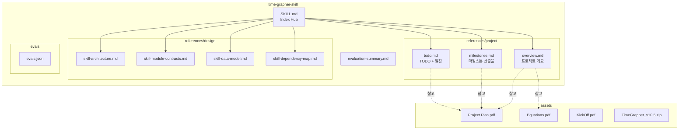
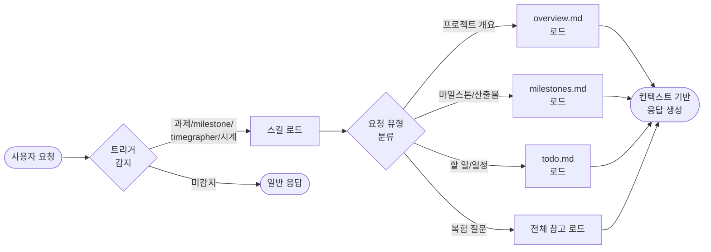

# TimeGrapher Skill — Architecture

## 스킬 유형

`artifact_type: skill` / `skill_scope: single-skill` / `target_agent: claude`

이 스킬은 **Context Provider** 유형으로, 외부 API 호출이나 코드 실행 없이
프로젝트 컨텍스트를 Claude에게 주입해 정확한 응답을 유도한다.

## 모듈 관계도

## 처리 흐름

## 설계 원칙

| 원칙 | 적용 내용 |
|------|-----------|
| **SRP** | SKILL.md는 인덱스 역할만, 상세 내용은 references/로 분리 |
| **OCP** | 새 마일스톤·산출물 추가 시 references/project/ 파일만 수정 |
| **DIP** | assets/*.pdf에 직접 의존하지 않고, 정리된 references/를 통해 접근 |
