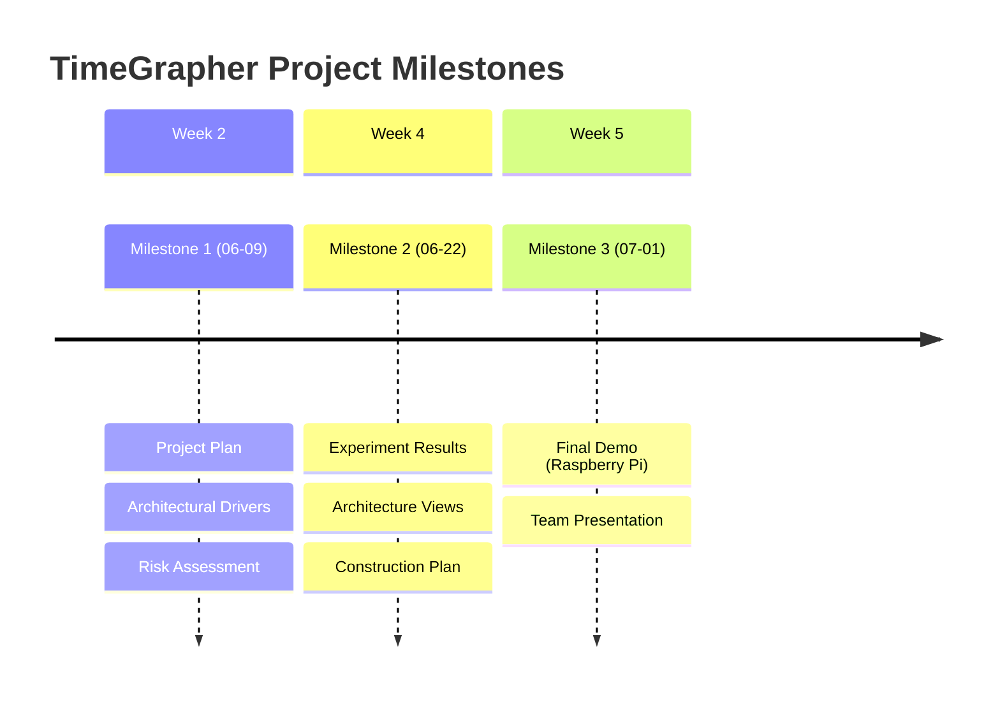

# TimeGrapher — 마일스톤 산출물

프로젝트 기간: 약 5주 (2026-05-27 ~ 2026-07-01)

## 마일스톤 개요

---

## Milestone 1 — `2026-06-09 (Tue)` Due

> Requirements, Project Plan, Architectural Drivers, Risk, Planned Experiments, Architectural Approaches

### 산출물 목록

| 산출물 | 설명 |
|--------|------|
| **Project Plan** | 역할 분담, 태스크, 마일스톤 정의 / 아키텍처 기반 구현 태스크 / 기술 실험 계획 포함 |
| **Architectural Drivers** | QA 요구사항 actionable 표현 / 프로젝트 목표와 연계 / 기능 요구사항 정의 / 우선순위 설정 |
| **Risk Assessment** | 기술적·비기술적 리스크 식별 / 확률·영향 H-M-L 평가 / 리스크 해소 액션 정의 |
| **Planned Experiments** | 실험 목적·질문 명확화 / 완료 기준 정의 |
| **Architectural Approaches** | 아키텍처 개요 / 주요 패턴·전술·설계 전략 / 드라이버와 아키텍처 연계 |

### 심사 체크 포인트 (Mentor 질문 기준)

**Project Plan**
- [ ] 역할 분담과 태스크가 명확히 정의되어 있는가?
- [ ] 아키텍처를 기반으로 한 구현 태스크가 반영되었는가?
- [ ] 기술 실험 계획이 포함되어 있는가?

**Architectural Drivers**
- [ ] QA 요구사항이 "actionable"하게 표현되었는가? (측정·검증 가능)
- [ ] 드라이버가 프로젝트 전체 목표와 연계되는가?
- [ ] 기능 요구사항이 충분히 이해되었는가?
- [ ] 요구사항에 우선순위가 설정되었는가?

**Risk Assessment**
- [ ] 기술적/비기술적 리스크를 구분했는가?
- [ ] H-M-L 척도로 확률·영향을 평가했는가?
- [ ] 오픈 이슈/리스크 해소를 위한 액션이 정의되었는가?

**Planned Experiments**
- [ ] 실험이 구체적이고 템플릿을 따르는가?
- [ ] 각 실험이 어떤 질문/이슈를 해결하는지 명확한가?
- [ ] 완료 기준이 명확한가?

**Architectural Approaches**
- [ ] 아키텍처 개요 수준의 설명이 있는가?
- [ ] 주요 아키텍처 접근법(전술·패턴·설계 전략)이 정의되었는가?
- [ ] 드라이버와 아키텍처가 연계되어 있는가?
- [ ] 설계가 구현 가이드로 충분한가?

---

## Milestone 2 — `2026-06-22 (Mon)` Due

> Experimentation Results, Architecture Design, Construction Plan

### 산출물 목록

| 산출물 | 설명 |
|--------|------|
| **Updated Project Plan** | 리스크 기반 계획 업데이트 / 현실적인 구현 계획 |
| **Experiment Results** | 수행 실험 결과 / 오픈 이슈 해소 여부 / 잔여 실험 목록 |
| **Architecture — Module View** | 코드 단위 구조 및 의존성 (최소 1개 필수) |
| **Architecture — Runtime/C&C View** | 컴포넌트·커넥터 런타임 관점 (최소 1개 필수) |
| **Architecture — Deployment View** | 하드웨어 배치·통신 채널 (Raspberry Pi 포함) |
| **Construction Plan** | 구현 태스크 구체화 / 남은 일정 |

### 심사 체크 포인트 (Mentor 질문 기준)

**Project Plan 업데이트**
- [ ] 팀이 리스크를 적극적으로 평가하고 계획에 반영했는가?
- [ ] 잔여 중요 이슈/리스크에 대한 계획이 있는가?
- [ ] 구현 계획이 현실적인가?

**Experiments/Results**
- [ ] 어떤 실험을 수행했는가?
- [ ] 실험 결과가 오픈 질문/이슈를 해소했는가?
- [ ] 아직 남은 실험이 있는가?
- [ ] 실험이 시스템 전체 목표와 관련이 있는가?

**Architecture**
- [ ] Module View: 코드 단위 구조·의존성이 표현되었는가?
- [ ] C&C View: 컴포넌트·커넥터가 표현되었는가? (런타임 관점)
- [ ] Deployment View: 고수준 컴포넌트 배치·통신 채널이 표현되었는가?
- [ ] 실험이 아키텍처 정제로 이어졌는가?
- [ ] 선택한 아키텍처 접근법과 트레이드오프를 이해하고 있는가?
- [ ] 아키텍처가 시스템 목표와 부합하는가?
- [ ] 해결되지 않은 중요 우려사항이 없는가?
- [ ] 아키텍처 평가가 수행되었는가?

---

## Milestone 3 — `2026-07-01 (Wed)` Due

> Final Demo + Team Presentation (20분)

### 팀 발표 (20분)

발표 커버 항목:

| 항목 | 내용 |
|------|------|
| **QA Requirements** | 높은 우선순위 QA 요구사항 선별 + 아키텍처에 미친 영향 |
| **Architecture** | 아키텍처 뷰 + 주요 접근법 + 설계 근거(rationale) |
| **Experiments & Evaluation** | 실험 결과 및 아키텍처 평가 활동 |
| **Lessons Learned** | 잘한 것 / 잘못한 것 / 다시 한다면 달리 할 것 |

> 20분은 모든 항목을 깊게 다루기에 부족하다. 각 항목에서 핵심 1~2개만 선별해 집중 발표한다.

### 최종 데모 (Raspberry Pi 실시)

데모에서 증명해야 할 품질 속성:

| 속성 | 요구 증거 |
|------|-----------|
| **Low Latency** | 캡처→처리→표시 latency 수치 제시 (ms 단위) |
| **Real-Time Performance** | Raspberry Pi에서 실시간 동작 확인 |
| **Consistency** | 측정값 안정성 (같은 시계, 같은 조건에서 일관된 값) |
| **Accuracy** | 신호 감지 정확도 (WeiShi 1000 기준 비교) |
| **Extensibility** | 새 그래프/분석 추가가 기존 코드에 미치는 영향 설명 |

데모 기본 요건:
- TimeGrapher GUI가 Raspberry Pi에서 실행 중
- 추가 구현한 그래프·디스플레이·컨트롤을 시연
- 각 추가 기능이 무엇을 사용자에게 보여주는지 설명
- 새 시각화가 기존 앱에 통합된 방식 (별도 프로토타입 아님) 강조
- 아키텍처·구현 선택이 품질 속성을 어떻게 지원하는지 설명
