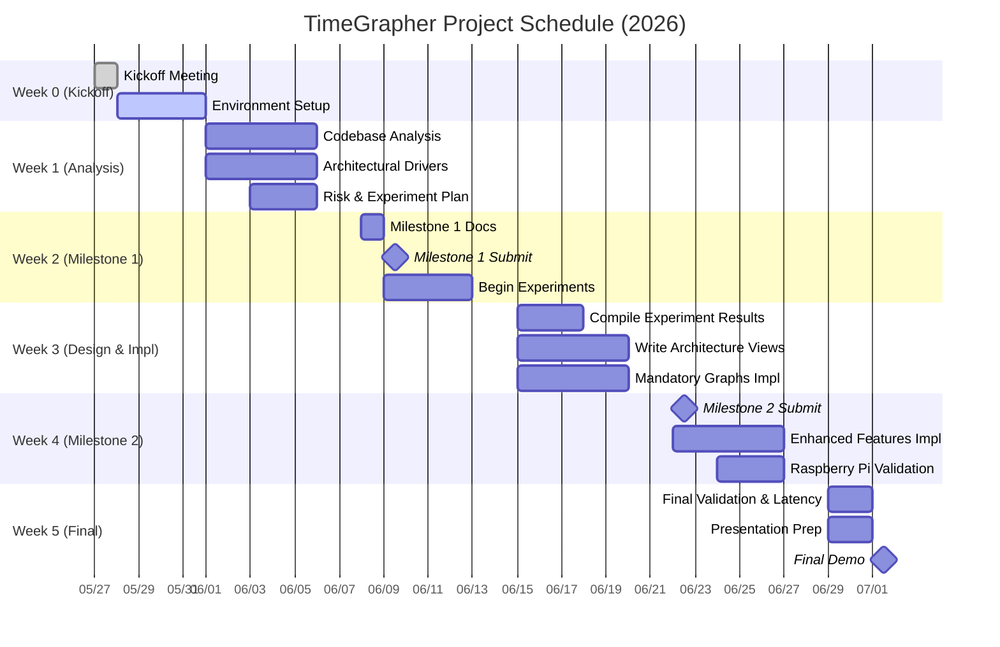

# TimeGrapher — TODO List

## Full Schedule

---

## Week 0 (05/25 ~ 05/29) — Kickoff

- [x] Attend Kickoff Meeting (completed 05/27)
- [x] Confirm equipment receipt (completed 05/28)
  - [x] Raspberry Pi 5 (8GB RAM, 128GB microSD)
  - [x] 2 mechanical watches
  - [x] USB Sensor Stand + Converter Box
  - [x] WeiShi No.1000 Standalone Timegrapher
  - [x] 8" Touchscreen
- [ ] Verify Raspberry Pi environment
  - [ ] Confirm `TimeGrapher_v10.5` runs
  - [ ] **Disable AGC (Auto Gain Control)** (verify in AlsaMixer)
- [x] Build and run `TimeGrapher_v10.5_Student.zip` on PC (completed 05/28)
  - [x] Install Qt Creator (Qt 6.11.1 macOS, ~/Qt)
  - [x] Confirm build success (cmake + AppleClang, Release build, warnings only)
- [ ] Read required documents
  - [ ] Time Grapher Project Plan (Draft).pdf — full document
  - [ ] TimeGrapher Equations_v0.docx.pdf — understand formulas
  - [ ] Witschi Training Course pp.14-19 — graph interpretation and Scope

---

## Week 1 (06/01 ~ 06/05) — Analysis & Planning

### Codebase Analysis
- [ ] Understand Qt module structure (which files serve which roles)
- [ ] Understand signal processing pipeline flow (capture → filter → event detection → display)
- [ ] Review existing Rate/Amplitude/Beat Error calculation logic
- [ ] Identify extension points in Tabbed Graph Panel

### Architectural Drivers
- [ ] Express 5 QAs in "measurable" form
  - Real-Time Performance: define target sps values
  - Low Latency: define end-to-end latency target values
  - Correctness: clarify comparison reference (WeiShi 1000)
  - Measurement Accuracy: define acceptable T1/T3 detection error range
  - Extensibility: limit number of files changed when adding new graph
- [ ] Write and prioritize functional requirements list

### Risk & Experiment Planning
- [ ] Write technical risk list (H/M/L assessment)
  - Raspberry Pi performance limits (feasibility of 96k sps)
  - Qt real-time rendering performance
  - T1/T3 event detection accuracy
  - Signal distortion if AGC not disabled
- [ ] Write non-technical risk list
- [ ] Write experiment plans (per experiment: purpose, method, completion criteria)

### Milestone 1 Document Drafts
- [ ] Project Plan draft (role assignments, tasks, schedule)
- [ ] Architectural Drivers draft
- [ ] Risk Assessment draft
- [ ] Planned Experiments draft
- [ ] Architectural Approaches draft

---

## Week 2 (06/08 ~ 06/12) — Milestone 1 Submission

- [ ] **Complete Milestone 1 documents (06/08)**
- [ ] **Submit Milestone 1 (06/09)**
  - [ ] Project Plan
  - [ ] Architectural Drivers
  - [ ] Risk Assessment
  - [ ] Planned Experiments
  - [ ] Architectural Approaches
- [ ] Begin technical risk mitigation experiments
  - [ ] Measure sps performance on Raspberry Pi
  - [ ] Measure Qt GUI rendering FPS
  - [ ] Basic T1/T3 detection accuracy experiment

---

## Week 3 (06/15 ~ 06/19) — Experiments & Design & Implementation

### Compile Experiment Results
- [ ] Document experiment results (record conclusions per question)
- [ ] Analyze impact on architecture

### Write Architecture Views
- [ ] **Module View** — code-level structure and dependency diagram
- [ ] **Runtime/C&C View** — component-connector diagram
- [ ] **Deployment View** — Raspberry Pi-based deployment diagram

### Mandatory Graphs Implementation (priority order)
- [ ] Trace Display (continuous rate deviation + amplitude recording)
- [ ] Rate & Amplitude Stability — Vario Display
- [ ] Beat Error Display & Diagnostic Trace
- [ ] Beat-Noise Scope (Scope 1 & 2)
- [ ] Multi-Position Sequence Display

---

## Week 4 (06/22 ~ 06/26) — Milestone 2 Submission & Implementation Complete

- [ ] **Submit Milestone 2 (06/22)**
  - [ ] Updated Project Plan
  - [ ] Experiment Results
  - [ ] Architecture (Module / C&C / Deployment View)
  - [ ] Construction Plan

### Remaining Mandatory Graphs Implementation
- [ ] Long-Term Performance Graph
- [ ] Escapement Analyzer & Marker-Line Display
- [ ] Time-Frequency Spectrogram Display
- [ ] Waveform Comparison Display with Timing Markers
- [ ] Scope Mode with Synchronized Sweep Display
- [ ] Scope Function (F0/F1/F2/F3 Filter Views)

### Enhanced Features Implementation
- [ ] All graphs run continuously (no stop/restart required)
- [ ] Interactive Start / Stop / **Pause** controls
- [ ] Time-axis forward/backward navigation in Pause state (captured data review)
- [ ] Interactive timing point selection
- [ ] Sound Print improvement (show averaging window, noise reduction)
- [ ] Raw signal waveform overlay on Rate/Scope graphs

### AI Feature (Optional)
- [ ] Signal Quality Classification (good / noisy / clipped / weak)
- [ ] Bad Data Rejection (automatic exclusion of bad segments)
- [ ] Fast/Slow Watch Classification (beat pattern-based)
- [ ] User Guidance (real-time hints: "signal too noisy", "reposition watch")

### Raspberry Pi Validation
- [ ] Build and run all features on Raspberry Pi
- [ ] Latency measurement: capture→process / process→display / end-to-end (avg + worst-case)
- [ ] Check dropped audio block and missed beat counts
- [ ] Verify 96k sps operation

---

## Week 5 (06/29 ~ 07/01) — Final Demo

- [ ] Final full-feature validation on Raspberry Pi
- [ ] Finalize and document latency figures
- [ ] Complete presentation materials (20-minute content)
  - [ ] Select QA requirements and explain architectural impact
  - [ ] Architecture views + design rationale
  - [ ] Experiment results and architecture evaluation
  - [ ] Lessons Learned
- [ ] **Milestone 3 Final Demo (07/01)**
  - [ ] Demonstrate GUI running on Raspberry Pi
  - [ ] Demonstrate new graphs/displays/controls
  - [ ] Present Low Latency / Real-Time Performance evidence
  - [ ] Explain Extensibility

---

## Contacts

| Role | Name | Email |
|------|------|-------|
| Lead Engineer | Jason Popowski | jpopowsk@andrew.cmu.edu |
| Lead Engineer | Steve Beck | srbeck@andrew.cmu.edu |
| CC | Dan Plakosh | dplakosh@sei.cmu.edu |
