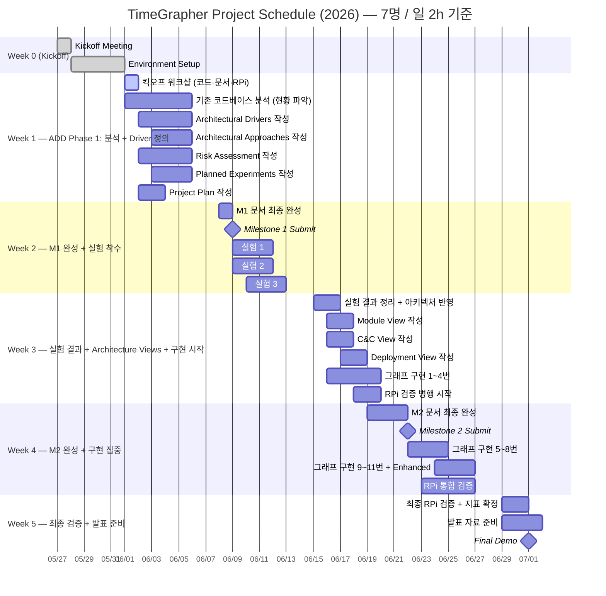

# TimeGrapher — TODO List

## Full Schedule

---

## 주차별 용량 및 집중 포인트

| 주차 | 가용 공수 | 주요 집중 | ADD 단계 |
|------|-----------|-----------|----------|
| Week 1 | 70h | 코드 분석 (현황 이해) + M1 문서 초안 | Driver 정의 |
| Week 2 | 70h | M1 최종 완성·제출 + 실험 착수 | Experiment |
| Week 3 | 70h | 실험 결과 → Architecture Views + 구현 시작 | Design + Impl |
| Week 4 | 70h | M2 제출 + 구현 집중 + RPi 검증 | Impl + Validate |
| Week 5 | 42h | 최종 검증 + 발표 준비 | Demo Prep |

---

## Week 0 (05/25 ~ 05/29) — Kickoff

- [x] Attend Kickoff Meeting (completed 05/27)
- [x] Confirm equipment receipt (completed 05/28)
  - [x] Raspberry Pi 5 (8GB RAM, 128GB microSD)
  - [x] 2 mechanical watches
  - [x] USB Sensor Stand + Converter Box
  - [x] WeiShi No.1000 Standalone Timegrapher
  - [x] 8" Touchscreen
- [ ] Verify Raspberry Pi environment
  - [ ] Confirm `TimeGrapher_v10.5` runs
  - [ ] **Disable AGC (Auto Gain Control)** (verify in AlsaMixer)
- [x] Build and run `TimeGrapher_v10.5_Student.zip` on PC (completed 05/28)
  - [x] Install Qt Creator (Qt 6.11.1 macOS, ~/Qt)
  - [x] Confirm build success (cmake + AppleClang, Release build, warnings only)
- [ ] Read required documents
  - [ ] Time Grapher Project Plan (Draft).pdf — full document
  - [ ] TimeGrapher Equations_v0.docx.pdf — understand formulas
  - [ ] Witschi Training Course pp.14-19 — graph interpretation and Scope

---

## Week 1 (06/01 ~ 06/05) — ADD Phase 1: 분석 + Driver 정의

> 목표: 코드 현황 파악 + M1 문서 5종 초안 완성  
> 용량: 70h / 예상 소요: ~35h (초안) + ~20h (코드 분석) = ~55h

### 06/01 (Mon) — 킥오프 워크샵 (전체, ~3h)

- [ ] **[발표 A]** 코드 구조 발표 — Qt 모듈 구조 + signal processing 파이프라인 흐름
- [ ] **[발표 B]** 도메인 문서 발표 — Witschi pp.14-19 핵심 + Equations 공식 요약
- [ ] **[발표 C]** RPi 빌드·배포 시연 — 빌드 방법 + AGC disable 확인
- [ ] QA 5개 수치 목표 팀 합의 (Architectural Drivers의 기반)
- [ ] M1 문서 역할 배정 확정

### 기존 코드베이스 분석 (현황 파악 — ADD의 입력)

> ⚠️ 이 단계의 산출물은 "현재 구조 이해"이며, Architecture Views 작성의 기반이 아님  
> Architecture Views는 ADD 설계 결정 이후 Week 3에 작성

- [ ] Qt 모듈 구조 파악 (어떤 파일이 어떤 역할을 하는지)
- [ ] Signal processing 파이프라인 흐름 이해 (capture → filter → event detection → display)
- [ ] 기존 Rate / Amplitude / Beat Error 계산 로직 확인
- [ ] Tabbed Graph Panel 확장 포인트 식별

### ADD Step 1 — Architectural Drivers 작성 (~8h, 팀원 3)

- [ ] QA 5개를 측정 가능한 형태로 표현
  - Real-Time Performance: 목표 sps 수치 정의 (96k target / 48k min / 192k stretch)
  - Low Latency: 구간별 지연 목표 수치 정의 (capture→process / process→display / end-to-end)
  - Correctness: WeiShi 1000 대비 허용 오차 정의
  - Measurement Accuracy: T1/T3 검출 오차 허용 범위 정의
  - Extensibility: 새 그래프 추가 시 변경 파일 수 제한
- [ ] 기능 요구사항 목록 작성 및 우선순위 부여
- [ ] **06/02(화) 오후 QA 초안 전체 공유** — 나머지 문서 작성의 기준점

### ADD Step 2 — Architectural Approaches 작성 (~8h, 팀원 4)

- [ ] 아키텍처 개요 작성 (코드 분석 결과 기반)
- [ ] Drivers에 연결된 핵심 패턴 / 전술 / 설계 전략 선정
  - 예: Plugin/Observer 패턴 (Extensibility), Double-buffering (Latency), Pipeline 구조 (Real-Time)
- [ ] 각 Approach가 어떤 QA를 해결하는지 매핑

### Risk Assessment 작성 (~4h, 팀원 2)

- [ ] 기술 리스크 목록 작성 (H/M/L 평가)
  - RPi 5에서 96k sps 달성 가능 여부
  - Qt 실시간 렌더링 성능 한계
  - T1/T3 이벤트 검출 정확도
  - AGC 미비활성화 시 신호 왜곡
- [ ] 비기술 리스크 목록 작성 (H/M/L 평가)
- [ ] 리스크별 완화 액션 정의

### Planned Experiments 작성 (~6h, 팀원 5·6)

- [ ] 실험별 목적 / 해결할 질문 / 방법 / 완료 기준 명시
  - 실험 1: RPi sps 성능 측정 (96k sps 달성 가능한지)
  - 실험 2: Qt GUI 렌더링 FPS 측정 (실시간 렌더링 병목 여부)
  - 실험 3: T1/T3 검출 정확도 (WeiShi 1000 대비 오차 측정)

### Project Plan 작성 (~4h, 팀원 1)

- [ ] 역할 배정 및 태스크 목록 작성
- [ ] 아키텍처 기반 구현 태스크 반영
- [ ] 기술 실험 계획 포함

### 주간 타임라인

| 날짜 | 팀 전체 | 개인 작업 |
|------|---------|-----------|
| 06/01 (Mon) | 킥오프 워크샵 (~3h) | — |
| 06/02 (Tue) | **오후: QA 초안 공유 (30분)** | Drivers 초안 / 코드 분석 심화 / Risk 초안 |
| 06/03 (Wed) | — | Approaches 초안 / Experiments 초안 / Project Plan 초안 |
| 06/04 (Thu) | **오후: Mid-week 리뷰 미팅 (~1h)** | 각자 초안 완성 → 취합 시작 |
| 06/05 (Fri) | **오후: 주간 마무리 싱크 (~1h)** | 피드백 반영 + 일관성 점검 |

---

## Week 2 (06/08 ~ 06/12) — M1 최종 완성 + 실험 착수

> 목표: M1 제출 (06/09) + 실험 3종 착수  
> 용량: 70h / M1 마무리 ~10h + 실험 ~20h = ~30h

### M1 최종 완성 및 제출

- [ ] **M1 문서 전체 최종 완성 (06/08 월)**
  - [ ] 문서 간 일관성 확인 (QA ↔ Risk ↔ Experiments ↔ Approaches 연결 여부)
  - [ ] Mentor 심사 질문 체크리스트 자체 점검
- [ ] **Milestone 1 제출 (06/09 화)**
  - [ ] Project Plan
  - [ ] Architectural Drivers
  - [ ] Risk Assessment
  - [ ] Planned Experiments
  - [ ] Architectural Approaches

### 실험 착수 (06/09 제출 직후)

- [ ] **실험 1: RPi sps 성능 측정** (~6h, 팀원 5)
  - 96k / 48k / 192k sps 각각 실행 및 처리 시간 측정
  - 완료 기준: sps별 처리 시간 수치 확보
- [ ] **실험 2: Qt GUI 렌더링 FPS 측정** (~6h, 팀원 6)
  - 그래프 업데이트 빈도 vs. CPU 사용률 측정
  - 완료 기준: 렌더링 병목 여부 및 허용 FPS 범위 확보
- [ ] **실험 3: T1/T3 검출 정확도** (~8h, 팀원 2·4)
  - WeiShi 1000과 동일 시계로 Rate/Amplitude 비교 측정
  - 완료 기준: 오차 범위 수치 확보

---

## Week 3 (06/15 ~ 06/19) — 실험 결과 반영 + Architecture Views + 구현 시작

> 목표: 실험 결과 → 아키텍처 반영 → Views 작성 + 그래프 1~4번 구현  
> 용량: 70h / 실험 결과 ~8h + Views ~16h + 구현 ~30h = ~54h

### 실험 결과 정리 및 아키텍처 반영 (~8h)

- [ ] 실험 1~3 결과 문서화 (결론 + 수치)
- [ ] 실험 결과 기반 Architectural Approaches 수정 필요 여부 검토
- [ ] 미해결 질문 / 추가 실험 필요 항목 정리

### ADD Step 3 — Architecture Views 작성 (실험 결과 + Approaches 기반)

> ⚠️ Approaches가 확정된 이후 작성. 코드 현황 그대로 그리는 것이 아님

- [ ] **Module View** (~6h, 팀원 4·7) — 설계 기반 코드 레벨 구조 + 의존성
- [ ] **C&C View** (~6h, 팀원 3·7) — 컴포넌트·커넥터 런타임 관점
- [ ] **Deployment View** (~4h, 팀원 1) — RPi 기반 하드웨어 배치 + 통신 채널

### Mandatory Graphs 구현 1~4번 (~30h, 팀원 2·4·5·6)

> 구현 시 RPi 빌드 병행 확인 — PC 동작 확인 즉시 RPi에서도 검증

- [ ] **Trace Display** — 연속 Rate 편차 + Amplitude 기록 (~3h)
- [ ] **Rate & Amplitude Stability (Vario)** — Min/Max/Avg/σ 통계 (~4h)
- [ ] **Beat Error Display & Diagnostic Trace** (~4h)
- [ ] **Beat-Noise Scope (Scope 1 & 2)** — 개별 beat 파형 + Σ 평균 (~5h)

### RPi 검증 병행

- [ ] 구현된 그래프 RPi에서 빌드·실행 확인 (구현 완료 즉시)

---

## Week 4 (06/22 ~ 06/26) — M2 완성 + 구현 집중 + RPi 통합 검증

> 목표: M2 제출 (06/22) + 그래프 5~11번 + Enhanced Features + RPi 통합 검증  
> 용량: 70h / M2 ~10h + 구현 ~40h + RPi 검증 ~15h = ~65h (2h 증량 가능)

### M2 최종 완성 및 제출 (~10h)

- [ ] **Milestone 2 제출 (06/22 월)**
  - [ ] Updated Project Plan (리스크 반영, 현실적 구현 계획)
  - [ ] Experiment Results (완료 실험 결과 + 미결 항목)
  - [ ] Architecture — Module View
  - [ ] Architecture — C&C View
  - [ ] Architecture — Deployment View
  - [ ] Construction Plan (상세 구현 태스크 + 잔여 일정)

### Mandatory Graphs 구현 5~11번 (~35h)

- [ ] **Multi-Position Sequence Display** — 최대 10 포지션 비교 (~5h)
- [ ] **Long-Term Performance Graph** — 장기 Rate/Amplitude/Beat Error 변화 (~4h)
- [ ] **Escapement Analyzer & Marker-Line Display** — A/C 이벤트 마커 + ms 레이블 (~5h)
- [ ] **Time-Frequency Spectrogram** — 시간-주파수 에너지 분포 (~8h)
- [ ] **Waveform Comparison Display** — 정렬된 beat 파형 비교 + 타이밍 마커 (~6h)
- [ ] **Scope Mode (Synchronized Sweep)** — 오실로스코프 스타일 스윕 윈도우 (~4h)
- [ ] **Scope Function (F0/F1/F2/F3 Filter Views)** — 4개 필터 동시 표시 (~8h)

### Enhanced Features 구현 (~18h)

- [ ] 모든 그래프 연속 실행 (stop/restart 불필요) (~3h)
- [ ] Interactive Start / Stop / **Pause** 컨트롤 (~3h)
- [ ] Pause 상태에서 Time-axis 전/후 탐색 (~4h)
- [ ] Interactive 타이밍 포인트 선택 (~3h)
- [ ] Sound Print 개선 (평균 윈도우 표시 + 노이즈 감소) (~3h)
- [ ] Rate/Scope 그래프에 Raw 신호 파형 오버레이 (~2h)

### RPi 통합 검증 (~15h)

- [ ] 전체 기능 RPi에서 빌드·실행 확인
- [ ] 지연 측정: capture→process / process→display / end-to-end (평균 + 최악)
- [ ] Dropped audio block 및 missed beat 횟수 확인
- [ ] 96k sps 동작 확인

---

## Week 5 (06/29 ~ 07/01) — 최종 검증 + 발표 준비

> 목표: 최종 RPi 검증 완료 + 발표 자료 완성 + Final Demo  
> 용량: 42h (3일) — 구현은 Week 4에 완료되어 있어야 함

### 최종 RPi 검증 (~10h)

- [ ] 전체 기능 최종 검증 on Raspberry Pi
- [ ] 지연 수치 최종 확정 및 문서화
- [ ] QA별 증거 자료 확보
  - Low Latency: 구간별 지연 수치 (ms)
  - Real-Time Performance: RPi에서 실시간 동작 확인
  - Consistency: 동일 시계·동일 조건 반복 측정 안정성
  - Accuracy: WeiShi 1000 대비 수치 비교
  - Extensibility: 새 그래프 추가 시 변경 파일 수

### 발표 자료 준비 (~20h, 전체)

- [ ] 발표 구성 (20분 기준, 각 항목 1~2개 핵심 포인트 선정)
  - [ ] QA 요구사항 — 우선순위 높은 QA + 아키텍처 영향 설명
  - [ ] Architecture Views + 핵심 Approach + 설계 근거
  - [ ] 실험 결과 + 아키텍처 평가
  - [ ] Lessons Learned (잘된 것 / 잘못된 것 / 다시 한다면)
- [ ] 발표 리허설 (팀 전체)

### Milestone 3 — Final Demo (07/01 수)

- [ ] Raspberry Pi에서 GUI 실행 시연
- [ ] 추가 구현된 그래프·디스플레이·컨트롤 시연
- [ ] 각 추가 기능이 사용자에게 무엇을 보여주는지 설명
- [ ] Low Latency / Real-Time Performance 수치 제시
- [ ] Extensibility 설명 (기존 코드 영향도)

---

## Contacts

| Role | Name | Email |
|------|------|-------|
| Lead Engineer | Jason Popowski | jpopowsk@andrew.cmu.edu |
| Lead Engineer | Steve Beck | srbeck@andrew.cmu.edu |
| CC | Dan Plakosh | dplakosh@sei.cmu.edu |
