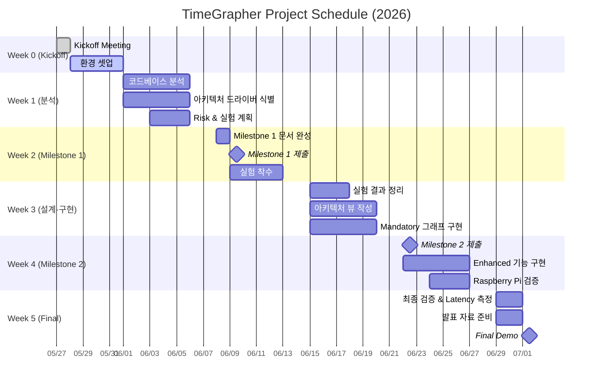

# TimeGrapher — TODO 리스트

## 전체 일정

---

## Week 0 (05/25 ~ 05/29) — Kickoff

- [x] Kickoff Meeting 참석 (05/27 완료)
- [x] 장비 수령 확인 (05/28 완료)
  - [x] Raspberry Pi 5 (8GB RAM, 128GB microSD)
  - [x] 기계식 시계 2개
  - [x] USB Sensor Stand + Converter Box
  - [x] WeiShi No.1000 Standalone Timegrapher
  - [x] 8인치 Touchscreen
- [ ] Raspberry Pi 환경 확인
  - [ ] `TimeGrapher_v10.5` 실행 확인
  - [ ] **AGC(Auto Gain Control) 비활성화** (AlsaMixer 확인)
- [x] PC에서 `TimeGrapher_v10.5_Student.zip` 빌드 및 실행 확인 (05/28 완료)
  - [x] Qt Creator 설치 (Qt 6.11.1 macOS, ~/Qt)
  - [x] 빌드 성공 확인 (cmake + AppleClang, Release build, 경고만 존재)
- [ ] 필수 문서 정독
  - [ ] Time Grapher Project Plan (Draft).pdf — 전체
  - [ ] TimeGrapher Equations_v0.docx.pdf — 공식 이해
  - [ ] Witschi Training Course pp.14-19 — 그래프 해석 및 Scope

---

## Week 1 (06/01 ~ 06/05) — 분석 & 계획

### 코드베이스 분석
- [ ] Qt 모듈 구조 파악 (어떤 파일이 어떤 역할인지)
- [ ] 신호 처리 파이프라인 흐름 이해 (캡처 → 필터 → 이벤트 감지 → 표시)
- [ ] 기존 Rate/Amplitude/Beat Error 계산 로직 확인
- [ ] Tabbed Graph Panel 확장 포인트 식별

### 아키텍처 드라이버 도출
- [ ] 5개 QA를 "측정 가능한" 형태로 표현
  - Real-Time Performance: target sps 수치 정의
  - Low Latency: end-to-end latency 목표 수치 정의
  - Correctness: 비교 기준(WeiShi 1000) 명확화
  - Measurement Accuracy: T1/T3 감지 오차 허용 범위
  - Extensibility: 새 그래프 추가 시 변경 파일 수 제한
- [ ] 기능 요구사항 목록 작성 및 우선순위 부여

### Risk & 실험 계획
- [ ] 기술적 리스크 목록 작성 (H/M/L 평가)
  - Raspberry Pi 성능 한계 (96k sps 달성 가능성)
  - Qt 실시간 렌더링 성능
  - T1/T3 이벤트 감지 정확도
  - AGC 미비활성화 시 신호 왜곡
- [ ] 비기술적 리스크 목록 작성
- [ ] 실험 계획서 작성 (각 실험: 목적, 방법, 완료 기준)

### Milestone 1 문서 초안
- [ ] Project Plan 초안 (역할 분담, 태스크, 일정)
- [ ] Architectural Drivers 초안
- [ ] Risk Assessment 초안
- [ ] Planned Experiments 초안
- [ ] Architectural Approaches 초안

---

## Week 2 (06/08 ~ 06/12) — Milestone 1 제출

- [ ] **Milestone 1 문서 완성 (06/08)**
- [ ] **Milestone 1 제출 (06/09)**
  - [ ] Project Plan
  - [ ] Architectural Drivers
  - [ ] Risk Assessment
  - [ ] Planned Experiments
  - [ ] Architectural Approaches
- [ ] 기술 리스크 해소 실험 착수
  - [ ] Raspberry Pi에서 sps 성능 측정
  - [ ] Qt GUI 렌더링 FPS 측정
  - [ ] T1/T3 감지 정확도 기초 실험

---

## Week 3 (06/15 ~ 06/19) — 실험 & 설계 & 구현

### 실험 결과 정리
- [ ] 실험 결과 문서화 (질문별 결론 기록)
- [ ] 아키텍처에 미치는 영향 분석

### 아키텍처 뷰 작성
- [ ] **Module View** — 코드 단위 구조·의존성 다이어그램
- [ ] **Runtime/C&C View** — 컴포넌트·커넥터 다이어그램
- [ ] **Deployment View** — Raspberry Pi 기반 배치 다이어그램

### Mandatory 그래프 구현 (우선순위 순)
- [ ] Trace Display (rate deviation + amplitude 연속 기록)
- [ ] Rate & Amplitude Stability — Vario Display
- [ ] Beat Error Display & Diagnostic Trace
- [ ] Beat-Noise Scope (Scope 1 & 2)
- [ ] Multi-Position Sequence Display

---

## Week 4 (06/22 ~ 06/26) — Milestone 2 제출 & 구현 완료

- [ ] **Milestone 2 제출 (06/22)**
  - [ ] Updated Project Plan
  - [ ] Experiment Results
  - [ ] Architecture (Module / C&C / Deployment View)
  - [ ] Construction Plan

### 잔여 Mandatory 그래프 구현
- [ ] Long-Term Performance Graph
- [ ] Escapement Analyzer & Marker-Line Display
- [ ] Time-Frequency Spectrogram Display
- [ ] Waveform Comparison Display with Timing Markers
- [ ] Scope Mode with Synchronized Sweep Display
- [ ] Scope Function (F0/F1/F2/F3 Filter Views)

### Enhanced Features 구현
- [ ] 모든 그래프 연속 실행 (stop/restart 없이)
- [ ] Start / Stop / **Pause** 인터랙티브 컨트롤
- [ ] Pause 상태에서 시간축 앞뒤 이동 (captured data review)
- [ ] 타이밍 포인트 인터랙티브 선택
- [ ] Sound Print 개선 (averaging window 표시, 노이즈 감소)
- [ ] Rate/Scope 그래프에 raw 신호 파형 오버레이

### AI Feature (선택)
- [ ] Signal Quality Classification (good / noisy / clipped / weak)
- [ ] Bad Data Rejection (불량 구간 자동 제외)
- [ ] Fast/Slow Watch Classification (beat pattern 기반)
- [ ] User Guidance (실시간 힌트: "signal too noisy", "reposition watch")

### Raspberry Pi 검증
- [ ] Raspberry Pi에서 전체 기능 빌드 및 실행
- [ ] Latency 측정: 캡처→처리 / 처리→표시 / end-to-end (avg + worst-case)
- [ ] Dropped audio block 및 missed beat 카운트 확인
- [ ] 96k sps 동작 검증

---

## Week 5 (06/29 ~ 07/01) — Final Demo

- [ ] Raspberry Pi 최종 전체 기능 검증
- [ ] Latency 수치 최종 정리 및 문서화
- [ ] 발표 자료 완성 (20분 분량)
  - [ ] QA requirements 선별 및 아키텍처 영향 설명
  - [ ] Architecture views + 설계 근거
  - [ ] 실험 결과 및 아키텍처 평가
  - [ ] Lessons Learned
- [ ] **Milestone 3 Final Demo (07/01)**
  - [ ] Raspberry Pi에서 GUI 실행 시연
  - [ ] 새 그래프/디스플레이/컨트롤 시연
  - [ ] Low Latency / Real-Time Performance 증거 제시
  - [ ] Extensibility 설명

---

## 연락처

| 역할 | 담당자 | 이메일 |
|------|--------|--------|
| Lead Engineer | Jason Popowski | jpopowsk@andrew.cmu.edu |
| Lead Engineer | Steve Beck | srbeck@andrew.cmu.edu |
| CC | Dan Plakosh | dplakosh@sei.cmu.edu |
