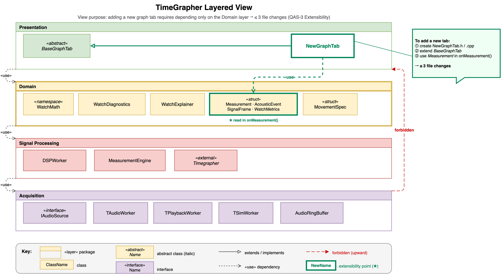
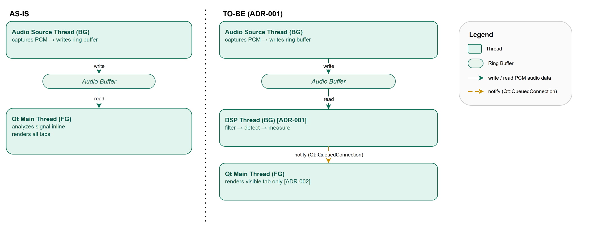
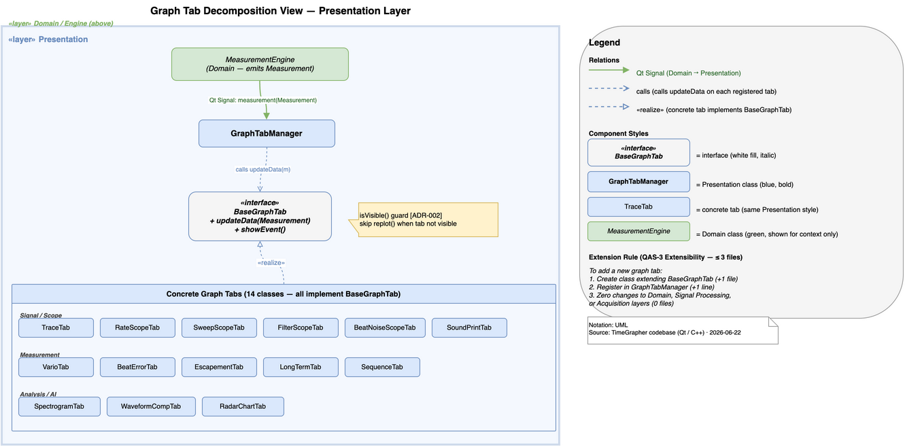
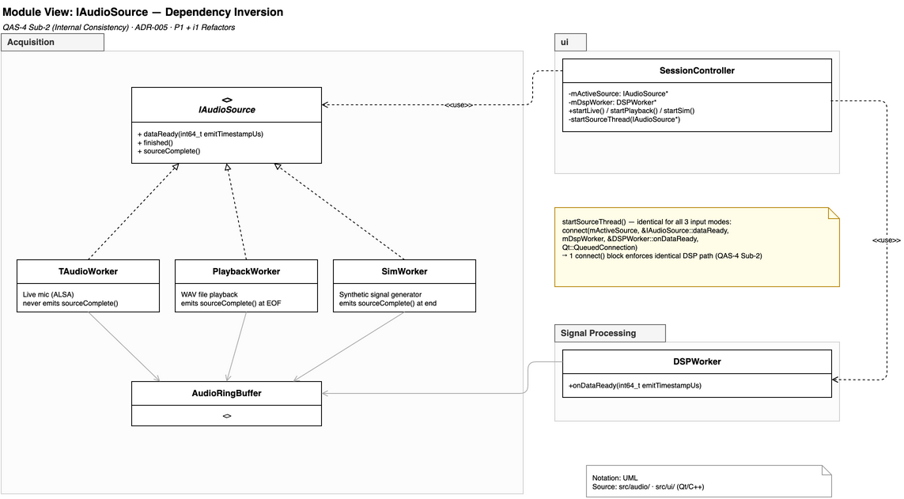

# TimeGrapher

A real-time acoustic timegrapher for mechanical watches, built for the LG SW Architect Training Program.

**Contents**: [Demo](#demo) · [Project Plan](#project-plan) · [Requirements](#requirements) · [Architecture](#architecture) ·
[Architecture Evaluation](#architecture-evaluation) · [Experiments](#experiments) · [ADRs](#adrs) ·
[Risk Register](#risk-register) · [Traceability](#traceability-qas--risk--experiment--adr) ·
[Lessons Learned](#lessons-learned) · [AI Usage](#ai-usage) · [Appendix](#appendix) · [About](#about)

---

## Demo


- [Full Demo Recording (MP4)](docs/misc/demo.mp4)
- [SW Architecture Final Presentation (PDF)](docs/milestone3/TimeGrapher-SW-Architecture_FinalPresentation_v2.1.pdf)

---

## Project Plan

- [Kanban Board](https://github.com/users/Ji-Min-Lee/projects/3/views/2) — single board tracking all issues across milestones

---

## Requirements

This section contains the requirements elicited from the project plan and grading rubric
provided by CMU MSE / LG Software Architectures Training Program, along with assumptions
the team made during elaboration. These requirements were the primary drivers for all
architectural decisions in this proposal.

- [Functional Requirements](docs/milestone3/final/references/architectural-drivers/functional-requirements.md)
- [Design Constraints](docs/milestone3/final/references/architectural-drivers/constraints.md) — hardware and development environment constraints that are fixed and not subject to architectural discussion
- [Quality Attribute Scenarios](docs/milestone3/final/references/qa/README.md) — six QAS covering real-time performance, latency, extensibility, correctness, measurement accuracy, and long-term session performance

---

## Architecture

The following architecture views document the software architecture designed to address
TimeGrapher's quality attribute requirements. Together they show the module decomposition,
runtime thread model, dependency inversion strategy, deployment pipeline, and domain
entity structure. The full view set also includes allocation views and a dedicated
LongTermTab downsampling view; see [Architecture Views](docs/milestone3/final/references/views/README.md).
The view set follows the architectural-view documentation approach of Views and Beyond
and complements the stakeholder-oriented view separation popularized by the 4+1 model
[Clements10] [Kruchten95].

<table>
<tr>
  <td align="center">
    <a href="docs/milestone3/final/references/views/view-layered-4layer.md">Layered and Module Decomposition<br>
    </a>
  </td>
  <td align="center">
    <a href="docs/milestone3/final/references/views/view-cc-dsp-pipeline.md">DSP Pipeline Thread Model View<br>
    </a>
  </td>
</tr>
<tr>
  <td align="center">
    <a href="docs/milestone3/final/references/views/view-decomposition-graph-tab.md">Graph Tab Module Uses View<br>
    </a>
  </td>
  <td align="center">
    <a href="docs/milestone3/final/references/views/view-iaudiosource.md">IAudioSource Dependency Inversion View<br>
    </a>
  </td>
</tr>
<tr>
  <td align="center">
    <a href="docs/milestone3/final/references/views/view-longtermtab-downsampling.md">LongTermTab Downsampling Decomposition View<br>
    </a>
  </td>
  <td align="center">
    <a href="docs/milestone3/final/references/views/view-deployment-build-pipeline.md">Raspberry Pi Deployment View<br>
    </a>
  </td>
</tr>
</table>

---

## Architecture Evaluation

The architecture was evaluated using **ATAM** (Architecture Tradeoff Analysis Method)
[Kazman00].
The evaluation identified the DSP + GUI single-thread coupling as the primary risk,
resolved by ADR-001 (T2 Offload Thread) and ADR-002 (Lazy Rendering), cutting deadline
misses from 43% to 0% and queue wait time by ×32,000 (420ms → 0.013ms on RPi 5).

See [atam-evaluation-m3.md](docs/milestone3/final/references/atam/atam-evaluation-m3.md) for the full evaluation,
including utility tree, sensitivity points, tradeoff points, and risk themes.

<table>
<tr>
  <td align="center">
    <a href="docs/milestone3/final/references/atam/atam-evaluation-m3.md">ATAM Utility Tree<br>
    </a>
  </td>
  <td align="center">
    <a href="docs/milestone3/final/references/atam/atam-evaluation-m3.md">ATAM Before / After<br>
    </a>
  </td>
</tr>
</table>

---

## Experiments

Six technical experiments were conducted to validate architectural decisions and
resolve identified risks before committing to design choices.

| ID | Title | QAS | Status |
|----|-------|-----|--------|
| [EXP-01](docs/milestone3/final/references/experiments/exp-01-realtime-dropped-block.md) | Real-Time Block Drop Under Load | QAS-1 | ✅ Done |
| [EXP-02](docs/milestone3/final/references/experiments/exp-02-latency-e2e.md) | End-to-End Latency Measurement | QAS-2 | ✅ Done |
| [EXP-03](docs/milestone3/final/references/experiments/exp-03-extensibility-observer-pattern.md) | Extensibility — Observer Pattern | QAS-3 | ✅ Done |
| [EXP-04](docs/milestone3/final/references/experiments/exp-04-correctness-detector-optimization.md) | Detector Parameter Optimization Under Noise | QAS-4 | ✅ Done |
| [EXP-05](docs/milestone3/final/references/experiments/exp-05-noise-threshold-popup.md) | Signal Quality Warning — Noise Threshold Validation | QAS-4 + Usability | ✅ Done |
| [EXP-06](docs/milestone3/final/references/experiments/exp-06-accuracy-witschi-comparison.md) | Accuracy vs. Witschi Reference Device | QAS-5 | ✅ Done |
| [EXP-07](docs/milestone3/final/references/experiments/exp-07-longterm-aging.md) | Long-Term Aging Test — Bucket Downsampling Efficiency | QAS-6 | ✅ Done |
| [EXP-08](docs/milestone3/final/references/experiments/exp-08-tab-expansion-file-change-cost.md) | Tab Expansion File-Change Cost | QAS-3 | ✅ Done |

---

## ADRs

The linked ADRs record the main architectural decisions, including context, options
considered, and rationale.

- ADR-001 — [T2 DSP Offload Thread](docs/milestone3/final/references/adr/ADR-001-t2-dsp-offload-thread.md)
- ADR-002 — [R1 Lazy Rendering (skip replot for non-visible tabs)](docs/milestone3/final/references/adr/ADR-002-r1-lazy-rendering.md)
- ADR-003 — [Audio Sample Rate Selection for RPi 5 (96 kHz)](docs/milestone3/final/references/adr/ADR-003-sample-rate-selection.md)
- ADR-004 — [R2 Timer-Decoupled Rendering](docs/milestone3/final/references/adr/ADR-004-r2-timer-decoupled-rendering.md)
- ADR-005 — [IAudioSource Dependency Inversion (P1)](docs/milestone3/final/references/adr/ADR-005-p1-iaudiosource-dependency-inversion.md)
- ADR-006 — [BaseGraphTab Observer Pattern and Tab Registration (AP-3)](docs/milestone3/final/references/adr/ADR-006-basegraphtab-observer-pattern.md)
- ADR-007 — [Time-Based Bucket Downsampling for LongTermTab](docs/milestone3/final/references/adr/ADR-007-longtermtab-downsampling.md)
- ADR-008 — [WatchMath Pure Calculation Module Isolation](docs/milestone3/final/references/adr/ADR-008-watchmath-module-isolation.md)
- ADR-009 — [FilterChain Design — HPF + Envelope Detector](docs/milestone3/final/references/adr/ADR-009-filterchain-design.md)

---

## Risk Register

See [risks.md](docs/milestone3/final/references/risks.md) for the full register of technical and non-technical
risks, their resolution status, and the experiments or architectural decisions that closed them.

---

## Traceability: QAS → Risk → Experiment → ADR

### [QAS-1 — Real-Time Performance](docs/milestone3/final/references/qa/qas-1-real-time-performance.md) *(H)*

| Risk | Description | Experiment | Result | ADR |
|------|-------------|-----------|--------|-----|
| [TR-01](docs/milestone3/final/references/risks.md) | RPi cannot sustain 96kHz audio capture alongside Qt GUI | [EXP-01](docs/milestone3/final/references/experiments/exp-01-realtime-dropped-block.md) | Dropped=0 at 48k/96k/192k ✅ | [ADR-003](docs/milestone3/final/references/adr/ADR-003-sample-rate-selection.md) 96kHz Accepted ✅ |

### [QAS-2 — Low Latency and Low Number of Missed Beats](docs/milestone3/final/references/qa/qas-2-low-latency-and-low-number-of-missed-beats.md) *(H)*

| Risk | Description | Experiment | Result | ADR |
|------|-------------|-----------|--------|-----|
| [TR-02](docs/milestone3/final/references/risks.md) | Single-threaded pipeline saturates cpu2; 43% deadline miss on RPi | [EXP-02](docs/milestone3/final/references/experiments/exp-02-latency-e2e.md) | wait_ms 420ms → **0.013ms** (×32,000); E2E 80ms → 2.1ms | [ADR-001](docs/milestone3/final/references/adr/ADR-001-t2-dsp-offload-thread.md) T2 DSP Offload Thread ✅ |
| [TR-03](docs/milestone3/final/references/risks.md) | Signal backlog accumulates unbounded under single-threaded load | [EXP-02](docs/milestone3/final/references/experiments/exp-02-latency-e2e.md) | E2E avg **2.2ms** / max 4.8ms on RPi (< 100ms target) | [ADR-001](docs/milestone3/final/references/adr/ADR-001-t2-dsp-offload-thread.md) T2 DSP Offload Thread ✅ |
| [TR-04](docs/milestone3/final/references/risks.md) | `replot()` in exec path consumes 79% of exec budget | [EXP-02](docs/milestone3/final/references/experiments/exp-02-latency-e2e.md) | replot/beat 8.22 → **1.20** (↓85%); max tail 11.1ms → 5.7ms | [ADR-002](docs/milestone3/final/references/adr/ADR-002-r1-lazy-rendering.md) R1 Lazy Rendering ✅ |

### QAS-3 — Extensibility / Modifiability *(M)*

| Risk | Description | Experiment | Result | ADR |
|------|-------------|-----------|--------|-----|
| [TR-07](docs/milestone3/final/references/risks.md) | Residual coupling survives refactoring | N/A | Compiler catches upward dependency ✅ | Allowed-to-use rule + per-layer include restriction |
| [TR-08](docs/milestone3/final/references/risks.md) | New tab requires data not in current Domain output | [EXP-03](docs/milestone3/final/references/experiments/exp-03-extensibility-observer-pattern.md) | All 14 tabs implemented within the target change budget ✅ | [ADR-006](docs/milestone3/final/references/adr/ADR-006-basegraphtab-observer-pattern.md) BaseGraphTab Observer |
| [TR-08](docs/milestone3/final/references/risks.md) | Tab addition file-change cost exceeds ≤ 3-file budget | [EXP-08](docs/milestone3/final/references/experiments/exp-08-tab-expansion-file-change-cost.md) | All 14 tabs added within budget; no lower-layer files touched ✅ | [ADR-006](docs/milestone3/final/references/adr/ADR-006-basegraphtab-observer-pattern.md) BaseGraphTab Observer |
| N/A | Audio source extension touches multiple unrelated components | [EXP-03](docs/milestone3/final/references/experiments/exp-03-extensibility-observer-pattern.md) | Adding `NetworkWorker` reduced to ≤ 3 files | [ADR-005](docs/milestone3/final/references/adr/ADR-005-p1-iaudiosource-dependency-inversion.md) IAudioSource Dependency Inversion ✅ |

### QAS-4 — Correctness *(M)*

| Risk | Description | Experiment | Result | ADR |
|------|-------------|-----------|--------|-----|
| [TR-05](docs/milestone3/final/references/risks.md) | Filter defaults reject beat signal at edge BPH values | [EXP-04](docs/milestone3/final/references/experiments/exp-04-correctness-detector-optimization.md) | onset=0.08, min_peak=0.10 confirmed ✅ | Default parameters locked in `Detector.cpp` |
| [TR-06](docs/milestone3/final/references/risks.md) | Layer refactoring introduces regression in existing DSP behavior | N/A | 142 unit tests (10 binaries) run as a pre-commit gate on every commit, not a one-time pass ✅ | `TestWatchMath`/`TestMeasurementEngine` pre-commit gate ([ADR-008](docs/milestone3/final/references/adr/ADR-008-watchmath-module-isolation.md)) |
| [NTR-07](docs/milestone3/final/references/risks.md) | Equation-level derivations difficult to verify manually | N/A | Pre-commit gate blocks any commit that fails the 142-test suite, keeping formula correctness continuously verified ✅ | [ADR-008](docs/milestone3/final/references/adr/ADR-008-watchmath-module-isolation.md) WatchMath module isolation |
| [TR-09](docs/milestone3/final/references/risks.md) | Signal quality warning thresholds mismatched to actual watch signal | [EXP-05](docs/milestone3/final/references/experiments/exp-05-noise-threshold-popup.md) | Heartbeat pattern validated; threshold tunable via single parameter ✅ | Noise threshold tuning (QAS-4 Sub-3) |

### QAS-5 — Measurement Accuracy *(M)*

| Risk | Description | Experiment | Result | ADR |
|------|-------------|-----------|--------|-----|
| N/A | Accuracy vs. Witschi reference device unvalidated | [EXP-06](docs/milestone3/final/references/experiments/exp-06-accuracy-witschi-comparison.md) | Validation against reference device completed ✅ | N/A |

### QAS-6 — Long-Term Session Performance *(L)*

| Risk | Description | Experiment | Result | ADR |
|------|-------------|-----------|--------|-----|
| N/A | Multi-day sessions may accumulate unbounded plot points and degrade GUI responsiveness | [EXP-07](docs/milestone3/final/references/experiments/exp-07-longterm-aging.md) | Worst case stays bounded at **840 points per series / 2,520 total points** over 7 days ✅ | [ADR-007](docs/milestone3/final/references/adr/ADR-007-longtermtab-downsampling.md) Time-Based Bucket Downsampling ✅ |

---

## Lessons Learned

See [lessons-learned.md](docs/milestone3/final/references/lessons-learned.md) for team retrospective on what
went right, what to improve, and process insights from the M3 cycle.

---

## AI Usage

See [ai/ai-usage.md](docs/milestone3/final/references/ai/ai-usage.md) for a summary of how Claude Code was
used as a development assistant throughout the project (design review, code drafting,
and documentation).

---

## Appendix

### Repository Structure

```
docs/milestone3/final/
├── README.md                              ← full traceability map (kept as the milestone snapshot)
├── assets/                                ← view diagrams (.drawio + .png), charts
└── references/
    ├── qa/                                ← QA scenario files (qas-1 ~ qas-6)
    ├── risks.md                           ← full risk register
    ├── atam/                              ← ATAM evaluations (M2 snapshot 2026-06-22; M3 snapshot 2026-06-28)
    ├── lessons-learned.md                 ← team retrospective
    ├── views/                             ← architecture view index + detailed view files (8 views)
    ├── experiments/                       ← experiment files (EXP-01 ~ EXP-08)
    │   └── README.md                      ← experiment index and QA traceability
    ├── adr/                               ← ADR files (ADR-001 ~ ADR-009)
    ├── ai/                                ← AI usage log
    └── architectural-drivers/             ← functional requirements and constraints
```

### External References

A full bibliography is available as a PDF: [Software Architecture References.pdf](docs/milestone3/final/references/Software%20Architecture%20References.pdf)

- [Clements10] P. Clements et al. *Documenting Software Architectures: Views and Beyond*, Second Edition. Addison-Wesley, 2010.
- [Kazman00] R. Kazman, M. Klein, P. Clements. "ATAM: Method for Architecture Evaluation". CMU/SEI-2000-TR-004, August 2000.
- [Kruchten95] P. Kruchten. "The 4+1 View Model of Software Architecture". *IEEE Software*, November 1995.

---

### Getting Started

#### Prerequisites

| Item | Version |
|------|---------|
| Qt | 6.11.1 |
| CMake | 3.16+ (bundled with Qt) |
| Compiler | Apple clang (macOS) / MinGW 64-bit (Windows) / GCC (RPi) |
| Docker | Required for RPi cross-build only |

#### 1. Clone

```bash
git clone git@github.com:Ji-Min-Lee/2026-3-sw-architect-studio-project.git
cd 2026-3-sw-architect-studio-project
```

#### 2. Configure Git Hooks (required, run once)

```bash
sh scripts/setup-hooks.sh
```

This sets `core.hooksPath` to `.githooks/` and activates the pre-commit unit test hook.
After this, `TestWatchMath` and `TestMeasurementEngine` run automatically before every commit.

#### 3. Build

##### macOS

```bash
mkdir -p src/build-mac
cd src/build-mac
~/Qt/6.11.1/macos/bin/qt-cmake .. -DCMAKE_BUILD_TYPE=Release
cmake --build . -j$(sysctl -n hw.ncpu)
```

Artifacts: `src/build-mac/TimeGrapher.app`

##### Windows (MinGW)

```powershell
mkdir src\build
cd src\build
C:\Qt\Tools\CMake_64\bin\cmake.exe .. -G "MinGW Makefiles" -DCMAKE_BUILD_TYPE=Release -DCMAKE_PREFIX_PATH=C:\Qt\6.11.1\mingw_64
cmake --build . -j4
```

Artifacts: `src\build\TimeGrapher.exe`

For detailed Windows setup, see [docs/week0/pc-build-verification-windows.md](docs/week0/pc-build-verification-windows.md).

##### Raspberry Pi 5 (cross-build via Docker)

```bash
sh build-rpi.sh
```

Artifacts: `build-rpi/TimeGrapher` (arm64 binary)

To deploy directly to the RPi:

```bash
RPI_HOST=pi@<ip-address> sh build-rpi.sh
```

#### 4. Run Unit Tests

Tests run automatically on commit via the pre-commit hook. To run manually:

```bash
# macOS
src/build-mac/TestWatchMath
src/build-mac/TestMeasurementEngine

# Windows
src\build\TestWatchMath.exe
src\build\TestMeasurementEngine.exe
```

| Binary | Coverage | Expected |
|--------|----------|---------|
| TestWatchMath | Rate, Amplitude, Beat Error formulas | 44 passed |
| TestMeasurementEngine | End-to-end measurement computation | 8 passed |

---

## About

**Team**: Blue Sky (Team 3) | LG SW Architect Training Program

Team members:
- HUNG SON TONG
- DONG HO SHIN
- GYEONGJIN SHIN
- JIMIN LEE
- KYUDAE BAHN
- SUNGHO SHIN
- TAEJOON SONG

### License

This project was developed as coursework for the LG SW Architect Training Program.
It is not licensed for public reuse or redistribution.
