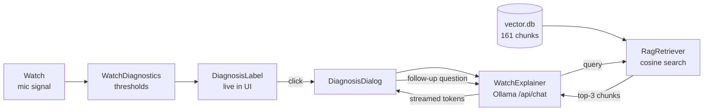

# AI Features

Three AI modules built on top of the existing real-time measurement
pipeline. Each module is independent — `WatchDiagnostics` runs every
beat, `WatchExplainer` and `RagRetriever` activate only on user click.
All share the `DiagnosisInput / DiagnosisResult` contract.

| Module | What it does |
|--------|--------------|
| `WatchDiagnostics` | Rule-based classifier → live diagnosis label |
| `WatchExplainer` | On-device LLM → plain-English explanation on click |
| `RagRetriever` | Witschi docs context injection into LLM prompt |



---

## WatchDiagnostics

A deterministic classifier that consumes Rate / Amplitude / Beat-Error
measurements and produces a coarse diagnosis label shown live in the
GUI. Zero inference cost — a handful of comparisons per beat,
negligible next to the audio DSP pipeline.

### Modules

| File | Contents |
|------|----------|
| [`src/engine/WatchDiagnostics.h`](../src/engine/WatchDiagnostics.h) | `DiagnosisInput`, `DiagnosisResult`, `DiagnosisLevel`, `WatchDiagnostics::Evaluate()` |
| [`src/engine/WatchDiagnostics.cpp`](../src/engine/WatchDiagnostics.cpp) | Threshold logic |

```cpp
// Measurement.h — each metric is std::optional; absent means "not yet valid".
struct WatchMetrics {
    std::optional<double> rate;       // s/day  (RLS average)
    std::optional<double> amplitude;  // degrees (rolling average)
    std::optional<double> beatError;  // ms      (rolling average)
};

struct DiagnosisInput {
    WatchMetrics metrics;                  // rate / amplitude / beatError
    WatchType    watch_type = WatchType::Men;
    bool         noSignal   = false;       // QAS-4: no A-event for ≥ 3 s
};

struct DiagnosisResult {
    DiagnosisLevel level;   // Unknown | Excellent | Good | NeedsService
    QString        label;   // human-readable, ready for the UI
};

class WatchDiagnostics {
public:
    DiagnosisResult Evaluate(const DiagnosisInput &input) const;
};
```

`Evaluate()` is a pure function — no state, no I/O, no Qt event
dependency.

### Watch type (Men / Women)

`MainWindow.ui` adds a `WatchTypeComboBox` inside the `WatchFrame`
panel, defaulting to **Men**. Selecting it sets `mWatchType`, which is
read into `DiagnosisInput::watch_type` on every `DisplayResults()` call.

Only rate thresholds differ by watch type; amplitude and beat-error
bands are identical (Witschi's table, p.15).

| Watch type | Excellent rate | Good rate |
|------------|---------------|-----------|
| Men (default) | −5 … +15 s/d | −10 … +10 s/d |
| Women | −5 … +25 s/d | −10 … +20 s/d |

### Diagnosis states

Evaluation order: **Excellent → Good → else NeedsService**. A watch
must clear the strict band on *all three* axes to be called Excellent.

| State | Rate (Men) | Amplitude | Beat Error | Meaning |
|-------|-----------|-----------|------------|---------|
| **Unknown** | not yet valid | not yet valid | not yet valid | Not enough beats measured yet |
| **Excellent** | −5 … +15 s/d | ≥ 270° | ≤ 0.5 ms | Witschi "watch movement ok" |
| **Good** | −10 … +10 s/d | ≥ 220° | ≤ 0.8 ms | Usable but not optimal |
| **Needs Service** | outside Good | outside Good | outside Good | Fails on at least one axis |

#### Threshold sources

| Axis | Tier | Value | Source |
|------|------|-------|--------|
| Rate | Excellent | −5 … +15 s/d | Witschi Training Course p.15, Gent's row |
| Rate | Good | −10 … +10 s/d | Project judgment: ~double the Excellent width, between "a few seconds" and "minutes/day" |
| Amplitude | Excellent | ≥ 270° | Project overview.md "strong" band (270–310°) |
| Amplitude | Good | ≥ 220° | Project overview.md "acceptable" band, corroborated by BeyondTheDial |
| Beat Error | Excellent | ≤ 0.5 ms | Witschi p.14–15 "watch movement ok" |
| Beat Error | Good | ≤ 0.8 ms | Boundary between rotatewatches "usable ≤ 1.0 ms" and BeyondTheDial "serious issue > 0.8 ms" |

### Integration point

Called once per beat inside `MainWindow::DisplayResults()`, reusing
the `Measurement` struct already published by `MeasurementEngine`:

```cpp
DiagnosisInput  diagInput { m.metrics, mWatchType, m.noSignal };
DiagnosisResult diagResult = mWatchDiagnostics.Evaluate(diagInput);

// Keep latest input/result for the LLM dialog
mLastExplainRequest.input  = diagInput;
mLastExplainRequest.result = diagResult;

ui->DiagnosisLabel->setText(diagResult.label);
```

`Measurement` is published across the DSP→UI thread boundary via a queued
signal, so it is registered with `qRegisterMetaType<Measurement>()` at
startup. `MeasurementEngine` also keeps a sticky cache of the last valid
metrics so amplitude (computed only on C-event frames) does not flicker to
`nullopt` between beats.

### Verification logging

Logs to console only when the diagnosis **level changes** (not every beat):

Metrics that are not yet valid print as `NULL` (the field is `std::optional`):

```
[WatchDiagnostics] "DIAGNOSIS: Excellent"     rate= -3.5  amplitude= 303  beatError= 0.00
[WatchDiagnostics] "DIAGNOSIS: Unknown"       rate= -0.3  amplitude= NULL beatError= 0.00
[WatchDiagnostics] "DIAGNOSIS: Needs Service" rate= -4.5  amplitude= 203  beatError= 0.20
[WatchDiagnostics] "DIAGNOSIS: Good"          rate=  9.9  amplitude= 227  beatError= 0.19
```

---

## WatchExplainer

When the user clicks the `DIAGNOSIS:` label, a dialog opens and asks a
locally-running LLM to explain **why** the diagnosis was reached and
**what to service**. Inference is fully on-device via
[Ollama](https://ollama.com) — no network call leaves the machine.

### Flow

```
MainWindow
  │  click on DiagnosisLabel (eventFilter → QEvent::MouseButtonPress)
  │
  ▼
DiagnosisDialog          ← popup: colored banner + progress bar + text
  │  explain(req)
  ▼
WatchExplainer           ← QObject, owns QNetworkAccessManager
  │  POST /api/chat  (stream:true, num_ctx:2048, num_thread:2)
  ▼
Ollama (localhost:11434) ← fully on-device, no cloud
  │  newline-delimited JSON stream
  ▼
tokenReceived(token)     ← signal per token → dialog renders text
explanationReady(text)   ← signal when stream finishes
```

All network I/O is async — the Qt event loop is never blocked.

### Multi-turn conversation

After the initial explanation, the dialog keeps an input box so the user
can ask follow-up questions. `WatchExplainer` accumulates the full
`messages` array (`m_history`): each user turn and each completed
assistant turn is appended, and the whole history is re-sent on every
`/api/chat` call so the model retains context across turns.

```cpp
void explain(const ExplainRequest &req);  // first turn — resets history
void chat(const QString &userMessage);    // follow-up turn — reuses history
```

A new `explain()` clears the history; a new dialog (or re-click) therefore
starts a fresh conversation. Any in-flight reply is aborted before a new
request starts, so closing and reopening the dialog never resumes a stale
stream.

### Modules

| File | Contents |
|------|----------|
| [`src/engine/WatchExplainer.h`](../src/engine/WatchExplainer.h) | `ExplainRequest` struct, `WatchExplainer` class |
| [`src/engine/WatchExplainer.cpp`](../src/engine/WatchExplainer.cpp) | HTTP POST to Ollama, streaming JSON parse, model list fetch |
| [`src/ui/DiagnosisDialog.h`](../src/ui/DiagnosisDialog.h) | Popup dialog declaration |
| [`src/ui/DiagnosisDialog.cpp`](../src/ui/DiagnosisDialog.cpp) | Dialog UI, follow-up input, markdown→HTML chat rendering |

### WatchExplainer API

```cpp
struct ExplainRequest {
    DiagnosisInput  input;      // raw measurements passed through from DisplayResults()
    DiagnosisResult result;     // diagnosis level + label from WatchDiagnostics
    QString         modelName;  // Ollama model (auto-selected at startup)
};

class WatchExplainer : public QObject {
signals:
    void tokenReceived(const QString &token);        // one token at a time
    void explanationReady(const QString &text);      // full text when done
    void errorOccurred(const QString &errorMsg);     // Ollama unreachable or timeout
    void modelsAvailable(const QStringList &models); // sorted by size ascending
    void ragStatusChanged(bool active, int chunkCount); // RAG context in/out
public:
    void explain(const ExplainRequest &req);  // start conversation (resets history)
    void chat(const QString &userMessage);    // follow-up turn (reuses history)
    void warmup(const QString &modelName);    // preload model into RAM at startup
    void loadRag(const QString &dbPath);      // load vector.db for context
    void checkAvailability();                 // async ping /api/tags
};
```

### Ollama request parameters

| Parameter | Value | Reason |
|-----------|-------|--------|
| `stream` | `true` | Tokens forwarded via `readyRead` as they arrive |
| `num_ctx` | `2048` | Holds accumulated multi-turn history while keeping the KV-cache modest on RPi5 |
| `num_thread` | `2` | Leaves 2 of 4 RPi5 cores free for the audio/DSP pipeline |
| `num_predict` | `1024` | Headroom for a full answer; the model normally stops earlier at a natural end |

Inference only runs when the user clicks — it does not run
continuously and does not affect the real-time measurement loop.

### Prompt

The first turn's prompt is intentionally short to keep inference fast on
RPi5. `buildPrompt()` has two branches:

**Normal diagnosis** (Excellent / Good / Needs Service):

```
You are a watchmaker. A {men's|ladies'} watch timegrapher reading:
Rate {R} s/d, Amplitude {A} deg, Beat Error {E} ms. Diagnosis: {D}.
In 3 sentences: why this diagnosis, likely mechanical cause, what to service.
```

**Unknown** (one or more metrics not yet measurable) — each missing value
is rendered as `not measurable` so the model reasons about the gap:

```
You are a watchmaker. A {men's|ladies'} watch timegrapher reading:
Rate {R}, Amplitude {A}, Beat Error {E}.
One or more values cannot be measured yet. In 2 sentences:
what mechanical condition could cause this, and what to check.
```

When RAG is active the retrieved chunks are appended to either prompt.
Follow-up turns send the user's raw question with no template. Initial
inference is ~3–5 s on RPi5 with `qwen2.5:0.5b`.

### Model selection

On startup, `checkAvailability()` fetches `/api/tags` from the local
Ollama server. Models are sorted by file size (ascending) so the
**smallest installed model is auto-selected** — fastest on RPi5. The
user can override via the **AI Model** dropdown in Misc. Parameters.

The selected model is also used for `warmup()`, which fires a
zero-prompt POST at startup to preload weights into RAM before the
first click.

#### Recommended models

| Model | Size | RPi5 speed | Notes |
|-------|------|------------|-------|
| `qwen2.5:0.5b` | 394 MB | ~15–20 tok/s | Default; best speed/quality tradeoff on RPi5 |
| `gemma3:1b` | 815 MB | ~8–10 tok/s | Slightly better English quality |
| `phi3:mini` | 2.2 GB | ~2–5 tok/s | High quality; slow on RPi5 CPU |

### Ollama setup

**Windows / x86-64:**
```
winget install Ollama.Ollama
ollama pull qwen2.5:0.5b
```

**RPi5 / ARM64:**
```bash
curl -fsSL https://ollama.com/install.sh | sh
ollama pull qwen2.5:0.5b
# systemd service registered automatically
```

Restart / logs:
```bash
sudo systemctl restart ollama
journalctl -u ollama -f
```

### Error handling

If Ollama is unreachable the dialog shows an install reminder. A
120-second timeout aborts the request if the model is still loading on
first launch.

---

## RagRetriever

At inference time, the top-3 most relevant chunks from a pre-computed
vector database are injected into the prompt, allowing the LLM to
reference Witschi documentation and project-specific thresholds rather
than relying solely on its pre-trained knowledge.

### Flow

```
[Offline — external PC, once]
PDF/MD documents → chunk → nomic-embed-text → vector.db (SQLite, 768 KB)

[Runtime — RPi5 on-device]
diagnosis context → nomic-embed-text embed → cosine search (top-3)
→ inject chunks into prompt → Ollama LLM → DiagnosisDialog
```

### Modules

| File | Contents |
|------|----------|
| [`src/rag/RagRetriever.h`](../src/rag/RagRetriever.h) | Loads `vector.db`, async query embedding, cosine similarity search |
| [`src/rag/RagRetriever.cpp`](../src/rag/RagRetriever.cpp) | SQLite load, Ollama `/api/embeddings` POST, top-k retrieval |
| [`src/tools/embed_docs.py`](../src/tools/embed_docs.py) | Offline script: chunks PDFs/MDs, embeds via `nomic-embed-text`, saves to SQLite |
| [`src/rag/vector.db`](../src/rag/vector.db) | Pre-computed embeddings (161 chunks, 768 KB) |

### Embedded documents

| Source | Chunks |
|--------|--------|
| Witschi Training Course (PDF) | 56 |
| Witschi Chronoscope X1 Manual (PDF) | 53 |
| TimeGrapher Equations (PDF) | 13 |
| `docs/ai-features.md` | 10 |
| `docs/metrics-explained.md` | 14 |
| `docs/week1/kickoff-workshop/domain-knowledge.md` | 15 |
| **Total** | **161** |

### Runtime flow

1. App startup: `RagRetriever::load("rag/vector.db")` loads all 161 embeddings into RAM (~25 MB)
2. User clicks label: query string built from diagnosis label + measurement values
3. `nomic-embed-text` embeds query via Ollama `/api/embeddings`
4. Cosine similarity against all 161 embeddings → top-3 chunks selected
5. Chunks appended to prompt (ASCII-only, 200 chars each)
6. LLM generates response with context

If `vector.db` is missing, `WatchExplainer` falls back silently to LLM-only mode (no context). Status is shown in the dialog: `📚 RAG: 3 chunks from Witschi docs` or `RAG: no context`.

### Offline re-embedding

To regenerate `vector.db` (e.g. after adding documents):

```bash
# Requires: pip install pymupdf requests
# Requires: ollama pull nomic-embed-text
python -X utf8 src/tools/embed_docs.py
cp src/rag/vector.db <build_dir>/rag/vector.db
```

### RPi5 setup

```bash
# Pull embedding model (274 MB, one-time)
ollama pull nomic-embed-text

# Copy vector.db to app directory
mkdir -p <build_dir>/rag
cp src/rag/vector.db <build_dir>/rag/
```

`nomic-embed-text` is used only for the brief query embedding at click time (~0.5 s on RPi5) and does not stay loaded between requests.
