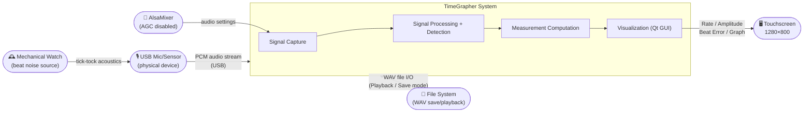
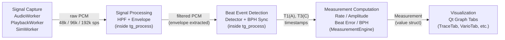

# Architectural Approaches

**Team**: Blue Sky (Team 3) | **Milestone**: M1 | **Due**: 2026-06-09 | **Status**: [ ] Draft / [ ] Final

---

## 1. Architecture Overview

TimeGrapher collects beat noise from a mechanical watch via USB microphone, detects T1(A) and T3(C) events through a real-time DSP pipeline, computes Rate, Amplitude, and Beat Error, and displays them in a Qt GUI. The overall structure is a unidirectional pipeline — **Capture → Process → Detect → Compute → Visualize** — built on a **4-layer module structure** and a **2-thread concurrency model**.

Operating modes: **Live** (real-time microphone) | **Playback** (WAV file) | **Sim** (synthetic signal)  
All three modes share the same DSP pipeline; the only difference is which component fills the ring buffer.

---

### 1.1 System Context Diagram

Shows the relationships between components inside the system boundary and external actors.

---

### 1.2 Pipeline Data Flow Diagram

Shows each processing stage and the data format passed between stages.

---

## 2. Core Architectural Patterns

> **Pattern definition** (course standard): A proven solution to a recurring problem. More complex than a tactic and involves more components.

---

### AP-01: Observer (Measurement → Visualization Coupling)

| Item | Detail |
|------|--------|
| **Pattern** | Observer |
| **Applied To** | `MeasurementEngine` (Domain Layer) emits a `measurementUpdated` signal; each graph tab (TraceTab, VarioTab, BeatErrorTab, etc.) subscribes and updates its display independently |
| **Rationale** | Decouples computation logic from display logic. Adding a new graph tab requires only one `connect()` call — no changes to `MainWindow.cpp`. This is the key pattern for resolving the God Object problem (TR-05), where `MainWindow` currently owns both computation and UI |
| **Trade-off** | Event flow becomes non-linear, requiring Signal-Slot tracing during debugging. Acceptable at the scale of 11 graph tabs |
| **Related Drivers** | QAS-4 (Correctness), QAS-5 (Extensibility) |

---

### AP-02: Single Source of Truth (Consistent Measurement Values)

| Item | Detail |
|------|--------|
| **Pattern** | Single Source of Truth |
| **Applied To** | Rate, Amplitude, and Beat Error are computed from the same T1·T3 timestamps and stored in a single `MeasurementState` object. All graph tabs read from this one source |
| **Rationale** | If each view computed independently, values would diverge across views. Computing once in `MeasurementEngine` and distributing via `measurementUpdated` structurally guarantees QAS-4 (inter-view deviation = 0). The only QAS achievable by design alone, without experiments |
| **Trade-off** | Changes to `MeasurementState` fields affect all tabs. However, field additions are backward-compatible, and some fields may be adjusted based on [EX-02](./planned-experiments.md#ex-02-beat-event-detection-accuracy) results |
| **Related Drivers** | QAS-4 (Correctness), QAS-2 (Measurement Accuracy — single computation source) |

---

## 3. Core Architectural Tactics

> **Tactic definition** (course standard): A design technique for achieving a specific Quality Attribute. Simpler than a pattern; multiple tactics can be applied together. Tactic usage is a design decision and must always consider trade-offs.

---

### AT-01: Pipeline — Introduce Concurrency (Performance Tactic)

| Item | Detail |
|------|--------|
| **Tactic Type** | Performance — Introduce Concurrency (Pipeline / Pipe-and-Filter) |
| **Applied To** | Signal capture → Signal processing (HPF+Envelope) → Beat event detection (Detector+BPH) → Measurement computation (Rate/Amplitude/Beat Error) are separated into independent processing stages |
| **Rationale** | Each stage has a single responsibility and can be replaced independently. `tg_process()` already encapsulates the DSP stages, aligning with this tactic. In EX-02 (detection threshold comparison) and EX-03 (filter parameter sweep), only the relevant stage needs to be swapped for comparison |
| **Trade-off** | Inter-stage buffering introduces processing delay (Latency ↑). Mitigated by limiting block size to 4096 samples max. Design complexity ↑ |
| **Related Drivers** | QAS-1 (Real-Time Performance), QAS-3 (Low Latency) |

---

### AT-02: Thread Separation — Introduce Concurrency (Performance Tactic)

| Item | Detail |
|------|--------|
| **Tactic Type** | Performance — Introduce Concurrency (Thread creation) |
| **Applied To** | `AudioCapture` family (LiveCapture / PlaybackCapture / SimCapture) runs on a `TimeCriticalPriority` background thread. Qt GUI and DSP processing run on the main thread. A 30-second float PCM ring buffer (`TMasterAudioDataRaw`) connects the two threads |
| **Rationale** | If UI event handling blocked audio capture, dropped audio blocks would occur (QAS-1 failure). `TimeCriticalPriority` gives the audio thread preemptive priority with the OS scheduler, ensuring 96k sps real-time processing |
| **Trade-off** | Mutex synchronization required for ring buffer `WriteIndex` access. Design complexity ↑. Minimized because Qt Signal-Slot `AutoConnection` mode handles thread-boundary crossing safely and automatically |
| **Related Drivers** | QAS-1 (Real-Time Performance), QAS-3 (Low Latency) |

---

### AT-03: 4-Layer Structure — Layered Architecture (Modifiability Architecture Decision)

| Item | Detail |
|------|--------|
| **Tactic Type** | Modifiability Architecture Decision — Layered Architecture |
| **Applied To** | The full module structure is divided into four layers: Acquisition / Signal Processing / Domain / Presentation. The core refactoring task is decomposing `MainWindow.cpp` (31 private methods, 30+ member variables) into `MeasurementEngine`, `MeasurementStore`, and `AudioCapture` abstractions |
| **Rationale** | In the current structure, adding one new graph tab requires modifying `MainWindow.h`, `MainWindow.cpp`, and `MainWindow.ui`. After 4-layer separation, it requires only one new tab class file + one `connect()` call. This is the essential structure for achieving the QAS-5 "≤ 3 files modified" criterion |
| **Trade-off** | Upfront refactoring cost. Layer dependency direction must be strictly maintained (top → bottom, one-way); violating boundaries eliminates the structural benefit |
| **Related Drivers** | QAS-4 (Correctness), QAS-5 (Extensibility) |

---

### AT-04: Graceful Degradation — Manage Work Requests (Performance Tactic)

| Item | Detail |
|------|--------|
| **Tactic Type** | Performance — Manage Work Requests (load control) |
| **Applied To** | Sample rate configuration for the signal capture and processing pipeline. Actual processing limits on RPi 5 are measured via EX-01, after which fallback thresholds are confirmed. Step-down: 192k sps → 96k sps → 48k sps |
| **Rationale** | Whether RPi 5 can simultaneously handle 96k sps + Qt GUI is unverified (OI-03, TR-03). Forcing the highest sample rate risks total system failure. Stepping down load ensures the QAS-1 minimum (48k sps) is always met |
| **Trade-off** | At lower sample rates, T1/T3 timing resolution decreases → may affect measurement accuracy (QAS-2). Latency vs. quality balance required. Accuracy error tolerance is finalized after EX-01 + EX-02 results |
| **Related Drivers** | QAS-1 (Real-Time Performance), QAS-2 (Measurement Accuracy) |

---

## 4. Architecture ↔ Driver Mapping

| Driver | Related Approach | Confidence | Rationale |
|--------|-----------------|-----------|-----------|
| QAS-1 Real-Time Performance (96k sps, 0 dropped blocks) | AT-01 Pipeline, AT-02 Thread Separation, AT-04 Graceful Degradation | ⚠️ Conditional | Design direction is correct; achieving 96k sps on RPi 5 requires verification via [EX-01](./planned-experiments.md#ex-01-sample-rate-performance-on-raspberry-pi-5) |
| QAS-2 Measurement Accuracy (Rate error < 5 s/d, Beat Error < 0.1 ms) | AT-01 Pipeline (independent stage replacement), AP-02 Single Source | ⚠️ Conditional | Pipeline stage separation enables filter/detection swap. Single source guarantees internal consistency. Actual error vs. WeiShi confirmed by [EX-02](./planned-experiments.md#ex-02-beat-event-detection-accuracy)·[EX-03](./planned-experiments.md#ex-03-filter-parameter-sweep) |
| QAS-3 Low Latency (end-to-end < 100 ms) | AT-01 Minimal-buffer pipeline (block ≤ 4096 samples), AT-02 Thread separation | ⚠️ Conditional | Structure reduces latency; achieving < 100 ms requires verification via [EX-01](./planned-experiments.md#ex-01-sample-rate-performance-on-raspberry-pi-5) |
| QAS-4 Correctness (0 deviation across all views) | AP-02 Single Source, AT-03 4-layer (single Domain Layer computes), AP-01 Observer (all views subscribe same signal) | ✅ Guaranteed by design | Single `MeasurementEngine` computes; all views subscribe to same signal → inter-view deviation = 0 structurally guaranteed. No experiment needed |
| QAS-5 Extensibility (≤ 3 files modified to add new graph) | AT-01 Single-responsibility pipeline stages, AP-01 Signal-Slot decoupling, AT-03 4-layer separation | ✅ Guaranteed by design | 1 new tab class + 1 `connect()` call → ≤ 3 file changes structurally guaranteed |

**⚠️ Conditional**: Design direction is correct; target values are finalized in M2 after EX-01·EX-02·EX-03 results.

---

## 5. Open Design Decisions

Decisions to be confirmed in M2 based on experiment results. Until then, use the provisional defaults below.

| Decision | Options | Provisional Default | Related Experiment | Status |
|---------|---------|--------------------|--------------------|--------|
| T1 detection reference | onset vs peak | onset (temporary, pre-EX-02) | [EX-02](./planned-experiments.md) | Open |
| Target sample rate | 192k / 96k / 48k sps | 96k sps target, 48k sps fallback | [EX-01](./planned-experiments.md) | Open |
| Threading model | Single thread vs audio/UI separate | Separate threads (retain current structure) | [EX-01](./planned-experiments.md), [EX-05](./planned-experiments.md) | Provisional |
| Filter defaults | LP cutoff, HP cutoff combinations | HP=200Hz, LP=8000Hz (current code) | [EX-03](./planned-experiments.md) | Open |
| Build method | macOS cross-compile vs RPi native | RPi native build (safe fallback) | [EX-04](./planned-experiments.md) | Open |
