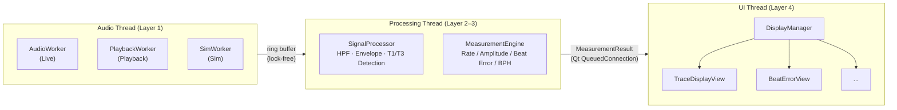

# 아키텍처 접근법 / Architectural Approaches

**팀 / Team**: Blue Sky (3팀) | **마일스톤 / Milestone**: M1 | **마감 / Due**: 2026-06-09 | **상태 / Status**: [ ] 초안 Draft / [ ] 최종 Final

---

## 1. 아키텍처 개요 / Architecture Overview

**한국어**

TimeGrapher는 기계식 시계의 음향 신호를 실시간으로 수집·처리·표시하는 시스템이다. Raspberry Pi 5 위에서 Qt GUI로 동작하며, 기존 `TimeGrapher_v10.5` 코드베이스를 확장한다.

시스템은 **4-레이어 파이프라인**으로 구성된다. 데이터는 단방향으로 흐르며 각 레이어는 인접 레이어와만 통신한다. 오디오 캡처(Layer 1)와 신호 처리(Layer 2)는 **별도 스레드**로 분리되어 lock-free 링 버퍼로 연결되고, GUI 렌더링(Layer 4)은 Qt UI 스레드에서만 실행된다.

**현재 v10.5의 문제**: `MainWindow.cpp`(1,540줄+, 61 메서드)가 위 4개 레이어의 로직을 모두 포함하는 God Object다(TR-07). 핵심 리팩토링 목표는 이를 4-레이어로 분리하는 것이다.

**English**

TimeGrapher captures, processes, and displays acoustic signals from a mechanical watch in real time. It runs on Raspberry Pi 5 with a Qt GUI, extending the `TimeGrapher_v10.5` codebase.

The system is structured as a **4-layer pipeline**. Data flows in one direction only; each layer communicates exclusively with its adjacent layer. Audio capture (Layer 1) and signal processing (Layer 2) run on separate threads connected by a lock-free ring buffer. GUI rendering (Layer 4) runs only on the Qt UI thread.

**Current v10.5 problem**: `MainWindow.cpp` (1,540+ lines, 61 methods) is a God Object containing logic from all four layers (TR-07). The primary refactoring goal is to separate it into this 4-layer structure.



---

## 2. 주요 아키텍처 접근법 / Key Architectural Approaches

**한국어**

6개의 아키텍처 접근법을 정의한다. 각 접근법은 하나 이상의 드라이버(QAS)를 지원하기 위해 선택되었다.

**English**

Six architectural approaches are defined. Each is chosen to support one or more QAS drivers.

---

### AA-01: 파이프라인 패턴 / Pipeline Pattern

**한국어**

신호 수집 → 신호 처리 → 측정 계산 → 표시를 4개 독립 레이어로 분리한다. 각 레이어는 교체·최적화가 가능하며, 레이어 경계가 레이턴시 측정 포인트가 된다. 이 패턴은 데이터 흐름의 처리 순서를 규정하는 **런타임 구조**에 해당한다.

**English**

Separates capture → processing → calculation → display into four independent layers. Each layer can be replaced or optimized independently. Layer boundaries become latency measurement points. This pattern governs the **runtime processing sequence**.

| 항목 / Item | 내용 / Detail |
|------------|--------------|
| **적용 범위 / Applied To** | Audio Input → Signal Processing → Measurement Engine → Display |
| **근거 / Rationale** | 실시간 처리 시스템에서 단계 분리는 병목 구간 독립 최적화를 가능하게 함 / Separating stages enables independent bottleneck optimization in real-time systems |
| **트레이드오프 / Trade-off** | 단계 버퍼링으로 레이턴시 증가 → 버퍼 크기 최소화로 보완 / Stage buffering adds latency — mitigated by minimizing buffer sizes |
| **연결 드라이버 / Linked Driver** | QAS-1 (Real-Time), QAS-3 (Low Latency), QAS-5 (Extensibility) |

---

### AA-02: 스레드 분리 + Lock-free 링 버퍼 / Thread Separation + Lock-free Ring Buffer

**한국어**

오디오 캡처(Layer 1)와 신호 처리(Layer 2–3)를 별도 스레드로 분리하고, lock-free 링 버퍼로 연결한다. GUI 렌더링은 Qt UI 스레드에서만 실행된다. 스레드 간 데이터 전달은 Qt Signal-Slot의 `QueuedConnection`을 사용해 thread-safe하게 처리한다.

```
[Audio Thread]  →  lock-free ring buffer  →  [Processing Thread]  →  QueuedConnection  →  [UI Thread]
  Layer 1                                      Layer 2–3                                    Layer 4
```

**왜 이 전술인가**: 오디오 캡처 스레드가 처리 지연의 영향을 받으면 dropped audio block이 발생한다. 스레드를 분리하면 캡처는 항상 일정한 속도로 동작하고, 처리가 느려져도 캡처에 영향을 주지 않는다. 이것이 QAS-1(dropped block = 0)을 달성하는 핵심 전술이다.

**English**

Audio capture (Layer 1) and signal processing (Layer 2–3) run on separate threads connected by a lock-free ring buffer. GUI rendering runs only on the Qt UI thread. Cross-thread data passing uses Qt Signal-Slot `QueuedConnection` for thread safety.

**Why this tactic**: If the audio capture thread is affected by processing delays, dropped audio blocks occur. Thread separation ensures capture always runs at a constant rate, unaffected by processing speed. This is the key tactic for achieving QAS-1 (zero dropped blocks).

| 항목 / Item | 내용 / Detail |
|------------|--------------|
| **적용 범위 / Applied To** | AudioWorker (Audio Thread); SignalProcessor, MeasurementEngine (Processing Thread); DisplayManager, IGraphView (UI Thread) |
| **트레이드오프 / Trade-off** | 스레드 동기화 복잡도 증가; lock-free 버퍼 + QueuedConnection으로 관리 / Synchronization complexity — managed via lock-free buffer and QueuedConnection |
| **연결 드라이버 / Linked Driver** | QAS-1 (Real-Time), QAS-3 (Low Latency) |
| **연결 실험 / Linked Experiment** | EX-01, EX-05 |

---

### AA-03: 단일 데이터 소스 / Single Data Source

**한국어**

Rate, Amplitude, Beat Error는 동일한 T1·T3 타임스탬프에서 계산되며, 단일 `MeasurementResult` 객체에 저장된다. 모든 GUI 뷰는 이 하나의 소스를 읽는다.

```
T1·T3 timestamps (SignalProcessor)
    └──▶ MeasurementEngine → MeasurementResult (단일 소스)
              ├──▶ TraceDisplayView
              ├──▶ BeatErrorView
              ├──▶ SpectrogramView
              └──▶ (새 그래프 / new graph)
```

**왜 이 패턴인가**: 각 뷰가 독립적으로 계산하면 뷰마다 수치가 달라지는 inconsistency가 발생한다. 단일 소스를 강제하면 QAS-4(뷰 간 편차 = 0)가 구조적으로 보장된다. 실험 없이 설계만으로 달성 가능한 유일한 QAS다.

**English**

Rate, Amplitude, and Beat Error are computed from the same T1·T3 timestamps and stored in a single `MeasurementResult` object. All GUI views read from this one source.

**Why this pattern**: If each view computes independently, numeric inconsistencies arise between views. Enforcing a single source structurally guarantees QAS-4 (zero deviation across views). This is the only QAS achievable by design alone, without experiments.

| 항목 / Item | 내용 / Detail |
|------------|--------------|
| **적용 범위 / Applied To** | MeasurementEngine → DisplayManager → 모든 IGraphView 구현체 |
| **연결 드라이버 / Linked Driver** | QAS-4 (Correctness), QAS-2 (Accuracy — 단일 계산 소스) |

---

### AA-04: 플러그인 표시 레이어 / Plugin Display Layer

**한국어**

Layer 4의 모든 그래프 뷰는 공통 인터페이스 `IGraphView`를 구현한다. `DisplayManager`가 뷰를 등록하고 `MeasurementResult` 업데이트를 구독한다. 새 그래프 추가 시 Layer 1–3은 수정하지 않는다.

```cpp
// 새 그래프 추가 시 필요한 것 / Adding a new graph
class NewGraphWidget : public IGraphView { ... };         // ① 신규 파일 생성 / New file
DisplayManager::registerView(new NewGraphWidget());       // ② 기존 파일 1개 수정 / One existing file
// Layer 1–3: 변경 없음 / No changes
```

**왜 이 패턴인가**: 11개 그래프를 5주 안에 구현해야 한다. 매 그래프 추가마다 Layer 1–3을 수정하면 regression risk가 누적된다. Plugin 구조는 이 risk를 Layer 4로 격리한다.

**English**

All graph views in Layer 4 implement a common `IGraphView` interface. `DisplayManager` registers views and subscribes to `MeasurementResult` updates. Adding a new graph requires no changes to Layers 1–3.

**Why this pattern**: 11 graphs must be implemented in 5 weeks. Modifying Layers 1–3 for each graph accumulates regression risk. The plugin structure isolates this risk to Layer 4 only.

| 항목 / Item | 내용 / Detail |
|------------|--------------|
| **적용 범위 / Applied To** | DisplayManager + 모든 IGraphView 구현체 (탭별 독립 파일) |
| **확장성 목표 / Extensibility Target** | 새 그래프 1개 추가 시 변경 파일 ≤ 3개 (QAS-5) / ≤ 3 files changed per new graph |
| **트레이드오프 / Trade-off** | 초기 인터페이스 설계 규율 필요 / Requires up-front interface design discipline |
| **연결 드라이버 / Linked Driver** | QAS-5 (Extensibility) |

---

### AA-05: tg_c_placement_t 파라미터 선택 / tg_c_placement_t Parameter Selection

**한국어**

`Detector.cpp`에는 T1/T3 감지 기준점으로 `TG_C_PLACEMENT_PEAK`와 `TG_C_PLACEMENT_ONSET` 두 설정이 이미 구현되어 있다. 새로 구현하지 않고, EX-02에서 WeiShi No.1000 대비 오차가 더 작은 설정을 선택하여 코드베이스의 기본값으로 고정한다.

**왜 이 전략인가**: 감지 기준점 선택이 Rate, Beat Error 계산에 직접 영향을 준다. 구현은 이미 존재하므로 실험으로 최적값을 선택하는 것이 가장 효율적이다. 이 결정이 QAS-2 수치를 확정하는 근거가 된다.

**English**

`Detector.cpp` already implements both `TG_C_PLACEMENT_PEAK` and `TG_C_PLACEMENT_ONSET`. Rather than reimplementing, EX-02 selects the setting with lower error vs. WeiShi No.1000 and fixes it as the codebase default.

**Why this strategy**: The timing reference directly affects Rate and Beat Error calculations. Since both options are already implemented, selecting the optimal one through experiment is the most efficient path. This decision confirms the QAS-2 target values.

| 항목 / Item | 내용 / Detail |
|------------|--------------|
| **적용 범위 / Applied To** | `Detector.cpp` — `tg_c_placement_t` 기본값 설정 |
| **연결 드라이버 / Linked Driver** | QAS-2 (Measurement Accuracy) |
| **연결 실험 / Linked Experiment** | EX-02 |

---

### AA-06: 우아한 성능 저하 / Graceful Degradation

**한국어**

RPi 5의 실제 처리 능력이 확인되기 전까지, 샘플레이트를 3단계로 계획한다. 각 단계에서 시스템은 정상 동작을 유지하되 측정 해상도만 낮아진다. EX-01 결과에 따라 실제 목표 sps가 확정된다.

**English**

Until RPi 5 real-world capacity is verified via EX-01, three sample-rate tiers are planned. The system maintains normal operation at each tier; only measurement resolution decreases. EX-01 results will confirm the actual target sps.

| 단계 / Tier | 샘플레이트 / Sample Rate | 상태 / Status |
|------------|----------------------|--------------|
| Stretch | 192,000 sps | RPi 부하 실측 후 결정 / Decided after EX-01 |
| **Objective** | **96,000 sps** | **목표 / Target** |
| Minimum | 48,000 sps | 이 이하면 프로젝트 실패 / Below this = project failure |

| 항목 / Item | 내용 / Detail |
|------------|--------------|
| **적용 범위 / Applied To** | AudioCapture — ALSA 버퍼 및 샘플레이트 설정 |
| **연결 드라이버 / Linked Driver** | QAS-1 (Real-Time Performance) |
| **연결 실험 / Linked Experiment** | EX-01 |

---

## 3. 핵심 인터페이스 계약 / Key Interface Contracts

**한국어**

AA-03, AA-04가 실제로 동작하려면 두 인터페이스의 계약이 확정되어야 한다. 아래 정의를 기준으로 코딩팀이 탭을 독립 구현한다. 필드는 EX-02 결과에 따라 일부 조정될 수 있다.

**English**

For AA-03 and AA-04 to function, two interface contracts must be fixed. The coding team implements each tab independently against these definitions. Fields may be partially adjusted after EX-02 results.

### 3.1 MeasurementResult 구조체 / MeasurementResult Struct

```cpp
struct MeasurementResult {
    // 측정값 / Measurements
    double  rate_spd;          // Rate (s/d) — WeiShi 오차 < 5 s/d 목표
    double  amplitude_deg;     // Amplitude (°)
    double  beatError_ms;      // Beat Error (ms)
    int     bph;               // Beats Per Hour

    // 이벤트 타이밍 / Event timestamps (Processing Thread 기준 ms)
    double  t1_ms;             // T1 (A 이벤트) onset 또는 peak — EX-02 결과로 확정
    double  t3_ms;             // T3 (C 이벤트)

    // 파형 데이터 / Waveform data (Scope 계열 탭용)
    QVector<float> processedPcm;   // HPF + envelope 처리 완료 샘플
    float          onsetThreshold; // 현재 감지 임계값

    // 메타 / Meta
    int     beatIndex;         // 0부터 순환하는 beat 번호
    qint64  captureTimestamp;  // ALSA 캡처 시작 시각 (ms, 모노토닉)
};
```

### 3.2 IGraphView 인터페이스 / IGraphView Interface

```cpp
class IGraphView : public QWidget {
    Q_OBJECT
public:
    explicit IGraphView(QWidget* parent = nullptr) : QWidget(parent) {}
    virtual ~IGraphView() = default;

    // 매 beat마다 MeasurementEngine이 emit → DisplayManager가 각 탭에 전달
    // Called each beat; DisplayManager forwards MeasurementResult to each tab
    virtual void onMeasurementUpdate(const MeasurementResult& result) = 0;

    // 운영 모드 전환 시 호출 (Live / Playback / Sim)
    // Called on operating mode change
    virtual void onModeChanged(OperatingMode mode) {}  // 기본 no-op / default no-op
};
```

**한국어**

`DisplayManager`는 `IGraphView*` 목록을 관리하고 `MeasurementEngine`의 Signal을 각 탭의 `onMeasurementUpdate` 슬롯에 연결한다. 새 탭 추가 시 `IGraphView`를 상속한 클래스 파일 1개와 `DisplayManager`의 등록 호출 1줄만 추가하면 된다.

**English**

`DisplayManager` manages a list of `IGraphView*` and connects `MeasurementEngine`'s signal to each tab's `onMeasurementUpdate` slot. Adding a new tab requires only one new subclass file and one `registerView()` call.

---

## 4. 레이턴시 예산 분석 / Latency Budget Analysis

**한국어**

QAS-3 요구사항(end-to-end < 100 ms)을 스레드·스테이지별로 분배한다. 아래 수치는 EX-01 실측 전 잠정값이며, 실험 결과에 따라 조정된다.

**English**

QAS-3 (end-to-end < 100 ms) is broken down per thread and stage. Values below are tentative pending EX-01 measurements and will be revised after results.

```
Audio Thread  →  Processing Thread  (lock-free ring buffer)
──────────────────────────────────────────────────────────
[ALSA 버퍼 수집 / ALSA buffer capture]    ~20 ms  ← 버퍼 크기 설정으로 제어 가능
[LP/HP 필터 처리 / Filter processing]      ~10 ms
[Beat event 감지 / Beat detection]         ~10 ms
[Rate/Amplitude/BE 계산 / Calculation]      ~5 ms
──────────────────────────────────────────────────────────
capture → process 소계 / Subtotal          ~45 ms

Processing Thread  →  UI Thread  (Qt QueuedConnection)
──────────────────────────────────────────────────────────
[GUI 이벤트 루프 픽업 대기 / GUI event-loop pickup]  ~25 ms  ← GUI 부하 의존; QueuedConnection 자체는 μs 단위
[Qt Signal-Slot 디스패치 / dispatch]                  ~5 ms
[IGraphView 렌더링 / rendering]                       ~25 ms
──────────────────────────────────────────────────────────
process → display 소계 / Subtotal          ~55 ms  ← 목표 30 ms 초과 → EX-05로 검증 필요

End-to-End 합계 / Total                   ~100 ms  (28,800 BPH 기준 beat 주기 208ms 이내)
```

**한국어**

`process→display` 소계(~55 ms)가 architectural-drivers의 목표값(< 30 ms)을 초과한다. EX-05(Qt 멀티탭 렌더링 성능 실험) 결과에 따라 렌더링 최적화 또는 목표값 재조정이 필요하다.

**English**

The `process→display` subtotal (~55 ms) exceeds the architectural-drivers target (< 30 ms). EX-05 (Qt multi-tab rendering performance) results will determine whether rendering optimization or target revision is needed.

---

## 5. 아키텍처 ↔ 드라이버 매핑 / Architecture ↔ Driver Mapping

**한국어**

각 QAS 드라이버가 어떤 접근법으로 지원되는지, 그리고 설계만으로 보장되는지 실험이 필요한지를 명시한다.

**English**

For each QAS driver, the table lists which approach supports it and whether it is guaranteed by design or conditional on experiments.

| 드라이버 / Driver | 아키텍처 접근법 / Approach | 신뢰도 / Confidence | 근거 / Rationale |
|-----------------|--------------------------|-------------------|----------------|
| **QAS-1** Real-Time Performance | AA-01, AA-02, AA-06 | ⚠️ 조건부 / Conditional | 설계 방향은 올바르나 96k sps 달성 여부는 EX-01로 검증 / Design is sound; 96k sps verified by EX-01 |
| **QAS-2** Measurement Accuracy | AA-03, AA-05 | ⚠️ 조건부 / Conditional | 단일 소스로 내부 일관성 보장; WeiShi 대비 오차는 EX-02·EX-03 후 확정 / Single source ensures consistency; error vs WeiShi confirmed by EX-02·EX-03 |
| **QAS-3** Low Latency | AA-01, AA-02 | ⚠️ 조건부 / Conditional | 구조적으로 레이턴시 단축 가능; 100 ms 달성 여부는 EX-01로 확정 / Structure enables low latency; 100ms target confirmed by EX-01 |
| **QAS-4** Correctness | AA-03 | ✅ 설계로 보장 / Guaranteed by design | 단일 소스 구조 → 뷰 간 편차 = 0 수학적 보장; 실험 불필요 / Single source mathematically guarantees zero deviation |
| **QAS-5** Extensibility | AA-01, AA-04 | ✅ 설계로 보장 / Guaranteed by design | IGraphView + DisplayManager → 신규 그래프 추가 시 변경 파일 ≤ 3개 / ≤ 3 files changed per new graph |

**⚠️ 조건부 / Conditional**: 설계 방향은 올바르나, 목표 수치는 EX-01~EX-03 결과 후 M2에서 확정된다.

---

## 6. 구현 가이드 / Construction Guidance

**한국어**

아래 결정들은 확정되어 코딩팀이 구현을 시작할 수 있다. 미확정 항목은 실험 결과 후 확정되며, 확정 전까지 해당 영역의 구현을 시작하지 않는다.

**English**

The decisions below are confirmed; the coding team can begin implementation. Open items are confirmed after experiments; implementation of affected areas must not begin until each decision is locked.

### 확정된 결정 / Confirmed Decisions

| 결정 / Decision | 내용 / Detail |
|----------------|--------------|
| 레이어 구조 / Layer structure | 4-레이어 확정. `MainWindow.cpp` → `AudioInput` / `SignalProcessor` / `MeasurementEngine` / `DisplayManager` 분리 |
| 스레드 모델 / Thread model | Audio Thread + Processing Thread + UI Thread (3개) |
| 스레드 간 연결 / Thread connection | Audio→Processing: lock-free ring buffer / Processing→UI: Qt QueuedConnection |
| 데이터 흐름 / Data flow | ring buffer → beat events → `MeasurementResult` → `IGraphView::onMeasurementUpdate()` |
| 새 그래프 추가 방법 / Adding a graph | `IGraphView` 구현 파일 1개 + `DisplayManager::registerView()` 호출 1줄 |

### 미확정 항목 / Open Items

| 미확정 사항 / Open Item | 연결 실험 / Experiment | 결정 시점 / When |
|----------------------|----------------------|----------------|
| T1 감지 기준점 (Onset vs Peak) / T1 detection reference | EX-02 | EX-02 완료 후 — **구현 블로커 / Blocker** |
| 목표 sps (96k vs 48k) / Target sps | EX-01 | EX-01 완료 후 — **구현 블로커 / Blocker** |
| 레이턴시 목표 수치 (ms) / Latency target values | EX-01 | EX-01 완료 후 |
| 필터 컷오프 기본값 / Filter cutoff defaults | EX-03 | EX-03 완료 후 |
| `tg_c_placement_t` 기본값 / Default value | EX-02 | EX-02 완료 후 |
| process→display 목표 수정 여부 / Latency target revision | EX-05 | EX-05 완료 후 |

---

## 7. 아키텍처 범위 외 항목 / Out of Scope

**한국어**

- 클라우드 연결 또는 원격 데이터 로깅 없음 (온디바이스 전용)
- 커스텀 DSP 하드웨어 없음 (USB 오디오 입력 그대로 사용)
- Witschi Chronoscope UI 정확한 복제 없음 (기능적 참고만)
- AI 기능(FR-09)은 선택적 — 아키텍처가 이에 의존하지 않음

**English**

- No cloud connectivity or remote data logging (on-device only)
- No custom DSP hardware (uses USB audio input as-is)
- No exact copy of Witschi Chronoscope UI (functional reference only)
- AI feature (FR-09) is optional — architecture must not depend on it

---

## 8. 검토 체크리스트 / Review Checklist

- [ ] 아키텍처 개요 (3-스레드, lock-free ring buffer 포함) 제공됨 / Architecture overview (3-thread + lock-free ring buffer) provided
- [ ] Mermaid 다이어그램으로 레이어·스레드 구조 시각화됨 / Mermaid diagram visualizes layer and thread structure
- [ ] 6개 접근법(AA-01~AA-06) 근거·트레이드오프·드라이버 연결 정의됨 / All 6 approaches defined with rationale, trade-off, and driver link
- [ ] AA-05로 기존 구현 활용 전략 명시됨 / AA-05 documents existing-implementation selection strategy
- [ ] MeasurementResult 구조체 필드 정의됨 / MeasurementResult struct fields defined
- [ ] IGraphView 인터페이스 시그니처 정의됨 / IGraphView interface signature defined
- [ ] 레이턴시 예산 스레드·스테이지별 분해됨 / Latency budget broken down per thread and stage
- [ ] 드라이버 지원 신뢰도 (설계 보장 vs 조건부) 명시됨 / Driver support confidence (guaranteed vs conditional) stated
- [ ] 확정된 결정과 미확정 항목이 구분되어 명시됨 / Confirmed decisions and open items clearly separated
- [ ] M2 구현을 가이드하기에 충분한 설계 / Design sufficient to guide M2 construction
