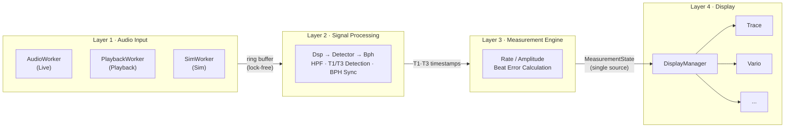

# Architectural Approaches — TimeGrapher

**Milestone**: M1 | **Due**: 2026-06-09 | **Updated**: 2026-06-03

---

## 1. Architecture Overview

### 한국어

TimeGrapher는 기계식 시계의 음향 신호를 실시간으로 수집·처리·표시하는 시스템이다. Raspberry Pi 5 위에서 Qt GUI로 동작하며, 기존 `TimeGrapher_v10.5` 코드베이스를 확장한다.

시스템은 **4-레이어 파이프라인**으로 구성된다. 데이터는 단방향으로 흐르며 각 레이어는 인접 레이어와만 통신한다.



**현재 v10.5의 문제**: `MainWindow.cpp`(1,600줄+)가 위 4개 레이어의 로직을 모두 포함하는 God Object다. 이 구조는 TR-05(merge conflict)와 QAS-5(Extensibility) 달성을 방해한다. 핵심 리팩토링 목표는 이를 4-레이어로 분리하는 것이다.

### English

TimeGrapher captures, processes, and displays acoustic signals from a mechanical watch in real time. It runs on Raspberry Pi 5 with a Qt GUI, extending the `TimeGrapher_v10.5` codebase.

The system is structured as a **4-layer pipeline**. Data flows in one direction only; each layer communicates exclusively with its adjacent layer.

**Current v10.5 problem**: `MainWindow.cpp` (1,600+ lines) is a God Object containing logic from all four layers. This blocks both TR-05 (merge conflicts) and QAS-5 (Extensibility). The primary refactoring goal is to separate it into this 4-layer structure.

---

## 2. Architectural Approaches

### 한국어

5개의 아키텍처 접근 방식을 정의한다. 각 접근 방식은 하나 이상의 드라이버(QAS)를 지원하기 위해 선택되었다.

### English

Five architectural approaches are defined. Each is chosen to support one or more QAS drivers.

---

### AA-01: Pipeline Pattern

**Pattern**: Pipeline

**한국어**

신호 수집 → 신호 처리 → 측정 계산 → 표시를 독립 레이어로 분리한다. 각 레이어는 교체·최적화가 가능하며, 레이어 경계가 latency 측정 포인트가 된다.

**왜 이 패턴인가**: 실시간 처리 시스템에서 각 처리 단계를 분리하면 병목 구간을 독립적으로 최적화할 수 있다. 또한 레이어 경계를 통해 latency를 3구간으로 측정할 수 있어 QAS-3 검증이 가능하다.

**구현 방향**:
- `AudioWorker` → ring buffer → `Timegrapher::process()` → `MeasurementEngine` → `DisplayManager`
- 각 레이어 간 인터페이스를 명확히 정의하여 의존성 단방향 유지

**English**

Separates capture → processing → calculation → display into independent layers. Each layer can be optimized or replaced independently. Layer boundaries become latency measurement points.

**Why this pattern**: In real-time processing systems, separating stages enables independent optimization of bottlenecks. Layer boundaries also enable 3-segment latency measurement, making QAS-3 verifiable.

---

### AA-02: Thread Separation + Lock-free Ring Buffer

**Tactic**: Increase available resources / Manage sampling rate

**한국어**

오디오 캡처(Layer 1)와 신호 처리(Layer 2)를 별도 스레드로 분리하고, lock-free 링 버퍼로 연결한다. GUI 렌더링은 Qt UI 스레드에서만 실행된다.

```
[Audio Thread]  →  ring buffer  →  [Processing Thread]  →  Qt signal  →  [UI Thread]
  AudioWorker       (lock-free)     Dsp · Detector · ME                    Display
```

**왜 이 전술인가**: 오디오 캡처 스레드가 처리 지연의 영향을 받으면 dropped audio block이 발생한다. 스레드를 분리하면 캡처는 항상 일정한 속도로 동작하고, 처리가 느려져도 캡처에 영향을 주지 않는다. 이것이 QAS-1(dropped block = 0)을 달성하는 핵심 전술이다.

**EX-01에서 검증**: 96k sps에서 스레드 분리 구조가 실제로 dropped block 없이 동작하는지, end-to-end latency가 100ms 이내인지 측정한다.

**English**

Audio capture (Layer 1) and signal processing (Layer 2) run on separate threads connected by a lock-free ring buffer. GUI rendering runs only on the Qt UI thread.

**Why this tactic**: If the audio capture thread is delayed by processing, dropped audio blocks occur. Thread separation ensures capture always runs at a constant rate, unaffected by processing speed. This is the key tactic for achieving QAS-1 (zero dropped blocks).

**Validated by EX-01**: Measures whether this structure sustains 96k sps without dropped blocks and whether end-to-end latency stays under 100ms.

---

### AA-03: Single Data Source

**Pattern**: Single Source of Truth

**한국어**

Rate, Amplitude, Beat Error는 동일한 T1·T3 타임스탬프에서 계산되며, 단일 `MeasurementState` 객체에 저장된다. 모든 GUI 뷰는 이 하나의 소스를 읽는다.

```
T1·T3 timestamps (Layer 2)
    └──▶ MeasurementEngine (Layer 3) → MeasurementState
              ├──▶ Trace Display
              ├──▶ Vario
              ├──▶ Beat Error View
              └──▶ (new graph)
```

**왜 이 패턴인가**: 각 뷰가 독립적으로 계산하면 뷰마다 수치가 달라지는 inconsistency가 발생한다. 단일 소스를 강제하면 QAS-4(뷰 간 편차 = 0)가 구조적으로 보장된다. 실험 없이 설계만으로 달성 가능한 유일한 QAS다.

**English**

Rate, Amplitude, and Beat Error are computed from the same T1·T3 timestamps and stored in a single `MeasurementState` object. All GUI views read from this one source.

**Why this pattern**: If each view computes independently, inconsistencies arise between views. Enforcing a single source structurally guarantees QAS-4 (zero deviation across views). This is the only QAS achievable by design alone, without experiments.

---

### AA-04: Plugin Display Layer

**Pattern**: Strategy + Observer

**한국어**

Layer 4의 모든 그래프 뷰는 공통 인터페이스 `IGraphView`를 구현한다. `DisplayManager`가 뷰를 등록하고 `MeasurementState` 업데이트를 구독한다.

```cpp
// 새 그래프 추가 시 필요한 것
class NewGraphWidget : public IGraphView { ... };  // ① 신규 파일 생성
DisplayManager::registerView(new NewGraphWidget()); // ② 기존 파일 1개 수정
// Layer 1~3: 변경 없음
```

**왜 이 패턴인가**: 11개 그래프를 5주 안에 구현해야 한다. 매 그래프 추가마다 Layer 1~3을 수정하면 regression risk가 누적된다. Plugin 구조는 이 risk를 Layer 4로 격리한다.

**English**

All graph views in Layer 4 implement a common `IGraphView` interface. `DisplayManager` registers views and subscribes to `MeasurementState` updates.

**Why this pattern**: 11 graphs must be implemented in 5 weeks. Modifying Layers 1–3 for each graph accumulates regression risk. The plugin structure isolates this risk to Layer 4 only.

---

### AA-05: tg_c_placement_t Parameter Selection

**Design Strategy**: Select optimal configuration from existing implementation

**한국어**

`Detector.cpp`에는 T1/T3 감지 기준점으로 `TG_C_PLACEMENT_PEAK`와 `TG_C_PLACEMENT_ONSET` 두 설정이 이미 구현되어 있다. 새로 구현하지 않고, EX-03에서 WeiShi No.1000 대비 오차가 더 작은 설정을 선택하여 코드베이스의 기본값으로 고정한다.

**왜 이 전략인가**: 감지 기준점 선택이 Rate, Beat Error 계산에 직접 영향을 준다. 구현은 이미 존재하므로 실험으로 최적값을 선택하는 것이 가장 효율적이다. 이 결정이 QAS-2 수치를 확정하는 근거가 된다.

**English**

`Detector.cpp` already implements both `TG_C_PLACEMENT_PEAK` and `TG_C_PLACEMENT_ONSET`. Rather than reimplementing, EX-03 selects the setting with lower error vs. WeiShi No.1000 and fixes it as the codebase default.

**Why this strategy**: The timing reference directly affects Rate and Beat Error calculations. Since both options are already implemented, selecting the optimal one through experiment is the most efficient path. This decision confirms the QAS-2 target values.

---

## 3. How Well Drivers Are Supported

### 한국어

각 QAS 드라이버가 위 아키텍처에 의해 얼마나 잘 지원되는지 평가한다.

| QAS | 지원 방식 | 신뢰도 | 근거 |
|-----|---------|-------|------|
| **QAS-1** Real-Time Performance | AA-01 (파이프라인) + AA-02 (스레드 분리) | ⚠️ 조건부 | 설계는 충분하나 RPi 5에서 실제 96k sps 달성 여부는 EX-01로 검증 필요 |
| **QAS-2** Measurement Accuracy | AA-03 (단일 소스) + AA-05 (placement 선택) | ⚠️ 조건부 | 단일 소스로 내부 일관성 보장. 실제 WeiShi 대비 오차는 EX-02·EX-03으로 확정 |
| **QAS-3** Low Latency | AA-01 (레이어 경계 = 측정 포인트) + AA-02 (스레드 분리) | ⚠️ 조건부 | 구조적으로 latency 단축 가능하나 100ms 이내 달성 여부는 EX-01로 확정 |
| **QAS-4** Correctness | AA-03 (단일 데이터 소스) | ✅ 설계로 보장 | 단일 소스 구조를 채택하면 뷰 간 편차 = 0이 수학적으로 보장됨. 실험 불필요 |
| **QAS-5** Extensibility | AA-01 (Layer 4 분리) + AA-04 (Plugin 구조) | ✅ 설계로 보장 | IGraphView 인터페이스 + DisplayManager 구조 → 신규 그래프 추가 시 파일 변경 ≤ 3개 |

**⚠️ 조건부**: 설계 방향은 올바르나, 목표 수치는 EX-01~EX-03 결과 후 M2에서 확정된다.

### English

| QAS | How supported | Confidence | Rationale |
|-----|--------------|-----------|-----------|
| **QAS-1** Real-Time Performance | AA-01 + AA-02 | ⚠️ Conditional | Design is sound; whether 96k sps is achievable on RPi 5 must be verified by EX-01 |
| **QAS-2** Measurement Accuracy | AA-03 + AA-05 | ⚠️ Conditional | Single source ensures internal consistency; actual error vs. WeiShi confirmed by EX-02·EX-03 |
| **QAS-3** Low Latency | AA-01 + AA-02 | ⚠️ Conditional | Structure reduces latency; whether end-to-end < 100ms is achieved confirmed by EX-01 |
| **QAS-4** Correctness | AA-03 | ✅ Guaranteed by design | Single data source mathematically guarantees zero deviation across views. No experiment needed |
| **QAS-5** Extensibility | AA-01 + AA-04 | ✅ Guaranteed by design | IGraphView + DisplayManager structure → new graph addition changes ≤ 3 files |

**⚠️ Conditional**: The design direction is correct, but target values are confirmed at M2 after EX-01~EX-03.

---

## 4. Is the Design Sound Enough to Guide Construction?

### 한국어

다음 사항이 확정되어 구현을 시작할 수 있다:

| 구현 결정 | 내용 |
|---------|------|
| 레이어 구조 | 4-레이어 확정. `MainWindow.cpp` → `AudioInput` / `SignalProcessor` / `MeasurementEngine` / `DisplayManager`로 분리 |
| 스레드 모델 | Audio Thread + Processing Thread + UI Thread (3개) |
| 데이터 흐름 | ring buffer → beat event → `MeasurementState` → `IGraphView::onUpdate()` |
| 새 그래프 추가 방법 | `IGraphView` 구현 + `DisplayManager::registerView()` 호출 2단계 |
| 감지 파라미터 | EX-03 결과 후 `tg_c_placement_t` 기본값 확정 |

실험 결과 전까지 열려 있는 결정:

| 미확정 사항 | 결정 시점 |
|-----------|---------|
| Target sps (96k vs 48k) | EX-01 완료 후 |
| Latency 목표 수치 (ms) | EX-01 완료 후 |
| tg_c_placement_t 기본값 | EX-03 완료 후 |

### English

The following decisions are confirmed and construction can begin:

| Decision | Detail |
|----------|--------|
| Layer structure | 4 layers confirmed. Split `MainWindow.cpp` into `AudioInput` / `SignalProcessor` / `MeasurementEngine` / `DisplayManager` |
| Thread model | Audio Thread + Processing Thread + UI Thread (3 threads) |
| Data flow | ring buffer → beat events → `MeasurementState` → `IGraphView::onUpdate()` |
| Adding a new graph | Implement `IGraphView` + call `DisplayManager::registerView()` — 2 steps |
| Detection parameter | `tg_c_placement_t` default confirmed after EX-03 |

Decisions still open pending experiments:

| Open item | When confirmed |
|-----------|---------------|
| Target sps (96k vs 48k fallback) | After EX-01 |
| Latency target values (ms) | After EX-01 |
| tg_c_placement_t default | After EX-03 |
