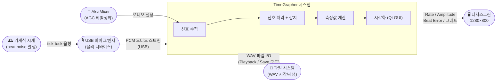
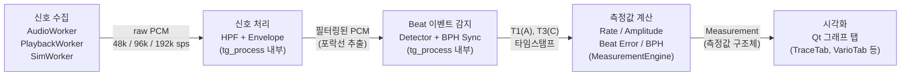

# 아키텍처 어프로치

**팀**: Blue Sky (3팀) | **마일스톤**: M1 | **마감**: 2026-06-09 | **상태**: [ ] 초안 / [ ] 최종

---

## 1. 아키텍처 개요

TimeGrapher는 기계식 시계의 beat noise를 USB 마이크로 수집하고, 실시간 DSP 파이프라인으로
T1(A)·T3(C) 이벤트를 감지하여 Rate, Amplitude, Beat Error를 계산한 뒤 Qt GUI에 표시하는 시스템이다.
전체 구조는 **신호 수집 → 처리 → 감지 → 계산 → 시각화**의 단방향 파이프라인을 기반으로 하며,
**4계층 모듈 구조**와 **2스레드 동시성 모델** 위에서 동작한다.

운영 모드: **Live** (실시간 마이크) | **Playback** (WAV 파일 재생) | **Sim** (합성 신호)
세 모드 모두 동일한 DSP 파이프라인을 사용하며, 차이는 링버퍼에 데이터를 채우는 주체뿐이다.

---

### 1.1 시스템 컨텍스트 다이어그램

시스템 경계 내부의 구성요소와 외부 행위자(Actor) 간의 관계를 나타낸다.

---

### 1.2 파이프라인 데이터 흐름 다이어그램

각 처리 단계와 단계 간 데이터 형식을 나타낸다.

---

## 2. 핵심 아키텍처 패턴

> **패턴 정의** (수업 기준): 반복되는 문제에 대한 검증된 해결 방법. Tactic보다 복잡하고 더 많은 구성 요소를 포함한다.

---

### AP-01: Observer / Qt Signal-Slot (측정값 → 시각화 연결)

| 항목 | 내용 |
|------|------|
| **패턴** | Observer |
| **적용 대상** | `MeasurementEngine`(Domain Layer)이 `measurementUpdated` Signal을 발행하면, 각 그래프 탭(TraceTab, VarioTab, BeatErrorTab 등)이 구독하여 독립적으로 화면을 갱신 |
| **채택 이유** | 계산 로직과 표시 로직을 분리하여 새 그래프 탭 추가 시 `MainWindow.cpp` 수정 없이 `connect()` 한 줄만 추가하면 됨. 현재 `MainWindow`가 계산과 UI를 모두 담당하는 God Object 문제(TR-05)를 해결하는 핵심 패턴 |
| **트레이드오프** | 이벤트 흐름이 비선형이 되어 디버깅 시 Signal-Slot 연결을 추적해야 함. 11개 그래프 탭 규모에서는 허용 가능한 수준 |
| **연관 드라이버** | QAS-4 (정합성), QAS-5 (확장성) |

---

### AP-02: 단일 데이터 소스 (측정값 단일 출처 보장)

| 항목 | 내용 |
|------|------|
| **패턴** | Single Source of Truth |
| **적용 대상** | Rate, Amplitude, Beat Error를 동일한 T1·T3 타임스탬프에서 계산하여 단일 `MeasurementState` 객체에 저장. 모든 그래프 탭은 이 하나의 소스를 읽음 |
| **채택 이유** | 각 뷰가 독립적으로 계산하면 뷰마다 수치가 달라지는 inconsistency가 발생함. `MeasurementEngine` 단일 진입점에서 계산 후 `measurementUpdated` Signal로 배포하면 QAS-4(뷰 간 편차 = 0)가 구조적으로 보장됨. 실험 없이 설계만으로 달성 가능한 유일한 QAS |
| **트레이드오프** | `MeasurementState` 구조체 필드가 변경되면 모든 탭에 영향. 단, 필드 추가는 하위 호환 가능하며 [EX-02](./planned-experiments.md#ex-02-beat-event-detection-accuracy) 결과에 따라 일부 필드가 조정될 수 있음 |
| **연관 드라이버** | QAS-4 (정합성), QAS-2 (측정 정확도 — 단일 계산 소스) |

---

## 3. 핵심 아키텍처 전술

> **전술 정의** (수업 기준): 특정 Quality Attribute를 달성하기 위한 설계 기법. 패턴보다 단순한 단위이며 여러 전술을 함께 적용할 수 있다. 전술 사용은 설계 결정이므로 반드시 트레이드오프를 고려해야 한다.

---

### AT-01: Pipeline 도입 — Introduce Concurrency (Performance Tactic)

| 항목 | 내용 |
|------|------|
| **전술 분류** | Performance — Introduce Concurrency (Pipeline / Pipe-and-Filter) |
| **적용 대상** | 신호 수집 → 신호 처리(HPF+Envelope) → Beat 이벤트 감지(Detector+BPH) → 측정값 계산(Rate/Amplitude/Beat Error) 전 구간을 독립적인 처리 단계로 분리 |
| **채택 이유** | 각 단계가 단일 책임을 가지므로 독립적으로 교체 가능. `tg_process()` 단일 진입점이 DSP 단계들을 이미 캡슐화하고 있어 이 전술과 일치. EX-02(감지 기준점 비교), EX-03(필터 파라미터 탐색) 실험 시 해당 단계만 교체하여 비교 측정 가능 |
| **트레이드오프** | 단계 간 버퍼링으로 처리 지연 발생(Latency ↑). 블록 크기를 최대 4096 샘플로 제한하여 보완. Design complexity ↑ |
| **연관 드라이버** | QAS-1 (실시간 성능), QAS-3 (저지연) |

---

### AT-02: 스레드 분리 — Introduce Concurrency (Performance Tactic)

| 항목 | 내용 |
|------|------|
| **전술 분류** | Performance — Introduce Concurrency (Thread 생성) |
| **적용 대상** | `AudioCapture` 계열(LiveCapture/PlaybackCapture/SimCapture)을 `TimeCriticalPriority` 백그라운드 스레드에서 실행. Qt GUI 및 DSP 처리는 메인 스레드에서 실행. 30초 float PCM 링버퍼(`TMasterAudioDataRaw`)가 두 스레드를 연결 |
| **채택 이유** | UI 이벤트 처리가 오디오 캡처를 블로킹하면 dropped audio block 발생(QAS-1 실패). `TimeCriticalPriority`로 OS 스케줄러에서 오디오 스레드를 선점하여 96k sps 실시간 처리를 보장 |
| **트레이드오프** | 링버퍼 `WriteIndex` 접근 시 뮤텍스 동기화 필요. Design complexity ↑. Qt Signal-Slot의 `AutoConnection` 모드가 스레드 경계를 자동으로 안전하게 처리하므로 복잡도는 최소화됨 |
| **연관 드라이버** | QAS-1 (실시간 성능), QAS-3 (저지연) |

---

### AT-03: 4계층 구조 — Layered Architecture (Modifiability Architecture Decision)

| 항목 | 내용 |
|------|------|
| **전술 분류** | Modifiability Architecture Decision — Layered Architecture |
| **적용 대상** | 전체 모듈 구조를 Acquisition / Signal Processing / Domain / Presentation 4계층으로 분리. 현재 `MainWindow.cpp`(31개 private 메서드, 30개 이상 멤버 변수)를 `MeasurementEngine`, `MeasurementStore`, `AudioCapture` 추상화로 분해하는 것이 핵심 리팩토링 과제 |
| **채택 이유** | 현재 구조에서 새 그래프 탭 1개를 추가하려면 `MainWindow.h`, `MainWindow.cpp`, `MainWindow.ui`를 반드시 수정해야 함. 4계층 분리 후에는 새 탭 클래스 파일 1개 추가 + `connect()` 한 줄로 완료. QAS-5의 "파일 수정 ≤ 3개" 기준을 달성하기 위한 필수 구조 |
| **트레이드오프** | 초기 리팩토링 비용 발생. 계층 간 의존성 방향을 엄격히 유지해야 하며(상위 → 하위 단방향), 경계 위반 시 구조적 장점이 무너짐 |
| **연관 드라이버** | QAS-4 (정합성), QAS-5 (확장성) |

---

### AT-04: 단계적 성능 저하 — Manage Work Requests (Performance Tactic)

| 항목 | 내용 |
|------|------|
| **전술 분류** | Performance — Manage Work Requests (요청 부하 제어) |
| **적용 대상** | 신호 수집 및 처리 파이프라인의 샘플레이트 설정. RPi 5의 실제 처리 한계를 EX-01 실험으로 측정한 뒤 폴백 임계값을 확정. 단계별 폴백: 192k sps → 96k sps → 48k sps |
| **채택 이유** | RPi 5에서 96k sps + Qt GUI 동시 처리 가능 여부가 미검증 상태(OI-03, TR-03). 최고 샘플레이트를 강제할 경우 시스템 전체가 실패할 위험이 있으므로, 처리 부하를 단계적으로 줄여 QAS-1의 최소 기준(48k sps)을 보장 |
| **트레이드오프** | 낮은 샘플레이트에서 T1/T3 타이밍 해상도 감소 → 측정 정확도(QAS-2)에 영향 가능. Latency vs 품질 균형 필요. 정확도 오차 허용 범위는 EX-01 + EX-02 결과 이후 확정 |
| **연관 드라이버** | QAS-1 (실시간 성능), QAS-2 (측정 정확도) |

---

## 4. 아키텍처 ↔ 드라이버 매핑

| 드라이버 | 연관 아키텍처 어프로치 | 신뢰도 | 근거 |
|---------|---------------------|-------|------|
| QAS-1 실시간 성능 (96k sps, dropped block 0) | AT-01 Pipeline 도입, AT-02 스레드 분리, AT-04 단계적 성능 저하 | ⚠️ 조건부 | 설계 방향은 올바르나 RPi 5에서 96k sps 달성 여부는 [EX-01](./planned-experiments.md#ex-01-sample-rate-performance-on-raspberry-pi-5)로 검증 필요 |
| QAS-2 측정 정확도 (Rate 오차 < 5 s/d, Beat Error 오차 < 0.1 ms) | AT-01 Pipeline (필터·감지 단계 독립 교체 가능), AT-04 폴백 설계, AP-02 단일 데이터 소스 | ⚠️ 조건부 | Pipeline 단계 분리로 필터·감지 교체 가능. 단일 계산 소스로 내부 일관성 보장. 실제 WeiShi 대비 오차는 [EX-02](./planned-experiments.md#ex-02-beat-event-detection-accuracy)·[EX-03](./planned-experiments.md#ex-03-filter-parameter-sweep)으로 확정 |
| QAS-3 저지연 (end-to-end < 100 ms) | AT-01 최소 버퍼 파이프라인 (블록 ≤ 4096 샘플), AT-02 스레드 분리 | ⚠️ 조건부 | 구조적으로 latency 단축 가능하나 100ms 이내 달성 여부는 [EX-01](./planned-experiments.md#ex-01-sample-rate-performance-on-raspberry-pi-5)로 확정 |
| QAS-4 정합성 (모든 뷰에서 수치 편차 0) | AP-02 단일 데이터 소스, AT-03 4계층 구조 (단일 Domain Layer에서 계산), AP-01 Observer (동일 Signal 구독) | ✅ 설계로 보장 | 단일 `MeasurementEngine`에서 계산 후 동일 Signal을 모든 뷰가 구독 → 뷰 간 편차 = 0이 구조적으로 보장. 실험 불필요 |
| QAS-5 확장성 (새 그래프 추가 시 수정 파일 ≤ 3개) | AT-01 단일 책임 Pipeline 단계, AP-01 Signal-Slot 디커플링, AT-03 4계층 분리 | ✅ 설계로 보장 | 새 탭 클래스 1개 추가 + `connect()` 한 줄 → 파일 변경 ≤ 3개가 구조적으로 보장 |

**⚠️ 조건부**: 설계 방향은 올바르나, 목표 수치는 EX-01·EX-02·EX-03 결과 후 M2에서 확정된다.

---

## 5. 미결 설계 결정

실험 결과에 따라 M2에서 확정될 결정 목록. 실험 전까지는 아래 잠정 기본값을 사용한다.

| 결정 사항 | 후보 옵션 | 잠정 기본값 | 연관 실험 | 상태 |
|---------|---------|-----------|---------|------|
| T1 감지 기준점 | onset vs peak | onset (EX-02 결과 전 임시) | [EX-02](./planned-experiments.md) | 미결 |
| 목표 샘플레이트 | 192k / 96k / 48k sps | 96k sps 목표, 48k sps 폴백 | [EX-01](./planned-experiments.md) | 미결 |
| 스레딩 모델 | 단일 스레드 vs 오디오/UI 분리 스레드 | 분리 스레드 (현재 구조 유지) | [EX-01](./planned-experiments.md), [EX-05](./planned-experiments.md) | 잠정 결정 |
| 필터 기본값 | LP 컷오프, HP 컷오프 조합 | HP=200Hz, LP=8000Hz (현재 코드 기준) | [EX-03](./planned-experiments.md) | 미결 |
| 빌드 방식 | macOS 크로스 컴파일 vs RPi 네이티브 빌드 | RPi 네이티브 빌드 (안전한 폴백) | [EX-04](./planned-experiments.md) | 미결 |

