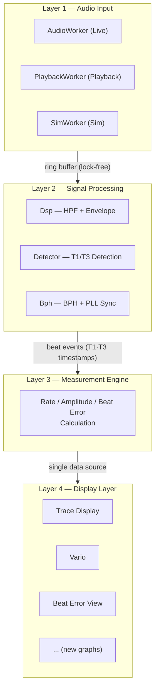

# Architectural Approaches — TimeGrapher

**Milestone**: M1 | **Due**: 2026-06-09 | **Updated**: 2026-06-03

---

## 1. Architecture Overview

### 한국어

TimeGrapher는 음향 신호를 실시간으로 처리하는 **4-레이어 파이프라인 구조**로 설계한다. 각 레이어는 단방향으로 데이터를 전달하며, 상위 레이어는 하위 레이어를 직접 참조하지 않는다.



**핵심 설계 원칙**: 새 그래프는 Layer 4에만 추가된다. Layer 1~3은 수정하지 않는다.

현재 v10.5의 `MainWindow.cpp`(1,600줄+, God Object)를 이 4-레이어 구조로 분리하는 것이 핵심 리팩토링 과제다.

### English

TimeGrapher adopts a **4-layer pipeline architecture** for real-time acoustic signal processing. Data flows in one direction only; upper layers do not reference lower layers directly.

**Core design principle**: New graphs are added only to Layer 4. Layers 1–3 remain untouched.

The primary refactoring task is splitting the current `MainWindow.cpp` (1,600+ lines, God Object) into this 4-layer structure.

---

## 2. Architectural Approaches

### 2.1 Summary

| ID | Approach | Pattern / Tactic | Supports |
|----|----------|-----------------|---------|
| AA-01 | 4-Layer Pipeline | Pipeline pattern | QAS-1, QAS-3, QAS-5 |
| AA-02 | Audio–Processing Thread Separation | Concurrency tactic | QAS-1, QAS-3 |
| AA-03 | Single Data Source | Single source of truth | QAS-4 |
| AA-04 | Plugin Display Layer | Strategy + Observer pattern | QAS-5 |
| AA-05 | tg_c_placement_t Selection | Parameter tuning | QAS-2 |

---

### AA-01: 4-Layer Pipeline

**한국어**

신호 수집 → 신호 처리 → 측정 계산 → 표시를 독립 레이어로 분리한다. 각 레이어는 인접 레이어와만 통신한다.

- **QAS-1**: 각 레이어를 독립적으로 최적화 가능
- **QAS-3**: 레이어 경계가 latency 측정 포인트가 됨 (EX-01)
- **QAS-5**: Layer 4만 수정하여 새 그래프 추가 가능
- **TR-05 대응**: `MainWindow.cpp` God Object → 4개 레이어로 분리

**English**

Separates capture → processing → calculation → display into independent layers with one-directional data flow.

- **QAS-1**: Each stage optimized independently
- **QAS-3**: Layer boundaries are latency measurement points (EX-01)
- **QAS-5**: New graphs added only to Layer 4
- **TR-05**: Splits God Object `MainWindow.cpp` into 4 layers

---

### AA-02: Audio–Processing Thread Separation

**한국어**

오디오 캡처(Layer 1)와 신호 처리(Layer 2)를 별도 스레드로 분리하고, lock-free 링 버퍼로 연결한다. GUI 렌더링은 Qt UI 스레드에서만 실행된다.

```
[Audio Thread] → ring buffer → [Processing Thread] → Qt signal → [UI Thread]
  AudioWorker                   Dsp + Detector + ME               Display
```

- **QAS-1**: 오디오 캡처 스레드가 처리 지연에 영향받지 않음 → dropped block 방지
- **QAS-3**: 처리와 렌더링 분리 → end-to-end latency 단축
- **TR-03, TR-04 대응**: EX-01로 실측 검증

**English**

Audio capture (Layer 1) and signal processing (Layer 2) run on separate threads, connected by a lock-free ring buffer. GUI rendering runs on the Qt UI thread only.

- **QAS-1**: Audio thread unaffected by processing delays → no dropped blocks
- **QAS-3**: Separated processing and rendering reduce end-to-end latency
- **TR-03, TR-04**: Validated by EX-01

---

### AA-03: Single Data Source

**한국어**

Rate, Amplitude, Beat Error는 동일한 T1·T3 타임스탬프에서 계산되며, 단일 `MeasurementEngine` 객체에 저장된다. 모든 GUI 뷰는 이 소스를 구독한다.

```
T1·T3 timestamps
    └──▶ MeasurementEngine
              ├──▶ Trace Display
              ├──▶ Vario
              └──▶ (new graph)
```

- **QAS-4**: 동일 소스 → 뷰 간 수치 편차 = 0 (구조적 보장)
- **QAS-2**: 단일 감지 파이프라인 → 측정 일관성

**English**

Rate, Amplitude, and Beat Error are all computed from the same T1·T3 timestamps stored in a single `MeasurementEngine`. All GUI views subscribe to this one source.

- **QAS-4**: Single source → zero deviation across views (structurally guaranteed)
- **QAS-2**: Single detection pipeline → consistent measurements

---

### AA-04: Plugin Display Layer

**한국어**

Layer 4의 각 그래프 뷰는 공통 인터페이스(`IGraphView`)를 구현한다. `DisplayManager`가 뷰를 등록·관리하며, 새 그래프 추가 시 기존 코드를 수정하지 않는다.

```
새 그래프 추가 시 변경 파일:
  ① NewGraphWidget.cpp/h  (신규 생성)
  ② DisplayManager.cpp    (탭 등록, 기존 수정)
  → 총 2개 (≤ 3개 목표 달성)
```

- **QAS-5**: 신규 그래프 추가 시 변경 파일 ≤ 3개
- **TR-05 대응**: 모듈 경계 확정 → merge conflict 최소화

**English**

Each graph view in Layer 4 implements a common `IGraphView` interface. `DisplayManager` registers and manages views. Adding a new graph requires no changes to existing logic.

- **QAS-5**: New graph addition changes ≤ 3 files
- **TR-05**: Defined module boundaries minimize merge conflicts

---

### AA-05: tg_c_placement_t Selection

**한국어**

`Detector.cpp`에 이미 구현된 두 가지 T1/T3 감지 기준(`TG_C_PLACEMENT_PEAK`, `TG_C_PLACEMENT_ONSET`) 중 WeiShi No.1000 대비 오차가 작은 설정을 EX-03으로 선택하여 확정한다.

- **QAS-2**: 정확한 감지 기준 선택 → Rate / Beat Error 오차 최소화
- **EX-03 완료 후 확정**

**English**

`Detector.cpp` already implements `TG_C_PLACEMENT_PEAK` and `TG_C_PLACEMENT_ONSET`. EX-03 selects whichever minimizes error vs. WeiShi No.1000.

- **QAS-2**: Optimal timing reference → minimized Rate / Beat Error error
- **Confirmed after EX-03**

---

## 3. Driver–Approach Mapping

| QAS | Priority | Approaches | How supported |
|-----|----------|-----------|--------------|
| QAS-1 Real-Time Performance | 1 | AA-01, AA-02 | Pipeline + thread separation prevents dropped audio blocks |
| QAS-2 Measurement Accuracy | 2 | AA-03, AA-05 | Single detection path + optimal placement parameter (EX-03) |
| QAS-3 Low Latency | 3 | AA-01, AA-02 | Thread separation reduces latency; EX-01 confirms values |
| QAS-4 Correctness | 4 | AA-03 | Single data source guarantees zero view deviation structurally |
| QAS-5 Extensibility | 5 | AA-01, AA-04 | Plugin display layer limits graph addition to ≤ 3 file changes |

---

## 4. Open Decisions (Pending Experiments)

| 결정 / Decision | 근거 실험 / Experiment | 시점 / When |
|---------------|----------------------|-----------|
| Target sps: 96k 유지 vs. 48k 폴백 | EX-01 | M2 이전 |
| QAS-3 latency 수치 확정 | EX-01 | M2 이전 |
| tg_c_placement_t 설정 확정 | EX-03 | M2 이전 |
| QAS-2 오차 목표 수치 확정 | EX-02, EX-03 | M2 이전 |
