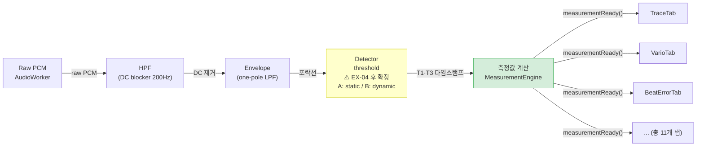

# Correctness 요구사항 분석 / Correctness Requirement Analysis

> **작성일 / Date**: 2026-06-05  
> **팀 / Team**: Blue Sky (3팀) | **마일스톤 / Milestone**: M1

---

## 0. QA / ASR 판단 기준 / Classification Criteria

### QA (Quality Attribute) 판단 기준

**한국어**

QA는 시스템이 stakeholder의 needs를 얼마나 잘 충족하는지를 나타내는 **측정 가능하거나 테스트 가능한(measurable or testable) 속성**이다. [Bass et al., *Software Architecture in Practice* 4th ed., p.39]

> "A quality attribute (QA) is a *measurable or testable property* of a system that is used to indicate how well the system satisfies the *needs of its stakeholders*."

핵심은 **수치화가 아니라 테스트 가능성**이다. 정성적 기준이라도 pass/fail을 판단할 수 있으면 valid한 QA response measure이다. [Bass et al., p.43: "measurable in some fashion so that the scenario can be tested"]

**English**

A QA is a measurable or testable property — quantification is not required; testability is the criterion.

---

### ASR (Architecturally Significant Requirement) 판단 기준

**한국어**

ASR은 **아키텍처에 영향을 주는** 요구사항이다. 조건은 단 하나: 아키텍처 결정(컴포넌트 구조, 패턴, 커넥터 방식 등)을 유발했거나 유발하는가. [Merson, *Architectural Drivers*, LG Architecture Training, CMU, slide 5]

> "Requirements that influence the architecture are called *architectural drivers* or *architecturally significant requirements (ASRs)*."

**두 가지 흔한 오해:**
1. ❌ "이미 아키텍처 결정이 내려졌으니 ASR이 아니다" → 결정이 완료된 상태는 ASR 여부와 무관하다. 그 요구사항이 결정을 유발했다면 ASR이다.
2. ❌ "대안이 하나뿐이면 ASR이 아니다" → 대안 수는 ASR 조건이 아니다. 아키텍처에 영향을 주면 ASR이다.

**English**

An ASR is any requirement that influences the architecture. The single condition is: did (or does) it cause an architectural decision? The number of alternatives and whether the decision is already made are irrelevant to ASR classification.

---

## 1. 요구사항 분류 / Requirement Classification

### 1.1 분류 결과 / Classification Result

**한국어**

원문 Correctness 요구사항은 두 가지 관심사를 포함한다. QA 기준(측정/테스트 가능하고, 아키텍처 결정에 영향을 준다)을 적용한 결과, **두 가지 모두 QA (및 ASR)** 로 분류된다.

| 관심사 / Concern | 분류 / Classification | 근거 / Rationale |
|-----------------|----------------------|-----------------|
| 모든 GUI 뷰가 동일 데이터 소스에서 계산됨 / All GUI views computed from same data source | **QA (ASR)** | 테스트 가능 (뷰 간 값 불일치 여부로 검증). Observer 패턴 선택을 유발한 아키텍처 결정임 |
| 소음 환경에서도 올바른 beat 감지 유지 / Correct beat detection maintained under ambient noise | **QA (ASR)** | Δ Rate / Δ Amplitude / Δ Beat Error로 측정 가능. HPF→Envelope→Detector 파이프라인 + adaptive threshold 아키텍처를 유발함 |

**English**

The original Correctness requirement contains two concerns. Applying the QA criterion (measurable/testable + influences architecture), **both are classified as QA (and ASR)**.

- **Same data source → QA**: Testable (verify no divergence across views). The requirement caused the architectural decision to apply the Observer pattern.
- **Noise robustness → QA**: Measurable via Δ Rate / Δ Amplitude / Δ Beat Error. The requirement caused the HPF → Envelope → Detector pipeline and adaptive threshold architecture.

---

### 1.2 QA 요구사항 / Quality Attribute Requirements

**한국어**

Correctness 요구사항에서 도출된 QA 요구사항은 아래와 같다.

| ID | QA 요건 / QA Requirement | 우선순위 / Priority | 상태 / Status |
|----|--------------------------|:-----------------:|:------------:|
| QA-C1 | 모든 GUI 뷰(Rate·Amplitude·Beat Error 그래프)가 동일한 Measurement 구조체를 구독 / All GUI views subscribe to the same Measurement struct | HIGH | ⚠️ 부분 구현 (리팩토링 필요) |
| QA-C2 | 소음 환경에서 beat 감지 품질 유지를 위한 Detector 파라미터(`onset_fraction`, `min_peak_fraction`) 튜닝 / Tune Detector parameters (`onset_fraction`, `min_peak_fraction`) to maintain beat detection quality under ambient noise | HIGH | ⚠️ 미결 — EX-04 결과로 최적값 확정 (현재 기본값: 0.03 / 0.20) |

**English**

QA-C1 is guaranteed structurally once the Observer pattern is in place. QA-C2: the adaptive threshold algorithm is already implemented in `Detector.cpp` (noise floor via 75th percentile, reference peak via median of last 16 beats). The open question is whether the default parameter values (`onset_fraction` = 0.03, `min_peak_fraction` = 0.20) hold up under noise — to be confirmed by EX-04.

---

---

## 2. 리스크 평가 / Risk Assessment

### 2.1 전체 리스크 요약 / Overall Risk Summary

**한국어**

Correctness FR 구현은 파라미터 설정에 따른 두 가지 실패 경로로 위협받는다.
- **`onset_fraction`이 너무 높으면**: 실제 beat onset을 threshold 이하로 판단 → missed beat
- **`onset_fraction`이 너무 낮으면**: 노이즈 burst를 beat로 판단 → false detection → 측정값 오염

성능(SPS) 문제는 이 FR의 범위 밖이다 — 파라미터 값은 상수이므로 연산량에 영향을 주지 않는다.

**English**

Correctness FR implementation faces two failure paths depending on parameter settings: (1) `onset_fraction` too high → real beat onset falls below threshold → missed beat; (2) `onset_fraction` too low → noise burst detected as beat → false detection. SPS/performance is out of scope — parameter values are constants and do not affect compute load.

---

### 2.2 기술 리스크 / Technical Risks

| ID | 리스크 / Risk | Prob | Impact | 연관 실험 / Experiment |
|----|-------------|:----:|:------:|:---------------------:|
| **TR-C1** | **Threshold 파라미터 미최적화**: 기본값(`onset_fraction`=0.03, `min_peak_fraction`=0.20)이 소음 환경에서 부적절 → Δ Rate / Δ Amplitude / Δ Beat Error 허용 범위 초과 / Default parameter values inadequate under noise → metrics exceed acceptable Δ | H | H | EX-04 |

---

### 2.3 미해결 이슈 및 대응 / Open Issues and Actions

**한국어**

| 이슈 / Open Issue | 연관 리스크 / Risk | 대응 / Action | 완료 기준 / Done When |
|------------------|:-----------------:|--------------|---------------------|
| 소음 3조건에서 Δ를 최소화하는 `onset_fraction` / `min_peak_fraction` 값은 무엇인가 / What `onset_fraction` / `min_peak_fraction` values minimize Δ across the 3 noise conditions | TR-C1 | **EX-04** — 파라미터 값 변화에 따른 Δ 측정 | 최적 파라미터 값 팀 합의 결정 |

**English**

TR-C1 is resolved by EX-04. SPS/performance is not a factor — parameter values are constants that do not affect compute load.

---

### 2.4 트레이드오프 / Trade-off

**한국어**

| 결정 / Decision | 얻는 것 / Gain | 잃는 것 / Loss |
|----------------|--------------|--------------|
| 높은 `onset_fraction` / Higher `onset_fraction` | 노이즈 버스트 차단 향상 / Better rejection of noise bursts | beat onset이 threshold 아래로 → missed beat |
| 낮은 `onset_fraction` / Lower `onset_fraction` | beat onset 감지 민감도 향상 / Better sensitivity to beat onset | 노이즈 버스트를 beat로 오감지 → false detection |

**English**

The tradeoff is purely about detection accuracy — parameter values are constants and do not affect compute load or sps. EX-04 finds the values that minimize Δ across all three noise conditions.

---

## 3. 계획된 실험 / Planned Experiments

---

### EX-04: 소음 환경 Threshold 파라미터 튜닝 / Noise-Condition Threshold Parameter Tuning

#### 결과 및 권고 / Results and Recommendations

**한국어** *(M2에서 기록)*

**English** *(To be recorded at M2)*

---

#### 목적 / Objective

**한국어**

Detector에는 noise floor 기반 adaptive threshold가 이미 구현되어 있다 (`noise_floor` = 최근 256ms 무음 구간의 75th percentile, `reference_peak` = 최근 16개 beat peak의 median). 소음 환경에서 이 메커니즘이 올바르게 작동하려면 `onset_fraction`과 `min_peak_fraction`이 적절히 설정되어야 한다.

이 실험이 답해야 하는 기술 질문:  
> **"소음 3조건에서 Δ Rate / Δ Amplitude / Δ Beat Error를 최소화하는 `onset_fraction` / `min_peak_fraction` 값은 무엇인가?"**

이 결과를 바탕으로:
- 소음 환경에 적합한 파라미터 값 확정 (기본값 0.03 / 0.20 유지 또는 조정)
- QAS-C Response Measure (허용 Δ 한계) 수치 확정

**English**

The Detector already implements a noise-floor-based adaptive threshold (`noise_floor` = 75th percentile of recent 256 ms silence samples; `reference_peak` = median of last 16 beat peaks). For this mechanism to work correctly under noise, `onset_fraction` and `min_peak_fraction` must be appropriately set.

Technical question this experiment must answer:  
> **"What values of `onset_fraction` / `min_peak_fraction` minimize Δ Rate / Δ Amplitude / Δ Beat Error across the three noise conditions?"**

Results feed into:
- Confirming parameter values for noisy environments (keep defaults 0.03 / 0.20 or adjust)
- Finalizing QAS-C Response Measure thresholds

---

#### 상태 / Status

`[x] Planned` | `[ ] In Progress` | `[ ] Concluded`

---

#### 기대 산출물 / Expected Outcomes

**한국어**

- 소음 조건 × 파라미터 값별 Δ Rate / Δ Amplitude / Δ Beat Error 비교표
- 소음 환경에 적합한 `onset_fraction` / `min_peak_fraction` 최적값 결정
- QAS-C Response Measure 허용 Δ 수치 확정 (잠정 "TBD" 대체)

**English**

- Comparison table: Δ Rate / Δ Amplitude / Δ Beat Error per noise condition × parameter value set
- Confirmed optimal `onset_fraction` / `min_peak_fraction` values for noisy environments
- Finalized QAS-C Response Measure thresholds (replacing TBD)

---

#### 필요 자원 / Resources Required

| 항목 / Item | 내용 / Detail |
|------------|--------------|
| 오디오 파일 / Audio files | 시계 clean 녹음 1개 + 각 환경 노이즈 녹음 3종 / 1 clean watch recording + 3 environmental noise recordings |
| 합성 조건 / Synthesis condition | 동일 마이크 위치·gain 설정으로 녹음 후 1:1 진폭 합성 — "시계와 동일 거리에서 해당 환경 소음이 들릴 때"를 재현 / Record all files at identical mic position and gain, then mix at 1:1 amplitude — simulates ambient noise heard at the same distance as the watch |
| 합성 도구 / Synthesis tool | Python 스크립트 (numpy + soundfile) — 1:1 진폭 합산, 재현성 보장 / Python script (numpy + soundfile) — 1:1 amplitude sum, reproducible |
| 소프트웨어 / Software | TimeGrapher Playback mode |
| 선행 조건 / Prerequisite | 없음 — SPS/성능과 무관, EX-01과 독립적으로 진행 가능 / None — independent of SPS/performance, can run in parallel with EX-01 |
| 공수 / Effort | 1 person-day |

---

#### 실험 절차 / Experiment Description

**한국어**

1. **녹음**: 동일 마이크 위치·gain 설정 유지하여 아래 4개 파일 수집
   - Clean: 조용한 환경에서 시계음 단독 녹음 (ground truth용)
   - 노이즈 A: 사람이 있는 교실 ambient noise 녹음 (시계 없이)
   - 노이즈 B: 조용한 밀폐 공간 ambient noise 녹음 (시계 없이)
   - 노이즈 C: 50cm 이내 의도적 소음 녹음 (진동/음향, 시계 없이)
2. **합성**: 시계 clean 녹음 + 노이즈 A / B / C 각각 1:1 진폭으로 합성 → 총 4개 입력 (clean 1, noisy 3)
3. **Ground truth 측정**: clean 파일에서 Rate / Amplitude / Beat Error 기록
4. **파라미터 값 세트 준비**: `onset_fraction` / `min_peak_fraction` 후보 조합 정의
   - 기본값: 0.03 / 0.20
   - 후보 조합 예시: (0.05, 0.25), (0.10, 0.30) 등 — 팀이 범위 결정
5. **측정**: 각 파라미터 조합 × noisy 3개 파일 Playback 모드 실행
6. **Δ 계산**: Δ = (noisy 결과) − (clean ground truth), 각 조건 × 각 파라미터 조합
7. **비교 및 결정**: 전체 소음 조건에서 Δ 합산이 가장 낮은 파라미터 조합을 최적값으로 팀 합의 결정

**English**

1. **Record**: collect 4 files using identical mic position and gain settings throughout
   - Clean: watch recording only, in a quiet environment (ground truth)
   - Noise A: classroom ambient noise (without watch)
   - Noise B: enclosed quiet room ambient noise (without watch)
   - Noise C: intentional noise within 50 cm (vibration/sound, without watch)
2. **Synthesize**: mix clean watch recording with each noise file at 1:1 amplitude → 4 total inputs (1 clean, 3 noisy)
3. **Ground truth**: record Rate / Amplitude / Beat Error from clean file
4. **Prepare parameter sets**: define candidate `onset_fraction` / `min_peak_fraction` combinations
   - Default: 0.03 / 0.20
   - Candidate sets e.g.: (0.05, 0.25), (0.10, 0.30) — range decided by team
5. **Measure**: run each parameter set × 3 noisy files in Playback mode
6. **Compute Δ**: Δ = (noisy result) − (clean ground truth), per condition × per parameter set
7. **Select**: parameter set with lowest total Δ across all noise conditions confirmed by team

---

#### 완료 기준 / Completion Criteria

**한국어**

- 4개 입력 (clean 1 + noisy 3) × 파라미터 후보 조합 측정 완료
- Δ Rate / Δ Amplitude / Δ Beat Error 비교표 작성
- 최적 `onset_fraction` / `min_peak_fraction` 값 팀 합의로 결정 및 문서화
- QAS-C Response Measure 허용 Δ 수치 확정

**English**

- Measurements completed: 4 inputs × parameter candidate sets
- Δ comparison table produced
- Optimal `onset_fraction` / `min_peak_fraction` values decided and documented by team
- QAS-C Response Measure thresholds finalized

---

#### 기간 / Duration

**한국어** 목표 완료: EX-01과 병렬 진행 가능 (파라미터 값은 연산량에 영향 없음)

**English** Target completion: can run in parallel with EX-01 (parameter values do not affect compute load)

---

#### 참고 링크 / Links and References

- [QAS-C 시나리오](./correctness-analysis.md#qas-c-소음-환경에서의-correctness--noise-robust-correctness)
- [TR-C1, TR-C2 리스크](./correctness-analysis.md#22-기술-리스크--technical-risks)
- [EX-01 RPi 성능 벤치마크](./planned-experiments.md#ex-01-rpi-성능-벤치마크--rpi-performance-benchmark)

---

## 4. 아키텍처 어프로치 / Architectural Approaches

### 4.1 아키텍처 개요 / Architecture Overview

**한국어**

TimeGrapher의 전체 구조는 단방향 신호 처리 파이프라인을 기반으로 한다. Correctness 요구사항은 이 파이프라인의 두 지점에서 각각 다른 방식으로 지원된다.

- **입력 쪽 (노이즈 필터링)**: 소음이 beat 감지에 영향을 주기 전에 제거 → QA 지원
- **출력 쪽 (Observer 구독)**: 단일 계산 결과를 모든 뷰가 공유 → FR 지원

**English**

TimeGrapher's architecture is a unidirectional signal processing pipeline. The Correctness requirement is addressed at two distinct points in this pipeline: noise is removed before beat detection (QA), and all views share a single computed result (FR).

> **범례 / Legend**  
> 🟡 노란 박스: 아키텍처 결정 보류 — Detector threshold 전략을 EX-04 결과로 확정 / Decision pending — Detector threshold strategy confirmed after EX-04  
> 🟢 초록 박스: 단일 데이터 소스 — Observer 패턴 적용 지점 / Single data source — Observer pattern applied here  
> 흰 박스: 이미 결정된 DSP 파이프라인 단계 / White box: DSP pipeline stages already decided

---

### 4.2 핵심 아키텍처 어프로치 / Main Architectural Approaches

#### AP-1: 파이프라인 필터링 (QA-C2 지원) / Pipeline Filtering (supports QA-C2)

**한국어**

| 항목 / Item | 내용 / Detail |
|------------|--------------|
| **대응 QA** | QA-C2 — 소음 환경에서의 beat 감지 품질 유지 |
| **고정 결정** | DSP 파이프라인(HPF → Envelope → Detector) + adaptive threshold 알고리즘 (`noise_floor` = 75th percentile, `reference_peak` = median of 16 beats) |
| **개방 결정** | `onset_fraction` / `min_peak_fraction` 파라미터 값 — 소음 환경에 적합한 값 확정 필요 |
| **현재 기본값** | `onset_fraction` = 0.03, `min_peak_fraction` = 0.20 |
| **결정 방법** | EX-04 — 소음 3조건 × 파라미터 후보 조합 Δ 비교 |
| **제약** | 없음 — 파라미터 값은 상수이므로 연산량·SPS에 무관 / None — parameter values are constants, independent of compute load and SPS |

**English**

The DSP pipeline and adaptive threshold algorithm are fixed (`Detector.cpp`: `noise_floor` via 75th percentile of recent silence samples, `reference_peak` via median of last 16 beat peaks). The only open decision is the parameter values (`onset_fraction`, `min_peak_fraction`) that keep metrics within acceptable Δ across all noise conditions. EX-04 finds these values empirically.

**설계가 드라이버를 지원하는 방식 / How the design supports the driver**

**한국어**: Detector의 adaptive threshold는 noise floor를 실시간으로 추정하므로 소음 환경 변화에 구조적으로 대응한다. EX-04에서 소음 3조건에 걸쳐 Δ를 최소화하는 파라미터 값을 확정함으로써 QA-C2 구현을 완성한다.

**English**: The Detector's adaptive threshold continuously estimates the noise floor, structurally enabling robustness to changing acoustic conditions. EX-04 confirms the parameter values that minimize Δ across all three noise conditions, completing the QA-C2 implementation.

---

#### AP-2: Observer / Qt Signal-Slot (QA-C1 지원) / Observer Pattern (supports QA-C1)

**한국어**

| 항목 / Item | 내용 / Detail |
|------------|--------------|
| **대응 QA** | QA-C1 — 모든 GUI 뷰가 동일 데이터 소스 사용 |
| **패턴** | Observer / Qt Signal-Slot |
| **설명** | MeasurementEngine이 단일 Measurement 구조체를 발행, 모든 탭이 동일 신호 구독 |
| **결정 필요 여부** | 없음 — 구조적으로 자동 보장 |

**English**

MeasurementEngine emits a single `Measurement` struct; all 11 graph tabs subscribe to the same signal. No view computes values independently. Consistency is structurally guaranteed.

---

### 4.3 QA-아키텍처 대응 / QA–Architecture Traceability

**한국어**

| QA | 리스크 | 실험 | 아키텍처 어프로치 | 구현 충분성 |
|----|-------|------|-----------------|-----------|
| QA-C2 (소음 환경 beat 감지) | TR-C1 (파라미터 미최적화) | EX-04 → Δ 비교 (EX-01과 병렬) | AP-1: 최적 `onset_fraction` / `min_peak_fraction` 확정 | EX-04 후 확정 |
| QA-C1 (동일 데이터 소스) | — | — | AP-2: Observer 패턴 (구조적 보장) | ✅ 설계로 즉시 보장 |

**English**

| QA | Risk | Experiment | Architectural Approach | Implementation Soundness |
|----|------|-----------|----------------------|-----------------|
| QA-C2 (noise-robust beat detection) | TR-C1 (parameter not optimized) | EX-04 → Δ comparison (parallel with EX-01) | AP-1: confirms optimal `onset_fraction` / `min_peak_fraction` values | Confirmed after EX-04 |
| QA-C1 (same data source) | — | — | AP-2: Observer pattern (structural guarantee) | ✅ Immediately guaranteed by design |
