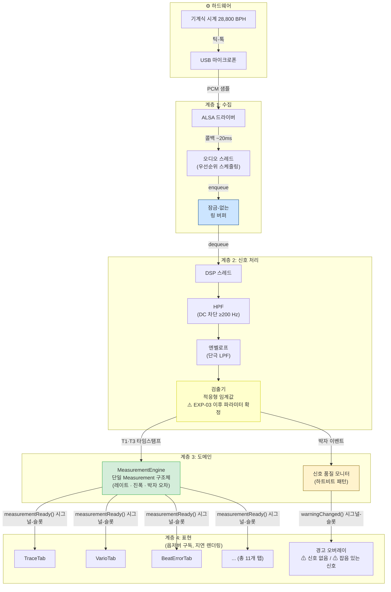
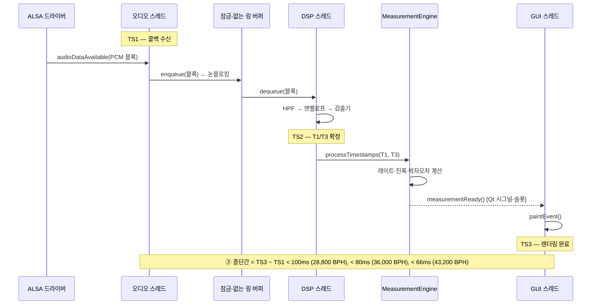
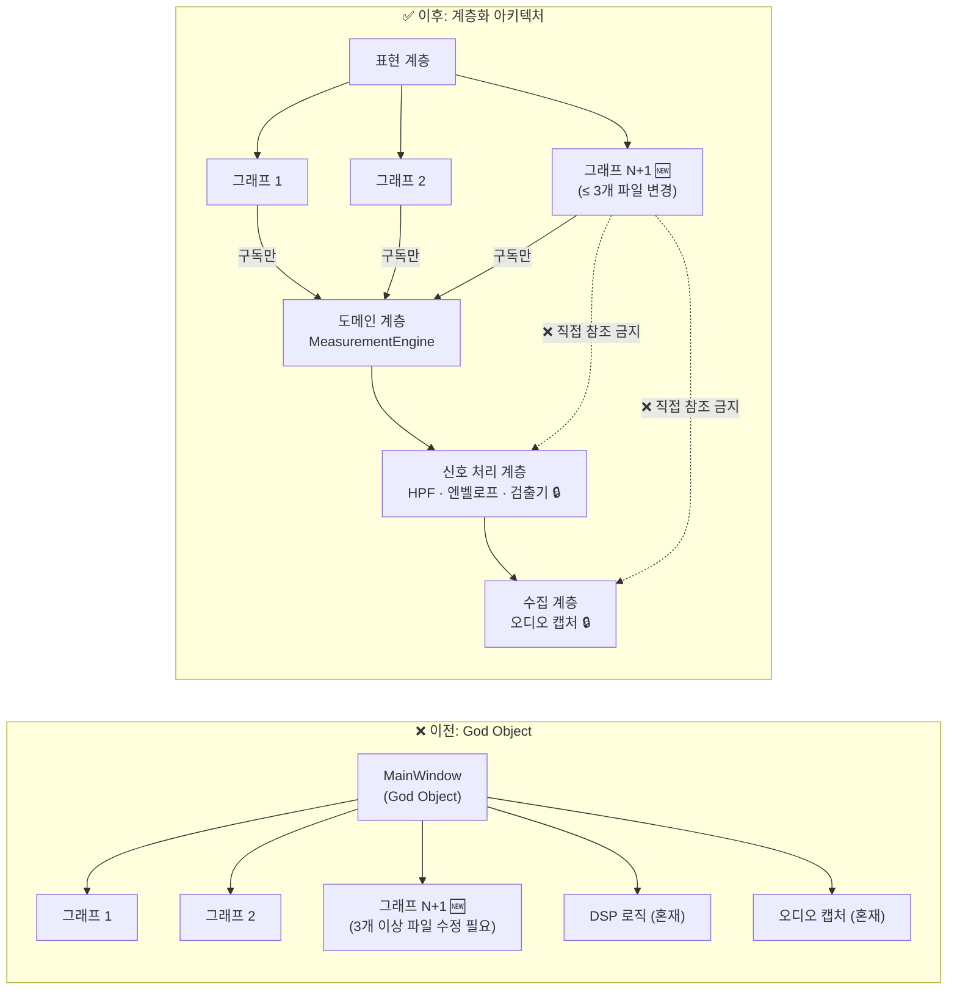
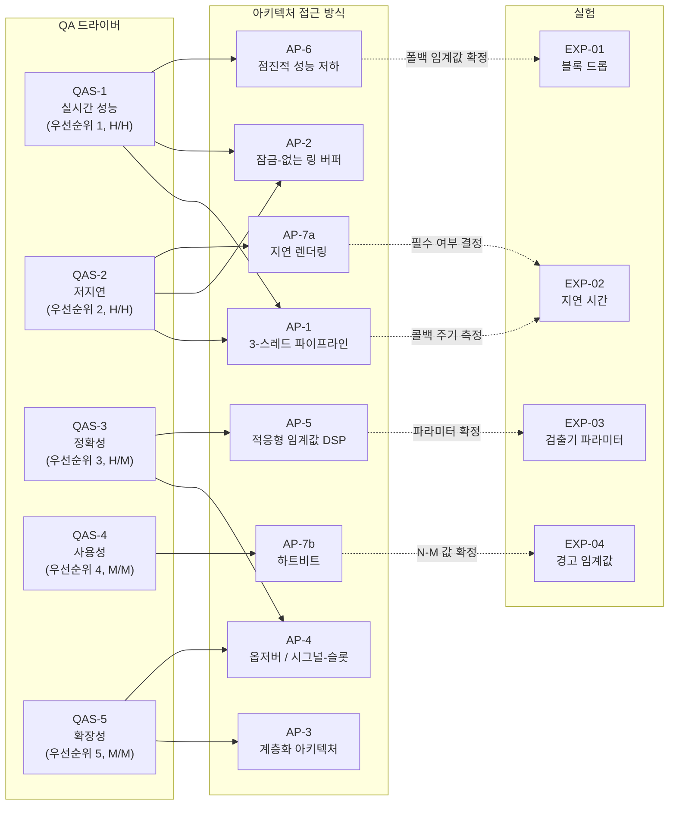

# 아키텍처 접근 방식 — TimeGrapher

---

## 1. 아키텍처 개요

### 1.1 시스템 목적 및 구조적 제약

TimeGrapher는 기계식 시계로부터 음향 신호(박자 소음)를 실시간으로 포착하여 레이트(Rate) / 진폭(Amplitude) / 박자 오차(Beat Error)를 계산하고, 11개의 그래프 탭에 결과를 표시합니다.

두 가지 구조적 제약이 모든 아키텍처 결정을 이끌어냅니다:

| 제약 | 세부 사항 | 아키텍처 영향 |
|------|----------|--------------|
| **하드웨어 제약** | Raspberry Pi 5 (ARM64, 8GB RAM) + USB 오디오 센서 | 오디오 캡처, DSP, GUI가 단일 프로세스 내 CPU를 공유 → 스레드 분리 필수 |
| **개발 제약** | Qt6 C++ (`TimeGrapher_v10.5` 코드베이스) | Qt 시그널-슬롯 메커니즘이 옵저버 패턴의 자연스러운 구현 수단 |

---

### 1.2 아키텍처 개요 다이어그램

TimeGrapher의 아키텍처는 **단방향 신호 처리 파이프라인**을 기반으로 합니다. 데이터는 물리 계층(오디오 하드웨어)에서 표현 계층(GUI)으로 한 방향으로 흐르며, 계층 간 결합은 인터페이스(링 버퍼, Qt 시그널-슬롯)를 통해서만 이루어집니다.

> **범례**
> - 🟡 노란 박스: 파라미터 미확정 — 적응형 임계값 전략은 결정됨; EXP-03 이후 최적 `onset_fraction`/`min_peak_fraction` 값만 확정
> - 🟢 초록 박스: 옵저버 패턴 적용 — 단일 데이터 소스 보장
> - 🔵 파란 박스: 잠금-없는 링 버퍼 — 스레드 간 결합 인터페이스
> - 🟠 주황 박스: 하트비트 패턴 적용

---

### 1.3 계층 책임 정의

| 계층 | 책임 | 참조 허용 대상 |
|:----:|-----|:------------:|
| **수집** | USB 오디오 입력 → PCM 샘플 → 링 버퍼 공급 | 없음 (최하위 계층) |
| **신호 처리** | HPF → 엔벨로프 → 검출기 → T1/T3 타임스탬프 추출 | 수집 (링 버퍼만) |
| **도메인** | T1/T3 타임스탬프 → 레이트·진폭·박자 오차 계산, 측정값 발행 | 신호 처리 (T1/T3만) |
| **표현** | GUI 렌더링, 옵저버 구독, 경고 표시 | **도메인 계층만** (MeasurementEngine 인터페이스) |

> **핵심 규칙**: 표현 계층은 신호 처리 / 수집 계층을 **직접 참조해서는 안 됩니다**. 이 규칙을 위반하면 QAS-5 확장성 목표(≤ 3-파일 변경)를 달성할 수 없습니다.

---

## 2. 주요 아키텍처 접근 방식

총 7가지 아키텍처 접근 방식이 있으며, 각각 하나 이상의 QA 드라이버를 직접 다룹니다.

---

### AP-1: 3-스레드 파이프라인

| 항목 | 세부 사항 |
|------|----------|
| **패턴** | 생산자-소비자 파이프라인 (Bass13 성능 전술 #4 — 동시성 도입) |
| **구조** | 오디오 스레드 (생산자) → 잠금-없는 링 버퍼 → DSP 스레드 (소비자) → Qt 시그널-슬롯 → GUI 스레드 |
| **근거** | RPi 5에서 오디오 캡처, DSP, GUI 렌더링을 같은 스레드에서 실행하면 콜백 블로킹 → 블록 드롭 발생. 각 관심사를 독립 스레드로 분리하여 콜백 주기(~20ms) 보호 |
| **연계 드라이버** | QAS-1 (실시간 성능), QAS-2 (저지연) |

> **구간 정의**: ① = TS2−TS1 (캡처→처리, < 70ms), ② = TS3−TS2 (처리→표시, < 30ms), ③ = TS3−TS1 (종단간, < 100ms)

---

### AP-2: 잠금-없는 링 버퍼

| 항목 | 세부 사항 |
|------|----------|
| **전술** | 자원 경합 감소 (Bass13 성능 전술 #4) |
| **설명** | 오디오 스레드(생산자)와 DSP 스레드(소비자) 간 뮤텍스를 제거하여 잠금 경합으로 인한 DSP 처리 지연 방지; 원자 연산을 통해 원형 버퍼 구현 |
| **근거** | 뮤텍스 대기로 블록 주기(~20ms) 위반 → 링 버퍼 오버플로(블록 드롭) 발생 가능. 잠금-없는 구조로 이 실패 경로를 완전히 제거 |
| **트레이드오프** | 구현 복잡성 증가 (올바른 메모리 순서 필요). AP-1의 구현 패턴으로 함께 적용 |
| **연계 드라이버** | QAS-1 (실시간 성능 — 블록 드롭 방지), QAS-2 (저지연 — 구간 ① 보호) |

---

### AP-3: 계층화 아키텍처 + 의존성 제한

| 항목 | 세부 사항 |
|------|----------|
| **패턴** | 계층화 아키텍처 + 의존성 제한 (Bass13 수정성 전술) |
| **설명** | 기존 God Object 구조를 4개 계층(수집 → 신호 처리 → 도메인 → 표현)으로 분리; 표현 계층은 도메인 계층(MeasurementEngine 인터페이스)만 참조 가능 |
| **근거** | God Object 구조에서는 그래프 추가 시 여러 파일 수정 필요 → 병렬 개발 충돌. 계층 분리 후 새 그래프 추가 시 표현 계층의 3개 파일만 변경(새 위젯 + 탭 등록 + 구독 연결) |
| **연계 드라이버** | QAS-5 (확장성 — ≤ 3-파일 목표) |

---

### AP-4: 옵저버 패턴 / Qt 시그널-슬롯 (단일 데이터 소스)

| 항목 | 세부 사항 |
|------|----------|
| **패턴** | 옵저버 (GoF) / Qt 시그널-슬롯 |
| **설명** | MeasurementEngine이 `measurementReady()` 시그널을 통해 단일 `Measurement` 구조체를 발행; 11개 탭이 모두 같은 시그널에 독립적으로 구독 |
| **근거 (정확성)** | 뷰가 값을 독립적으로 계산하면 서로 다른 계산 경로로 인해 뷰 간 불일치 발생 가능. 옵저버 패턴은 모든 뷰가 단일 소스에서 동일한 구조체를 수신하도록 보장 — 일관성이 구조적으로 보장됨 |
| **근거 (확장성)** | 새 그래프 추가 시 구독만 추가하면 됨 — 기존 로직 수정 불필요 (AP-3과 상호 보완) |
| **연계 드라이버** | QAS-3 QA-C1 (정확성 — 동일 데이터 소스), QAS-5 (확장성 — 구독만으로 확장) |

---

### AP-5: 적응형 임계값 DSP 파이프라인

| 항목 | 세부 사항 |
|------|----------|
| **전술** | 파이프라인 필터링 + 적응형 임계값 |
| **확정된 결정** | DSP 파이프라인: Raw PCM → HPF (DC 차단 ≥200 Hz) → 엔벨로프 (단극 LPF) → 검출기. 적응형 임계값 전략 채택 (이미 구현됨): `noise_floor` = 최근 256ms 무음의 75번째 백분위수; `reference_peak` = 최근 16개 박자 피크의 중앙값 |
| **미결 사항** | 기본 검출기 파라미터(`onset_fraction`=0.03, `min_peak_fraction`=0.20)가 3가지 노이즈 조건에서 최적인지 — **EXP-03**으로 확정 |
| **트레이드오프** | `onset_fraction` 높을수록 → 노이즈 제거 향상, 실제 박자 시작점 놓칠 수 있음. 낮을수록 → 감도 높으나 오탐 증가 |
| **연계 드라이버** | QAS-3 QA-C2 (정확성 — 주변 노이즈 하에서 박자 검출 품질) |

---

### AP-6: 점진적 성능 저하

| 항목 | 세부 사항 |
|------|----------|
| **전술** | 점진적 성능 저하 (Bass13 성능 전술) |
| **설명** | EXP-01에서 96k sps에서 블록 드롭 > 0이 확인되면 48k sps로 자동 전환; 블록 주기가 ~10ms에서 ~20ms로 확장되어 DSP 시간 예산이 2배 증가 |
| **트레이드오프** | T1 검출 해상도 저하: 96k에서 10.4 µs/샘플 → 48k에서 20.8 µs/샘플; 블록 드롭 = 0 보장을 위해 해상도 희생 |
| **잠정적** | ⚠️ 폴백 임계값(96k 달성 가능 여부)은 **EXP-01**로 확정 |
| **연계 드라이버** | QAS-1 (실시간 성능 — 블록 드롭 = 0 보장) |

---

### AP-7: 지연 렌더링 + 하트비트

#### AP-7a: 지연 렌더링

| 항목 | 세부 사항 |
|------|----------|
| **전술** | 작업 요청 관리 — 렌더링 스로틀링 (Bass13 성능 전술 #3) |
| **설명** | 11개 탭 중 활성 탭만 `paintEvent()`를 실행; 비활성 탭은 데이터를 업데이트하지만 렌더링을 지연 |
| **근거** | 11개 탭 동시 렌더링이 Qt 메인 스레드를 과부하시켜 구간 ② 처리→표시가 30ms(TR-04)를 초과할 수 있음; 비활성 탭을 건너뜀으로써 렌더링 부하를 단일 탭 수준으로 감소 |
| **트레이드오프** | 탭 전환 시 잠깐 오래된 값이 표시될 수 있음 → EXP-02에서 허용 수준 확인 |
| **잠정적** | ⚠️ 지연 렌더링 필수 여부는 **EXP-02** OI-L2 결과로 결정 |
| **연계 드라이버** | QAS-2 (저지연 — 처리→표시 < 30ms) |

#### AP-7b: 하트비트 패턴

| 항목 | 세부 사항 |
|------|----------|
| **패턴** | 하트비트 (재사용) |
| **설명** | 기존 A(T1)·C(T3) 이벤트를 하트비트로 재사용. N초 동안 박자 이벤트 없음 → `⚠ 신호 없음`. 노이즈/신호 비율이 임계값 초과 → `⚠ 잡음 있는 신호`. 신호 복구 후 M초 뒤 자동 해제 |
| **근거** | 추가 검출 로직 없이 기존 검출기 출력을 재사용 → 최소한의 구현 비용 |
| **잠정적** | ⚠️ N·M 값과 노이즈/신호 임계값은 **EXP-04**로 확정 |
| **연계 드라이버** | QAS-4 (사용성 — 신호 품질 경고) |

---

## 3. 설계 건전성 평가

설계가 구현을 이끌 만큼 충분히 건전한가? 각 접근 방식을 확정 상태 및 구현 준비도로 평가합니다.

| 기준 | 평가 |
|:---:|:---:|
| ✅ **즉시 구현 가능** | 설계 결정 확정, 실험 의존성 없음 |
| ⚠️ **조건부 구현 가능** | 핵심 구조 결정됨; 파라미터/임계값은 실험 확정 필요 |
| 🔴 **구현 보류** | 실험 결과 없이는 구현 방향 결정 불가 |

| AP | 접근 방식 | 상태 | 근거 |
|:--:|---------|:----:|------|
| AP-1 | 3-스레드 파이프라인 | ✅ | 스레드 분리 방향 확정 |
| AP-2 | 잠금-없는 링 버퍼 | ✅ | 뮤텍스-없는 구조 확정 |
| AP-3 | 계층화 아키텍처 | ✅ | 4-계층 정의 + 의존성 제한 규칙 확정; 리팩토링 시작 가능 |
| AP-4 | 옵저버 / 시그널-슬롯 | ✅ | 단일 MeasurementEngine 발행 구조 확정 |
| AP-5 | 적응형 임계값 DSP | ⚠️ | 파이프라인 구조 확정; EXP-03 이후 최적 검출기 파라미터 확정 |
| AP-6 | 점진적 성능 저하 | ⚠️ | 폴백 로직 설계 확정; EXP-01 이후 48k 트리거 임계값 확정 |
| AP-7a | 지연 렌더링 | ⚠️ | 전술 방향 확정; 필수 적용 여부는 EXP-02 OI-L2 결과에 의존 |
| AP-7b | 하트비트 패턴 | ⚠️ | 검출 구조 확정; EXP-04 이후 N·M 값 + 임계값 확정 |

**건전성 결론**: 7가지 접근 방식 모두 **확정된 구조적 방향**을 가짐 — 모두 구현 시작 가능. 파라미터와 임계값만 실험적 확정이 필요하며; 보수적 기본값(48k sps 폴백, 100ms 상한)이 실험 결과와 무관하게 최소 동작을 보장합니다.

---

## 4. 드라이버-접근 방식 추적성

각 QA 드라이버를 지원하는 아키텍처 접근 방식과 이를 검증하는 실험을 매핑합니다.

**범례**: 실선 (→) = 접근 방식이 드라이버를 지원 | 점선 (-..→) = 실험이 접근 방식 파라미터를 확정

### 4.1 QA별 지원 요약

| QA | 우선순위 | 지원 접근 방식 | 방법 | 미결 실험 |
|----|:-------:|-------------|-----|:--------:|
| **QAS-1** 실시간 성능 | 1 | AP-1, AP-2, AP-6 | 스레드 분리로 캡처 콜백 보호 + 잠금-없는 구조로 DSP 지연 방지 + 폴백으로 블록 드롭 = 0 보장 | EXP-01 |
| **QAS-2** 저지연 | 2 | AP-1, AP-2, AP-7a | 3-구간 측정 가능성 + 구간 ① 하한 보호 + 구간 ② 렌더링 부하 감소 | EXP-02 |
| **QAS-3** 정확성 | 3 | AP-4 (QA-C1), AP-5 (QA-C2) | 옵저버가 구조적으로 단일 소스 보장 + 적응형 임계값이 노이즈 하에서 박자 검출 유지 | EXP-03 |
| **QAS-4** 사용성 | 4 | AP-7b | 하트비트 패턴이 신호 손실 / 노이즈를 즉시 감지 | EXP-04 |
| **QAS-5** 확장성 | 5 | AP-3, AP-4 | 계층화 아키텍처로 ≤ 3-파일 목표 달성 + 옵저버로 구독만으로 확장 | — |

---

## 5. 드라이버 지원 평가

### QAS-1: 실시간 성능

**지원 수준**: 구조적으로 충분; 경험적 검증 필요

- AP-1(스레드 분리)은 캡처 콜백을 DSP/GUI로부터 격리하여 블록 드롭에 대한 첫 번째 방어선을 형성합니다.
- AP-2(잠금-없는 링 버퍼)는 스레드 간 뮤텍스 경합을 제거하여 DSP 처리 지연에 대한 두 번째 방어선을 형성합니다.
- AP-6(점진적 성능 저하)은 96k sps가 달성 불가능한 경우에도 48k sps 폴백을 통해 블록 드롭 = 0을 보장하는 마지막 방어선입니다.

**미결 사항**: EXP-01 없이는 96k sps 달성 가능 여부를 확정할 수 없습니다. 보수적 설계(48k 폴백)가 최소 목표를 보장합니다.

---

### QAS-2: 저지연

**지원 수준**: 구조적으로 충분; 두 가지 미결 사항 해결 필요

- AP-1(3-스레드 파이프라인)은 3-구간 측정(TS1/TS2/TS3)을 가능하게 하여 병목 구간을 식별할 수 있습니다.
- AP-2(잠금-없는 링 버퍼)는 구간 ①(캡처→처리)의 하한을 OS 콜백 주기(~20ms)에서 유지합니다.
- AP-7a(지연 렌더링)는 구간 ②(처리→표시)의 11개 탭 렌더링 부하를 단일 탭 수준으로 감소시킵니다.

**미결 사항**: ① 실제 QAudioSource 라이브 콜백 주기(OI-L1), ② 11개 탭에서 구간 ②가 30ms 이내인지 여부(OI-L2) — 모두 EXP-02로 해결. 세 가지 시계(28,800 / 36,000 / 43,200 BPH)가 모두 가용하므로, Primary(28,800 BPH) 목표가 확인된 후 같은 EXP-02 세션에서 Stretch BPH 검증을 진행할 수 있습니다.

---

### QAS-3: 정확성

**지원 수준**: QA-C1 구조적으로 보장; QA-C2는 실험 후 완성

- **QA-C1 (동일 데이터 소스)**: AP-4(옵저버/시그널-슬롯) 구현 후 모든 뷰의 일관성이 구조적으로 보장됨 — 실험 불필요.
- **QA-C2 (노이즈 강건한 박자 검출)**: AP-5 파이프라인 구조 및 알고리즘 확정됨. EXP-03에서 최적 `onset_fraction`/`min_peak_fraction` 값이 확인된 후 완성.

---

### QAS-4: 사용성

**지원 수준**: 구조 확정; 임계값 실험 필요

- AP-7b(하트비트)는 기존 A/C 이벤트를 신호 손실 감지에 재사용 — 추가 검출 로직 없이 낮은 구현 비용.
- EXP-04에서 N·M 값과 노이즈/신호 임계값이 확정된 후 QAS-4 응답 측도 완성.
- 미확정 임계값으로 인한 오탐/누락은 사용자 경험에만 영향 (QAS-3 정확성과 독립적).

---

### QAS-5: 확장성

**지원 수준**: 구조적으로 달성 가능; 리팩토링 후 검증 필요

- AP-3(계층화 아키텍처)은 God Object가 4개 계층으로 분해된 후 새 그래프 추가 시 3개의 표현 계층 파일만 변경하도록 제한합니다.
- AP-4(옵저버)는 구독만으로 확장을 가능하게 함 — 기존 로직 수정 불필요.
- **위험 TR-07**: God Object 분해 중 기존 그래프 회귀. 점진적 리팩토링 + 리팩토링 전 단위 테스트 기준선으로 완화.
- 옵저버 리팩토링 완료 후 실제로 새 그래프를 추가했을 때 `git diff --stat`에서 ≤ 3개 파일 변경이 표시되면 검증 완료.

---

## 6. 접근 방식 간 상호 작용

아키텍처 접근 방식은 서로 독립적이지 않습니다. 구현 순서 관리 시 다음 상호 작용을 이해해야 합니다.

| 상호 작용 | 설명 |
|---------|-----|
| **AP-3 + AP-4 (상호 보완)** | 계층화 아키텍처가 의존성 방향을 제한; 옵저버 패턴이 그 경계를 넘는 유일한 데이터 흐름을 제공. 두 접근 방식이 함께 QAS-5를 지원 |
| **AP-1 + AP-2 (구현 쌍)** | 3-스레드 파이프라인(AP-1)은 잠금-없는 링 버퍼(AP-2) 없이 스레드 간 데이터를 전달할 수 없음. 두 가지를 함께 구현해야 함 |
| **AP-6 → AP-1 (의존)** | 점진적 성능 저하(AP-6)의 폴백 로직은 AP-1의 스레드 분리 구조 위에서 동작. AP-1 구현 후 AP-6을 추가할 수 있음 |
| **AP-7a ↔ AP-4 (트레이드오프)** | 지연 렌더링(AP-7a)은 비활성 탭 렌더링을 억제; 옵저버(AP-4)가 발행한 최신 데이터가 탭 전환 전까지 반영되지 않음. 허용 수준은 EXP-02로 확인 |
| **AP-5 → AP-7b (순서)** | 하트비트(AP-7b)는 검출기(AP-5)의 출력(A/C 이벤트)을 재사용. AP-5 구현 후 AP-7b를 추가할 수 있음 |

---

## 7. 요약

| 질문 | 답변 |
|-----|-----|
| 아키텍처 개요? | 단방향 4-계층 신호 처리 파이프라인 (수집 → 신호 처리 → 도메인 → 표현). 3개 스레드(오디오/DSP/GUI)가 단일 RPi 5 프로세스 내에서 자원 경합을 관리 |
| 주요 접근 방식? | AP-1 (3-스레드 파이프라인), AP-2 (잠금-없는 링 버퍼), AP-3 (계층화 아키텍처), AP-4 (옵저버/시그널-슬롯), AP-5 (적응형 임계값 DSP), AP-6 (점진적 성능 저하), AP-7 (지연 렌더링 + 하트비트) |
| 구현을 이끌 만큼 건전한가? | ✅ 모든 접근 방식의 구조적 방향 확정. ⚠️ 파라미터/임계값 미확정(EXP-01~04), 그러나 보수적 기본값이 최소 동작 보장 |
| 접근 방식이 드라이버와 연결되어 있는가? | ✅ 5개 QA 드라이버 각각에 명시적으로 연결된 접근 방식이 하나 이상 있음 (4절 추적성 매핑 참조) |
| 드라이버 지원 수준은? | QAS-1, QAS-2: 구조적으로 충분 + 경험적 검증 필요 \| QAS-3 QA-C1: 구조적으로 완전 보장 \| QAS-3 QA-C2, QAS-4: 구조 확정 + 실험적 파라미터 확정 필요 \| QAS-5: 리팩토링 후 구조적으로 달성 가능 |
