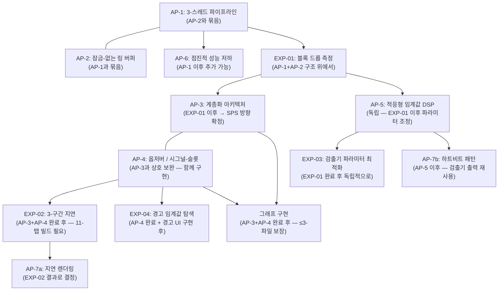
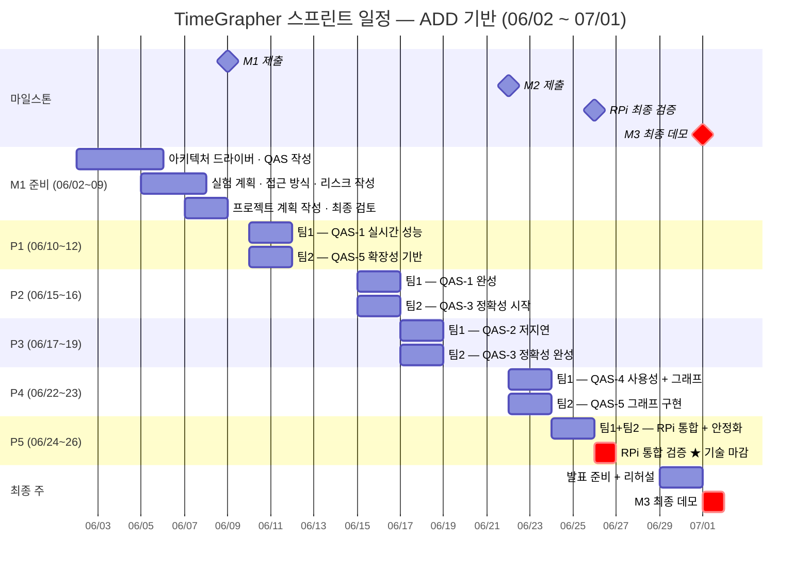

# 프로젝트 계획 — TimeGrapher

---

이 문서는 세 가지 요구사항에 순서대로 답합니다:

1. 역할 배정, 구체적인 작업, 마일스톤이 정의되어 있는가?
2. 전반적인 아키텍처를 반영한 구현 작업이 포함되어 있는가?
3. 계획된 기술 실험이 작업에 반영되어 있는가?

---

## 1. 개요

**핵심 원칙**: ADD(속성 기반 설계) 기반의 2일 스크럼 스프린트. 각 스프린트는 하나의 QA 드라이버에 집중하며, 팀 1과 팀 2는 동일한 QA 목표를 향해 서로 다른 작업을 병렬로 수행합니다.

**프로젝트 목표**: [architectural-drivers_kr.md §1 프로젝트 목표](architectural-drivers_kr.md#1-프로젝트-목표) 참조

**일정 개요**:

```
M1 제출 (06/09) → 구현 시작 (06/10) → M2 제출 (06/22) → RPi 최종 검증 (06/26) → M3 최종 데모 (07/01)
```

---

## 2. 역할 정의

| 역할 | 담당자 | 책임 |
|-----|------|-----|
| 제품 책임자 | 이지민 | 요구사항 우선순위 결정, 스프린트 목표 승인 |
| 스크럼 마스터 — 팀 1 | 신성호 | 스프린트 진행 관리, 장애물 제거, 아키텍처 위원회 참여 |
| 스크럼 마스터 — 팀 2 | 신동호 | 스프린트 진행 관리, 장애물 제거, 아키텍처 위원회 참여 |
| 개발팀 1 | 신경진, 통훙손, 반규대 | 기능 구현 및 실험 |
| 개발팀 2 | 송태준, 이지민 | 기능 구현 및 실험 |

---

## 3. 개발 프로세스 (Agile)

| 이벤트 | 주기 | 참여자 | 시간 | ADD 단계 |
|-------|-----|------|-----|---------|
| 스프린트 계획 | 매 스프린트 시작 (2일마다) | 아키텍처 위원회 (양 SM + PO) | 1시간 | **2–4단계**: QA 드라이버 선택 → 분해 대상 → 전술/패턴 |
| 스프린트 (개발) | 2일 | 각 팀 독립적으로 | 2일 | **5단계**: 요소 인스턴스화 + 책임 배정 (구현 + 실험) |
| 스프린트 검토 및 회고 | 매 스프린트 종료 | 전체 팀 | 1시간 | **6단계**: 뷰 스케치 + 설계 결정 기록 (ADR) |
| 버퍼 | 매주 금요일 | 전체 팀 | 1일 | 다음 반복: 다음 QA 드라이버를 위해 2단계로 복귀 |

**아키텍처 위원회 역할**: 매 스프린트 계획(1시간)이 ADD 2–4단계를 수행합니다.
- **2단계**: 이번 스프린트에 집중할 QA 드라이버 선택
- **3단계**: 해당 QA를 위해 분해할 아키텍처 요소 결정
- **4단계**: 전술/패턴 인스턴스화 선택 및 계획

두 팀은 동일한 QA 스프린트 목표를 공유하며, 집중 순서는 중요도만이 아닌 구현 의존성(실험 전제 조건, 접근 방식 간 순서)으로 결정됩니다.

---

## 4. 아키텍처 기반 구현 작업

TimeGrapher의 구현은 7가지 아키텍처 접근 방식(AP-1~7)을 기반으로 합니다. 접근 방식 간 상호 작용이 구현 순서를 결정합니다.

### 4.1 구현 순서



### 4.2 계층별 작업

| 계층 | AP | 핵심 작업 | 목표 QA | 상태 |
|:---:|:--:|---------|:------:|:---:|
| **수집** | AP-1, AP-2 | 오디오 스레드 분리, 잠금-없는 링 버퍼 구현 (`atomic` 기반) | QAS-1, QAS-2 | 🔴 미구현 |
| **수집** | AP-6 | 점진적 성능 저하: 96k→48k sps 자동 폴백 (트리거 임계값 EXP-01로 확정) | QAS-1 | 🔴 미구현 |
| **신호 처리** | AP-5 | HPF → 엔벨로프 → 검출기 파이프라인 검증, 적응형 임계값 파라미터 조정 (EXP-03 이후) | QAS-3 QA-C2 | ⚠️ 부분 구현 |
| **도메인** | AP-4 | MeasurementEngine이 `measurementReady()` 시그널-슬롯을 통해 단일 `Measurement` 구조체 발행 | QAS-3 QA-C1, QAS-5 | 🔴 미구현 |
| **도메인** | AP-7b | 신호 품질 모니터 (하트비트 패턴 — A/C 이벤트 재사용; N·M은 EXP-04로 확정) | QAS-4 | 🔴 미구현 |
| **표현** | AP-3 | God Object → 4-계층 분리 (의존성 제한 적용: 표현 → 도메인만) | QAS-5 | 🔴 미구현 |
| **표현** | AP-7a | 지연 렌더링: 활성 탭만 `paintEvent()` 실행 (EXP-02 OI-L2 결과 기반) | QAS-2 | 🔴 미구현 |
| **표현** | AP-3, AP-4 | 핵심 / 필수 / 확장 그래프 구현 (≤3-파일 변경 규칙 적용) | QAS-5 | 🔴 미구현 |

---

## 5. 그래프 우선순위 분류

| 계층 | 기준 | 목표 정렬 |
|-----|-----|---------|
| **핵심** | QAS-3 정확성(H) 및 QAS-1 실시간(H)에 직접 연결; M3 데모에서 측정 안정성 증명 필수 | 1위: 정확한 측정 |
| **필수** | QAS-4 사용성(M) 및 QAS-5 확장성(M)에 연결; 데모 완성도 향상 및 확장성 증거 제공 | 3위: 확장 가능한 아키텍처 |
| **확장** | 추가 QAS-5 시각화; 시간이 허용되면 추가 | (현재 범위 외) |

| 계층 | 그래프 / 기능 | 연계 FR | M2 필수 |
|:---:|------------|:------:|:------:|
| **핵심** | 트레이스 표시 (레이트 + 진폭 실시간 기록) | FR-05 | ✅ |
| **핵심** | 박자 오차 표시 & 진단 트레이스 | FR-07 | ✅ |
| **핵심** | 레이트 & 진폭 안정성 / Vario | FR-06 | ✅ |
| **필수** | 신호 품질 경고 UI (`⚠ 신호 없음` / `⚠ 잡음 있는 신호`) | FR-08 | ✅ |
| **필수** | 박자-노이즈 스코프 (스코프 1 & 2) | FR-11 | ✅ |
| **필수** | 시계 위치 테스트 | FR-10 | ✅ |
| **필수** | 다중 위치 순서 표시 | FR-12 | ✅ |
| **확장** | FR-09, FR-13~FR-18 | — | ❌ |

> **완료 원칙**: 3개의 핵심 그래프가 모두 완료되기 전에는 필수 또는 확장을 시작하지 않습니다.

---

## 6. QA 우선순위 및 스프린트 집중

| 순위 | QA | 비즈니스 중요도 | 기술 위험 | **우선순위** | 집중 스프린트 | 연계 AP |
|:---:|----| :---------:| :-----:| :--------:| :--------:|--------|
| 1 | 실시간 성능 | H | H | **H** | **P1** — 팀 1 | AP-1, AP-2, AP-6 |
| 2 | 정확성 | H | M | **H** | **P2~P3** — 팀 2 | AP-4, AP-5, EXP-03 |
| 3 | 저지연 | H | H | **H** | **P3** — 팀 1 | AP-7a, EXP-02 |
| 4 | 확장성 | M | M | **M** | **P1~P4** — 팀 2 + 그래프 구현 | AP-3, AP-4 |
| 5 | 사용성 | M | M | **M** | **P4~P5** — 팀 1 | AP-7b, EXP-04 |

> **스프린트 순서 근거**: 실시간 → 저지연 → 정확성 순서는 중요도 순위가 아닌 *구현 전제 조건 의존성*을 따릅니다. 블록 드롭 없음(QAS-1)은 지연 측정(QAS-2)의 전제 조건이며, 실시간 파이프라인(QAS-1+2)이 있어야 측정 정확도(QAS-3)를 검증할 수 있습니다.

---

## 7. 스프린트 일정

총 **10개 스프린트** (팀 1 & 팀 2 각각 5개 스프린트, 기간별 동시 진행) × 2일 + 3일 버퍼.



---

## 8. 기술 실험 요약

| ID | 실험 | 해결 OI | 전제 조건 | 스프린트 | 담당 |
|:--:|-----|:------:|---------|:------:|-----|
| **EXP-01** | RPi 블록 드롭 측정 | OI-P1 | RPi 5 설정 + 시계 연결 | **P1** | 팀 1 |
| **EXP-02** | 종단간 3-구간 지연 | OI-L1, OI-L2 | EXP-01 완료 + AP-3+AP-4 완료 | **P3** | 팀 1 |
| **EXP-03** | 검출기 파라미터 최적화 | OI-C1 | EXP-01 완료 (SPS 확정) | **P2~P3** | 팀 2 |
| **EXP-04** | 경고 임계값 탐색 | OI-U1, OI-U2 | AP-4 완료 + 경고 UI 구현 | **P4~P5** | 팀 1 |
| **EXP-05** | BPH 확장 (36k/43k BPH) | OI-L3 | 28,800 BPH QAS-1~4 모두 통과 | **P5 조건부** | 양 팀 |
