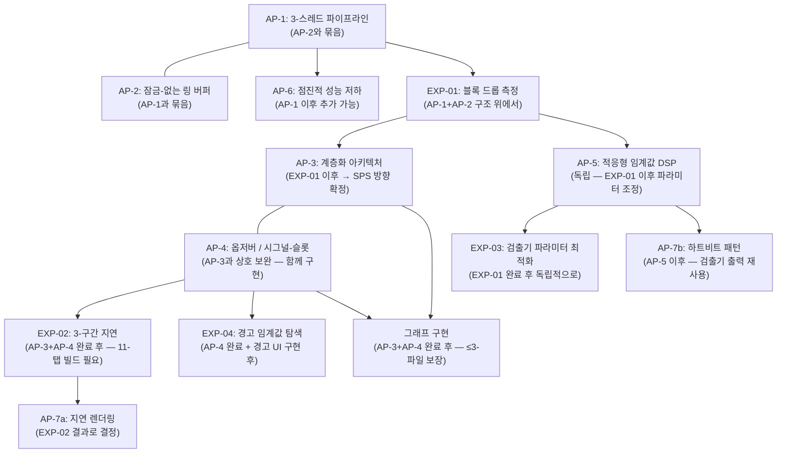
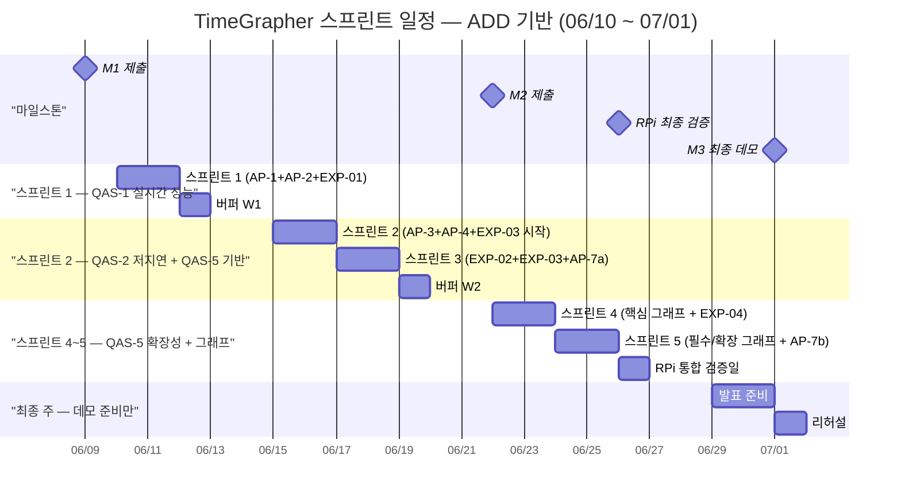

# 프로젝트 계획 — TimeGrapher

---

이 문서는 세 가지 요구사항에 순서대로 답합니다:

1. 역할 배정, 구체적인 작업, 마일스톤이 정의되어 있는가?
2. 전반적인 아키텍처를 반영한 구현 작업이 포함되어 있는가?
3. 계획된 기술 실험이 작업에 반영되어 있는가?

---

## 1. 개요

**핵심 원칙**: ADD(속성 기반 설계) 기반의 2일 스크럼 스프린트. 각 스프린트는 하나의 QA 드라이버에 집중하며, 팀 1과 팀 2는 동일한 QA 목표를 향해 서로 다른 작업을 병렬로 수행합니다.

**프로젝트 목표**: `architectural-drivers_kr.md` §1 참조

**일정 개요**:

```
M1 제출 (06/09) → 구현 시작 (06/10) → M2 제출 (06/22) → RPi 최종 검증 (06/26) → M3 최종 데모 (07/01)
```

---

## 2. 역할 정의

| 역할 | 담당자 | 책임 |
|-----|------|-----|
| 제품 책임자 | 이지민 | 요구사항 우선순위 결정, 스프린트 목표 승인 |
| 스크럼 마스터 — 팀 1 | 신성호 | 스프린트 진행 관리, 장애물 제거, 아키텍처 위원회 참여 |
| 스크럼 마스터 — 팀 2 | 신동호 | 스프린트 진행 관리, 장애물 제거, 아키텍처 위원회 참여 |
| 개발팀 1 | 신경진, 통훙손, 반규대 | 기능 구현 및 실험 |
| 개발팀 2 | 송태준, 이지민 | 기능 구현 및 실험 |

---

## 3. 애자일 의식 & ADD-애자일 매핑

| 이벤트 | 주기 | 참여자 | 시간 | ADD 단계 |
|-------|-----|------|-----|---------|
| 스프린트 계획 | 매 스프린트 시작 (2일마다) | 아키텍처 위원회 (양 SM + PO) | 1시간 | **2–4단계**: QA 드라이버 선택 → 분해 대상 → 전술/패턴 |
| 스프린트 (개발) | 2일 | 각 팀 독립적으로 | 2일 | **5단계**: 요소 인스턴스화 + 책임 배정 (구현 + 실험) |
| 스프린트 검토 및 회고 | 매 스프린트 종료 | 전체 팀 | 1시간 | **6단계**: 뷰 스케치 + 설계 결정 기록 (ADR) |
| 버퍼 | 매주 금요일 | 전체 팀 | 1일 | 다음 반복: 다음 QA 드라이버를 위해 2단계로 복귀 |

**아키텍처 위원회 역할**: 1시간 스프린트 계획이 ADD 2–4단계를 수행합니다:
- **2단계**: 이번 스프린트에 집중할 QA 드라이버 선택
- **3단계**: 해당 QA를 위해 분해할 아키텍처 요소 결정
- **4단계**: 전술/패턴 인스턴스화 선택 및 계획

두 팀은 동일한 QA 스프린트 목표를 공유하며; 작업 배정은 아키텍처 위원회가 결정합니다. 집중 순서는 중요도만이 아닌 구현 의존성(실험 전제 조건, 접근 방식 간 순서)으로 결정됩니다.

---

## 5. 아키텍처 기반 구현 작업

TimeGrapher의 구현은 7가지 아키텍처 접근 방식(AP-1~7)을 기반으로 합니다. 접근 방식 간 상호 작용이 구현 순서를 결정합니다.

### 5.1 구현 순서



### 5.2 계층별 작업

| 계층 | AP | 핵심 작업 | 목표 QA | 상태 |
|:---:|:--:|---------|:------:|:---:|
| **수집** | AP-1, AP-2 | 오디오 스레드 분리, 잠금-없는 링 버퍼 구현 (`atomic` 기반) | QAS-1, QAS-2 | 🔴 미구현 |
| **수집** | AP-6 | 점진적 성능 저하: 96k→48k sps 자동 폴백 (트리거 임계값 EXP-01로 확정) | QAS-1 | 🔴 미구현 |
| **신호 처리** | AP-5 | HPF → 엔벨로프 → 검출기 파이프라인 검증, 적응형 임계값 파라미터 조정 (EXP-03 이후) | QAS-3 QA-C2 | ⚠️ 부분 구현 |
| **도메인** | AP-4 | MeasurementEngine이 `measurementReady()` 시그널-슬롯을 통해 단일 `Measurement` 구조체 발행 | QAS-3 QA-C1, QAS-5 | 🔴 미구현 |
| **도메인** | AP-7b | 신호 품질 모니터 (하트비트 패턴 — A/C 이벤트 재사용; N·M은 EXP-04로 확정) | QAS-4 | 🔴 미구현 |
| **표현** | AP-3 | God Object → 4-계층 분리 (의존성 제한 적용: 표현 → 도메인만) | QAS-5 | 🔴 미구현 |
| **표현** | AP-7a | 지연 렌더링: 활성 탭만 `paintEvent()` 실행 (EXP-02 OI-L2 결과 기반) | QAS-2 | 🔴 미구현 |
| **표현** | AP-3, AP-4 | 핵심 / 필수 / 확장 그래프 구현 (≤3-파일 변경 규칙 적용) | QAS-5 | 🔴 미구현 |

---

## 6. 그래프 우선순위 분류

NTR-05(범위 과도 확장 위험)와 OI-07(그래프 우선순위 미분류)을 해결하기 위해, 12개의 그래프/기능 항목(FR-05~18)을 핵심 / 필수 / 확장의 세 계층으로 분류합니다. 이 분류는 프로젝트 목표 우선순위에 직접 매핑됩니다.

**분류 기준**:

| 계층 | 기준 | 목표 정렬 |
|-----|-----|---------|
| **핵심** | QAS-3 정확성(H) 및 QAS-1 실시간(H)에 직접 연결; M3 데모에서 Witschi 비교 및 측정 안정성 증명을 위해 필수 | 1위: 정확한 측정 |
| **필수** | QAS-4 사용성(M) 및 QAS-5 확장성(M)에 연결; 데모 완성도 향상 및 확장성 증거 제공 | 3위: 확장 가능한 아키텍처 |
| **확장** | 추가 QAS-5 시각화 및 BPH 확장 시나리오; 시간이 허용되면 추가 | (구 2위 목표 — 현재 범위 외) |

| 계층 | 그래프 / 기능 | 연계 FR | 연계 QA | M2 필수 |
|:---:|------------|:------:|:------:|:------:|
| **핵심** | 트레이스 표시 (레이트 + 진폭 실시간 기록) | FR-05 | QAS-3 QA-C1 | ✅ |
| **핵심** | 박자 오차 표시 & 진단 트레이스 | FR-07 | QAS-3 QA-C1, QAS-2 | ✅ |
| **핵심** | 레이트 & 진폭 안정성 / Vario | FR-06 | QAS-3 QA-C1, QAS-1 | ✅ |
| **필수** | 신호 품질 경고 UI (`⚠ 신호 없음` / `⚠ 잡음 있는 신호`) | FR-08 | QAS-4 | ✅ |
| **필수** | 박자-노이즈 스코프 (스코프 1 & 2) | FR-11 | QAS-5 확장성 증거 | ✅ |
| **필수** | 시계 위치 테스트 | FR-10 | QAS-4, QAS-5 | ✅ |
| **필수** | 다중 위치 순서 표시 | FR-12 | QAS-5 | ✅ |
| **확장** | 일시정지 + 타임라인 탐색 | FR-09 | QAS-5 | ❌ |
| **확장** | 장기 성능 그래프 | FR-13 | QAS-5 / 2위 목표 | ❌ |
| **확장** | 탈진기 분석기 & 마커-라인 표시 | FR-14 | QAS-5 | ❌ |
| **확장** | 시간-주파수 스펙트로그램 표시 | FR-15 | QAS-5 | ❌ |
| **확장** | 파형 비교 표시 | FR-16 | QAS-5 | ❌ |
| **확장** | 동기화된 스윕 모드 스코프 | FR-17 | QAS-5 | ❌ |
| **확장** | 다중 필터 뷰 스코프 기능 | FR-18 | QAS-5 | ❌ |

> **완료 원칙**: 3개의 핵심 그래프가 모두 완료되기 전에는 필수 또는 확장을 시작하지 않습니다. 핵심 = 데모 생존 임계값.

---

## 7. QA 우선순위 및 스프린트 집중

| 순위 | QA | 비즈니스 중요도 | 기술 위험 | **우선순위** | 집중 스프린트 | 연계 AP |
|:---:|----| :---------:| :-----:| :--------:| :--------:|--------|
| 1 | 실시간 성능 | H | H | **H** | **P1** — 팀 1 | AP-1, AP-2, AP-6 |
| 2 | 정확성 | H | M | **H** | **P2~P3** — 팀 2 | AP-4, AP-5, EXP-03 |
| 3 | 저지연 | H | H | **H** | **P3** — 팀 1 | AP-7a, EXP-02 |
| 4 | 확장성 | M | M | **M** | **P1~P4** — 팀 2 + 그래프 구현 | AP-3, AP-4 |
| 5 | 사용성 | M | M | **M** | **P4~P5** — 팀 1 | AP-7b, EXP-04 |

> **스프린트 기간 (P)**: 두 팀이 동시에 진행하는 2일 단위. P1–P5 = 총 5개 기간. 각 팀은 같은 기간 내에 서로 다른 QA에 집중 — 두 QA 트랙이 진정으로 병렬 실행.

> **스프린트 순서 근거**: 실시간 → 저지연 → 정확성 순서는 중요도 순위가 아닌 *구현 전제 조건 의존성*을 따릅니다. 블록 드롭 없음(QAS-1)은 지연 측정(QAS-2)의 전제 조건이며, 실시간 파이프라인(QAS-1+2)이 있어야 측정 정확도(QAS-3)를 검증할 수 있습니다. 확장성(AP-3+AP-4 리팩토링)은 QAS-5이지만 모든 그래프 구현의 전제 조건이므로 스프린트 2–3부터 병렬로 시작합니다.

---

## 8. 스프린트 일정

총 **10개 스프린트** (팀 1 & 팀 2 각각 5개 스프린트, 기간별 동시 진행) × 2일 + 3일 버퍼. 구현은 M1 제출(06/09) 이후인 06/10에 시작합니다.
**팀 1 & 팀 2는 같은 스프린트 기간 내에 서로 다른 QA/FR에 집중 — 진정한 병렬 QA 트랙.**



---

### 기간 1 (06/10 수 ~ 06/11 목)

#### T1-S1 — QA 집중: QAS-1 실시간 성능

> **ADD 2단계**: QAS-1 실시간 성능 (우선순위 1, H/H)
> **ADD 3단계**: 수집 계층 (오디오 스레드 + 링 버퍼)
> **ADD 4단계**: AP-1 (3-스레드 파이프라인) + AP-2 (잠금-없는 링 버퍼) + EXP-01

**아키텍처 위원회 결정**

| 결정 ID | 결정 | 해결 QA | 의존 실험 |
|--------|-----|:------:|:-------:|
| ADD-P1T1-01 | 오디오 스레드 분리 구조 확정 + 링 버퍼 인터페이스 정의 | QAS-1 | — |
| ADD-P1T1-02 | 잠금-없는 링 버퍼 크기 결정 (sps별 블록 주기 기반) | QAS-1 | EXP-01 이후 조정 |
| ADD-P1T1-03 | 잠정적 점진적 성능 저하 폴백 설정 (48k sps 보수적 기본값) | QAS-1 | EXP-01로 확정 |

**팀 1 작업**

| 작업 | 설명 | 완료 기준 |
|-----|-----|---------|
| AP-1 구현 | `QThread` 기반 오디오 스레드 분리 | RPi에서 3-스레드 구조 실행 확인 |
| AP-2 구현 | `std::atomic` 헤드/테일 잠금-없는 링 버퍼 | 오버플로 없이 데이터 순환 |
| EXP-01 수행 | 48k/96k/192k sps × 10분 블록 드롭 측정 | sps별 블록 드롭 횟수 확정 |
| TR-01 완화 | 48k 폴백 코드 준비 | `SCHED_RR` 전후 비교 |

#### T2-S1 — QA 집중: QAS-5 확장성 기반 (AP-3)

> **ADD 2단계**: QAS-5 확장성 — God Object 분해 시작
> **ADD 3단계**: 표현 계층 경계 설계
> **ADD 4단계**: AP-3 (계층화 아키텍처) 설계 + 점진적 리팩토링 시작

**팀 2 작업**

| 작업 | 설명 | 완료 기준 |
|-----|-----|---------|
| ADD-P1T2-01 | 4-계층 경계 설계: 수집 / 신호 처리 / 도메인 / 표현 | 계층 다이어그램 + 의존성 방향 문서화 |
| AP-3 시작 | God Object 분해 — 수집 계층 분리 (점진적 1단계) | 기존 기능 회귀 없이 수집 계층 분리 |
| TR-07 완화 | 리팩토링 전 레이트·진폭·박자 오차 기준값 기록 | 기준값 문서화 |
| 의존성 제한 | 규칙 정의: 표현 → 도메인만 | 규칙 문서 + 위반 감지 방법 확정 |

**P1 검토 목표**: EXP-01 결과 획득 (블록 드롭 횟수). AP-1+AP-2 기본 동작 확인. 4-계층 경계 설계 완료.

---

### 버퍼 W1 (06/12 금) — EXP-01 결과 분석 + ADD 6단계

**양 팀**

| 항목 | 설명 |
|-----|-----|
| EXP-01 결과 통합 | 48k/96k/192k 블록 드롭 횟수 → QAS-1 응답 측도 확정 (OI-P1 해결) |
| ADD 6단계 | P1 아키텍처 결정 기록 (ADR): SPS 확정, AP-1/AP-2 구조, 4-계층 경계 |
| AP-6 결정 | EXP-01 기반 점진적 성능 저하 폴백 임계값 확정 (96k 달성 가능? → 48k 트리거 조건) |
| P2 스프린트 계획 | 아키텍처 위원회: P2 QA 드라이버 배정 확정 (팀 1 = AP-6, 팀 2 = AP-4+EXP-03) |

---

### 기간 2 (06/15 월 ~ 06/16 화)

#### T1-S2 — QA 집중: QAS-1 완성 + AP-6 점진적 성능 저하

**팀 1 작업**

| 작업 | 설명 | 완료 기준 |
|-----|-----|---------|
| AP-6 구현 | EXP-01 확정값 기반 96k→48k 자동 폴백 로직 구현 | 폴백 트리거 시 블록 드롭 = 0 확인 |
| FR-04 완성 | 엔벨로프 검출기 추가 (HPF만 → HPF+엔벨로프) | FR-04 ⚠️ → ✅ |
| QAS-1 검증 | 5분 연속 실행 블록 드롭 = 0 | QAS-1 응답 측도 통과 |

#### T2-S2 — QA 집중: QAS-3 정확성 시작 + AP-4

> ⚠️ **TR-07 위험**: God Object 분해에 회귀 위험 있음. 리팩토링 전 기준값 수집 필수.

**팀 2 작업**

| 작업 | 설명 | 완료 기준 |
|-----|-----|---------|
| AP-3 완성 | God Object 분해 — 신호 처리 + 도메인 계층 분리 완료 | 의존성 제한 위반 = 0 |
| AP-4 구현 | MeasurementEngine: 단일 `Measurement` 구조체 + `measurementReady()` 시그널-슬롯 | 11-탭 구독 지원 구조 |
| EXP-03 파트 1 | 낮은 노이즈 기준선: 기본 파라미터로 레이트·진폭·박자 오차 30회 측정 | 기준선 문서화 |
| EXP-03 설계 | 그리드 탐색 설계 (`onset_fraction` × `min_peak_fraction` 조합 일정) | 탐색 행렬 정의 |

**P2 검토 목표**: QAS-1 응답 측도 통과 (블록 드롭 = 0). AP-3 계층 분리 완료. AP-4 MeasurementEngine 기본 동작 확인. EXP-03 기준선 수립.

---

### 기간 3 (06/17 수 ~ 06/18 목)

#### T1-S3 — QA 집중: QAS-2 저지연

**팀 1 작업**

| 작업 | 설명 | 완료 기준 |
|-----|-----|---------|
| EXP-02 수행 | TS1/TS2/TS3 타임스탬프 주입 + 3-구간 × 3 sps 계층 × 1/11 탭 측정 | 3-구간 지연값 확정 |
| AP-7a 결정 | EXP-02 OI-L2 기반 지연 렌더링 필수/선택 결정 | 지연 렌더링 적용 / 건너뜀 결정 |
| C&C 뷰 초안 | 3-스레드 파이프라인 런타임 뷰 | C&C 뷰 초안 완성 |

#### T2-S3 — QA 집중: QAS-3 정확성 완성

**팀 2 작업**

| 작업 | 설명 | 완료 기준 |
|-----|-----|---------|
| EXP-03 완성 | 중간/높은 노이즈 그리드 탐색 + 최적 파라미터 확정 | OI-C1 해결, `Detector.cpp` 업데이트 |
| AP-5 적용 | 코드에 적응형 임계값 파라미터 적용 | QAS-3 QA-C2 응답 측도 통과 |
| ≤3-파일 검증 | 새 그래프 1개 추가 후 `git diff --stat` 측정 | ≤3개 파일 통과 확인 |
| 모듈 + 배포 뷰 | 4-계층 모듈 뷰 + RPi 배포 뷰 초안 | 두 뷰 모두 완성 |

**P3 검토 목표**: EXP-02 완료 → QAS-2 확정 (OI-L1/L2 해결). EXP-03 완료 → 검출기 파라미터 확정 (OI-C1 해결). ≤3-파일 검증 통과. 아키텍처 뷰(3종) 초안 완성.

---

### 버퍼 W2 (06/19 금) — M2 문서 준비 + ADD 6단계

**양 팀**

| 항목 | 설명 |
|-----|-----|
| 실험 결과 통합 | EXP-01~03 결과 통합 → 아키텍처 드라이버 업데이트 (⚠️ 잠정적 → 확정) |
| 아키텍처 뷰 확정 | 모듈 / C&C / 배포 뷰 초안 → 측정값으로 확정 |
| M2 산출물 준비 | 업데이트된 프로젝트 계획, 실험 결과, 아키텍처 뷰, 구현 계획 |
| ADD 6단계 | P1~P3 아키텍처 결정 기록 (ADR) |
| P4 스프린트 계획 | 아키텍처 위원회: P4 QA 드라이버 배정 확정 |

---

### 기간 4 (06/22 월 ~ 06/23 화) | M2 제출: 06/22

> ⚠️ **M2 제출 (06/22)**: 양 팀은 스프린트 시작 전에 M2 산출물을 함께 확인하고 제출합니다.
> **그래프 구현 속도 근거**: AP-3+AP-4 기반 완료 시 1개 그래프 = ≤3-파일 변경 (QAS-5 확장성 증거). 반일 내 구현 가능 → P4 2일이면 팀당 전체 핵심+필수+확장 가능.

#### T1-S4 — QA 집중: QAS-4 사용성 + 핵심·확장 그래프

**팀 1 작업**

| 작업 | 설명 | 완료 기준 |
|-----|-----|---------|
| EXP-04 완성 | AP-7b 하트비트 경고 UI + N·M 값 탐색 (파트 A+B) | OI-U1/U2 해결 |
| FR-08 구현 | 신호 품질 경고 UI (`⚠ 신호 없음` / `⚠ 잡음 있는 신호`) | RPi 빌드 검증 ✓ |
| FR-05 구현 | 트레이스 표시 (레이트 + 진폭 실시간 기록) | RPi 빌드 검증 ✓ |
| FR-07 구현 | 박자 오차 표시 & 진단 트레이스 | RPi 빌드 검증 ✓ |
| FR-13 구현 | 장기 성능 그래프 | RPi 빌드 검증 ✓ |
| FR-14 구현 | 탈진기 분석기 & 마커-라인 표시 | RPi 빌드 검증 ✓ |
| FR-15 구현 | 시간-주파수 스펙트로그램 표시 | RPi 빌드 검증 ✓ |

#### T2-S4 — QA 집중: QAS-5 전체 그래프 구현

**팀 2 작업**

| 작업 | 설명 | 완료 기준 |
|-----|-----|---------|
| FR-06 완성 | 레이트 & 진폭 안정성 / Vario (최소/최대/평균/σ) | RPi 빌드 검증 ✓ |
| FR-10 구현 | 시계 위치 테스트 (위치별 레이트 편차) | RPi 빌드 검증 ✓ |
| FR-11 구현 | 박자-노이즈 스코프 표시 (스코프 1: 원시, 스코프 2: 필터됨) | RPi 빌드 검증 ✓ |
| FR-12 구현 | 다중 위치 순서 표시 | RPi 빌드 검증 ✓ |
| FR-09 구현 | 일시정지 + 타임라인 탐색 | RPi 빌드 검증 ✓ |
| FR-16 구현 | 타이밍 마커가 있는 파형 비교 표시 | RPi 빌드 검증 ✓ |
| FR-17 구현 | 동기화된 스윕 모드 스코프 | RPi 빌드 검증 ✓ |
| FR-18 구현 | 다중 필터 뷰 스코프 기능 | RPi 빌드 검증 ✓ |
| 확장성 증거 | 그래프 추가별 `git diff --stat` ≤3개 파일 | 증거 문서 완성 |

**P4 검토 목표**: M2 제출 완료. 모든 그래프(핵심+필수+확장) RPi 빌드 검증. EXP-04 완료 (OI-U1/U2 해결). 확장성 증거 (≤3개 파일) 문서화.

---

### 기간 5 (06/24 수 ~ 06/25 목) — 버퍼 + RPi 통합 + BPH 확장

> **P5 운영 원칙**: EXP-05는 P4에서 모든 그래프가 구현되고 QAS-1~4가 모두 통과된 경우에만 시작합니다. 그렇지 않으면 P5는 순전히 버퍼와 RPi 안정화에 사용합니다.

**양 팀**

| 항목 | 설명 | 조건 |
|-----|-----|-----|
| RPi 통합 빌드 | 전체 구현 RPi 통합 빌드 + 실행 안정성 검증 | 필수 |
| QA 값 최종 확인 | QAS-1~4 응답 측도 전체 검증 + 발표용 값 확정 | 필수 |
| 미완성 그래프 완성 | P4에서 완성되지 않은 그래프 완성 | 필요 시 |
| ADD 6단계 | P4 아키텍처 결정 기록 (ADR) + 확장성 증거 문서 완성 | 필수 |
| **EXP-05: BPH 확장** | **36k/43k BPH 지연 + 블록 드롭 측정** — 28,800 BPH QAS-1~4 모두 통과한 경우에만 시작 | **조건부** |

---

### RPi 통합 검증일 (06/26 금) — ★ 기술 작업 마감

> ⚠️ **이 날짜 이후 기술 구현 없음. 모든 RPi 검증은 06/26 EOD까지 완료해야 합니다.**

| 항목 | 완료 기준 | 연계 QA |
|-----|---------|:------:|
| 전체 그래프 RPi 통합 빌드 + 실행 | RPi에서 모든 그래프가 충돌 없이 동작 | QAS-1, QAS-5 |
| 종단간 지연 최종 측정 (3-구간 평균 + 최악의 경우) | 28,800 BPH: ① < 70ms ② < 30ms ③ < 100ms (EXP-02 확정값) | QAS-2 |
| 96k sps 안정 동작 (또는 48k 폴백) | 5분 연속 블록 드롭 = 0 | QAS-1 |
| 레이트·진폭·박자 오차 정확도 최종 검증 | EXP-03 확정 파라미터 적용 후 Δ 최소화 | QAS-3 |
| 확장성 증거 문서화 | ≤ 3-파일 변경 확인 문서 완성 | QAS-5 |
| QA 증거 값 전체 문서화 | 발표용 모든 값 확정 | 전체 |

---

### 최종 주 (06/29~07/01) — 발표 & 데모 준비만

> ⚠️ **기술 구현이나 RPi 검증 없음. 발표 준비, 리허설, 데모만.**

| 날짜 | 활동 | 참여자 |
|-----|-----|------|
| 06/29 (월) | 발표 구조 설계 + 초안 (QA 요구사항 · 아키텍처 · 실험 · 교훈) | 전체 팀 |
| 06/30 (화) | 발표 확정 + 전체 팀 리허설 (20분 시간 체크) | 전체 팀 |
| 07/01 (수) | **M3 최종 데모** | 전체 팀 |

---

## 9. 기술 실험 요약

전체 실험 세부 사항(목표, 질문, 완료 기준, 전제 조건)은 `docs/milestone1/final/planned-experiments.md`에 정의되어 있습니다. 아래 표는 스프린트 계획과의 연결을 요약합니다.

| ID | 실험 | 해결 OI | 전제 조건 | 스프린트 | 담당 |
|:--:|-----|:------:|---------|:------:|-----|
| **EXP-01** | RPi 블록 드롭 측정 | OI-P1 | RPi 5 설정 + 시계 연결 | **P1** (T1-S1) | 팀 1 |
| **EXP-02** | 종단간 3-구간 지연 | OI-L1, OI-L2 | EXP-01 완료 + AP-3+AP-4 완료 | **P3** (T1-S3) | 팀 1 |
| **EXP-03** | 검출기 파라미터 최적화 | OI-C1 | EXP-01 완료 (SPS 확정) | **P2~P3** (T2-S2~S3) | 팀 2 |
| **EXP-04** | 경고 임계값 탐색 | OI-U1, OI-U2 | AP-4 완료 + 경고 UI 구현 | **P4~P5** (T1-S4~S5) | 팀 1 |
| **EXP-05** | BPH 확장 (36k/43k BPH) | OI-L3 | 28,800 BPH QAS-1~4 모두 통과 | **P5 조건부** | 양 팀 |

**실험 의존성**:

```
EXP-01 (P1 T1-S1)
    └─→ EXP-02 (P3 T1-S3) — AP-3+AP-4 완료 후 (11-탭 빌드 필요)
    └─→ EXP-03 (P2~P3 T2-S2~S3) — SPS 확정 후 독립적으로
              └─→ EXP-04 (P4~P5 T1-S4~S5) — 경고 UI 구현 후
                        └─→ EXP-05 (이연) — 28,800 BPH QAS-1~4 모두 확정 후
```
