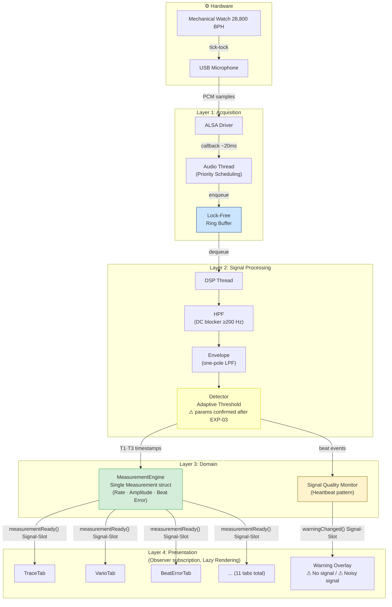
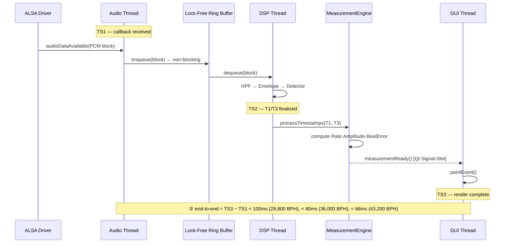
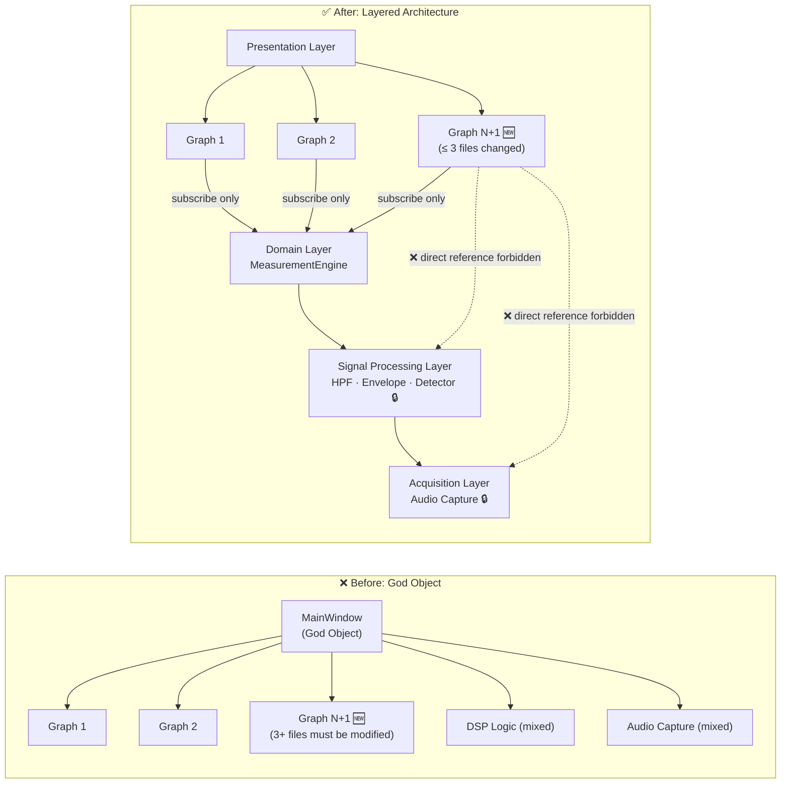
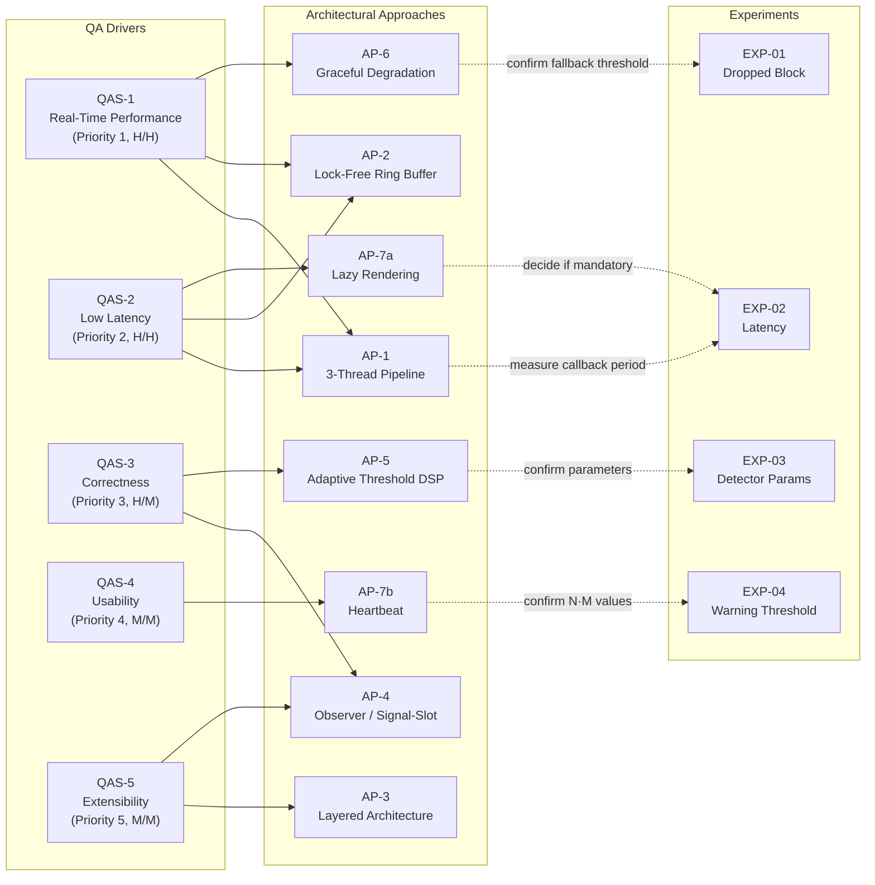

# Architectural Approaches — TimeGrapher

---

## 1. Architecture Overview

### 1.1 System Purpose and Structural Constraints

TimeGrapher captures acoustic signals (beat noise) from a mechanical watch in real time, computes Rate / Amplitude / Beat Error, and renders the results across 11 graph tabs.

Two structural constraints drive all architectural decisions:

| Constraint | Detail | Architectural impact |
|------------|--------|---------------------|
| **Hardware constraint** | Raspberry Pi 5 (ARM64, 8GB RAM) + USB audio sensor | Audio capture, DSP, and GUI share CPU in a single process → thread separation is mandatory |
| **Development constraint** | Qt6 C++ (`TimeGrapher_v10.5` codebase) | Qt Signal-Slot mechanism is the natural implementation vehicle for the Observer pattern |

---

### 1.2 Architecture Overview Diagram

TimeGrapher's architecture is built on a **unidirectional signal processing pipeline**. Data flows in one direction from the physical layer (audio hardware) to the Presentation layer (GUI); inter-layer coupling is mediated solely through interfaces (Ring Buffer, Qt Signal-Slot).

> **Legend**
> - 🟡 Yellow box: Parameters pending — Adaptive Threshold strategy is decided; only optimal `onset_fraction`/`min_peak_fraction` values confirmed after EXP-03
> - 🟢 Green box: Observer pattern applied — single data source guaranteed
> - 🔵 Blue box: Lock-Free Ring Buffer — inter-thread coupling interface
> - 🟠 Orange box: Heartbeat pattern applied

---

### 1.3 Layer Responsibility Definition

| Layer | Responsibility | May Reference |
|:-----:|---------------|:-------------:|
| **Acquisition** | USB audio input → PCM samples → Ring Buffer supply | None (lowest layer) |
| **Signal Processing** | HPF → Envelope → Detector → T1/T3 timestamp extraction | Acquisition (Ring Buffer only) |
| **Domain** | T1/T3 timestamps → Rate·Amplitude·Beat Error computation, Measurement publication | Signal Processing (T1/T3 only) |
| **Presentation** | GUI rendering, Observer subscription, warning display | **Domain Layer only** (MeasurementEngine interface) |

> **Core rule**: Presentation Layer **must not directly reference** Signal Processing / Acquisition layers. Violating this rule makes QAS-5 Extensibility target (≤ 3-file change) unachievable.

---

## 2. Main Architectural Approaches

There are 7 architectural approaches in total; each directly addresses one or more QA drivers.

---

### AP-1: 3-Thread Pipeline

| Item | Detail |
|------|--------|
| **Pattern** | Producer-Consumer Pipeline (Bass13 Performance Tactic #4 — Introduce Concurrency) |
| **Structure** | Audio Thread (producer) → Lock-Free Ring Buffer → DSP Thread (consumer) → Qt Signal-Slot → GUI Thread |
| **Rationale** | Running audio capture, DSP, and GUI rendering in the same thread on RPi 5 causes callback blocking → Dropped Blocks. Separating each concern into an independent thread protects the callback period (~20 ms) |
| **Linked drivers** | QAS-1 (Real-Time Performance), QAS-2 (Low Latency) |

> **Segment Definition**: ① = TS2−TS1 (capture→process, < 70ms), ② = TS3−TS2 (process→display, < 30ms), ③ = TS3−TS1 (end-to-end, < 100ms)

---

### AP-2: Lock-Free Ring Buffer

| Item | Detail |
|------|--------|
| **Tactic** | Reduce Resource Contention (Bass13 Performance Tactic #4) |
| **Description** | Eliminates mutex between Audio Thread (producer) and DSP Thread (consumer) to prevent DSP processing delays from lock contention; implements circular buffer via atomic operations |
| **Rationale** | Mutex waits can cause block period violations (~20 ms), leading to Ring Buffer overflow (Dropped Block). Lock-Free structure eliminates this failure path entirely |
| **Trade-off** | Higher implementation complexity (correct memory ordering required). Applied together with AP-1 as its implementation pattern |
| **Linked drivers** | QAS-1 (Real-Time Performance — prevents Dropped Block), QAS-2 (Low Latency — protects segment ①) |

---

### AP-3: Layered Architecture + Restrict Dependencies

| Item | Detail |
|------|--------|
| **Pattern** | Layered Architecture + Restrict Dependencies (Bass13 Modifiability Tactic) |
| **Description** | Splits the existing God Object structure into 4 layers (Acquisition → Signal Processing → Domain → Presentation); Presentation Layer may only reference the Domain Layer (MeasurementEngine interface) |
| **Rationale** | In the God Object structure, adding each graph requires modifying multiple files → parallel development conflicts. After layer separation, adding a new graph only touches 3 files in the Presentation Layer (new widget + tab registration + subscription wiring) |
| **Linked drivers** | QAS-5 (Extensibility — ≤ 3-file target) |

---

### AP-4: Observer Pattern / Qt Signal-Slot (Single Data Source)

| Item | Detail |
|------|--------|
| **Pattern** | Observer (GoF) / Qt Signal-Slot |
| **Description** | MeasurementEngine publishes a single `Measurement` struct via `measurementReady()` signal; all 11 tabs independently subscribe to the same signal |
| **Rationale (Correctness)** | If views compute values independently, differing computation paths can cause inter-view divergence. Observer pattern ensures all views receive the same struct from a single source — consistency is structurally guaranteed |
| **Rationale (Extensibility)** | Adding a new graph only requires adding a subscription — no modification of existing logic (complementary to AP-3) |
| **Linked drivers** | QAS-3 QA-C1 (Correctness — same data source), QAS-5 (Extensibility — extend by subscription only) |

---

### AP-5: Adaptive Threshold DSP Pipeline

| Item | Detail |
|------|--------|
| **Tactic** | Pipeline Filtering + Adaptive Threshold |
| **Fixed decisions** | DSP pipeline: Raw PCM → HPF (DC blocker ≥200 Hz) → Envelope (one-pole LPF) → Detector. Adaptive threshold strategy adopted (already implemented): `noise_floor` = 75th percentile of last 256 ms silence; `reference_peak` = median of last 16 beat peaks |
| **Open decision** | Whether default Detector parameters (`onset_fraction`=0.03, `min_peak_fraction`=0.20) are optimal under 3 noise conditions — confirmed by **EXP-03** |
| **Trade-off** | Higher `onset_fraction` → better noise rejection but may miss real beat onset. Lower → higher sensitivity but false detections |
| **Linked drivers** | QAS-3 QA-C2 (Correctness — beat detection quality under ambient noise) |

---

### AP-6: Graceful Degradation

| Item | Detail |
|------|--------|
| **Tactic** | Graceful Degradation (Bass13 Performance Tactic) |
| **Description** | If EXP-01 confirms Dropped Block > 0 at 96k sps, auto-switch to 48k sps; block period expands from ~10 ms to ~20 ms, doubling the DSP time budget |
| **Trade-off** | T1 detection resolution degrades: 10.4 µs/sample at 96k → 20.8 µs/sample at 48k; resolution sacrificed to guarantee Dropped Block = 0 |
| **Provisional** | ⚠️ Fallback threshold (whether 96k is achievable) confirmed by **EXP-01** |
| **Linked drivers** | QAS-1 (Real-Time Performance — guarantees Dropped Block = 0) |

---

### AP-7: Lazy Rendering + Heartbeat

#### AP-7a: Lazy Rendering

| Item | Detail |
|------|--------|
| **Tactic** | Manage Work Requests — rendering throttling (Bass13 Performance Tactic #3) |
| **Description** | Of 11 tabs, only the active tab executes `paintEvent()`; inactive tabs update data but defer rendering |
| **Rationale** | Simultaneous rendering of 11 tabs may overload the Qt main thread, pushing segment ② process→display beyond 30 ms (TR-04); skipping inactive tabs reduces rendering load to single-tab level |
| **Trade-off** | Momentarily stale values may appear on tab switch → EXP-02 confirms acceptable level |
| **Provisional** | ⚠️ Whether Lazy Rendering is mandatory decided by **EXP-02** OI-L2 result |
| **Linked drivers** | QAS-2 (Low Latency — process→display < 30 ms) |

#### AP-7b: Heartbeat Pattern

| Item | Detail |
|------|--------|
| **Pattern** | Heartbeat (reuse) |
| **Description** | Reuses existing A(T1)·C(T3) events as heartbeat. No beat event for N seconds → `⚠ No signal`. noise/signal ratio exceeds threshold → `⚠ Noisy signal`. Auto-cleared M seconds after signal recovers |
| **Rationale** | Reuses existing Detector output without additional detection logic → minimal implementation cost |
| **Provisional** | ⚠️ N·M values and noise/signal threshold confirmed by **EXP-04** |
| **Linked drivers** | QAS-4 (Usability — signal quality warning) |

---

## 3. Design Soundness Assessment

Is the design sound enough to guide construction? Each approach is assessed on confirmation status and implementation readiness.

| Criterion | Assessment |
|:---------:|:----------:|
| ✅ **Immediately implementable** | Design decision confirmed, no experiment dependency |
| ⚠️ **Conditionally implementable** | Core structure decided; parameters/thresholds require experiment confirmation |
| 🔴 **Implementation on hold** | Implementation direction cannot be determined without experiment results |

| AP | Approach | Status | Rationale |
|:--:|----------|:------:|-----------|
| AP-1 | 3-Thread Pipeline | ✅ | Thread separation direction confirmed |
| AP-2 | Lock-Free Ring Buffer | ✅ | Mutex-free structure confirmed |
| AP-3 | Layered Architecture | ✅ | 4-layer definition + Restrict Dependencies rule confirmed; refactoring can begin |
| AP-4 | Observer / Signal-Slot | ✅ | Single MeasurementEngine publication structure confirmed |
| AP-5 | Adaptive Threshold DSP | ⚠️ | Pipeline structure confirmed; optimal Detector parameters confirmed after EXP-03 |
| AP-6 | Graceful Degradation | ⚠️ | Fallback logic design confirmed; 48k trigger threshold confirmed after EXP-01 |
| AP-7a | Lazy Rendering | ⚠️ | Tactic direction confirmed; mandatory application depends on EXP-02 OI-L2 |
| AP-7b | Heartbeat Pattern | ⚠️ | Detection structure confirmed; N·M values + thresholds confirmed after EXP-04 |

**Soundness conclusion**: All 7 approaches have a **confirmed structural direction** — implementation can begin on all of them. Only parameters and thresholds require experimental confirmation; conservative defaults (48k sps fallback, 100 ms ceiling) guarantee minimum behavior regardless of experiment outcomes.

---

## 4. Driver–Approach Traceability

Maps each QA driver to the architectural approaches that support it and the experiments that validate them.

**Legend**: Solid (→) = approach supports driver | Dashed (-..→) = experiment confirms approach parameter

### 4.1 QA-by-QA Support Summary

| QA | Priority | Supporting Approaches | How | Open Experiment |
|----|:--------:|----------------------|-----|:--------------:|
| **QAS-1** Real-Time Performance | 1 | AP-1, AP-2, AP-6 | Thread separation protects capture callback + Lock-Free prevents DSP delay + fallback guarantees Dropped Block = 0 | EXP-01 |
| **QAS-2** Low Latency | 2 | AP-1, AP-2, AP-7a | 3-segment measurability + segment ① lower bound protection + segment ② rendering load reduction | EXP-02 |
| **QAS-3** Correctness | 3 | AP-4 (QA-C1), AP-5 (QA-C2) | Observer structurally guarantees single source + Adaptive Threshold maintains beat detection under noise | EXP-03 |
| **QAS-4** Usability | 4 | AP-7b | Heartbeat pattern immediately detects signal loss / noise | EXP-04 |
| **QAS-5** Extensibility | 5 | AP-3, AP-4 | Layered Architecture enables ≤ 3-file target + Observer allows extension by subscription only | — |

---

## 5. Driver Support Assessment

### QAS-1: Real-Time Performance

**Support level**: Structurally sufficient; empirical verification required

- AP-1 (thread separation) isolates the capture callback from DSP/GUI, forming the first line of defense against Dropped Blocks.
- AP-2 (Lock-Free Ring Buffer) eliminates mutex contention between threads, forming the second line of defense against DSP processing delays.
- AP-6 (Graceful Degradation) guarantees Dropped Block = 0 via 48k sps fallback even if 96k sps is unachievable — the last line of defense.

**Open item**: Whether 96k sps is achievable cannot be confirmed without EXP-01. Conservative design (48k fallback) guarantees minimum target.

---

### QAS-2: Low Latency

**Support level**: Structurally sufficient; two open items need resolution

- AP-1 (3-thread pipeline) enables 3-segment measurement (TS1/TS2/TS3) so the bottleneck segment can be identified.
- AP-2 (Lock-Free Ring Buffer) preserves the lower bound of segment ① (capture→process) at the OS callback period (~20 ms).
- AP-7a (Lazy Rendering) reduces the 11-tab rendering load on segment ② (process→display) to a single-tab equivalent.

**Open items**: ① Actual QAudioSource live callback period (OI-L1), ② whether segment ② stays within 30 ms at 11 tabs (OI-L2) — both resolved by EXP-02. Since all three watches (28,800 / 36,000 / 43,200 BPH) are available, Stretch BPH verification can be run in the same EXP-02 session once the Primary (28,800 BPH) target is confirmed.

---

### QAS-3: Correctness

**Support level**: QA-C1 structurally guaranteed; QA-C2 complete after experiment

- **QA-C1 (same data source)**: Once AP-4 (Observer/Signal-Slot) is implemented, consistency across all views is structurally guaranteed — no experiment needed.
- **QA-C2 (noise-robust beat detection)**: AP-5 pipeline structure and algorithm are confirmed. Complete once optimal `onset_fraction`/`min_peak_fraction` values are confirmed by EXP-03.

---

### QAS-4: Usability

**Support level**: Structure confirmed; threshold experiment needed

- AP-7b (Heartbeat) reuses existing A/C events for signal loss detection — low implementation cost with no additional detection logic.
- QAS-4 Response Measure is complete once N·M values and noise/signal threshold are confirmed by EXP-04.
- False alarms / missed warnings from unconfirmed thresholds affect only user experience (independent of QAS-3 Correctness).

---

### QAS-5: Extensibility

**Support level**: Structurally achievable; verification required after refactoring

- AP-3 (Layered Architecture) limits file changes to 3 Presentation Layer files when adding a new graph after God Object is decomposed into 4 layers.
- AP-4 (Observer) enables extension by subscription only — no modification of existing logic.
- **Risk TR-07**: Regression in existing graphs during God Object decomposition. Mitigated by incremental refactoring + pre-refactoring unit test baseline.
- Verified via `git diff --stat` showing ≤ 3 files changed when actually adding a new graph after Observer refactoring completes.

---

## 6. Cross-Approach Interactions

Architectural approaches are not independent of each other. The following interactions must be understood when managing implementation order.

| Interaction | Description |
|-------------|-------------|
| **AP-3 + AP-4 (Complementary)** | Layered Architecture restricts dependency direction; Observer pattern provides the only data flow crossing that boundary. Both approaches together support QAS-5 |
| **AP-1 + AP-2 (Implementation pair)** | 3-thread pipeline (AP-1) cannot transfer data between threads without Lock-Free Ring Buffer (AP-2). Both must be implemented together |
| **AP-6 → AP-1 (Depends on)** | Graceful Degradation (AP-6) fallback logic operates on top of AP-1's thread separation structure. AP-6 can be added after AP-1 is implemented |
| **AP-7a ↔ AP-4 (Trade-off)** | Lazy Rendering (AP-7a) suppresses inactive tab rendering; the latest data published by Observer (AP-4) will not be reflected until tab switch. Acceptable level confirmed by EXP-02 |
| **AP-5 → AP-7b (Sequence)** | Heartbeat (AP-7b) reuses Detector (AP-5) output (A/C events). AP-7b can be added after AP-5 is implemented |

---

## 7. Summary

| Question | Answer |
|----------|--------|
| Architecture overview? | Unidirectional 4-layer signal processing pipeline (Acquisition → Signal Processing → Domain → Presentation). 3 threads (Audio/DSP/GUI) manage resource contention in a single RPi 5 process |
| Main approaches? | AP-1 (3-thread pipeline), AP-2 (Lock-Free Ring Buffer), AP-3 (Layered Architecture), AP-4 (Observer/Signal-Slot), AP-5 (Adaptive Threshold DSP), AP-6 (Graceful Degradation), AP-7 (Lazy Rendering + Heartbeat) |
| Sound enough to guide construction? | ✅ Structural direction confirmed for all approaches. ⚠️ Parameters/thresholds pending (EXP-01~04), but conservative defaults guarantee minimum behavior |
| Approaches linked to drivers? | ✅ Each of 5 QA drivers has at least one explicitly linked approach (see Section 4 traceability mapping) |
| How well are drivers supported? | QAS-1, QAS-2: Structurally sufficient + empirical verification needed \| QAS-3 QA-C1: Fully guaranteed by structure \| QAS-3 QA-C2, QAS-4: Structure confirmed + experimental parameter confirmation needed \| QAS-5: Structurally achievable after refactoring |
