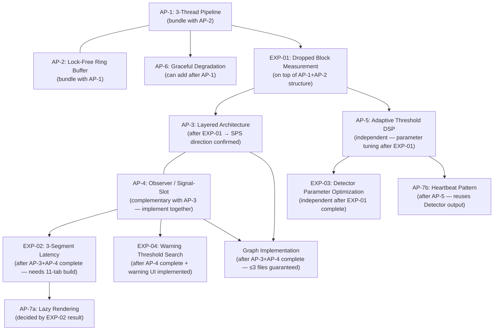
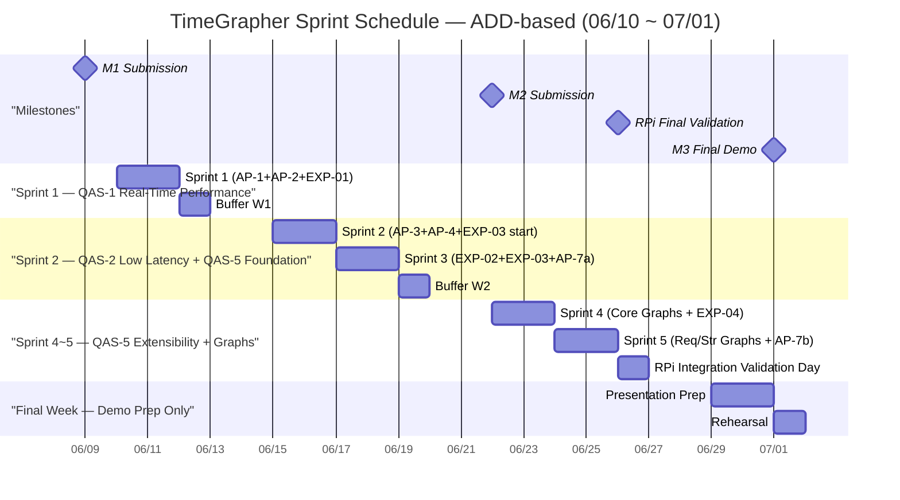

# Project Plan — TimeGrapher

---

This document answers three requirements in order:

1. Are role assignments, specific tasks, and milestones defined?
2. Are construction tasks based on the overall architecture reflected?
3. Are planned technical experiments reflected in the tasks?

---

## 1. Overview

This document defines the Milestone 1 project plan for the TimeGrapher project.

**Core principle**: ADD (Attribute-Driven Design)-based 2-day Scrum sprints. Each sprint focuses on one QA driver; Team 1 and Team 2 run different tasks in parallel toward the same QA goal.

**Project objectives (in priority order)**:

| Rank | Objective | Description |
|:---:|-----------|-------------|
| **1st** | Accurate Measurement | Provide Rate / Amplitude / Beat Error accurately — sacrificing accuracy to cover more BPH is not acceptable |
| **2nd** | Wider BPH Coverage | Extend accurate support to higher BPH watches while preserving accuracy |
| **3rd** | Extensible Architecture | Enable parallel development of 11 graphs within 5 weeks |
| **4th** | Architecture Principles | Apply CMU MSE software architecture design principles |

**Schedule overview**:

```
M1 Submission (06/09) → Construction start (06/10) → M2 Submission (06/22) → RPi Final Validation (06/26) → M3 Final Demo (07/01)
```

---

## 2. Role Definitions

| Role | Assignee | Responsibility |
|------|----------|---------------|
| Product Owner | Team 3 Lead | Prioritize requirements, approve sprint goals |
| Scrum Master — Team 1 | Sungho Shin | Manage sprint progress, remove blockers, join Architecture Committee |
| Scrum Master — Team 2 | Dong Ho Shin | Manage sprint progress, remove blockers, join Architecture Committee |
| Dev Team 1 | Gyeongjin Shin, Hung Son Tong, Kyudae Bahn | Feature implementation and experiments |
| Dev Team 2 | Taejoon Song, Jimin Lee | Feature implementation and experiments |

---

## 3. Agile Ceremonies

| Event | Cadence | Participants | Duration |
|-------|---------|-------------|---------|
| Sprint Planning | Every sprint start (every 2 days) | Architecture Committee (both SMs + PO) | 1 hour |
| Sprint (Development) | 2 days | Each team independently | 2 days |
| Sprint Review & Retrospective | Every sprint end | Full team | 1 hour |
| Buffer | Every Friday | Full team | 1 day |

**Architecture Committee role**: The 1-hour Sprint Planning performs ADD Steps 2–4:
- **Step 2**: Select the QA driver to focus on this sprint
- **Step 3**: Decide the architecture element to decompose for that QA
- **Step 4**: Select and plan instantiation of tactics/patterns

Both teams share the same QA sprint goal; task allocation is decided by the Architecture Committee.

---

## 4. ADD–Agile Mapping

```
Sprint Planning (1h)    = ADD Step 2–4: Select QA driver → decomposition target → tactic/pattern
Sprint development (2d)  = ADD Step 5:  Element instantiation + responsibility allocation (impl + experiment)
Sprint Review (1h)      = ADD Step 6:  Views sketch + record design decisions (ADR)
Next Sprint              = ADD "Next Iteration": return to Step 2 for next QA driver
```

**ADD QA focus principle**: Each sprint concentrates on one QA driver. The focus order is determined by implementation dependency (experiment prerequisites, cross-approach ordering), not importance alone.

---

## 5. Architecture-Based Construction Tasks

TimeGrapher's construction is based on 7 architectural approaches (AP-1~7). Interactions between approaches determine implementation order.

### 5.1 Implementation Order



### 5.2 Layer-by-Layer Tasks

| Layer | AP | Key Tasks | Target QA | Status |
|:-----:|:--:|----------|:---------:|:------:|
| **Acquisition** | AP-1, AP-2 | Separate Audio Thread, implement Lock-Free Ring Buffer (`atomic`-based) | QAS-1, QAS-2 | 🔴 Not impl. |
| **Acquisition** | AP-6 | Graceful Degradation: auto-fallback 96k→48k sps (trigger threshold confirmed by EXP-01) | QAS-1 | 🔴 Not impl. |
| **Signal Processing** | AP-5 | Verify HPF → Envelope → Detector pipeline, tune Adaptive Threshold params (after EXP-03) | QAS-3 QA-C2 | ⚠️ Partial |
| **Domain** | AP-4 | MeasurementEngine publishes single `Measurement` struct via `measurementReady()` Signal-Slot | QAS-3 QA-C1, QAS-5 | 🔴 Not impl. |
| **Domain** | AP-7b | Signal Quality Monitor (Heartbeat pattern — reuses A/C events; N·M confirmed by EXP-04) | QAS-4 | 🔴 Not impl. |
| **Presentation** | AP-3 | God Object → 4-layer separation (enforce Restrict Dependencies: Presentation → Domain only) | QAS-5 | 🔴 Not impl. |
| **Presentation** | AP-7a | Lazy Rendering: only active tab executes `paintEvent()` (based on EXP-02 OI-L2 result) | QAS-2 | 🔴 Not impl. |
| **Presentation** | AP-3, AP-4 | Core / Required / Stretch graph implementation (enforce ≤3-file change rule) | QAS-5 | 🔴 Not impl. |

---

## 6. Graph Priority Classification

To resolve NTR-05 (scope overextension risk) and OI-07 (graph priority unclassified), the 12 graph/feature items (FR-05~18) are categorized into three tiers: Core / Required / Stretch. This classification maps directly to project goal priority.

**Classification criteria**:

| Tier | Criteria | Goal alignment |
|------|----------|---------------|
| **Core** | Directly linked to QAS-3 Correctness (H) and QAS-1 Real-Time (H); mandatory for WeiShi comparison and measurement stability proof at M3 demo | 1st: Accurate Measurement |
| **Required** | Linked to QAS-4 Usability (M) and QAS-5 Extensibility (M); enhances demo completeness and provides extensibility evidence | 3rd: Extensible Architecture |
| **Stretch** | Additional QAS-5 visualizations and BPH-extension scenarios; added if time permits | 2nd: Wider BPH Coverage |

| Tier | Graph / Feature | Linked FR | Linked QA | M2 Required |
|:----:|----------------|:--------:|:---------:|:-----------:|
| **Core** | Trace Display (Rate + Amplitude real-time recording) | FR-05 | QAS-3 QA-C1 | ✅ |
| **Core** | Beat Error Display & Diagnostic Trace | FR-07 | QAS-3 QA-C1, QAS-2 | ✅ |
| **Core** | Rate & Amplitude Stability / Vario | FR-06 | QAS-3 QA-C1, QAS-1 | ✅ |
| **Required** | Signal Quality Warning UI (`⚠ No signal` / `⚠ Noisy signal`) | FR-08 | QAS-4 | ✅ |
| **Required** | Beat-Noise Scope (Scope 1 & 2) | FR-11 | QAS-5 Extensibility evidence | ✅ |
| **Required** | Watch-Position Testing | FR-10 | QAS-4, QAS-5 | ✅ |
| **Required** | Multi-Position Sequence Display | FR-12 | QAS-5 | ✅ |
| **Stretch** | Pause + Timeline Navigation | FR-09 | QAS-5 | ❌ |
| **Stretch** | Long-Term Performance Graph | FR-13 | QAS-5 / 2nd goal | ❌ |
| **Stretch** | Escapement Analyzer & Marker-Line Display | FR-14 | QAS-5 | ❌ |
| **Stretch** | Time-Frequency Spectrogram Display | FR-15 | QAS-5 | ❌ |
| **Stretch** | Waveform Comparison Display | FR-16 | QAS-5 | ❌ |
| **Stretch** | Scope Mode with Synchronized Sweep | FR-17 | QAS-5 | ❌ |
| **Stretch** | Scope Function with Multiple Filter Views | FR-18 | QAS-5 | ❌ |

> **Completion principle**: Do not start Required or Stretch until all 3 Core graphs are complete. Core = demo survival threshold.

---

## 7. QA Priority and Sprint Focus

| Rank | QA | Business Imp. | Tech Risk | **Priority** | Focus Sprints | Linked AP |
|:----:|----| :----------:| :------:| :--------:| :---------:|-----------|
| 1 | Real-Time Performance | H | H | **H** | **P1** — Team 1 | AP-1, AP-2, AP-6 |
| 2 | Correctness | H | M | **H** | **P2~P3** — Team 2 | AP-4, AP-5, EXP-03 |
| 3 | Low Latency | H | H | **H** | **P3** — Team 1 | AP-7a, EXP-02 |
| 4 | Extensibility | M | M | **M** | **P1~P4** — Team 2 + graph impl. | AP-3, AP-4 |
| 5 | Usability | M | M | **M** | **P4~P5** — Team 1 | AP-7b, EXP-04 |

> **Sprint Period (P)**: A 2-day window in which both teams run concurrently. P1–P5 = 5 periods total. Each team focuses on a different QA within the same period — two QA tracks run in true parallel.

> **Sprint ordering rationale**: The Real-Time → Low Latency → Correctness sequence follows *implementation prerequisite dependency*, not importance rank. Zero Dropped Blocks (QAS-1) is required to measure latency (QAS-2), and a real-time pipeline (QAS-1+2) must exist before measurement accuracy (QAS-3) can be verified. Extensibility (AP-3+AP-4 refactoring) is QAS-5 but is a prerequisite for all graph construction — so it is started in parallel from Sprint 2–3.

---

## 8. Sprint Schedule

Total **10 sprints** (Teams 1 & 2 each run 5 sprints, concurrent per period) × 2 days + 3 buffer days. Construction starts 06/10 (after M1 submission 06/09).
**Teams 1 & 2 each focus on a different QA/FR within the same sprint period — truly parallel QA tracks.**



---

### Period 1 (06/10 Wed ~ 06/11 Thu)

#### T1-S1 — QA Focus: QAS-1 Real-Time Performance

> **ADD Step 2**: QAS-1 Real-Time Performance (Priority 1, H/H)
> **ADD Step 3**: Acquisition Layer (Audio Thread + Ring Buffer)
> **ADD Step 4**: AP-1 (3-Thread Pipeline) + AP-2 (Lock-Free Ring Buffer) + EXP-01

**Architecture Committee Decisions**

| Decision ID | Decision | Resolved QA | Dependent Experiment |
|------------|----------|:-----------:|:-------------------:|
| ADD-P1T1-01 | Confirm Audio Thread separation structure + define Ring Buffer interface | QAS-1 | — |
| ADD-P1T1-02 | Determine Lock-Free Ring Buffer size (based on block period per sps) | QAS-1 | Adjusted after EXP-01 |
| ADD-P1T1-03 | Set provisional Graceful Degradation fallback (48k sps conservative default) | QAS-1 | Confirmed by EXP-01 |

**Team 1 Tasks**

| Task | Description | Done Criteria |
|------|-------------|--------------|
| AP-1 implementation | `QThread`-based Audio Thread separation | 3-thread structure running on RPi confirmed |
| AP-2 implementation | `std::atomic` head/tail Lock-Free Ring Buffer | Data circulated without overflow |
| EXP-01 execution | 48k/96k/192k sps × 10-min Dropped Block measurement | Dropped Block counts per sps confirmed |
| TR-01 mitigation | Prepare 48k fallback code | `SCHED_RR` before/after comparison |

#### T2-S1 — QA Focus: QAS-5 Extensibility Foundation (AP-3)

> **ADD Step 2**: QAS-5 Extensibility — begin God Object decomposition
> **ADD Step 3**: Design Presentation Layer boundary
> **ADD Step 4**: AP-3 (Layered Architecture) design + begin incremental refactoring

**Team 2 Tasks**

| Task | Description | Done Criteria |
|------|-------------|--------------|
| ADD-P1T2-01 | Design 4-layer boundaries: Acquisition / Signal Processing / Domain / Presentation | Layer diagram + dependency direction documented |
| AP-3 initiation | God Object decomposition — Acquisition Layer separation (incremental step 1) | Acquisition separated without regression in existing features |
| TR-07 mitigation | Record Rate·Amplitude·Beat Error baseline values before refactoring | Baseline values documented |
| Restrict Dependencies | Define rule: Presentation → Domain only | Rule document + violation detection method confirmed |

**P1 Review Goal**: EXP-01 results obtained (Dropped Block counts). AP-1+AP-2 basic operation confirmed. 4-layer boundary design complete.

---

### Buffer W1 (06/12 Fri) — EXP-01 Result Analysis + ADD Step 6

**Both Teams**

| Item | Description |
|------|-------------|
| EXP-01 result integration | 48k/96k/192k Dropped Block counts → confirm QAS-1 Response Measure (OI-P1 resolved) |
| ADD Step 6 | Record P1 architecture decisions (ADR): SPS confirmed, AP-1/AP-2 structure, 4-layer boundary |
| AP-6 decision | Confirm Graceful Degradation fallback threshold based on EXP-01 (96k achievable? → 48k trigger condition) |
| P2 Sprint Planning | Architecture Committee: confirm P2 QA driver allocation (Team 1 = AP-6, Team 2 = AP-4+EXP-03) |

---

### Period 2 (06/15 Mon ~ 06/16 Tue)

#### T1-S2 — QA Focus: Complete QAS-1 + AP-6 Graceful Degradation

**Team 1 Tasks**

| Task | Description | Done Criteria |
|------|-------------|--------------|
| AP-6 implementation | Implement 96k→48k auto-fallback logic based on EXP-01 confirmed values | Dropped Block = 0 confirmed when fallback triggers |
| FR-04 completion | Add Envelope Detector (HPF only → HPF+Envelope) | FR-04 ⚠️ → ✅ |
| QAS-1 verification | 5-min continuous run Dropped Block = 0 | QAS-1 Response Measure Pass |

#### T2-S2 — QA Focus: QAS-3 Correctness Start + AP-4

> ⚠️ **TR-07 risk**: God Object decomposition has regression risk. Baseline collection before refactoring is mandatory.

**Team 2 Tasks**

| Task | Description | Done Criteria |
|------|-------------|--------------|
| AP-3 completion | God Object decomposition — Signal Processing + Domain Layer separation complete | Restrict Dependencies violations = 0 |
| AP-4 implementation | MeasurementEngine: single `Measurement` struct + `measurementReady()` Signal-Slot | Structure supports 11-tab subscription |
| EXP-03 Part 1 | Low-noise baseline: measure Rate·Amplitude·Beat Error 30 times with default params | Baseline documented |
| EXP-03 design | Design grid search (`onset_fraction` × `min_peak_fraction` combination schedule) | Search matrix defined |

**P2 Review Goal**: QAS-1 Response Measure Pass (Dropped Block = 0). AP-3 layer separation complete. AP-4 MeasurementEngine basic operation confirmed. EXP-03 baseline established.

---

### Period 3 (06/17 Wed ~ 06/18 Thu)

#### T1-S3 — QA Focus: QAS-2 Low Latency

**Team 1 Tasks**

| Task | Description | Done Criteria |
|------|-------------|--------------|
| EXP-02 execution | TS1/TS2/TS3 timestamp injection + 3-segment × 3 sps tiers × 1/11 tabs measurement | 3-segment latency values confirmed |
| AP-7a decision | Decide Lazy Rendering mandatory/optional based on EXP-02 OI-L2 | Lazy Rendering applied / skipped decision made |
| C&C View draft | 3-thread pipeline runtime view | C&C View draft complete |

#### T2-S3 — QA Focus: Complete QAS-3 Correctness

**Team 2 Tasks**

| Task | Description | Done Criteria |
|------|-------------|--------------|
| EXP-03 completion | Medium/high noise grid search + optimal parameters confirmed | OI-C1 resolved, `Detector.cpp` updated |
| AP-5 application | Apply Adaptive Threshold parameter to code | QAS-3 QA-C2 Response Measure Pass |
| ≤3-file verification | Add one new graph and measure `git diff --stat` | ≤3 files PASS confirmed |
| Module + Deployment View | 4-layer Module View + RPi Deployment View draft | Both views complete |

**P3 Review Goal**: EXP-02 complete → QAS-2 confirmed (OI-L1/L2 resolved). EXP-03 complete → Detector parameters confirmed (OI-C1 resolved). ≤3-file verification Pass. Architecture Views (3 types) draft complete.

---

### Buffer W2 (06/19 Fri) — M2 Document Preparation + ADD Step 6

**Both Teams**

| Item | Description |
|------|-------------|
| EXP result integration | Integrate EXP-01~03 results → update Architectural Drivers (⚠️ provisional → confirmed) |
| Architecture Views finalization | Module / C&C / Deployment View drafts → finalized with measured values |
| M2 deliverable preparation | Updated Project Plan, Experiment Results, Architecture Views, Construction Plan |
| ADD Step 6 | Record P1~P3 architecture decisions (ADR) |
| P4 Sprint Planning | Architecture Committee: confirm P4 QA driver allocation |

---

### Period 4 (06/22 Mon ~ 06/23 Tue) | M2 Submission: 06/22

> ⚠️ **M2 Submission (06/22)**: Both teams confirm and submit M2 deliverables together before starting Sprint.
> **Graph implementation speed rationale**: With AP-3+AP-4 foundation complete, 1 graph = ≤3-file change (QAS-5 Extensibility evidence). Implementable within half a day → P4 2 days allows full Core+Required+Stretch per team.

#### T1-S4 — QA Focus: QAS-4 Usability + Core·Stretch Graphs

**Team 1 Tasks**

| Task | Description | Done Criteria |
|------|-------------|--------------|
| EXP-04 completion | AP-7b Heartbeat warning UI + N·M value search (Part A+B) | OI-U1/U2 resolved |
| FR-08 implementation | Signal Quality Warning UI (`⚠ No signal` / `⚠ Noisy signal`) | RPi build verified ✓ |
| FR-05 implementation | Trace Display (Rate + Amplitude real-time recording) | RPi build verified ✓ |
| FR-07 implementation | Beat Error Display & Diagnostic Trace | RPi build verified ✓ |
| FR-13 implementation | Long-Term Performance Graph | RPi build verified ✓ |
| FR-14 implementation | Escapement Analyzer & Marker-Line Display | RPi build verified ✓ |
| FR-15 implementation | Time-Frequency Spectrogram Display | RPi build verified ✓ |

#### T2-S4 — QA Focus: QAS-5 Full Graph Implementation

**Team 2 Tasks**

| Task | Description | Done Criteria |
|------|-------------|--------------|
| FR-06 completion | Rate & Amplitude Stability / Vario (Min/Max/Avg/σ) | RPi build verified ✓ |
| FR-10 implementation | Watch-Position Testing (Rate deviation per position) | RPi build verified ✓ |
| FR-11 implementation | Beat-Noise Scope Display (Scope 1: raw, Scope 2: filtered) | RPi build verified ✓ |
| FR-12 implementation | Multi-Position Sequence Display | RPi build verified ✓ |
| FR-09 implementation | Pause + Timeline Navigation | RPi build verified ✓ |
| FR-16 implementation | Waveform Comparison Display with Timing Markers | RPi build verified ✓ |
| FR-17 implementation | Scope Mode with Synchronized Sweep | RPi build verified ✓ |
| FR-18 implementation | Scope Function with Multiple Filter Views | RPi build verified ✓ |
| Extensibility evidence | `git diff --stat` ≤3 files per graph addition | Evidence document complete |

**P4 Review Goal**: M2 submission complete. All graphs (Core+Required+Stretch) RPi build verified. EXP-04 complete (OI-U1/U2 resolved). Extensibility evidence (≤3 files) documented.

---

### Period 5 (06/24 Wed ~ 06/25 Thu) — Buffer + RPi Integration + BPH Escalation

> **P5 operating principle**: EXP-05 only begins if all graphs are implemented in P4 AND QAS-1~4 all passed. Otherwise P5 is used purely for buffer and RPi stabilization.

**Both Teams**

| Item | Description | Condition |
|------|-------------|-----------|
| RPi integration build | Full implementation RPi integrated build + run stability verification | Mandatory |
| QA values final confirmation | QAS-1~4 Response Measure full verification + finalize values for presentation | Mandatory |
| Incomplete graph completion | Complete any graphs not finished in P4 | If needed |
| ADD Step 6 | Record P4 architecture decisions (ADR) + Extensibility evidence document complete | Mandatory |
| **EXP-05: BPH escalation** | **36k/43k BPH latency + Dropped Block measurement** — only starts if 28,800 BPH QAS-1~4 all passed | **Conditional** |

---

### RPi Integration Validation Day (06/26 Fri) — ★ Technical Work Deadline

> ⚠️ **No technical implementation after this date. All RPi validation must be complete by EOD 06/26.**

| Item | Done Criteria | Linked QA |
|------|--------------|:---------:|
| Full graph RPi integrated build + run | All graphs operate without crash on RPi | QAS-1, QAS-5 |
| End-to-end latency final measurement (3-segment avg + worst-case) | 28,800 BPH: ① < 70ms ② < 30ms ③ < 100ms (EXP-02 confirmed values) | QAS-2 |
| 96k sps stable operation (or 48k fallback) | 5-min continuous Dropped Block = 0 | QAS-1 |
| Rate·Amplitude·Beat Error accuracy final verification | Δ minimized after applying EXP-03 confirmed parameters | QAS-3 |
| Extensibility evidence documented | ≤ 3-file change confirmation document complete | QAS-5 |
| QA evidence values fully documented | All values for presentation confirmed | All |

---

### Final Week (06/29~07/01) — Presentation & Demo Prep Only

> ⚠️ **No technical implementation or RPi validation. Presentation preparation, rehearsal, and demo only.**

| Date | Activity | Participants |
|------|----------|-------------|
| 06/29 (Mon) | Presentation structure design + draft (QA requirements · Architecture · Experiments · Lessons) | Full team |
| 06/30 (Tue) | Finalize presentation + full team rehearsal (20-min time check) | Full team |
| 07/01 (Wed) | **M3 Final Demo** | Full team |

---

## 9. Technical Experiment Summary

Full experiment details (objective, questions, completion criteria, prerequisites) are defined in `docs/milestone1/final/planned-experiments.md`. The table below summarizes the connection to the sprint plan.

| ID | Experiment | Resolved OI | Prerequisites | Sprint | Owner |
|:--:|-----------|:-----------:|--------------|:------:|-------|
| **EXP-01** | RPi Dropped Block Measurement | OI-P1 | RPi 5 setup + watch connected | **P1** (T1-S1) | Team 1 |
| **EXP-02** | End-to-End 3-Segment Latency | OI-L1, OI-L2 | EXP-01 complete + AP-3+AP-4 complete | **P3** (T1-S3) | Team 1 |
| **EXP-03** | Detector Parameter Optimization | OI-C1 | EXP-01 complete (SPS confirmed) | **P2~P3** (T2-S2~S3) | Team 2 |
| **EXP-04** | Warning Threshold Search | OI-U1, OI-U2 | AP-4 complete + warning UI implemented | **P4~P5** (T1-S4~S5) | Team 1 |
| **EXP-05** | BPH Escalation (36k/43k BPH) | OI-L3 | All 28,800 BPH QAS-1~4 passed | **P5 conditional** | Both teams |

**Experiment Dependency**:

```
EXP-01 (P1 T1-S1)
    └─→ EXP-02 (P3 T1-S3) — after AP-3+AP-4 complete (11-tab build needed)
    └─→ EXP-03 (P2~P3 T2-S2~S3) — independent after SPS confirmed
              └─→ EXP-04 (P4~P5 T1-S4~S5) — after warning UI implemented
                        └─→ EXP-05 (Deferred) — after 28,800 BPH QAS-1~4 all confirmed
```

