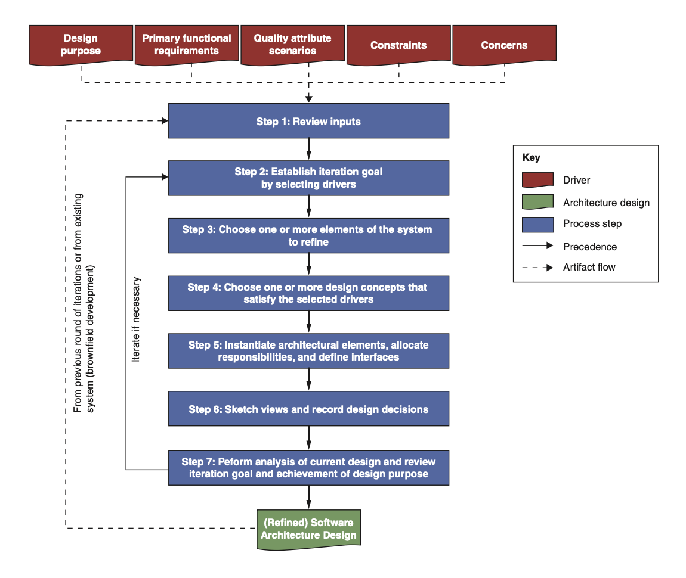
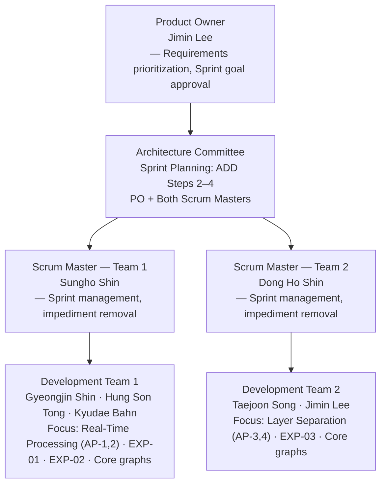
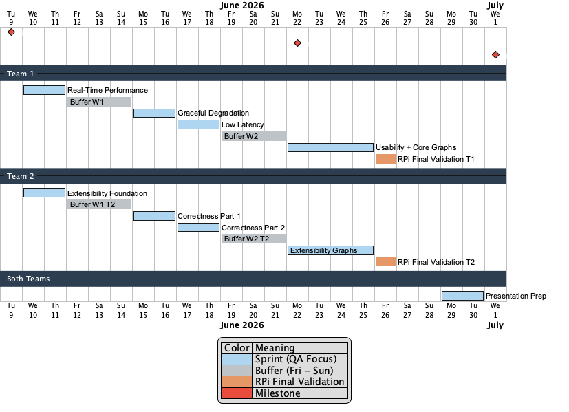

# Project Plan — TimeGrapher

**Team**: Blue Sky (Team 3) | **Milestone**: M1 | **Date**: 2026-06-09

---

## 1. Project Objectives

The goal of TimeGrapher is to **analyze beat sounds from a mechanical watch** in real time, and provide accurate measurement data for watch repair.

In watch repair, what matters is whether Rate (s/d), Amplitude (°), and Beat Error (ms) are correct. Rather than maximizing BPH coverage, the priority is to **achieve the level of accuracy required to make a repair decision** for the watches we support.

---

## 2. Applying Agile and ADD

### 2.1 Rationale

**Why Agile?**

This project has a lot to cover **from technical research, architectural design, to implementation and final demo** all within 5 weeks. Key parameters — audio signal processing (SPS, Detector threshold) and hardware (RPi 5) performance — cannot be determined without actual measurement. So instead of planning everything upfront, **we chose Agile** so that we can adjust our plan based on what we learn from each sprint.

Agile's core value of **"responding to change over following a plan"** is especially relevant here:

- **Short iterations (2-day sprints)**: Experiment results feed directly into the next sprint's direction
- **Continuous review (Sprint Review)**: At every sprint end, working results are reviewed and course-corrected quickly
- **Parallel team execution**: Teams 1 & 2 focus on different QAs in the same period, maximizing development throughput

**Why ADD (Attribute-Driven Design)?**

Satisfying all QAs simultaneously within 5 weeks is not feasible. Architecture decisions must be made and implemented starting from the most critical QA — that is the only way to achieve the core objectives within the schedule.

ADD is a methodology that **drives architecture decisions from Quality Attributes**:

Each sprint covers Steps 2–6 of ADD in one cycle. Sprints then repeat, each iteration targeting the next priority driver.

---

## 3. Our Team's Agile Process

### 3.1 Team Structure

Two development teams run in parallel within the same sprint period, each focusing on a different QA driver. The Architecture Committee (PO + both Scrum Masters) meets at each Sprint Planning to apply ADD Steps 2–4 and make architecture decisions before development begins.

---

### 3.2 Agile Ceremonies & Rules

| Event | Cadence | Participants | Duration |
|---|:---:|:---:|:---:|
| Sprint Planning (ADD Step 2–4) | Every sprint start (every 2 days) | Architecture Committee (PO + both SMs) | 1 hour |
| Sprint development (ADD Step 5) | 2 days | Each team independently | 2 days |
| Sprint Review & Retrospective (ADD Step 6) | Every sprint end | Full team | 1 hour |
| Buffer | Every Friday | Full team | 1 day |

**Operating principles**:
- Teams 1 & 2 focus on **different QAs** in the same Period — two QA tracks run in true parallel
- Sprint Planning 1 hour = Architecture Committee performs ADD Steps 2–4
- Buffer is used for experiment result integration, ADR writing, and next sprint prep
- **Do not start Required or Stretch until all 3 Core graphs are complete** — Core = demo survival threshold

---

### 3.3 Sprint Schedule

5 Periods (2 days each) are allocated based on QA priority and implementation dependency.

**Sprint QA Allocation**:

| Period | Date | Team 1 QA Focus | Team 2 QA Focus | Milestone |
|:------:|:----:|---|---|:---:|
| **P1** | 06/10–11 | **Real-Time Performance** | **Extensibility** Foundation | — |
| **P2** | 06/15–16 | Real-Time Performance (Complete) | **Correctness** (Part 1) | — |
| **P3** | 06/17–18 | **Low Latency** | Correctness (Complete) | — |
| **P4** | 06/22–23 | **Usability** + Core Graphs | **Extensibility** Graphs | **M2** |
| **P5** | 06/24–25 | RPi Integration Verification | Graph Wrap-up | — |

> For detailed objectives, completion criteria, and prerequisites of each experiment (EXP-01~05), see [`04-planned-experiments.md`](04-planned-experiments.md).
> For QA scenarios and Response Measures, see [`02-architectural-drivers.md`](02-architectural-drivers.md).
