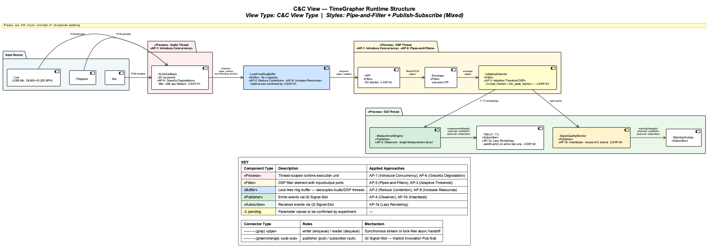
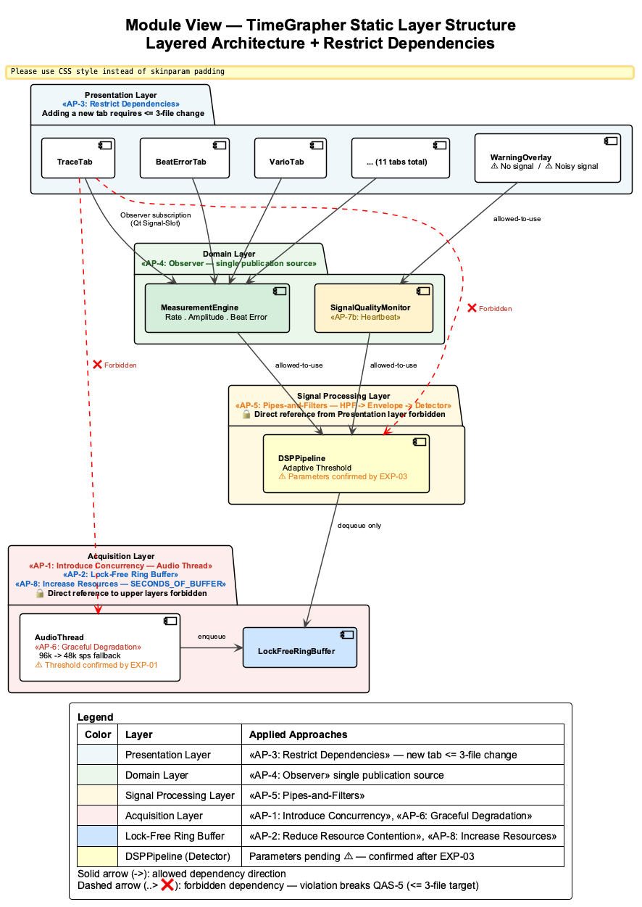
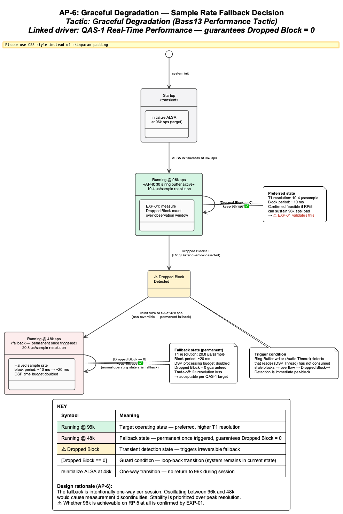

# Architectural Approaches — TimeGrapher

**Team**: Blue Sky (Team 3) | **Milestone**: M1 | **Date**: 2026-06-07

---

## 1. Architecture Overview

### 1.1 Pipe-and-Filter + Publish-Subscribe View of TimeGrapher

- C&C View — shows how data flows through the system at runtime
- 3 threads: **Audio Thread** → **DSP Thread** → **GUI Thread** (top to bottom)
- Top: **Pipe-and-Filter** style — one-way data flow through filters
- Bottom: **Publish-Subscribe** style — MeasurementEngine publishes, all 11 tabs receive
- Input modes: Live (USB Mic), Playback, Sim

> Source file: [`assets/cc-view.puml`](assets/cc-view.puml)

---

### 1.2 Layered View of TimeGrapher

| Layer | Responsibility | May Reference |
|:-----:|---------------|:-------------:|
| **Acquisition** | USB audio input → PCM samples → Ring Buffer supply | None (lowest layer) |
| **Signal Processing** | HPF → Envelope → Detector → T1/T3 timestamp extraction | Acquisition (Ring Buffer only) |
| **Domain** | T1/T3 timestamps → Rate·Amplitude·Beat Error computation, Measurement publication | Signal Processing (T1/T3 only) |
| **Presentation** | GUI rendering, Observer subscription, warning display | **Domain Layer only** (MeasurementEngine interface) |

> **Core rule**: Presentation Layer **must not directly reference** Signal Processing / Acquisition layers. Violating this rule makes QAS-5 Extensibility target (≤ 3-file change) unachievable.

The Module View (Layered Style) below visualises the rule above. Forbidden dependencies (❌) are shown explicitly; their presence structurally prevents the QAS-5 ≤ 3-file target.

> Source file: [`assets/module-view.puml`](assets/module-view.puml)

---

## 2. Main Architectural Approaches

There are 8 architectural approaches in total; each directly addresses one or more QA drivers.

---

### AP-1: 3-Thread Pipeline

| Item | Detail |
|------|--------|
| **Pattern** | Producer-Consumer Pipeline (Bass13 Performance Tactic #4 — Introduce Concurrency) |
| **Structure** | Audio Thread (producer) → Lock-Free Ring Buffer → DSP Thread (consumer) → Qt Signal-Slot → GUI Thread |
| **Rationale** | Running audio capture, DSP, and GUI rendering in the same thread on RPi 5 causes callback blocking → Dropped Blocks. Separating each concern into an independent thread protects the callback period (~20 ms) |
| **Linked drivers** | QAS-1 (Real-Time Performance), QAS-2 (Low Latency) |

---

### AP-2: Lock-Free Ring Buffer

| Item | Detail |
|------|--------|
| **Tactic** | Reduce Resource Contention (Bass13 Performance Tactic #4) |
| **Description** | Eliminates mutex between Audio Thread (producer) and DSP Thread (consumer) to prevent DSP processing delays from lock contention; implements circular buffer via atomic operations |
| **Rationale** | Mutex waits can cause block period violations (~20 ms), leading to Ring Buffer overflow (Dropped Block). Lock-Free structure eliminates this failure path entirely |
| **Trade-off** | Higher implementation complexity (correct memory ordering required). Applied together with AP-1 as its implementation pattern |
| **Linked drivers** | QAS-1 (Real-Time Performance — prevents Dropped Block), QAS-2 (Low Latency — protects segment ①) |

---

### AP-6: Graceful Degradation

| Item | Detail |
|------|--------|
| **Tactic** | Graceful Degradation (Bass13 Performance Tactic) |
| **Description** | If EXP-01 confirms Dropped Block > 0 at 96k sps, auto-switch to 48k sps; block period expands from ~10 ms to ~20 ms, doubling the DSP time budget |
| **Trade-off** | T1 detection resolution degrades: 10.4 µs/sample at 96k → 20.8 µs/sample at 48k; resolution sacrificed to guarantee Dropped Block = 0 |
| **Provisional** | ⚠️ Fallback threshold (whether 96k is achievable) confirmed by **EXP-01** |
| **Linked drivers** | QAS-1 (Real-Time Performance — guarantees Dropped Block = 0) |

The state diagram below shows the fallback decision flow. The transition 96k sps → Dropped Block detected → 48k sps is one-way (non-reversible); stability is prioritised over peak resolution within a session.

> Source file: [`assets/ap6-state.puml`](assets/ap6-state.puml)

---

### AP-8: Increase Resources

| Item | Detail |
|------|--------|
| **Tactic** | Increase Resources (Bass13 Performance Tactic) |
| **Description** | Increases the application Ring Buffer (`SECONDS_OF_BUFFER`) to provide more headroom for transient foreground processing delays. Currently 30 s (~11.5 MB at 96k sps). Size is adjustable by changing a single parameter |
| **Rationale** | When the Ring Buffer fills up, unprocessed samples are overwritten, causing Dropped Blocks. A sufficiently large buffer gives the foreground time to catch up after a temporary stall without sample loss |
| **Trade-off** | Memory increase (negligible on RPi 5 8 GB). However, an excessively large buffer delays detection of sustained overload and postpones the AP-6 fallback decision |
| **Provisional** | ⚠️ Optimal size determined after **EXP-01** reveals actual processing delay patterns. Default of 30 s retained until then |
| **Linked drivers** | QAS-1 (Real-Time Performance — absorbs transient processing delays) |

---

### AP-7a: Lazy Rendering

| Item | Detail |
|------|--------|
| **Tactic** | Manage Work Requests — rendering throttling (Bass13 Performance Tactic #3) |
| **Description** | Of 11 tabs, only the active tab executes `paintEvent()`; inactive tabs update data but defer rendering |
| **Rationale** | Simultaneous rendering of 11 tabs may overload the Qt main thread, pushing segment ② process→display beyond 30 ms (TR-04); skipping inactive tabs reduces rendering load to single-tab level |
| **Trade-off** | Momentarily stale values may appear on tab switch → EXP-02 confirms acceptable level |
| **Provisional** | ⚠️ Whether Lazy Rendering is mandatory decided by **EXP-02** result |
| **Linked drivers** | QAS-2 (Low Latency — process→display < 30 ms) |

---

### AP-4: Observer Pattern / Qt Signal-Slot

| Item | Detail |
|------|--------|
| **Pattern** | Observer (GoF) / Qt Signal-Slot |
| **Description** | MeasurementEngine publishes a single `Measurement` struct via `measurementReady()` signal; all 11 tabs independently subscribe to the same signal |
| **Rationale (Correctness)** | If views compute values independently, differing computation paths can cause inter-view divergence. Observer pattern ensures all views receive the same struct from a single source — consistency is structurally guaranteed |
| **Rationale (Extensibility)** | Adding a new graph only requires adding a subscription — no modification of existing logic (complementary to AP-3) |
| **Linked drivers** | QAS-3 QA-C1 (Correctness — same data source), QAS-5 (Extensibility — extend by subscription only) |

---

### AP-5: Adaptive Threshold DSP Pipeline

| Item | Detail |
|------|--------|
| **Pattern** | Pipes and Filters (POSA) + Adaptive Threshold |
| **Fixed decisions** | DSP pipeline: Raw PCM → HPF (DC blocker ≥200 Hz) → Envelope (one-pole LPF) → Detector. Adaptive threshold strategy adopted (already implemented): `noise_floor` = 75th percentile of last 256 ms silence; `reference_peak` = median of last 16 beat peaks |
| **Open decision** | Whether default Detector parameters (`onset_fraction`=0.03, `min_peak_fraction`=0.20) are optimal under 3 noise conditions — confirmed by **EXP-03** |
| **Trade-off** | Higher `onset_fraction` → better noise rejection but may miss real beat onset. Lower → higher sensitivity but false detections |
| **Linked drivers** | QAS-3 QA-C2 (Correctness — beat detection quality under ambient noise) |

---

### AP-7b: Heartbeat Pattern

| Item | Detail |
|------|--------|
| **Pattern** | Heartbeat (reuse) |
| **Description** | Reuses existing A(T1)·C(T3) events as heartbeat. No beat event for N seconds → `⚠ No signal`. noise/signal ratio exceeds threshold → `⚠ Noisy signal`. Auto-cleared M seconds after signal recovers |
| **Rationale** | Reuses existing Detector output without additional detection logic → minimal implementation cost |
| **Provisional** | ⚠️ N·M values and noise/signal threshold confirmed by **EXP-04** |
| **Linked drivers** | QAS-4 (Usability — signal quality warning) |

---

### AP-3: Layered Architecture + Restrict Dependencies

| Item | Detail |
|------|--------|
| **Pattern** | Layered Architecture + Restrict Dependencies (Bass13 Modifiability Tactic) |
| **Description** | Splits the existing God Object structure into 4 layers (Acquisition → Signal Processing → Domain → Presentation); Presentation Layer may only reference the Domain Layer (MeasurementEngine interface) |
| **Rationale** | In the God Object structure, adding each graph requires modifying multiple files → parallel development conflicts. After layer separation, adding a new graph only touches 3 files in the Presentation Layer (new widget + tab registration + subscription wiring) |
| **Linked drivers** | QAS-5 (Extensibility — ≤ 3-file target) |

---

### 2.9 Driver Support Summary & Assessment

The table and assessments below summarise how and how well the 8 approaches support the 5 QA drivers. Structural decisions are complete at design time; open items are resolved by experiments (EXP-01–04).

| QA | Priority | Supporting Approaches | How | Level | Open Exp. |
|----|:--------:|----------------------|-----|:-----:|:---------:|
| **QAS-1** Real-Time Performance | 1 | AP-1, AP-2, AP-6, AP-8 | Thread separation → Lock-Free → Buffer increase → fallback: 3-layer defense guarantees Dropped Block = 0 | Structurally sufficient | EXP-01 |
| **QAS-2** Low Latency | 2 | AP-1, AP-2, AP-7a | 3-segment measurement + segment ① lower-bound protection + segment ② render-load reduction | Structurally sufficient | EXP-02 |
| **QAS-3** Correctness | 3 | AP-4 (QA-C1), AP-5 (QA-C2) | Observer structurally guarantees single-source consistency + Adaptive Threshold handles noisy beat detection | C1 done; C2 post-EXP | EXP-03 |
| **QAS-4** Usability | 4 | AP-7b | Heartbeat immediately detects signal loss and noise | Structure confirmed; thresholds open | EXP-04 |
| **QAS-5** Extensibility | 5 | AP-3, AP-4 | Layered Architecture limits changes to ≤ 3 files + Observer extends by subscription only | Achievable; verify post-refactor | — |

---

**QAS-1 / Real-Time Performance**

- AP-1 (thread separation): isolates capture callback from DSP/GUI — first line of defense against Dropped Blocks.
- AP-2 (Lock-Free Ring Buffer): eliminates mutex contention — second line of defense against DSP delays.
- AP-8 (Ring Buffer increase): provides headroom to catch up after transient foreground stalls without sample loss. Optimal size determined after EXP-01.
- AP-6 (Graceful Degradation): guarantees Dropped Block = 0 via 48k sps fallback if 96k sps is unachievable — last line of defense.
- **Open**: Whether 96k sps is achievable and the optimal Ring Buffer size require EXP-01. Conservative defaults (48k fallback, 30 s buffer) guarantee minimum target.

---

**QAS-2 / Low Latency**

- AP-1 (3-thread pipeline): enables TS1/TS2/TS3 3-segment measurement to identify the bottleneck.
- AP-2 (Lock-Free Ring Buffer): preserves segment ① (capture→process) lower bound at OS callback period (~20 ms).
- AP-7a (Lazy Rendering): reduces segment ② (process→display) rendering load to single-tab equivalent.

---

**QAS-3 / Correctness**

- **QA-C1 (same data source)**: AP-4 (Observer/Signal-Slot) implementation makes all views subscribe to the same `Measurement` struct → inter-view consistency structurally guaranteed. No experiment needed.
- **QA-C2 (noisy beat detection)**: AP-5 pipeline structure and algorithm confirmed. Optimal `onset_fraction`/`min_peak_fraction` values confirmed by EXP-03.

---

**QAS-4 / Usability**

- AP-7b (Heartbeat): reuses existing A/C events for signal loss and noise detection — minimal implementation cost.
- N·M values and noise/signal threshold confirmed by EXP-04. Unconfirmed thresholds affect only user experience (independent of QAS-3).

---

**QAS-5 / Extensibility**

- AP-3 (Layered Architecture): decomposing God Object into 4 layers limits new-graph changes to 3 Presentation Layer files.
- AP-4 (Observer): extension by subscription only — no modification of existing logic.
- **Risk TR-07**: regression in existing graphs during God Object decomposition → mitigated by incremental refactoring + unit test baseline. Verified via `git diff --stat` ≤ 3 files after refactoring.
