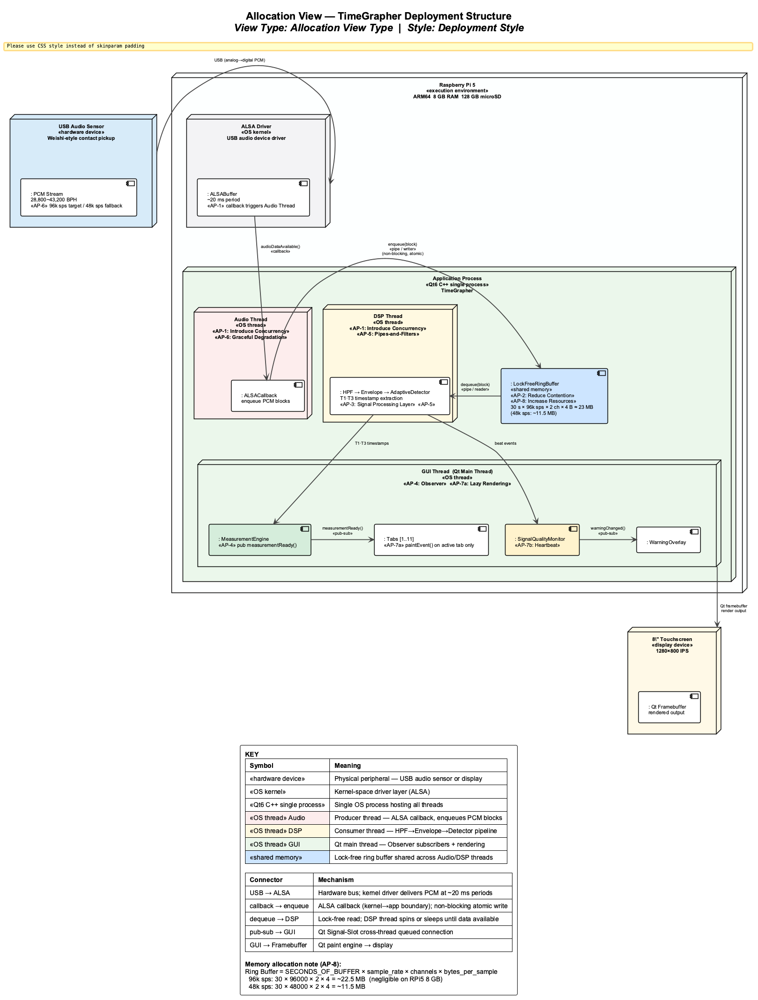
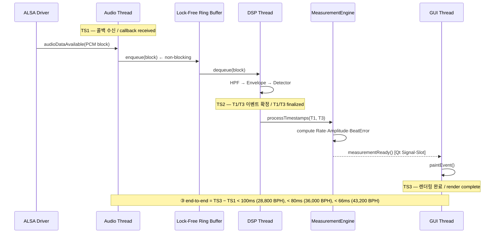
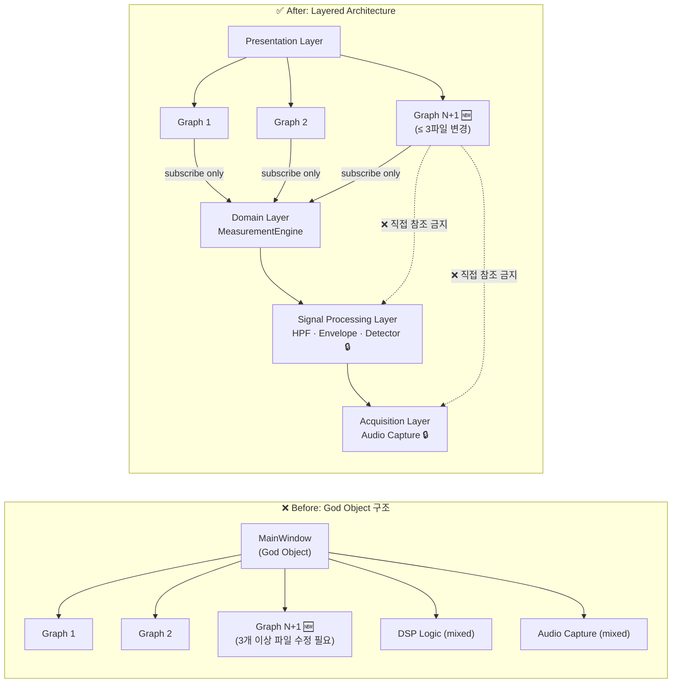
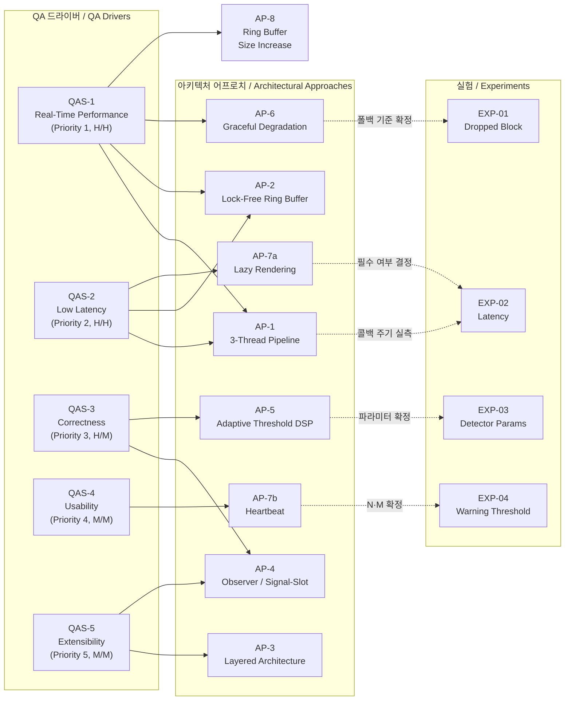

# 아키텍처 어프로치 / Architectural Approaches — TimeGrapher

**팀 / Team**: Blue Sky (3팀) | **마일스톤 / Milestone**: M1 | **작성일 / Date**: 2026-06-07

---

## 1. 아키텍처 개요 / Architecture Overview

### 1.1 시스템 목적과 구조적 제약 / System Purpose and Structural Constraints

> 프로젝트 목표 및 시스템 개요는 **[architectural-drivers.md §1 프로젝트 목표](architectural-drivers.md#1-프로젝트-목표--project-objectives)** 참조.
>
> Project objectives and system overview: see **[architectural-drivers.md §1 Project Objectives](architectural-drivers.md#1-프로젝트-목표--project-objectives)**.

**한국어** — 아키텍처 결정을 유발하는 구조적 제약:

| 제약 | 내용 | 아키텍처 영향 |
|------|------|------------|
| **하드웨어 제약** | Raspberry Pi 5 (ARM64, 8GB RAM) + USB 오디오 센서 | 오디오 캡처·DSP·GUI가 단일 프로세스에서 공유 CPU를 경쟁 → 스레드 분리 필수 |
| **개발 환경 제약** | Qt6 C++ 기반 (`TimeGrapher_v10.5` 코드베이스) | Qt Signal-Slot 메커니즘이 Observer 패턴의 자연스러운 구현 수단 |

**English** — Structural constraints that drive architectural decisions:

| Constraint | Detail | Architectural impact |
|------------|--------|---------------------|
| **Hardware constraint** | Raspberry Pi 5 (ARM64, 8GB RAM) + USB audio sensor | Audio capture, DSP, and GUI share CPU in a single process → thread separation is mandatory |
| **Development constraint** | Qt6 C++ (`TimeGrapher_v10.5` codebase) | Qt Signal-Slot mechanism is the natural implementation vehicle for the Observer pattern |

---

### 1.2 아키텍처 개요 다이어그램 / Architecture Overview Diagram

**한국어**

C&C View(Pipe-and-Filter + Pub-Sub)로 런타임 구조를 표현한다. 스레드 경계·커넥터 종류별로 적용된 아키텍처 어프로치(AP)를 주석으로 표시하며, 입력 소스는 Live(USB Mic) / Playback / Sim 세 가지 모드를 지원한다.

**English**

The C&C View (Pipe-and-Filter + Pub-Sub) describes the runtime structure. Each thread boundary and connector is annotated with the architectural approach (AP) applied at that point. Three input source modes are supported: Live (USB Mic), Playback, and Sim.

> 소스 파일 / Source file: [`assets/cc-view.puml`](assets/cc-view.puml)

| 색상 / Color | 의미 / Meaning |
|:---:|---|
| 🔴 연분홍 | Audio Thread — «AP-1: Introduce Concurrency», «AP-6: Graceful Degradation (96k→48k sps)» |
| 🟡 연황색 | DSP Thread — «AP-1: Introduce Concurrency», «AP-5: Pipes-and-Filters» |
| 🟢 연초록 | GUI Thread |
| 🔵 파랑 | Lock-Free Ring Buffer — «AP-2: Reduce Resource Contention», «AP-8: Increase Resources» |
| 🟩 진초록 | MeasurementEngine — «AP-4: Observer» 단일 발행 소스 |
| 🟠 주황 | SignalQualityMonitor — «AP-7b: Heartbeat» |
| 🟡 노랑 | 파라미터 미결 ⚠ — 전략 확정, 수치는 실험 후 확정 |

> **커넥터 읽는 법 / Reading connectors**: 실선(→) = 데이터 흐름 (동기 파이프 또는 비동기 Qt Signal-Slot)

---

### 1.3 배포 구조 다이어그램 / Deployment Structure Diagram

**한국어**

Allocation View(Deployment Style)로 스레드가 RPi5 하드웨어에 매핑되는 방식을 표현한다. AP-1(스레드 분리)·AP-2(Lock-Free Buffer)·AP-8(메모리 할당)의 하드웨어 제약 근거를 보여준다.

**English**

The Allocation View (Deployment Style) shows how threads map onto RPi5 hardware. It provides the hardware-constraint rationale for AP-1 (thread separation), AP-2 (Lock-Free Buffer), and AP-8 (memory allocation).

> 소스 파일 / Source file: [`assets/allocation-view.puml`](assets/allocation-view.puml)

---

### 1.4 레이어 책임 정의 / Layer Responsibility Definition

**한국어**

| 계층 / Layer | 책임 / Responsibility | 참조 허용 / May Reference |
|:------------:|----------------------|--------------------------|
| **Acquisition** | USB 오디오 입력 → PCM 샘플 → Ring Buffer 공급 | 없음 (최하위) |
| **Signal Processing** | HPF → Envelope → Detector → T1/T3 타임스탬프 추출 | Acquisition (Ring Buffer만) |
| **Domain** | T1/T3 타임스탬프 → Rate·Amplitude·Beat Error 계산, Measurement 발행 | Signal Processing (T1/T3만) |
| **Presentation** | GUI 렌더링, Observer 구독, 경고 표시 | **Domain Layer만** (MeasurementEngine 인터페이스) |

> **핵심 규칙**: Presentation Layer는 Signal Processing / Acquisition 레이어를 **직접 참조할 수 없다.** 이 규칙을 위반하면 QAS-5 Extensibility 목표(≤ 3파일 변경) 달성 불가.

**English**

| Layer | Responsibility | May Reference |
|:-----:|---------------|:-------------:|
| **Acquisition** | USB audio input → PCM samples → Ring Buffer supply | None (lowest layer) |
| **Signal Processing** | HPF → Envelope → Detector → T1/T3 timestamp extraction | Acquisition (Ring Buffer only) |
| **Domain** | T1/T3 timestamps → Rate·Amplitude·Beat Error computation, Measurement publication | Signal Processing (T1/T3 only) |
| **Presentation** | GUI rendering, Observer subscription, warning display | **Domain Layer only** (MeasurementEngine interface) |

> **Core rule**: Presentation Layer **must not directly reference** Signal Processing / Acquisition layers. Violating this rule makes QAS-5 Extensibility target (≤ 3-file change) unachievable.

**한국어**

아래 Module View(Layered Style)는 위 규칙을 시각화한다. 금지된 의존(❌ Forbidden)이 실선으로 표시되며, 이 의존이 존재할 경우 QAS-5 목표 달성 불가가 구조적으로 증명된다.

**English**

The Module View (Layered Style) below visualises the rule above. Forbidden dependencies (❌) are shown explicitly; their presence structurally prevents the QAS-5 ≤ 3-file target.

> 소스 파일 / Source file: [`assets/module-view.puml`](assets/module-view.puml)

---

## 2. 주요 아키텍처 어프로치 / Main Architectural Approaches

**한국어**

아키텍처 어프로치는 총 8개이며, 각각 하나 이상의 QA 드라이버에 직접 연결된다.

**English**

There are 8 architectural approaches in total; each directly addresses one or more QA drivers.

---

### AP-1: 3-스레드 파이프라인 (Concurrent Pipeline) / 3-Thread Pipeline

**한국어**

| 항목 / Item | 내용 / Detail |
|------------|--------------|
| **패턴 / Pattern** | Producer-Consumer Pipeline (Bass13 Performance Tactic #4 — Introduce Concurrency) |
| **구성 / Structure** | Audio Thread (생산자) → Lock-Free Ring Buffer → DSP Thread (소비자) → Qt Signal-Slot → GUI Thread |
| **적용 근거** | RPi 5의 단일 프로세스에서 오디오 캡처·DSP·GUI 렌더링이 동일 스레드에서 실행되면 캡처 콜백이 블로킹되어 Dropped Block 발생. 각 관심사를 독립 스레드로 분리하여 콜백 주기(~20ms) 보호 |
| **연결 드라이버** | QAS-1 (Real-Time Performance), QAS-2 (Low Latency) |

**English**

| Item | Detail |
|------|--------|
| **Pattern** | Producer-Consumer Pipeline (Bass13 Performance Tactic #4 — Introduce Concurrency) |
| **Structure** | Audio Thread (producer) → Lock-Free Ring Buffer → DSP Thread (consumer) → Qt Signal-Slot → GUI Thread |
| **Rationale** | Running audio capture, DSP, and GUI rendering in the same thread on RPi 5 causes callback blocking → Dropped Blocks. Separating each concern into an independent thread protects the callback period (~20 ms) |
| **Linked drivers** | QAS-1 (Real-Time Performance), QAS-2 (Low Latency) |

> **구간 정의 / Segment Definition**: ① = TS2−TS1 (capture→process, < 70ms), ② = TS3−TS2 (process→display, < 30ms), ③ = TS3−TS1 (end-to-end, < 100ms)

---

### AP-2: Lock-Free Ring Buffer

**한국어**

| 항목 / Item | 내용 / Detail |
|------------|--------------|
| **전술 / Tactic** | Reduce Resource Contention (Bass13 Performance Tactic #4) |
| **설명** | Audio Thread(생산자)와 DSP Thread(소비자) 사이의 뮤텍스를 제거하여 락 경합에 의한 DSP 처리 지연 방지. 원형 버퍼를 atomic 연산으로 구현 |
| **적용 근거** | 뮤텍스 대기가 발생하면 콜백 주기(~20ms)를 초과하여 Ring Buffer 오버플로(Dropped Block) 발생. Lock-Free 구조가 이 경로를 원천 차단 |
| **트레이드오프** | 구현 복잡도 ↑ (정확한 memory ordering 보장 필요). AP-1의 구현 패턴으로 AP-1과 함께 적용 |
| **연결 드라이버** | QAS-1 (Real-Time Performance — Dropped Block 방지), QAS-2 (Low Latency — ① 구간 보호) |

**English**

| Item | Detail |
|------|--------|
| **Tactic** | Reduce Resource Contention (Bass13 Performance Tactic #4) |
| **Description** | Eliminates mutex between Audio Thread (producer) and DSP Thread (consumer) to prevent DSP processing delays from lock contention; implements circular buffer via atomic operations |
| **Rationale** | Mutex waits can cause block period violations (~20 ms), leading to Ring Buffer overflow (Dropped Block). Lock-Free structure eliminates this failure path entirely |
| **Trade-off** | Higher implementation complexity (correct memory ordering required). Applied together with AP-1 as its implementation pattern |
| **Linked drivers** | QAS-1 (Real-Time Performance — prevents Dropped Block), QAS-2 (Low Latency — protects segment ①) |

---

### AP-3: Layered Architecture + Restrict Dependencies

**한국어**

| 항목 / Item | 내용 / Detail |
|------------|--------------|
| **패턴 / Pattern** | Layered Architecture + Restrict Dependencies (Bass13 Modifiability Tactic) |
| **설명** | 기존 God Object 구조를 4-계층 (Acquisition → Signal Processing → Domain → Presentation)으로 분리. Presentation Layer는 Domain Layer(MeasurementEngine 인터페이스)만 참조 가능 |
| **적용 근거** | God Object 구조에서는 그래프 1개 추가 시 여러 파일 수정 필요 → 병렬 개발 충돌. 레이어 분리 후 새 그래프는 Presentation Layer 내 파일 3개(위젯 신규 생성 + 탭 등록 + 구독 연결)만 변경 |
| **연결 드라이버** | QAS-5 (Extensibility — ≤ 3파일 목표) |

**English**

| Item | Detail |
|------|--------|
| **Pattern** | Layered Architecture + Restrict Dependencies (Bass13 Modifiability Tactic) |
| **Description** | Splits the existing God Object structure into 4 layers (Acquisition → Signal Processing → Domain → Presentation); Presentation Layer may only reference the Domain Layer (MeasurementEngine interface) |
| **Rationale** | In the God Object structure, adding each graph requires modifying multiple files → parallel development conflicts. After layer separation, adding a new graph only touches 3 files in the Presentation Layer (new widget + tab registration + subscription wiring) |
| **Linked drivers** | QAS-5 (Extensibility — ≤ 3-file target) |

> **정적 구조 뷰**: 레이어 경계와 금지된 의존 관계의 전체 그림은 **[§1.4 Module View](assets/module-view.png)** 참조.
>
> **Static structure view**: For the full picture of layer boundaries and forbidden dependencies, see **[§1.4 Module View](assets/module-view.png)**.

---

### AP-4: Observer 패턴 / Qt Signal-Slot (단일 데이터 소스) / Observer Pattern

**한국어**

| 항목 / Item | 내용 / Detail |
|------------|--------------|
| **패턴 / Pattern** | Observer (GoF) / Qt Signal-Slot |
| **설명** | MeasurementEngine이 단일 `Measurement` 구조체를 `measurementReady()` 시그널로 발행. 모든 11개 탭이 동일 시그널을 독립적으로 구독 |
| **적용 근거 (Correctness)** | 뷰가 독립적으로 값을 계산하면 계산 경로 차이로 뷰 간 값이 달라질 수 있음. Observer 패턴으로 단일 소스에서 발행된 동일 구조체를 모든 뷰가 구독하므로 일관성이 구조적으로 보장됨 |
| **적용 근거 (Extensibility)** | 새 그래프 추가 시 기존 로직을 수정할 필요 없이 구독만 추가하면 됨 (AP-3과 상보적) |
| **연결 드라이버** | QAS-3 QA-C1 (Correctness — 동일 데이터 소스), QAS-5 (Extensibility — 구독 추가만으로 확장) |

**English**

| Item | Detail |
|------|--------|
| **Pattern** | Observer (GoF) / Qt Signal-Slot |
| **Description** | MeasurementEngine publishes a single `Measurement` struct via `measurementReady()` signal; all 11 tabs independently subscribe to the same signal |
| **Rationale (Correctness)** | If views compute values independently, differing computation paths can cause inter-view divergence. Observer pattern ensures all views receive the same struct from a single source — consistency is structurally guaranteed |
| **Rationale (Extensibility)** | Adding a new graph only requires adding a subscription — no modification of existing logic (complementary to AP-3) |
| **Linked drivers** | QAS-3 QA-C1 (Correctness — same data source), QAS-5 (Extensibility — extend by subscription only) |

---

### AP-5: Adaptive Threshold DSP 파이프라인 / Adaptive Threshold DSP Pipeline

**한국어**

| 항목 / Item | 내용 / Detail |
|------------|--------------|
| **패턴 / Pattern** | Pipes and Filters (POSA) + Adaptive Threshold |
| **고정 결정** | DSP 파이프라인: Raw PCM → HPF (DC blocker ≥200 Hz) → Envelope (one-pole LPF) → Detector. Adaptive threshold 전략 채택 (이미 구현됨): `noise_floor` = 최근 256 ms 무음 구간 75th percentile, `reference_peak` = 최근 16 beat peak median |
| **미결 결정** | Detector 파라미터(`onset_fraction`=0.03, `min_peak_fraction`=0.20) 기본값이 소음 3조건에서 최적인지 검증 필요 → **EXP-03** |
| **트레이드오프** | `onset_fraction` 높이면 노이즈 차단↑ but 실제 beat onset missed. 낮추면 민감도↑ but false detection |
| **연결 드라이버** | QAS-3 QA-C2 (Correctness — 소음 환경 beat 감지 품질) |

**English**

| Item | Detail |
|------|--------|
| **Pattern** | Pipes and Filters (POSA) + Adaptive Threshold |
| **Fixed decisions** | DSP pipeline: Raw PCM → HPF (DC blocker ≥200 Hz) → Envelope (one-pole LPF) → Detector. Adaptive threshold strategy adopted (already implemented): `noise_floor` = 75th percentile of last 256 ms silence; `reference_peak` = median of last 16 beat peaks |
| **Open decision** | Whether default Detector parameters (`onset_fraction`=0.03, `min_peak_fraction`=0.20) are optimal under 3 noise conditions — confirmed by **EXP-03** |
| **Trade-off** | Higher `onset_fraction` → better noise rejection but may miss real beat onset. Lower → higher sensitivity but false detections |
| **Linked drivers** | QAS-3 QA-C2 (Correctness — beat detection quality under ambient noise) |

---

### AP-6: Graceful Degradation (SPS 폴백) / Graceful Degradation

**한국어**

| 항목 / Item | 내용 / Detail |
|------------|--------------|
| **전술 / Tactic** | Graceful Degradation (Bass13 Performance Tactic) |
| **설명** | EXP-01 결과 96k sps에서 Dropped Block > 0이 확인되면 48k sps로 자동 전환. 블록 주기를 ~10ms → ~20ms로 확장하여 DSP에 허용되는 처리 시간을 두 배로 늘림 |
| **트레이드오프** | T1 감지 분해능: 96k 시 10.4 µs/sample → 48k 시 20.8 µs/sample. 분해능 저하 대신 Dropped Block = 0 보장 |
| **잠정 상태** | ⚠️ 폴백 기준(96k 달성 가능 여부)은 **EXP-01** 결과로 확정 |
| **연결 드라이버** | QAS-1 (Real-Time Performance — Dropped Block = 0 보장) |

**English**

| Item | Detail |
|------|--------|
| **Tactic** | Graceful Degradation (Bass13 Performance Tactic) |
| **Description** | If EXP-01 confirms Dropped Block > 0 at 96k sps, auto-switch to 48k sps; block period expands from ~10 ms to ~20 ms, doubling the DSP time budget |
| **Trade-off** | T1 detection resolution degrades: 10.4 µs/sample at 96k → 20.8 µs/sample at 48k; resolution sacrificed to guarantee Dropped Block = 0 |
| **Provisional** | ⚠️ Fallback threshold (whether 96k is achievable) confirmed by **EXP-01** |
| **Linked drivers** | QAS-1 (Real-Time Performance — guarantees Dropped Block = 0) |

**한국어**

아래 상태 다이어그램은 폴백 결정 흐름을 보여준다. 96k sps → Dropped Block 감지 → 48k sps 전환은 단방향(비가역)이며, 세션 내 재전환 없이 안정성을 우선한다.

**English**

The state diagram below shows the fallback decision flow. The transition 96k sps → Dropped Block detected → 48k sps is one-way (non-reversible); stability is prioritised over peak resolution within a session.

> 소스 파일 / Source file: [`assets/ap6-state.puml`](assets/ap6-state.puml)

---

### AP-7: Lazy Rendering + Heartbeat 패턴 / Lazy Rendering + Heartbeat

**한국어**

#### AP-7a: Lazy Rendering

| 항목 / Item | 내용 / Detail |
|------------|--------------|
| **전술 / Tactic** | Manage Work Requests — 렌더링 스로틀링 (Bass13 Performance Tactic #3) |
| **설명** | 11개 탭 중 현재 활성 탭만 `paintEvent()`를 실행. 비활성 탭은 데이터만 업데이트하고 렌더링 보류 |
| **적용 근거** | 11탭 동시 렌더링 시 Qt 메인 스레드 부하로 ② process→display 구간이 30ms를 초과할 가능성 (TR-04). 비활성 탭을 스킵하면 렌더링 부하를 1탭 수준으로 감소 |
| **트레이드오프** | 비활성 탭 전환 시 순간적으로 오래된 값이 보일 수 있음 → EXP-02로 허용 수준 확인 |
| **잠정 상태** | ⚠️ Lazy Rendering 필수 여부는 **EXP-02** OI-L2 결과로 결정 |
| **연결 드라이버** | QAS-2 (Low Latency — ② process→display < 30ms) |

#### AP-7b: Heartbeat 패턴

| 항목 / Item | 내용 / Detail |
|------------|--------------|
| **패턴 / Pattern** | Heartbeat (재사용) |
| **설명** | 기존 A(T1)·C(T3) 이벤트를 heartbeat로 재사용. N초 동안 이벤트 미수신 → `⚠ No signal` 경고. noise/signal 비율 임계값 초과 → `⚠ Noisy signal` 경고. 정상 복귀 시 M초 후 자동 해제 |
| **적용 근거** | 별도 감지 로직을 추가하지 않고 기존 Detector 출력을 재활용 → 구현 비용 최소화 |
| **잠정 상태** | ⚠️ N·M 수치 및 noise/signal 임계값은 **EXP-04** 결과로 확정 |
| **연결 드라이버** | QAS-4 (Usability — 신호 품질 경고) |

**English**

#### AP-7a: Lazy Rendering

| Item | Detail |
|------|--------|
| **Tactic** | Manage Work Requests — rendering throttling (Bass13 Performance Tactic #3) |
| **Description** | Of 11 tabs, only the active tab executes `paintEvent()`; inactive tabs update data but defer rendering |
| **Rationale** | Simultaneous rendering of 11 tabs may overload the Qt main thread, pushing segment ② process→display beyond 30 ms (TR-04); skipping inactive tabs reduces rendering load to single-tab level |
| **Trade-off** | Momentarily stale values may appear on tab switch → EXP-02 confirms acceptable level |
| **Provisional** | ⚠️ Whether Lazy Rendering is mandatory decided by **EXP-02** OI-L2 result |
| **Linked drivers** | QAS-2 (Low Latency — process→display < 30 ms) |

#### AP-7b: Heartbeat Pattern

| Item | Detail |
|------|--------|
| **Pattern** | Heartbeat (reuse) |
| **Description** | Reuses existing A(T1)·C(T3) events as heartbeat. No beat event for N seconds → `⚠ No signal`. noise/signal ratio exceeds threshold → `⚠ Noisy signal`. Auto-cleared M seconds after signal recovers |
| **Rationale** | Reuses existing Detector output without additional detection logic → minimal implementation cost |
| **Provisional** | ⚠️ N·M values and noise/signal threshold confirmed by **EXP-04** |
| **Linked drivers** | QAS-4 (Usability — signal quality warning) |

---

### AP-8: Increase Resources (애플리케이션 Ring Buffer 크기 증설) / Increase Resources

**한국어**

| 항목 / Item | 내용 / Detail |
|------------|--------------|
| **전술 / Tactic** | Increase Resources (Bass13 Performance Tactic) |
| **설명** | 애플리케이션 Ring Buffer(`SECONDS_OF_BUFFER`)를 늘려 포그라운드 처리 지연 허용 시간을 확보. 현재 30초(96k sps 기준 약 11.5 MB). 파라미터 한 줄 변경만으로 크기 조정 가능 |
| **적용 근거** | Ring Buffer가 가득 차면 오래된 미처리 샘플이 덮어쓰여 Dropped Block 발생. 버퍼를 충분히 크게 유지하면 포그라운드가 일시적으로 지연되어도 샘플 손실 없이 따라잡을 수 있는 시간적 여유 제공 |
| **트레이드오프** | 메모리 증가 (RPi 5 8 GB 기준 부담 없음). 단, 버퍼가 과도하게 크면 시스템이 지속적으로 과부하 상태일 때 감지가 늦어지고 AP-6 폴백 결정이 지연됨 |
| **잠정 상태** | ⚠️ 최적 크기는 **EXP-01** 결과에서 실제 처리 지연 패턴을 확인한 후 결정. 현재 30초 기본값 유지 |
| **연결 드라이버** | QAS-1 (Real-Time Performance — 일시적 처리 지연 흡수) |

**English**

| Item | Detail |
|------|--------|
| **Tactic** | Increase Resources (Bass13 Performance Tactic) |
| **Description** | Increases the application Ring Buffer (`SECONDS_OF_BUFFER`) to provide more headroom for transient foreground processing delays. Currently 30 s (~11.5 MB at 96k sps). Size is adjustable by changing a single parameter |
| **Rationale** | When the Ring Buffer fills up, unprocessed samples are overwritten, causing Dropped Blocks. A sufficiently large buffer gives the foreground time to catch up after a temporary stall without sample loss |
| **Trade-off** | Memory increase (negligible on RPi 5 8 GB). However, an excessively large buffer delays detection of sustained overload and postpones the AP-6 fallback decision |
| **Provisional** | ⚠️ Optimal size determined after **EXP-01** reveals actual processing delay patterns. Default of 30 s retained until then |
| **Linked drivers** | QAS-1 (Real-Time Performance — absorbs transient processing delays) |

---

## 3. 설계 건전성 평가 / Design Soundness Assessment

**한국어**

설계가 구현을 안내하기에 충분한가? 각 어프로치의 확정 여부와 구현 준비 상태를 아래 기준으로 평가한다.

| 기준 / Criterion | 평가 / Assessment |
|:---------------:|:----------------:|
| ✅ **즉시 구현 가능** | 설계 결정이 확정되고 실험 의존성이 없음 |
| ⚠️ **조건부 구현 가능** | 핵심 구조는 결정되었으나, 파라미터/임계값이 실험으로 확정 필요 |
| 🔴 **구현 보류** | 실험 결과 없이 구현 방향 결정 불가 |

| AP | 어프로치 / Approach | 상태 | 근거 / Rationale |
|:--:|-------------------|:----:|----------------|
| AP-1 | 3-스레드 파이프라인 | ✅ | 스레드 분리 방향 확정. 구현 가능 |
| AP-2 | Lock-Free Ring Buffer | ✅ | 뮤텍스 제거 구조 확정. 구현 가능 |
| AP-3 | Layered Architecture | ✅ | 4-계층 정의 + Restrict Dependencies 규칙 확정. 리팩터링 착수 가능 |
| AP-4 | Observer / Signal-Slot | ✅ | MeasurementEngine 단일 발행 구조 확정. 구현 가능 |
| AP-5 | Adaptive Threshold DSP | ⚠️ | 파이프라인 구조 확정. Detector 파라미터 최적값은 EXP-03 후 확정 |
| AP-6 | Graceful Degradation | ⚠️ | 폴백 로직 설계 확정. 48k 폴백 발동 기준은 EXP-01 후 확정 |
| AP-7a | Lazy Rendering | ⚠️ | 전술 방향 확정. 필수 적용 여부는 EXP-02 OI-L2 결과에 의존 |
| AP-7b | Heartbeat 패턴 | ⚠️ | 감지 구조 확정. N·M 수치 + 임계값은 EXP-04 후 확정 |
| AP-8 | Ring Buffer 크기 증설 | ⚠️ | 증설 방향 확정. 최적 크기는 EXP-01 처리 지연 실측 후 결정 |

**설계 건전성 결론**: 8개 어프로치 모두 **구조적 방향은 확정**되어 구현 착수 가능. 파라미터/임계값만 실험으로 확정 필요하며, Conservative 기본값(48k sps 폴백, 100ms 상한)으로 최소 동작을 보장한다.

**English**

Is the design sound enough to guide construction? Each approach is assessed on confirmation status and implementation readiness.

| Criterion | Assessment |
|:---------:|:----------:|
| ✅ **Immediately implementable** | Design decision confirmed, no experiment dependency |
| ⚠️ **Conditionally implementable** | Core structure decided; parameters/thresholds require experiment confirmation |
| 🔴 **Implementation on hold** | Implementation direction cannot be determined without experiment results |

| AP | Approach | Status | Rationale |
|:--:|----------|:------:|-----------|
| AP-1 | 3-Thread Pipeline | ✅ | Thread separation direction confirmed |
| AP-2 | Lock-Free Ring Buffer | ✅ | Mutex-free structure confirmed |
| AP-3 | Layered Architecture | ✅ | 4-layer definition + Restrict Dependencies rule confirmed; refactoring can begin |
| AP-4 | Observer / Signal-Slot | ✅ | Single MeasurementEngine publication structure confirmed |
| AP-5 | Adaptive Threshold DSP | ⚠️ | Pipeline structure confirmed; optimal Detector parameters confirmed after EXP-03 |
| AP-6 | Graceful Degradation | ⚠️ | Fallback logic design confirmed; 48k trigger threshold confirmed after EXP-01 |
| AP-7a | Lazy Rendering | ⚠️ | Tactic direction confirmed; mandatory application depends on EXP-02 OI-L2 |
| AP-7b | Heartbeat Pattern | ⚠️ | Detection structure confirmed; N·M values + thresholds confirmed after EXP-04 |
| AP-8 | Ring Buffer Size Increase | ⚠️ | Increase direction confirmed; optimal size confirmed after EXP-01 processing delay measurement |

**Soundness conclusion**: All 8 approaches have a **confirmed structural direction** — implementation can begin on all of them. Only parameters and thresholds require experimental confirmation; conservative defaults (48k sps fallback, 100 ms ceiling) guarantee minimum behavior regardless of experiment outcomes.

---

## 4. 드라이버 ↔ 어프로치 추적성 / Driver–Approach Traceability

**한국어**

QA 드라이버별로 지원하는 아키텍처 어프로치와 실험의 관계를 매핑한다.

**English**

Maps each QA driver to the architectural approaches that support it and the experiments that validate them.

**범례 / Legend**: 실선(→) = 드라이버를 지원하는 어프로치 / Solid: approach supports driver | 점선(-..->) = 실험이 어프로치 파라미터 확정 / Dashed: experiment confirms approach parameter

---

### 4.1 QAS별 지원 요약 / QA-by-QA Support Summary

**한국어**

| QA | 우선순위 | 지원 어프로치 | 지원 방식 | 미결 실험 |
|----|:------:|------------|---------|:--------:|
| **QAS-1** Real-Time Performance | 1 | AP-1, AP-2, AP-6, AP-8 | 스레드 분리로 캡처 콜백 보호 + Lock-Free로 DSP 지연 방지 + 폴백으로 Dropped Block = 0 보장 + Ring Buffer 증설로 일시적 처리 지연 흡수 | EXP-01 |
| **QAS-2** Low Latency | 2 | AP-1, AP-2, AP-7a | 3구간 분리 측정 가능 + ① 구간 하한 보호 + ② 구간 렌더링 부하 감소 | EXP-02 |
| **QAS-3** Correctness | 3 | AP-4 (QA-C1), AP-5 (QA-C2) | Observer로 단일 소스 구조적 보장 + Adaptive Threshold로 소음 환경 beat 감지 | EXP-03 |
| **QAS-4** Usability | 4 | AP-7b | Heartbeat 패턴으로 신호 소실/노이즈 즉시 감지 | EXP-04 |
| **QAS-5** Extensibility | 5 | AP-3, AP-4 | Layered Architecture로 ≤ 3파일 목표 + Observer로 구독 추가만으로 확장 | — |

**English**

| QA | Priority | Supporting Approaches | How | Open Experiment |
|----|:--------:|----------------------|-----|:--------------:|
| **QAS-1** Real-Time Performance | 1 | AP-1, AP-2, AP-6, AP-8 | Thread separation protects capture callback + Lock-Free prevents DSP delay + fallback guarantees Dropped Block = 0 + Ring Buffer increase absorbs transient processing delays | EXP-01 |
| **QAS-2** Low Latency | 2 | AP-1, AP-2, AP-7a | 3-segment measurability + segment ① lower bound protection + segment ② rendering load reduction | EXP-02 |
| **QAS-3** Correctness | 3 | AP-4 (QA-C1), AP-5 (QA-C2) | Observer structurally guarantees single source + Adaptive Threshold maintains beat detection under noise | EXP-03 |
| **QAS-4** Usability | 4 | AP-7b | Heartbeat pattern immediately detects signal loss / noise | EXP-04 |
| **QAS-5** Extensibility | 5 | AP-3, AP-4 | Layered Architecture enables ≤ 3-file target + Observer allows extension by subscription only | — |

---

## 5. 드라이버 지원 평가 / Driver Support Assessment

**한국어**

QA 드라이버별로 아키텍처가 얼마나 잘 지원하는지 평가한다.

**English**

Assesses how well the architecture supports each QA driver.

---

### QAS-1: Real-Time Performance

**한국어**

**지원 수준**: 구조적으로 충분, 실측 검증 필요

- AP-1(스레드 분리)이 캡처 콜백을 DSP/GUI로부터 격리하여 Dropped Block의 1차 방어선을 형성한다.
- AP-2(Lock-Free Ring Buffer)가 스레드 간 뮤텍스 경합을 제거하여 DSP 처리 지연의 2차 방어선을 형성한다.
- AP-8(Ring Buffer 크기 증설)이 포그라운드 처리가 일시적으로 지연될 때 샘플 손실 없이 따라잡을 수 있는 시간적 여유를 제공한다. 최적 크기는 EXP-01 후 결정.
- AP-6(Graceful Degradation)이 96k sps 달성 불가 시에도 48k sps 폴백으로 Dropped Block = 0을 보장하는 최후 방어선이 된다.

**미결 사항**: EXP-01 결과 없이는 96k sps 달성 가능 여부 및 Ring Buffer 최적 크기가 미확인. Conservative 기본값(48k 폴백, 30초 버퍼)으로 최소 목표는 보장 가능.

**English**

**Support level**: Structurally sufficient; empirical verification required

- AP-1 (thread separation) isolates the capture callback from DSP/GUI, forming the first line of defense against Dropped Blocks.
- AP-2 (Lock-Free Ring Buffer) eliminates mutex contention between threads, forming the second line of defense against DSP processing delays.
- AP-8 (Ring Buffer size increase) provides temporal headroom for the foreground to catch up after a transient processing stall without sample loss. Optimal size determined after EXP-01.
- AP-6 (Graceful Degradation) guarantees Dropped Block = 0 via 48k sps fallback even if 96k sps is unachievable — the last line of defense.

**Open item**: Whether 96k sps is achievable and the optimal Ring Buffer size cannot be confirmed without EXP-01. Conservative defaults (48k fallback, 30 s buffer) guarantee minimum target.

---

### QAS-2: Low Latency

**한국어**

**지원 수준**: 구조적으로 충분, 두 미결 사항 해소 필요

- AP-1(3-스레드 파이프라인)이 3구간 분리 측정 구조(TS1/TS2/TS3)를 가능하게 하여 병목 구간을 특정할 수 있다.
- AP-2(Lock-Free Ring Buffer)가 ① 구간(capture→process)의 하한을 OS 콜백 주기(~20ms)로 유지한다.
- AP-7a(Lazy Rendering)가 ② 구간(process→display)의 11탭 렌더링 부하를 1탭 수준으로 감소시킨다.

**미결 사항**: ① QAudioSource 라이브 캡처 콜백 주기(OI-L1), ② 11탭 렌더링 시 ② 구간이 30ms 이내인지(OI-L2) — 둘 다 EXP-02로 해소. 28,800 / 36,000 / 43,200 BPH 시계를 모두 보유하고 있으므로, EXP-02에서 28,800 BPH Primary 달성 확인 후 36,000 / 43,200 BPH Stretch 검증을 동일 세션에서 진행 가능.

**English**

**Support level**: Structurally sufficient; two open items need resolution

- AP-1 (3-thread pipeline) enables 3-segment measurement (TS1/TS2/TS3) so the bottleneck segment can be identified.
- AP-2 (Lock-Free Ring Buffer) preserves the lower bound of segment ① (capture→process) at the OS callback period (~20 ms).
- AP-7a (Lazy Rendering) reduces the 11-tab rendering load on segment ② (process→display) to a single-tab equivalent.

**Open items**: ① Actual QAudioSource live callback period (OI-L1), ② whether segment ② stays within 30 ms at 11 tabs (OI-L2) — both resolved by EXP-02. Since all three watches (28,800 / 36,000 / 43,200 BPH) are available, Stretch BPH verification can be run in the same EXP-02 session once the Primary (28,800 BPH) target is confirmed.

---

### QAS-3: Correctness

**한국어**

**지원 수준**: QA-C1은 구조적 보장 완료 / QA-C2는 실험 후 완성

- **QA-C1 (동일 데이터 소스)**: AP-4(Observer/Signal-Slot)로 MeasurementEngine 단일 발행 구조가 완성되면 모든 뷰 간 일관성이 구조적으로 보장됨. 실험 불필요.
- **QA-C2 (소음 환경 beat 감지)**: AP-5(Adaptive Threshold DSP)의 파이프라인 구조와 알고리즘은 확정. `onset_fraction`/`min_peak_fraction` 최적값이 EXP-03 후 확정되면 완성.

**English**

**Support level**: QA-C1 structurally guaranteed; QA-C2 complete after experiment

- **QA-C1 (same data source)**: Once AP-4 (Observer/Signal-Slot) is implemented, consistency across all views is structurally guaranteed — no experiment needed.
- **QA-C2 (noise-robust beat detection)**: AP-5 pipeline structure and algorithm are confirmed. Complete once optimal `onset_fraction`/`min_peak_fraction` values are confirmed by EXP-03.

---

### QAS-4: Usability

**한국어**

**지원 수준**: 구조 확정, 임계값 실험 필요

- AP-7b(Heartbeat)의 기존 A/C 이벤트 재활용 방식이 별도 로직 없이 신호 소실을 감지할 수 있어 구현 비용이 낮다.
- N·M 수치 및 noise/signal 임계값이 EXP-04 후 확정되면 QAS-4 Response Measure가 완성된다.
- 임계값 미확정으로 인한 오경보/미경보는 사용자 경험에만 영향 (QAS-3 Correctness와 독립).

**English**

**Support level**: Structure confirmed; threshold experiment needed

- AP-7b (Heartbeat) reuses existing A/C events for signal loss detection — low implementation cost with no additional detection logic.
- QAS-4 Response Measure is complete once N·M values and noise/signal threshold are confirmed by EXP-04.
- False alarms / missed warnings from unconfirmed thresholds affect only user experience (independent of QAS-3 Correctness).

---

### QAS-5: Extensibility

**한국어**

**지원 수준**: 구조적 완성 가능, 리팩터링 후 검증 필요

- AP-3(Layered Architecture)이 God Object를 4-계층으로 분리하면 새 그래프 추가 시 변경 파일이 Presentation Layer의 3개로 제한된다.
- AP-4(Observer)가 새 그래프의 구독 추가만으로 기존 로직 수정 없이 확장을 가능하게 한다.
- **리스크 TR-07**: God Object 분리 중 기존 그래프 회귀 위험. 증분 리팩터링 + 단위 테스트 기준값 확보로 완화.
- Observer 패턴 리팩터링 완료 후 신규 그래프 실제 추가 시 `git diff --stat`으로 ≤ 3파일 검증.

**English**

**Support level**: Structurally achievable; verification required after refactoring

- AP-3 (Layered Architecture) limits file changes to 3 Presentation Layer files when adding a new graph after God Object is decomposed into 4 layers.
- AP-4 (Observer) enables extension by subscription only — no modification of existing logic.
- **Risk TR-07**: Regression in existing graphs during God Object decomposition. Mitigated by incremental refactoring + pre-refactoring unit test baseline.
- Verified via `git diff --stat` showing ≤ 3 files changed when actually adding a new graph after Observer refactoring completes.

