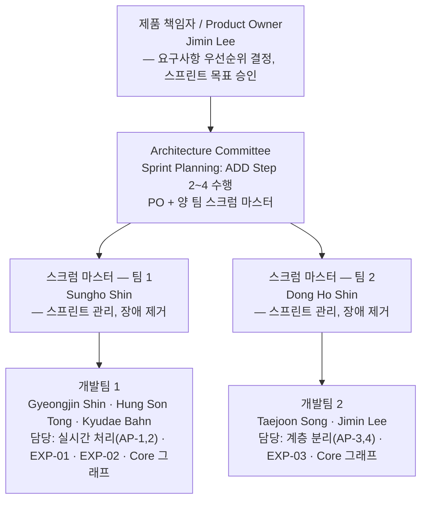
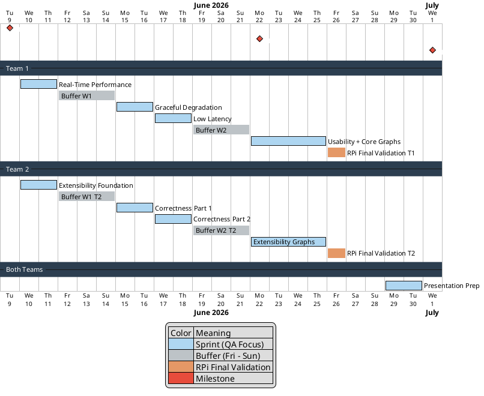

# 프로젝트 플랜 / Project Plan — TimeGrapher

**팀 / Team**: Blue Sky (3팀) | **마일스톤 / Milestone**: M1 | **작성일 / Date**: 2026-06-09

---

## 1. 프로젝트 목표 / Project Objectives

**한국어**

TimeGrapher는 기계식 시계의 음향 신호(beat noise)를 실시간으로 분석하여 **시계 수리에 필요한 측정 데이터를 정확하게 제공**하는 것을 목표로 한다.

시계 수리 과정에서 핵심은 Rate(일오차), Amplitude(진폭), Beat Error(좌우 비대칭) 세 지표가 정확한가의 여부다. 더 많은 종류의 시계를 지원하는 것보다, **지원하는 시계에 대해 수리 판단을 내릴 수 있는 수준의 정확도를 확보**하는 것이 우선이다.

**English**

The goal of TimeGrapher is to **provide accurate measurement data needed for watch repair** by analyzing acoustic signals (beat noise) from a mechanical watch's escapement in real time.

In watch repair, what matters is whether Rate (s/d), Amplitude (°), and Beat Error (ms) are correct. Rather than maximizing BPH coverage, the priority is to **achieve the level of accuracy required to make a repair decision** for the watches we support.

---

## 2. Agile 및 ADD 적용 / Applying Agile and ADD

### 2.1 적용 이유 / Rationale

**한국어**

**왜 Agile인가?**

5주라는 제한된 일정 안에 요구사항 불확실성이 높은 프로젝트를 진행해야 한다. 음향 신호 처리 파라미터(SPS, Detector threshold)나 하드웨어(RPi 5) 성능은 실제로 측정해보기 전까지 확정할 수 없다. 이런 조건에서 초기에 모든 것을 계획하고 순차 개발하는 방식(BDUF)은 리스크가 크다.

Agile의 핵심 가치인 **"계획보다 변화에 대한 대응"** 이 이 프로젝트에서 특히 중요하다:

- **짧은 이터레이션(2일 스프린트)**: 실험 결과가 나오는 즉시 다음 스프린트 방향에 반영
- **지속적 검토(Sprint Review)**: 각 스프린트 종료 시 동작하는 결과물을 검토하여 빠르게 방향 조정
- **팀 간 병렬 수행**: 팀 1·팀 2가 같은 기간에 서로 다른 QA에 집중하여 개발 속도 극대화

**왜 ADD(Attribute-Driven Design)인가?**

5주 안에 모든 QA를 동시에 만족시키는 것은 불가능하다. 중요한 QA부터 아키텍처를 결정하고 구현해야 일정 내에 핵심 목표를 달성할 수 있다.

ADD는 **Quality Attribute를 기준으로 아키텍처를 결정**하는 방법론이다:

- **Step 2**: 이번 스프린트에서 집중할 QA 드라이버를 선택
- **Step 3**: 해당 QA를 만족시킬 아키텍처 요소를 결정
- **Step 4**: 구체적인 Tactic/Pattern을 선택하고 인스턴스화 계획 수립
- **Step 5**: 구현 + 실험으로 가설 검증
- **Step 6**: 결과를 Architecture Decision Record(ADR)로 기록

이 방식을 통해 "측정 정확도의 전제 조건인 실시간 처리"를 먼저 해결하고, 이후 정확도·지연·확장성 순서로 QA를 쌓아갈 수 있다.

**English**

**Why Agile?**

This project must be completed within 5 weeks under high requirements uncertainty. Key parameters — audio signal processing (SPS, Detector threshold) and hardware (RPi 5) performance — cannot be determined without actual measurement. In this context, a Big Design Up Front (BDUF) approach with sequential development carries significant risk.

Agile's core value of **"responding to change over following a plan"** is especially relevant here:

- **Short iterations (2-day sprints)**: Experiment results feed directly into the next sprint's direction
- **Continuous review (Sprint Review)**: At every sprint end, working results are reviewed and course-corrected quickly
- **Parallel team execution**: Teams 1 & 2 focus on different QAs in the same period, maximizing development throughput

**Why ADD (Attribute-Driven Design)?**

Satisfying all QAs simultaneously within 5 weeks is not feasible. Architecture decisions must be made and implemented starting from the most critical QA — that is the only way to achieve the core objectives within the schedule.

ADD is a methodology that **drives architecture decisions from Quality Attributes**:

- **Step 2**: Select the QA driver to focus on for this sprint
- **Step 3**: Determine the architecture element responsible for satisfying that QA
- **Step 4**: Select and plan the instantiation of a specific tactic/pattern
- **Step 5**: Implement and run experiments to validate the hypothesis
- **Step 6**: Record the decision as an Architecture Decision Record (ADR)

This approach lets us first resolve real-time processing (the prerequisite for accuracy), then layer in correctness, low latency, and extensibility in dependency order.

---

## 3. 우리 팀 Agile 프로세스 / Our Team's Agile Process

### 3.1 팀 구조 / Team Structure

**한국어**

**English**

Two development teams run in parallel within the same sprint period, each focusing on a different QA driver. The Architecture Committee (PO + both Scrum Masters) meets at each Sprint Planning to apply ADD Steps 2–4 and make architecture decisions before development begins.

---

### 3.2 Agile 운영 규칙 / Agile Ceremonies & Rules

**한국어**

| 이벤트 / Event | 주기 | 참여 | 시간 |
|---|:---:|:---:|:---:|
| Sprint Planning (ADD Step 2–4) | 매 스프린트 시작 (2일마다) | Architecture Committee (PO + 양 팀 SM) | 1시간 |
| Sprint 개발 (ADD Step 5) | 2일 | 각 팀 독립 진행 | 2일 |
| Sprint Review & Retrospective (ADD Step 6) | 매 스프린트 종료 | 전체 팀 | 1시간 |
| Buffer | 매주 금요일 | 전체 팀 | 1일 |

**운영 원칙**:
- 양 팀은 같은 Period 안에서 **서로 다른 QA**에 집중 → 두 QA 트랙이 동시 진행
- Sprint Planning 1시간 = Architecture Committee의 ADD Step 2–4 수행
- Buffer는 실험 결과 통합, ADR 작성, 다음 스프린트 준비에 사용
- **Core 그래프(3개) 완성 전 Required·Stretch 착수 금지** — Core = 데모 생존선

**English**

| Event | Cadence | Participants | Duration |
|---|:---:|:---:|:---:|
| Sprint Planning (ADD Step 2–4) | Every sprint start (every 2 days) | Architecture Committee (PO + both SMs) | 1 hour |
| Sprint development (ADD Step 5) | 2 days | Each team independently | 2 days |
| Sprint Review & Retrospective (ADD Step 6) | Every sprint end | Full team | 1 hour |
| Buffer | Every Friday | Full team | 1 day |

**Operating principles**:
- Teams 1 & 2 focus on **different QAs** in the same Period — two QA tracks run in true parallel
- Sprint Planning 1 hour = Architecture Committee performs ADD Steps 2–4
- Buffer is used for experiment result integration, ADR writing, and next sprint prep
- **Do not start Required or Stretch until all 3 Core graphs are complete** — Core = demo survival threshold

---

### 3.3 스프린트 일정 / Sprint Schedule

**한국어**

QA 우선순위와 구현 의존성에 따라 5개 Period(각 2일)를 배분한다.

**English**

5 Periods (2 days each) are allocated based on QA priority and implementation dependency.

**스프린트 집중 배분 / Sprint QA Allocation**:

| Period | 날짜 | 팀 1 QA 집중 | 팀 2 QA 집중 | 마일스톤 |
|:------:|:----:|---|---|:---:|
| **P1** | 06/10–11 | **Real-Time Performance** | **Extensibility** Foundation | — |
| **P2** | 06/15–16 | Real-Time Performance (완료) | **Correctness** (Part 1) | — |
| **P3** | 06/17–18 | **Low Latency** | Correctness (완료) | — |
| **P4** | 06/22–23 | **Usability** + Core Graphs | **Extensibility** Graphs | **M2** |
| **P5** | 06/24–25 | RPi 통합 검증 | Graph 마무리 | — |

> 각 실험(EXP-01~05)의 상세 목표·완료 기준·선행 조건은 [`planned-experiments.md`](planned-experiments.md) 참조.
> QA 시나리오 및 Response Measure는 [`architectural-drivers.md`](architectural-drivers.md) 참조.
