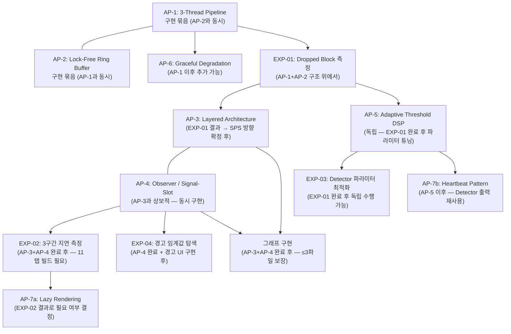
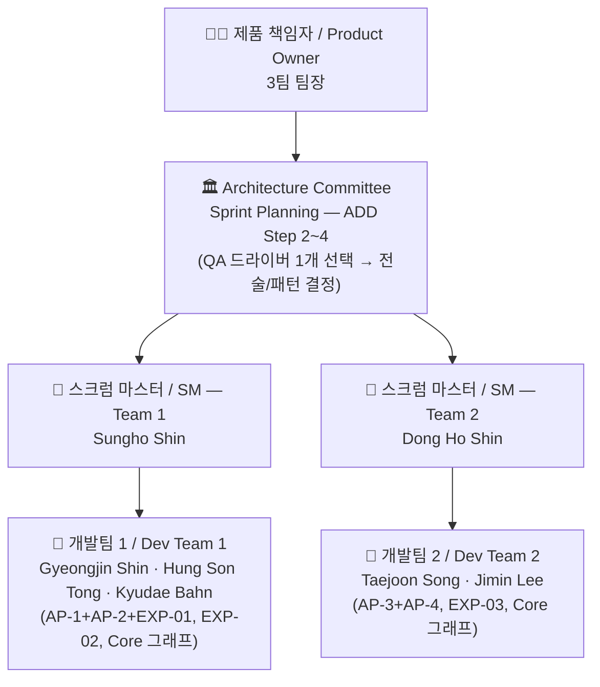

# 프로젝트 플랜 / Project Plan — TimeGrapher

**팀 / Team**: Blue Sky (3팀) | **마일스톤 / Milestone**: M1 | **작성일 / Date**: 2026-06-07

---

## 0. 이 문서의 구조 / Document Structure

**한국어**

이 문서는 아래 세 가지 요구사항에 순서대로 답한다.

1. 역할 분담과 구체적인 태스크, 마일스톤이 정의되어 있는가?
2. 전체 아키텍처를 기반으로 한 구현 태스크가 반영되어 있는가?
3. 계획된 기술 실험이 태스크에 반영되어 있는가?

**이 문서가 참조한 파일** — QA 분석 파일은 직접 참조하지 않으며, 아래 네 개의 최종 아키텍처 문서를 기준으로 작성한다.

| 파일 | 참조 내용 |
|------|---------|
| `docs/milestone1/final/architectural-drivers.md` | QAS-1~5, QA 우선순위, 기능 요구사항(FR-01~18), 미결 이슈(OI-*) |
| `docs/milestone1/final/risk-assessment.md` | TR-01~09, NTR-01~06, 액션 플랜 순서 |
| `docs/milestone1/final/planned-experiments.md` | EXP-01~05, 선행 조건 및 완료 기준 |
| `docs/milestone1/final/architectural-approaches.md` | AP-1~7, 구현 순서, 어프로치 간 상호작용 |

**English**

This document answers three requirements in order:

1. Are role assignments, specific tasks, and milestones defined?
2. Are construction tasks based on the overall architecture reflected?
3. Are planned technical experiments reflected in the tasks?

**Files referenced** — QA analysis files are not directly referenced; this document is written against the four final architecture documents above.

---

## 1. 개요 / Overview

**한국어**

본 문서는 TimeGrapher 프로젝트의 M1 기준 프로젝트 플랜이다.

**핵심 원칙**: ADD(Attribute-Driven Design) 기반 2일 스크럼 스프린트. 각 스프린트는 QA 드라이버 한 개에 집중하며, 팀 1 · 팀 2가 같은 QA 목표를 향해 서로 다른 태스크를 병렬로 수행한다.

**프로젝트 목표 (우선순위 순)**:

| 순위 | 목표 | 설명 |
|:---:|------|------|
| **1st** | 정확한 측정 | Rate / Amplitude / Beat Error를 정확하게 제공 — 정확도를 희생하고 BPH를 확장하는 선택은 하지 않는다 |
| **2nd** | BPH 범위 확대 | 정확도를 유지하면서 더 높은 BPH 시계까지 지원 |
| **3rd** | 확장 가능한 구조 | 11개 그래프를 5주 내 병렬 개발 가능한 구조 |
| **4th** | 아키텍처 원칙 실증 | CMU MSE 소프트웨어 아키텍처 설계 원칙 적용 |

**일정 개요**:

```
M1 제출 (06/09) → 구현 시작 (06/10) → M2 제출 (06/22) → RPi 최종 검증 (06/26) → M3 최종 데모 (07/01)
```

**English**

This document defines the Milestone 1 project plan for the TimeGrapher project.

**Core principle**: ADD (Attribute-Driven Design)-based 2-day Scrum sprints. Each sprint focuses on one QA driver; Team 1 and Team 2 run different tasks in parallel toward the same QA goal.

**Project objectives (in priority order)**:

| Rank | Objective | Description |
|:---:|-----------|-------------|
| **1st** | Accurate Measurement | Provide Rate / Amplitude / Beat Error accurately — sacrificing accuracy to cover more BPH is not acceptable |
| **2nd** | Wider BPH Coverage | Extend accurate support to higher BPH watches while preserving accuracy |
| **3rd** | Extensible Architecture | Enable parallel development of 11 graphs within 5 weeks |
| **4th** | Architecture Principles** | Apply CMU MSE software architecture design principles |

---

## 2. 역할 정의 / Role Definitions

**한국어**

| 역할 / Role | 담당자 / Assignee | 책임 / Responsibility |
|---|---|---|
| 제품 책임자 (Product Owner) | 3팀 팀장 (Team 3 Lead) | 요구사항 우선순위 결정, 스프린트 목표 승인 |
| 스크럼 마스터 — 팀 1 | Sungho Shin | 스프린트 진행 관리, 장애 제거, Architecture Committee 참여 |
| 스크럼 마스터 — 팀 2 | Dong Ho Shin | 스프린트 진행 관리, 장애 제거, Architecture Committee 참여 |
| 개발팀 1 | Gyeongjin Shin, Hung Son Tong, Kyudae Bahn | 기능 구현 및 실험 수행 |
| 개발팀 2 | Taejoon Song, Jimin Lee | 기능 구현 및 실험 수행 |

**English**

| 역할 / Role | 담당자 / Assignee | 책임 / Responsibility |
|---|---|---|
| Product Owner | Team 3 Lead | Prioritize requirements, approve sprint goals |
| Scrum Master — Team 1 | Sungho Shin | Manage sprint progress, remove blockers, join Architecture Committee |
| Scrum Master — Team 2 | Dong Ho Shin | Manage sprint progress, remove blockers, join Architecture Committee |
| Dev Team 1 | Gyeongjin Shin, Hung Son Tong, Kyudae Bahn | Feature implementation and experiments |
| Dev Team 2 | Taejoon Song, Jimin Lee | Feature implementation and experiments |

---

## 3. 애자일 운영 방식 / Agile Ceremonies

**한국어**

| 이벤트 / Event | 주기 / Cadence | 참여자 / Participants | 시간 / Duration |
|---|---|---|---|
| 스프린트 계획 회의 (Sprint Planning) | 매 스프린트 시작 (2일마다) | Architecture Committee (양 팀 SM + PO) | 1시간 |
| 스프린트 개발 (Sprint) | 2일 | 각 팀 독립 진행 | 2일 |
| 스프린트 리뷰 & 회고 (Review & Retrospective) | 매 스프린트 종료 | 전체 팀 | 1시간 |
| 버퍼 (Buffer) | 매주 금요일 | 전체 팀 | 1일 |

**Architecture Committee 역할**: Sprint Planning 1시간 = ADD Step 2~4 수행.
- **Step 2**: 이번 스프린트에서 집중할 QA 드라이버 선택
- **Step 3**: 해당 QA를 주소할 아키텍처 요소 분해 대상 결정
- **Step 4**: 전술(Tactic)/패턴(Pattern) 선택 및 인스턴스화 계획 수립

양 팀은 동일한 QA 스프린트 목표를 공유하되, 태스크 배분은 Architecture Committee에서 결정한다.

**English**

| 이벤트 / Event | 주기 / Cadence | 참여자 / Participants | 시간 / Duration |
|---|---|---|---|
| Sprint Planning | Every sprint start (every 2 days) | Architecture Committee (both SMs + PO) | 1 hour |
| Sprint (Development) | 2 days | Each team independently | 2 days |
| Sprint Review & Retrospective | Every sprint end | Full team | 1 hour |
| Buffer | Every Friday | Full team | 1 day |

**Architecture Committee role**: The 1-hour Sprint Planning performs ADD Steps 2–4:
- **Step 2**: Select the QA driver to focus on this sprint
- **Step 3**: Decide the architecture element to decompose for that QA
- **Step 4**: Select and plan instantiation of tactics/patterns

Both teams share the same QA sprint goal; task allocation is decided by the Architecture Committee.

---

## 4. ADD ↔ Agile 매핑 / ADD–Agile Mapping

**한국어**

```
Sprint Planning (1h)    = ADD Step 2~4: QA 드라이버 선택 → 분해 대상 → Tactic/Pattern 선택
Sprint 개발 (2일)        = ADD Step 5:  요소 인스턴스화 + 책임 할당 (구현 + 실험)
Sprint Review (1h)      = ADD Step 6:  Views 스케치 + 설계 결정 기록 (ADR)
다음 Sprint              = ADD "다음 Iteration": Step 2로 복귀하여 다음 QA 드라이버 선택
```

**ADD QA 집중 원칙**: 각 스프린트는 QA 드라이버 한 개에 집중한다. 구현 의존성(실험 선행 조건, 어프로치 간 순서)에 따라 집중 순서가 결정되며, 중요도가 같아도 구현 순서는 달라질 수 있다.

**English**

```
Sprint Planning (1h)    = ADD Step 2–4: Select QA driver → decomposition target → tactic/pattern
Sprint development (2d)  = ADD Step 5:  Element instantiation + responsibility allocation (impl + experiment)
Sprint Review (1h)      = ADD Step 6:  Views sketch + record design decisions (ADR)
Next Sprint              = ADD "Next Iteration": return to Step 2 for next QA driver
```

**ADD QA focus principle**: Each sprint concentrates on one QA driver. The focus order is determined by implementation dependency (experiment prerequisites, cross-approach ordering), not importance alone.

---

## 5. 아키텍처 기반 구현 태스크 / Architecture-Based Construction Tasks

**한국어**

TimeGrapher의 구현은 7개 아키텍처 어프로치(AP-1~7)를 기반으로 한다. 아키텍처 어프로치 간 상호작용이 구현 순서를 결정한다.

### 5.1 어프로치 구현 순서 / Implementation Order



### 5.2 레이어별 구현 태스크 / Layer-by-Layer Tasks

**한국어**

| 계층 / Layer | 어프로치 / AP | 핵심 태스크 / Key Tasks | 목표 QA | 구현 상태 |
|:------:|:--------:|------------------------|---------:|:-------:|
| **Acquisition** | AP-1, AP-2 | Audio Thread 분리, Lock-Free Ring Buffer 구현 (`atomic` 기반) | QAS-1, QAS-2 | 🔴 미구현 |
| **Acquisition** | AP-6 | Graceful Degradation: 96k→48k sps 자동 폴백 로직 (EXP-01 후 기준 확정) | QAS-1 | 🔴 미구현 |
| **Signal Processing** | AP-5 | HPF → Envelope → Detector 파이프라인 확인, Adaptive Threshold 파라미터 튜닝 (EXP-03 후) | QAS-3 QA-C2 | ⚠️ 부분 구현 |
| **Domain** | AP-4 | MeasurementEngine 단일 `Measurement` 구조체 발행, `measurementReady()` Signal-Slot | QAS-3 QA-C1, QAS-5 | 🔴 미구현 |
| **Domain** | AP-7b | Signal Quality Monitor (Heartbeat 패턴 — A/C 이벤트 재활용, EXP-04 후 N·M 확정) | QAS-4 | 🔴 미구현 |
| **Presentation** | AP-3 | God Object → 4-계층 분리 (Restrict Dependencies 규칙: Presentation → Domain만) | QAS-5 | 🔴 미구현 |
| **Presentation** | AP-7a | Lazy Rendering: 현재 탭만 `paintEvent()` 실행 (EXP-02 OI-L2 결과 기반) | QAS-2 | 🔴 미구현 |
| **Presentation** | AP-3, AP-4 | Core / Required / Stretch 그래프 구현 (≤3파일 변경 규칙 준수) | QAS-5 | 🔴 미구현 |

**English**

| Layer | AP | Key Tasks | Target QA | Status |
|:-----:|:--:|----------|:---------:|:------:|
| **Acquisition** | AP-1, AP-2 | Separate Audio Thread, implement Lock-Free Ring Buffer (`atomic`-based) | QAS-1, QAS-2 | 🔴 Not impl. |
| **Acquisition** | AP-6 | Graceful Degradation: auto-fallback 96k→48k sps (trigger threshold confirmed by EXP-01) | QAS-1 | 🔴 Not impl. |
| **Signal Processing** | AP-5 | Verify HPF → Envelope → Detector pipeline, tune Adaptive Threshold params (after EXP-03) | QAS-3 QA-C2 | ⚠️ Partial |
| **Domain** | AP-4 | MeasurementEngine publishes single `Measurement` struct via `measurementReady()` Signal-Slot | QAS-3 QA-C1, QAS-5 | 🔴 Not impl. |
| **Domain** | AP-7b | Signal Quality Monitor (Heartbeat pattern — reuses A/C events; N·M confirmed by EXP-04) | QAS-4 | 🔴 Not impl. |
| **Presentation** | AP-3 | God Object → 4-layer separation (enforce Restrict Dependencies: Presentation → Domain only) | QAS-5 | 🔴 Not impl. |
| **Presentation** | AP-7a | Lazy Rendering: only active tab executes `paintEvent()` (based on EXP-02 OI-L2 result) | QAS-2 | 🔴 Not impl. |
| **Presentation** | AP-3, AP-4 | Core / Required / Stretch graph implementation (enforce ≤3-file change rule) | QAS-5 | 🔴 Not impl. |

---

## 6. 그래프 우선순위 분류 / Graph Priority Classification

**한국어**

NTR-05 (스코프 과잉 리스크)와 OI-07 (그래프 우선순위 미분류)를 해소하기 위해 12개 그래프 항목(FR-05~18)을 Core / Required / Stretch 세 등급으로 분류한다. 이 분류는 프로젝트 목표 우선순위와 직접 연동된다.

**분류 기준**:

| 등급 | 기준 | 목표 연결 |
|------|------|---------|
| **Core** | QAS-3 Correctness (H)·QAS-1 Real-Time (H)와 직결. M3 데모에서 WeiShi 비교·측정 안정성 증명에 필수 | 1st: 정확한 측정 |
| **Required** | QAS-4 Usability (M)·QAS-5 Extensibility (M) 연결. 데모 완성도 향상 및 확장성 증거 제공 | 3rd: 확장 가능 구조 |
| **Stretch** | QAS-5 시각화 추가·BPH 확장 시나리오. 시간 여유 시 추가 | 2nd: BPH 범위 확대 |

**등급별 구현 목록** (FR-05~18 전체 18개 FR 기반, Sprint 1 Planning에서 최종 확정):

| 등급 | 그래프 / 기능 | 연결 FR | 연결 QA | M2 필수 |
|:----:|-------------|:------:|:-------:|:------:|
| **Core** | Trace Display (Rate + Amplitude 실시간 기록) | FR-05 | QAS-3 QA-C1 | ✅ |
| **Core** | Beat Error Display & Diagnostic Trace | FR-07 | QAS-3 QA-C1, QAS-2 | ✅ |
| **Core** | Rate & Amplitude Stability / Vario | FR-06 | QAS-3 QA-C1, QAS-1 | ✅ |
| **Required** | Signal Quality Warning UI (`⚠ No signal` / `⚠ Noisy signal`) | FR-08 | QAS-4 | ✅ |
| **Required** | Beat-Noise Scope (Scope 1 & 2) | FR-11 | QAS-5 Extensibility 증거 | ✅ |
| **Required** | Watch-Position Testing | FR-10 | QAS-4, QAS-5 | ✅ |
| **Required** | Multi-Position Sequence Display | FR-12 | QAS-5 | ✅ |
| **Stretch** | Pause + 시간축 탐색 | FR-09 | QAS-5 | ❌ |
| **Stretch** | Long-Term Performance Graph | FR-13 | QAS-5 / 2nd goal | ❌ |
| **Stretch** | Escapement Analyzer & Marker-Line Display | FR-14 | QAS-5 | ❌ |
| **Stretch** | Time-Frequency Spectrogram Display | FR-15 | QAS-5 | ❌ |
| **Stretch** | Waveform Comparison Display | FR-16 | QAS-5 | ❌ |
| **Stretch** | Scope Mode with Synchronized Sweep | FR-17 | QAS-5 | ❌ |
| **Stretch** | Scope Function with Multiple Filter Views | FR-18 | QAS-5 | ❌ |

> **완료 기준 원칙**: Core 3개 미완성 시 Required·Stretch 착수 금지. Core = 데모 생존선.

**English**

To resolve NTR-05 (scope overextension risk) and OI-07 (graph priority unclassified), the 12 graph/feature items (FR-05~18) are categorized into three tiers: Core / Required / Stretch. This classification maps directly to project goal priority.

**Classification criteria**:

| Tier | Criteria | Goal alignment |
|------|----------|---------------|
| **Core** | Directly linked to QAS-3 Correctness (H) and QAS-1 Real-Time (H); mandatory for WeiShi comparison and measurement stability proof at M3 demo | 1st: Accurate Measurement |
| **Required** | Linked to QAS-4 Usability (M) and QAS-5 Extensibility (M); enhances demo completeness and provides extensibility evidence | 3rd: Extensible Architecture |
| **Stretch** | Additional QAS-5 visualizations and BPH-extension scenarios; added if time permits | 2nd: Wider BPH Coverage |

> **Completion principle**: Do not start Required or Stretch until all 3 Core graphs are complete. Core = demo survival threshold.

---

## 7. QA 우선순위 및 스프린트 집중 순서 / QA Priority and Sprint Focus

**한국어**

| 순위 / Rank | QA | Business Imp. | Tech Risk | **우선순위** | 집중 스프린트 | 연결 AP |
|:-----------:|----| :-----------:| :-------:| :--------:| :---------: |--------|
| 1 | Real-Time Performance | H | H | **H** | **P1** — 팀 1 | AP-1, AP-2, AP-6 |
| 2 | Correctness | H | M | **H** | **P2~P3** — 팀 2 | AP-4, AP-5, EXP-03 |
| 3 | Low Latency | H | H | **H** | **P3** — 팀 1 | AP-7a, EXP-02 |
| 4 | Extensibility | M | M | **M** | **P1~P4** — 팀 2 (AP-3·AP-4 기반) + 그래프 구현 | AP-3, AP-4 |
| 5 | Usability | M | M | **M** | **P4~P5** — 팀 1 | AP-7b, EXP-04 |

> **스프린트 Period(P)**: 2개 팀이 동시에 수행하는 2일 기간. P1~P5 총 5회. 팀별로 다른 QA에 집중하므로 같은 Period 내 QA 트랙이 2개 동시 진행된다.

> **스프린트 집중 순서 결정 이유**: Real-Time Performance → Low Latency → Correctness 순서는 "구현 선행 의존성"에 따른 것이다. Dropped Block이 없어야(QAS-1) 지연을 측정할 수 있고(QAS-2), 실시간 시스템이 동작해야(QAS-1+2) 측정 정확도를 검증할 수 있다(QAS-3). Extensibility(AP-3+AP-4 리팩터링)는 QAS-5이지만 모든 그래프 구현의 선행 조건이므로 Sprint 2~3에서 병행 착수한다.

**English**

| Rank | QA | Business Imp. | Tech Risk | **Priority** | Focus Sprints | Linked AP |
|:----:|----| :----------:| :------:| :--------:| :---------:|-----------|
| 1 | Real-Time Performance | H | H | **H** | **P1** — Team 1 | AP-1, AP-2, AP-6 |
| 2 | Correctness | H | M | **H** | **P2~P3** — Team 2 | AP-4, AP-5, EXP-03 |
| 3 | Low Latency | H | H | **H** | **P3** — Team 1 | AP-7a, EXP-02 |
| 4 | Extensibility | M | M | **M** | **P1~P4** — Team 2 + graph impl. | AP-3, AP-4 |
| 5 | Usability | M | M | **M** | **P4~P5** — Team 1 | AP-7b, EXP-04 |

> **Sprint Period (P)**: A 2-day window in which both teams run concurrently. P1–P5 = 5 periods total. Each team focuses on a different QA within the same period — two QA tracks run in true parallel.

> **Sprint ordering rationale**: The Real-Time → Low Latency → Correctness sequence follows *implementation prerequisite dependency*, not importance rank. Zero Dropped Blocks (QAS-1) is required to measure latency (QAS-2), and a real-time pipeline (QAS-1+2) must exist before measurement accuracy (QAS-3) can be verified. Extensibility (AP-3+AP-4 refactoring) is QAS-5 but is a prerequisite for all graph construction — so it is started in parallel from Sprint 2–3.

---

## 8. 스프린트 계획 / Sprint Schedule

**한국어**

총 **10 스프린트** (팀 1 · 팀 2 각 5회, 동기간 병렬 수행) × 2일 + 3일 버퍼. M1 제출 후 구현 시작: 06/10.
**팀 1 · 팀 2는 동일 기간에 각자 다른 QA/FR에 집중한다. 같은 스프린트 Period 내에서도 팀별 집중 QA가 다를 수 있다.**

**English**

Total **10 sprints** (Teams 1 & 2 each run 5 sprints, concurrent per period) × 2 days + 3 buffer days. Construction starts 06/10 (after M1 submission 06/09).
**Teams 1 & 2 each focus on a different QA/FR within the same sprint period — truly parallel QA tracks.**


---

### Period 1 (06/10 Wed ~ 06/11 Thu)

#### T1-S1 — QA 집중: QAS-1 Real-Time Performance

> **ADD Step 2**: QAS-1 Real-Time Performance (Priority 1, H/H)  
> **ADD Step 3**: Acquisition Layer (Audio Thread + Ring Buffer)  
> **ADD Step 4**: AP-1 (3-Thread Pipeline) + AP-2 (Lock-Free Ring Buffer) + EXP-01  
> **커버 FR**: FR-03 (Live/Playback/Sim 모드) 검증 포함

**Architecture Committee 결정 사항**

| 결정 ID | 결정 내용 | 해결 QA | 의존 실험 |
|--------|---------|:------:|:-------:|
| ADD-P1T1-01 | Audio Thread 분리 구조 확정 + Ring Buffer 인터페이스 정의 | QAS-1 | — |
| ADD-P1T1-02 | Lock-Free Ring Buffer 크기 결정 (sps별 블록 주기 기반) | QAS-1 | EXP-01 결과 후 조정 |
| ADD-P1T1-03 | Graceful Degradation 폴백 기준 잠정 설정 (48k sps 보수적 기본값) | QAS-1 | EXP-01 결과로 확정 |

**팀 1 태스크**

| 태스크 | 내용 | 완료 기준 |
|--------|------|---------|
| AP-1 구현 | `QThread` 기반 Audio Thread 분리 | 3-Thread 구조 RPi에서 동작 확인 |
| AP-2 구현 | `std::atomic` head/tail Lock-Free Ring Buffer | overflow 없이 데이터 순환 전달 |
| EXP-01 실행 | 48k/96k/192k sps × 10분 Dropped Block 측정 | sps별 Dropped Block 수치 확정 |
| TR-01 완화 | 48k 폴백 코드 준비 | `SCHED_RR` 적용 전·후 비교 |

#### T2-S1 — QA 집중: QAS-5 Extensibility Foundation (AP-3)

> **ADD Step 2**: QAS-5 Extensibility — God Object 분리 착수  
> **ADD Step 3**: Presentation Layer 경계 설계  
> **ADD Step 4**: AP-3 (Layered Architecture) 설계 및 증분 리팩터링 착수  
> **커버 FR**: FR-01~04 레이어 재배치 준비

**팀 2 태스크**

| 태스크 | 내용 | 완료 기준 |
|--------|------|---------|
| ADD-P1T2-01 | 4-계층 경계 설계: Acquisition / Signal Processing / Domain / Presentation | 계층 다이어그램 + 의존 방향 문서화 |
| AP-3 착수 | God Object 분리 — Acquisition Layer 분리 (증분 1단계) | 기존 기능 회귀 없이 Acquisition 분리 완료 |
| TR-07 완화 | 리팩터링 전 Rate·Amplitude·Beat Error 기준값 기록 | baseline 수치 문서화 |
| Restrict Dependencies | Presentation → Domain만 참조 허용 규칙 정의 | 규칙 문서 + 위반 탐지 방법 확정 |

**P1 리뷰 목표**: EXP-01 결과 확보 (Dropped Block 수치). AP-1+AP-2 기본 동작 확인. 4-계층 경계 설계 완료.

---

### Buffer W1 (06/12 Fri) — EXP-01 결과 분석 + ADD Step 6

**양 팀 공동 수행**

| 항목 | 내용 |
|------|------|
| EXP-01 결과 통합 | 48k/96k/192k Dropped Block 수치 → QAS-1 Response Measure 확정 (OI-P1 해소) |
| ADD Step 6 | P1 아키텍처 결정 기록 (ADR): SPS 확정값, AP-1/AP-2 구조, 4-계층 경계 결정 |
| AP-6 결정 | EXP-01 기반 Graceful Degradation 폴백 기준 확정 (96k 달성 여부 → 48k 발동 조건) |
| P2 Sprint Planning | Architecture Committee: P2 QA 드라이버 배분 확정 (팀 1 = AP-6, 팀 2 = AP-4+EXP-03) |

---

### Period 2 (06/15 Mon ~ 06/16 Tue)

#### T1-S2 — QA 집중: QAS-1 완료 + AP-6 Graceful Degradation

> **ADD Step 2**: QAS-1 마무리 — Graceful Degradation 구현  
> **ADD Step 3**: Acquisition Layer — AP-6 폴백 로직  
> **ADD Step 4**: AP-6 (Graceful Degradation) + FR-03 운영 모드 최종 검증  
> **커버 FR**: FR-03 (Live/Playback/Sim), FR-04 (HPF 완성)

**팀 1 태스크**

| 태스크 | 내용 | 완료 기준 |
|--------|------|---------|
| AP-6 구현 | EXP-01 확정값 기반 96k→48k 자동 폴백 로직 구현 | 폴백 발동 시 Dropped Block = 0 확인 |
| FR-04 완성 | Envelope Detector 추가 (HPF만 → HPF+Envelope) | FR-04 ⚠️ → ✅ |
| QAS-1 검증 | 5분 연속 실행 Dropped Block = 0 | QAS-1 Response Measure Pass |

#### T2-S2 — QA 집중: QAS-3 Correctness 착수 + AP-4

> **ADD Step 2**: QAS-3 Correctness — MeasurementEngine + EXP-03 착수  
> **ADD Step 3**: Domain Layer — Signal-Slot 구조  
> **ADD Step 4**: AP-4 (Observer/Signal-Slot) + EXP-03 Part 1  
> **커버 FR**: FR-02 (Rate/Amplitude/Beat Error 계산 정확도)

> ⚠️ **TR-07 리스크**: God Object 분리는 기존 기능 회귀 위험. 리팩터링 전 기준값 수집 필수.

**팀 2 태스크**

| 태스크 | 내용 | 완료 기준 |
|--------|------|---------|
| AP-3 완성 | God Object 분리 — Signal Processing + Domain Layer 분리 완료 | Restrict Dependencies 위반 0건 |
| AP-4 구현 | MeasurementEngine: 단일 `Measurement` 구조체 + `measurementReady()` Signal-Slot | 11개 탭 구독 연결 가능한 구조 |
| EXP-03 Part 1 | 저소음 환경 baseline: 기본 파라미터로 Rate·Amplitude·Beat Error 30회 측정 | baseline 수치 문서화 |
| EXP-03 설계 | 격자 탐색 설계 (`onset_fraction` × `min_peak_fraction` 조합 스케줄링) | 탐색 행렬 정의 완료 |

**P2 리뷰 목표**: QAS-1 Response Measure Pass (Dropped Block = 0). AP-3 계층 분리 완료. AP-4 MeasurementEngine 기본 동작 확인. EXP-03 baseline 확보.

---

### Period 3 (06/17 Wed ~ 06/18 Thu)

#### T1-S3 — QA 집중: QAS-2 Low Latency

> **ADD Step 2**: QAS-2 Low Latency 검증  
> **ADD Step 3**: 전체 파이프라인 3구간 (TS1→TS2→TS3) + Lazy Rendering  
> **ADD Step 4**: EXP-02 실행 + AP-7a (Lazy Rendering) 결정  
> **커버 FR**: FR-03 전체 파이프라인 지연 검증

**팀 1 태스크**

| 태스크 | 내용 | 완료 기준 |
|--------|------|---------|
| EXP-02 실행 | TS1/TS2/TS3 타임스탬프 삽입 + 3구간 × sps 3단계 × 탭 1개/11개 측정 | 3구간 지연 실측값 확정 |
| AP-7a 결정 | EXP-02 OI-L2 기반 Lazy Rendering 필수 여부 판정 | Lazy Rendering 적용 / 스킵 결정 |
| C&C View 초안 | 3-스레드 파이프라인 런타임 뷰 | C&C View 초안 완성 |

#### T2-S3 — QA 집중: QAS-3 Correctness 완료

> **ADD Step 2**: QAS-3 Correctness 완성 — Detector 파라미터 최적화  
> **ADD Step 3**: Signal Processing Layer — Adaptive Threshold  
> **ADD Step 4**: EXP-03 완료 + AP-5 파라미터 적용 + ≤3파일 검증  
> **커버 FR**: FR-04 (신호 필터링 완성)

**팀 2 태스크**

| 태스크 | 내용 | 완료 기준 |
|--------|------|---------|
| EXP-03 완료 | 중소음/고소음 조건 격자 탐색 + 최적 파라미터 확정 | OI-C1 해소, `Detector.cpp` 업데이트 |
| AP-5 적용 | Adaptive Threshold 파라미터 코드 반영 | QAS-3 QA-C2 Response Measure Pass |
| ≤3파일 검증 | 신규 그래프 1개 추가하여 `git diff --stat` 측정 | ≤3파일 PASS 확인 |
| Module + Deployment View | 4-계층 Module View + RPi Deployment View 초안 | 두 View 초안 완성 |

**P3 리뷰 목표**: EXP-02 완료 → QAS-2 확정 (OI-L1/L2 해소). EXP-03 완료 → Detector 파라미터 확정 (OI-C1 해소). ≤3파일 검증 Pass. Architecture Views 3종 초안 완성.

---

### Buffer W2 (06/19 Fri) — M2 문서 준비 + ADD Step 6

**양 팀 공동 수행**

| 항목 | 내용 |
|------|------|
| EXP 결과 통합 | EXP-01~03 결과 통합 → Architectural Drivers 업데이트 (⚠️ 잠정값 → 확정값) |
| Architecture Views 완성 | Module View / C&C View / Deployment View 초안 → 수치 반영 후 완성 |
| M2 산출물 준비 | Updated Project Plan, Experiment Results, Architecture Views, Construction Plan |
| ADD Step 6 | P1~P3 아키텍처 결정 기록 (ADR) |
| P4 Sprint Planning | Architecture Committee: P4 QA 드라이버 배분 확정 (팀 1 = EXP-04+Core 그래프, 팀 2 = Core+Required 그래프) |

---

### Period 4 (06/22 Mon ~ 06/23 Tue) | M2 제출: 06/22

> ⚠️ **M2 제출 (06/22)**: 양 팀이 Sprint 착수 전 M2 산출물 공동 확인 후 제출.
> **그래프 구현 속도 근거**: AP-3+AP-4 foundation 완성 기준 그래프 1개 = ≤3파일 변경 (QAS-5 Extensibility 증거). 반나절 이내 구현 가능 → P4 2일에 팀당 Core+Required+Stretch 일괄 구현.

#### T1-S4 — QA 집중: QAS-4 Usability + Core·Stretch 그래프

> **ADD Step 2**: QAS-4 Usability 완성 + QAS-5 그래프 구현  
> **ADD Step 3**: AP-7b Heartbeat 경고 UI + Core 2개 + Stretch 3개  
> **ADD Step 4**: EXP-04 완료 + FR-05·07·08 + FR-13·14·15  
> **커버 FR**: FR-05, FR-07, FR-08, FR-13, FR-14, FR-15

**팀 1 태스크**

| 태스크 | 내용 | 완료 기준 |
|--------|------|---------|
| EXP-04 완료 | AP-7b Heartbeat 경고 UI + N·M 수치 탐색 (Part A+B) | OI-U1/U2 해소 |
| FR-08 구현 | Signal Quality Warning UI (`⚠ No signal` / `⚠ Noisy signal`) | RPi 빌드 검증 ✓ |
| FR-05 구현 | Trace Display (Rate + Amplitude 실시간 기록) | RPi 빌드 검증 ✓ |
| FR-07 구현 | Beat Error Display & Diagnostic Trace | RPi 빌드 검증 ✓ |
| FR-13 구현 | Long-Term Performance Graph | RPi 빌드 검증 ✓ |
| FR-14 구현 | Escapement Analyzer & Marker-Line Display | RPi 빌드 검증 ✓ |
| FR-15 구현 | Time-Frequency Spectrogram Display | RPi 빌드 검증 ✓ |

#### T2-S4 — QA 집중: QAS-5 Core·Required·Stretch 그래프 전체

> **ADD Step 2**: QAS-5 Extensibility — 전체 그래프 구현 완료  
> **ADD Step 3**: Presentation Layer — Core 1개 + Required 3개 + Stretch 3개  
> **ADD Step 4**: FR-06·10·11·12 + FR-16·17·18  
> **커버 FR**: FR-06, FR-09, FR-10, FR-11, FR-12, FR-16, FR-17, FR-18

**팀 2 태스크**

| 태스크 | 내용 | 완료 기준 |
|--------|------|---------|
| FR-06 완료 | Rate & Amplitude Stability / Vario (Min/Max/Avg/σ) | RPi 빌드 검증 ✓ |
| FR-10 구현 | Watch-Position Testing (포지션별 Rate 편차 측정) | RPi 빌드 검증 ✓ |
| FR-11 구현 | Beat-Noise Scope Display (Scope 1: 원시, Scope 2: 필터 후) | RPi 빌드 검증 ✓ |
| FR-12 구현 | Multi-Position Sequence Display | RPi 빌드 검증 ✓ |
| FR-09 구현 | Pause + 시간축 탐색 | RPi 빌드 검증 ✓ |
| FR-16 구현 | Waveform Comparison Display with Timing Markers | RPi 빌드 검증 ✓ |
| FR-17 구현 | Scope Mode with Synchronized Sweep | RPi 빌드 검증 ✓ |
| FR-18 구현 | Scope Function with Multiple Filter Views | RPi 빌드 검증 ✓ |
| Extensibility 증거 | 각 그래프 추가 시 `git diff --stat` → ≤3파일 기록 | 증거 문서 완성 |

**P4 리뷰 목표**: M2 제출 완료. 전체 그래프(Core+Required+Stretch) RPi 빌드 검증. EXP-04 완료 (OI-U1/U2 해소). Extensibility 증거(≤3파일) 기록 완료.

---

### Period 5 (06/24 Wed ~ 06/25 Thu) — Buffer + RPi 통합 + BPH 상향 도전

> **P5 운영 원칙**: P4에서 전체 그래프 구현 완료 + QAS-1~4 모두 통과한 경우에만 EXP-05 착수. 미충족 시 P5는 순수 버퍼·RPi 안정화로 사용.

**양 팀 공동 수행**

| 항목 | 내용 | 조건 |
|------|------|------|
| RPi 통합 빌드 | 전체 구현 그래프 RPi 통합 빌드 + 실행 안정성 확인 | 필수 |
| QA 수치 최종 확인 | QAS-1~4 Response Measure 전수 확인 + 발표 자료용 수치 확정 | 필수 |
| 미완성 그래프 마무리 | P4에서 미완성된 그래프 완료 | 필요 시 |
| ADD Step 6 | P4 아키텍처 결정 기록 (ADR) + Extensibility 증거 문서 완성 | 필수 |
| **EXP-05: BPH 상향 도전** | **36k/43k BPH 지연·Dropped Block 측정** — 28,800 BPH QAS-1~4 전부 충족 시에만 착수 | **조건부** |

**EXP-05 착수 판정 기준 (P4 리뷰에서 확인)**:

| 조건 | 기준값 |
|------|--------|
| QAS-1 | 28,800 BPH에서 Dropped Block = 0 (5분 연속) |
| QAS-2 | ① < 70ms ② < 30ms ③ < 100ms 모두 충족 |
| QAS-3 | Detector 파라미터 적용 후 Rate·Amplitude·Beat Error Δ 최소화 확인 |
| QAS-4 | 경고 UI N·M 파라미터 확정 + 경고 동작 확인 |

**P5 리뷰 목표**: 전체 RPi 통합 빌드 안정 확인. QA 수치 발표용 확정. EXP-05 착수 여부 판정 + 결과 확보 (조건 충족 시).

---

### RPi 통합 검증일 (06/26 Fri) — ★ 기술 작업 마감일

> ⚠️ **이 날 이후 기술 구현 작업 없음. 06/26 EOD까지 모든 RPi 검증 완료 필수.**

**양 팀 공동 수행 / Both Teams**

| 항목 / Item | 완료 기준 / Done Criteria | 연결 QA |
|---|---|:---:|
| 전체 구현 그래프 RPi 통합 빌드 + 실행 | 모든 그래프가 RPi에서 crash 없이 동작 | QAS-1, QAS-5 |
| end-to-end 지연 최종 측정 (3구간 avg + worst-case) | 28,800 BPH: ① < 70ms ② < 30ms ③ < 100ms (EXP-02 확정값) | QAS-2 |
| 96k sps 안정 동작 확인 (또는 48k 폴백 동작) | 5분 연속 실행 중 Dropped Block = 0 | QAS-1 |
| Rate·Amplitude·Beat Error 정확도 최종 확인 | EXP-03 확정 파라미터 적용 후 Δ 최소화 | QAS-3 |
| Extensibility 증거 기록 | ≤ 3파일 변경 확인 문서 완성 | QAS-5 |
| QA 증거 수치 문서화 완료 | 발표 자료에 사용할 수치 전수 확정 | 전체 |

---

### Final Week (06/29~07/01) — 발표·데모 준비 전용 / Presentation & Demo Prep Only

> ⚠️ **기술 구현·RPi 검증 없음. 발표 준비·리허설·데모만.**

| 날짜 | 활동 | 참여 |
|------|------|------|
| 06/29 (Mon) | 발표 자료 구조 설계 + 초안 (QA 요건 · Architecture · Experiments · Lessons) | 전체 팀 |
| 06/30 (Tue) | 발표 자료 완성 + 전체 팀 리허설 (20분 타임 체크) | 전체 팀 |
| 07/01 (Wed) | **M3 Final Demo** | 전체 팀 |

---

## 9. 기술 실험 계획 요약 / Technical Experiment Summary

**한국어**

모든 실험의 목적·질문·완료 기준·실행 선행 조건은 `docs/milestone1/final/planned-experiments.md`에 상세 정의되어 있다. 아래는 스프린트 계획과의 연결 요약이다.

**English**

Full experiment details (objective, questions, completion criteria, prerequisites) are defined in `docs/milestone1/final/planned-experiments.md`. The table below summarizes the connection to the sprint plan.

| ID | 실험명 / Experiment | 해결 OI | 선행 조건 | 수행 스프린트 | 담당 |
|:--:|---------------------|:-------:|---------|:-----------:|------|
| **EXP-01** | RPi Dropped Block 측정 | OI-P1 | RPi 5 세팅 + 시계 연결 | **P1** (T1-S1) | 팀 1 (팀 2 지원) |
| **EXP-02** | end-to-end 3구간 지연 측정 | OI-L1, OI-L2 | EXP-01 완료 + AP-3+AP-4 완료 | **P3** (T1-S3) | 팀 1 |
| **EXP-03** | Detector 파라미터 최적화 | OI-C1 | EXP-01 완료 (SPS 확정) | **P2~P3** (T2-S2~S3) | 팀 2 |
| **EXP-04** | 경고 임계값 탐색 | OI-U1, OI-U2 | AP-4 완료 + 경고 UI 구현 | **P4~P5** (T1-S4~S5) | 팀 1 |
| **EXP-05** | BPH 상향 검증 (36k/43k BPH) | OI-L3 | 28,800 BPH 기준 QAS-1~4 전부 충족 | **P5 조건부** | 양 팀 |

**실험 선행 조건 의존 관계 / Experiment Dependency**:

```
EXP-01 (P1 T1-S1)
    └─→ EXP-02 (P3 T1-S3) — AP-3+AP-4 완료 후 (11탭 빌드 필요)
    └─→ EXP-03 (P2~P3 T2-S2~S3) — SPS 확정 후 독립 수행
              └─→ EXP-04 (P4~P5 T1-S4~S5) — 경고 UI 구현 완료 후
                        └─→ EXP-05 (Deferred) — 28,800 BPH QAS-1~4 전부 충족 후
```

---

## 10. 마일스톤 연계 / Milestone Linkage

**한국어**

| 마일스톤 / Milestone | 기한 / Due | 연계 스프린트 | 주요 산출물 |
|:-------------------:|:----------:|:-----------:|------------|
| **M1** | 2026-06-09 (Tue) | (제출일 — 구현 전) | Project Plan, Architectural Drivers, Risk Assessment, Planned Experiments, Architectural Approaches |
| **M2** | 2026-06-22 (Mon) | Sprint 1~3 결과 | 실험 결과 (EXP-01~03), Architecture Views (Module/C&C/Deployment), Updated Project Plan, Construction Plan |
| **M3 (Final Demo)** | 2026-07-01 (Wed) | P4~P5 + Final | RPi 최종 데모 (Core+Required 그래프 + 가능 시 Stretch), 팀 발표 (20분) |

**English**

| Milestone | Due | Linked Sprints | Key Deliverables |
|:---------:|:---:|:--------------:|-----------------|
| **M1** | 2026-06-09 (Tue) | (submission — pre-construction) | Project Plan, Architectural Drivers, Risk Assessment, Planned Experiments, Architectural Approaches |
| **M2** | 2026-06-22 (Mon) | Sprint 1–3 results | Experiment Results (EXP-01~03), Architecture Views (Module/C&C/Deployment), Updated Project Plan, Construction Plan |
| **M3 (Final Demo)** | 2026-07-01 (Wed) | P4~P5 + Final | RPi Final Demo (Core+Required graphs + Stretch if time), Team Presentation (20 min) |

---

## 11. 미결 항목 / Open Items

**한국어**

| OI ID | 항목 | 해결 시점 | 담당 |
|:-----:|------|:--------:|------|
| **OI-06** | ✅ **해소** — 팀 1·팀 2 병렬 애자일(ADD 기반 2-day Scrum) 구성으로 역할 경계 확정 | M1 제출 전 완료 | Architecture Committee |
| **OI-07** | ✅ **해소** — FR-05~18 기반 Core(3개)/Required(3개)/Stretch(6개)로 분류 완료 (본 문서 섹션 6) | M1 제출 전 완료 | Architecture Committee |
| **OI-08** | ✅ **해소** — 팀내 소통·산출물 한영 병기, 발표/제출 자료 영어로 합의 완료 | M1 제출 전 완료 | 전체 팀 |
| **OI-P1** | RPi 5에서 96k sps Dropped Block = 0 달성 가능한가? | EXP-01 (Sprint 1) | 팀 1 |
| **OI-L1~L3** | 지연 3구간 실측값 + BPH 상향 가능 여부 | EXP-02 (Sprint 3) | 팀 1 |
| **OI-C1** | Detector 최적 파라미터 (`onset_fraction`, `min_peak_fraction`) | EXP-03 (Sprint 2~3) | 팀 2 |
| **OI-U1~U2** | 경고 N·M 수치 + noise/signal 임계값 | EXP-04 (Sprint 4~5) | 팀 1 |

**English**

| OI ID | Item | Target Resolution | Owner |
|:-----:|------|:----------------:|-------|
| **OI-06** | ✅ **Resolved** — Team 1 & 2 parallel agile (ADD-based 2-day Scrum) structure adopted; role boundary confirmed | Completed before M1 | Architecture Committee |
| **OI-07** | ✅ **Resolved** — Core(3)/Required(3)/Stretch(6) classification finalized based on FR-05~18 (see Section 6) | Completed before M1 | Architecture Committee |
| **OI-08** | ✅ **Resolved** — Bilingual KO/EN for internal deliverables; English-only for presentations/submissions agreed | Completed before M1 | Full team |
| **OI-P1** | Can RPi 5 achieve Dropped Block = 0 at 96k sps? | EXP-01 (Sprint 1) | Team 1 |
| **OI-L1~L3** | 3-segment latency measured values + BPH escalation feasibility | EXP-02 (Sprint 3) | Team 1 |
| **OI-C1** | Optimal Detector parameters (`onset_fraction`, `min_peak_fraction`) | EXP-03 (Sprint 2–3) | Team 2 |
| **OI-U1~U2** | Warning N·M values + noise/signal threshold | EXP-04 (Sprint 4–5) | Team 1 |

---

## 12. 팀 구성 요약 / Team Summary

**한국어**



양 팀은 동일한 QA 스프린트 목표를 공유하며 서로 다른 태스크를 병렬로 수행한다. Architecture Committee(PO + 양 팀 SM)가 각 스프린트 시작 시 ADD Step 2~4 기반의 QA 드라이버 선택과 아키텍처 결정을 내린다.

**English**

Both teams share the same QA sprint goal and execute different tasks in parallel. The Architecture Committee (PO + both SMs) convenes at each sprint start to perform ADD Steps 2–4: select the QA driver and make architecture decisions before development begins.
