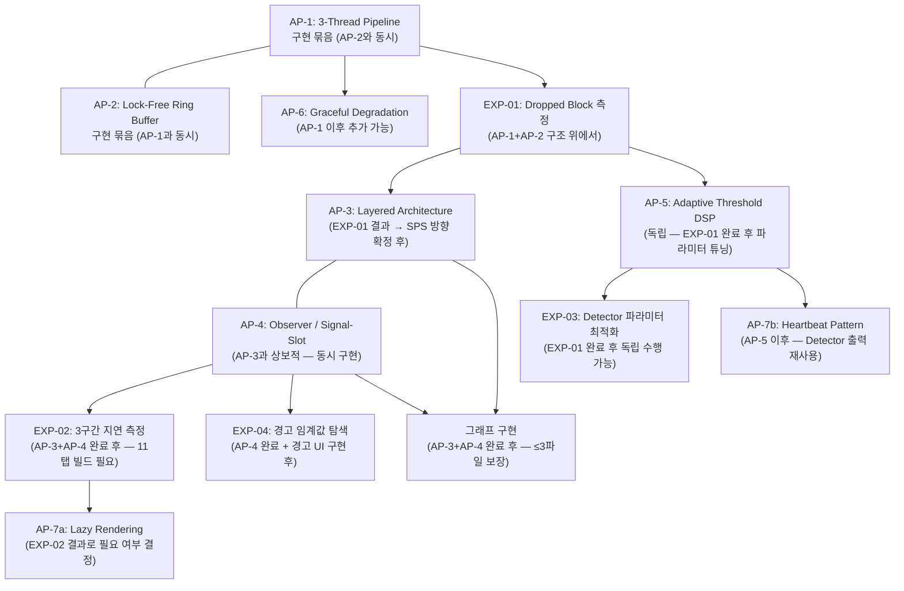
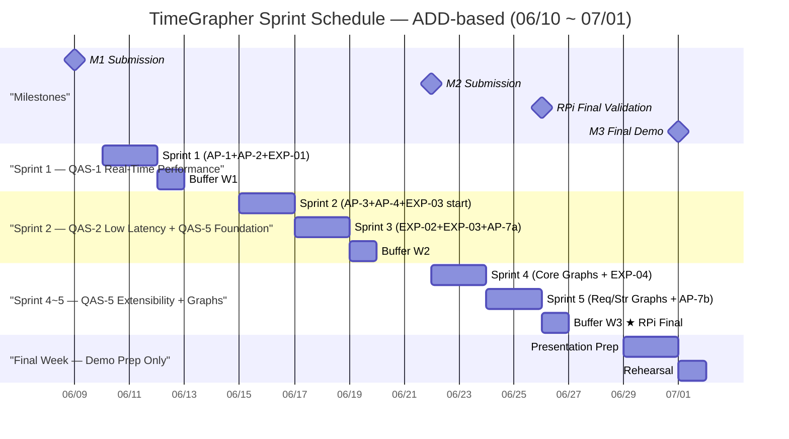
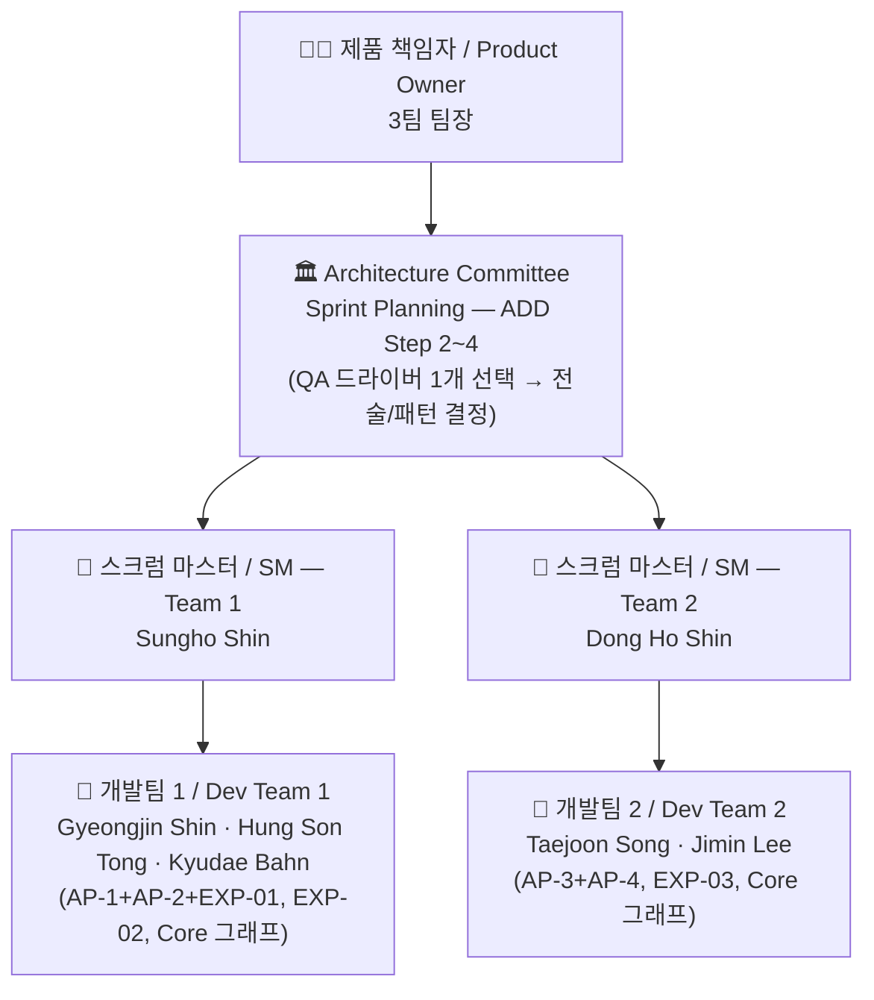

# 프로젝트 플랜 / Project Plan — TimeGrapher

**팀 / Team**: Blue Sky (3팀) | **마일스톤 / Milestone**: M1 | **작성일 / Date**: 2026-06-07

---

## 0. 이 문서의 구조 / Document Structure

**한국어**

이 문서는 아래 세 가지 요구사항에 순서대로 답한다.

1. 역할 분담과 구체적인 태스크, 마일스톤이 정의되어 있는가?
2. 전체 아키텍처를 기반으로 한 구현 태스크가 반영되어 있는가?
3. 계획된 기술 실험이 태스크에 반영되어 있는가?

**이 문서가 참조한 파일** — QA 분석 파일은 직접 참조하지 않으며, 아래 네 개의 최종 아키텍처 문서를 기준으로 작성한다.

| 파일 | 참조 내용 |
|------|---------|
| `docs/milestone1/final/architectural-drivers.md` | QAS-1~5, QA 우선순위, 기능 요구사항(FR-01~09), 미결 이슈(OI-*) |
| `docs/milestone1/final/risk-assessment.md` | TR-01~09, NTR-01~06, 액션 플랜 순서 |
| `docs/milestone1/final/planned-experiments.md` | EXP-01~04, 선행 조건 및 완료 기준 |
| `docs/milestone1/final/architectural-approaches.md` | AP-1~7, 구현 순서, 어프로치 간 상호작용 |

**English**

This document answers three requirements in order:

1. Are role assignments, specific tasks, and milestones defined?
2. Are construction tasks based on the overall architecture reflected?
3. Are planned technical experiments reflected in the tasks?

**Files referenced** — QA analysis files are not directly referenced; this document is written against the four final architecture documents above.

---

## 1. 개요 / Overview

**한국어**

본 문서는 TimeGrapher 프로젝트의 M1 기준 프로젝트 플랜이다.

**핵심 원칙**: ADD(Attribute-Driven Design) 기반 2일 스크럼 스프린트. 각 스프린트는 QA 드라이버 한 개에 집중하며, 팀 1 · 팀 2가 같은 QA 목표를 향해 서로 다른 태스크를 병렬로 수행한다.

**프로젝트 목표 (우선순위 순)**:

| 순위 | 목표 | 설명 |
|:---:|------|------|
| **1st** | 정확한 측정 | Rate / Amplitude / Beat Error를 정확하게 제공 — 정확도를 희생하고 BPH를 확장하는 선택은 하지 않는다 |
| **2nd** | BPH 범위 확대 | 정확도를 유지하면서 더 높은 BPH 시계까지 지원 |
| **3rd** | 확장 가능한 구조 | 11개 그래프를 5주 내 병렬 개발 가능한 구조 |
| **4th** | 아키텍처 원칙 실증 | CMU MSE 소프트웨어 아키텍처 설계 원칙 적용 |

**일정 개요**:

```
M1 제출 (06/09) → 구현 시작 (06/10) → M2 제출 (06/22) → RPi 최종 검증 (06/26) → M3 최종 데모 (07/01)
```

**English**

This document defines the Milestone 1 project plan for the TimeGrapher project.

**Core principle**: ADD (Attribute-Driven Design)-based 2-day Scrum sprints. Each sprint focuses on one QA driver; Team 1 and Team 2 run different tasks in parallel toward the same QA goal.

**Project objectives (in priority order)**:

| Rank | Objective | Description |
|:---:|-----------|-------------|
| **1st** | Accurate Measurement | Provide Rate / Amplitude / Beat Error accurately — sacrificing accuracy to cover more BPH is not acceptable |
| **2nd** | Wider BPH Coverage | Extend accurate support to higher BPH watches while preserving accuracy |
| **3rd** | Extensible Architecture | Enable parallel development of 11 graphs within 5 weeks |
| **4th** | Architecture Principles** | Apply CMU MSE software architecture design principles |

---

## 2. 역할 정의 / Role Definitions

**한국어**

| 역할 / Role | 담당자 / Assignee | 책임 / Responsibility |
|---|---|---|
| 제품 책임자 (Product Owner) | 3팀 팀장 (Team 3 Lead) | 요구사항 우선순위 결정, 스프린트 목표 승인 |
| 스크럼 마스터 — 팀 1 | Sungho Shin | 스프린트 진행 관리, 장애 제거, Architecture Committee 참여 |
| 스크럼 마스터 — 팀 2 | Dong Ho Shin | 스프린트 진행 관리, 장애 제거, Architecture Committee 참여 |
| 개발팀 1 | Gyeongjin Shin, Hung Son Tong, Kyudae Bahn | 기능 구현 및 실험 수행 |
| 개발팀 2 | Taejoon Song, Jimin Lee | 기능 구현 및 실험 수행 |

**English**

| 역할 / Role | 담당자 / Assignee | 책임 / Responsibility |
|---|---|---|
| Product Owner | Team 3 Lead | Prioritize requirements, approve sprint goals |
| Scrum Master — Team 1 | Sungho Shin | Manage sprint progress, remove blockers, join Architecture Committee |
| Scrum Master — Team 2 | Dong Ho Shin | Manage sprint progress, remove blockers, join Architecture Committee |
| Dev Team 1 | Gyeongjin Shin, Hung Son Tong, Kyudae Bahn | Feature implementation and experiments |
| Dev Team 2 | Taejoon Song, Jimin Lee | Feature implementation and experiments |

---

## 3. 애자일 운영 방식 / Agile Ceremonies

**한국어**

| 이벤트 / Event | 주기 / Cadence | 참여자 / Participants | 시간 / Duration |
|---|---|---|---|
| 스프린트 계획 회의 (Sprint Planning) | 매 스프린트 시작 (2일마다) | Architecture Committee (양 팀 SM + PO) | 1시간 |
| 스프린트 개발 (Sprint) | 2일 | 각 팀 독립 진행 | 2일 |
| 스프린트 리뷰 & 회고 (Review & Retrospective) | 매 스프린트 종료 | 전체 팀 | 1시간 |
| 버퍼 (Buffer) | 매주 금요일 | 전체 팀 | 1일 |

**Architecture Committee 역할**: Sprint Planning 1시간 = ADD Step 2~4 수행.
- **Step 2**: 이번 스프린트에서 집중할 QA 드라이버 선택
- **Step 3**: 해당 QA를 주소할 아키텍처 요소 분해 대상 결정
- **Step 4**: 전술(Tactic)/패턴(Pattern) 선택 및 인스턴스화 계획 수립

양 팀은 동일한 QA 스프린트 목표를 공유하되, 태스크 배분은 Architecture Committee에서 결정한다.

**English**

| 이벤트 / Event | 주기 / Cadence | 참여자 / Participants | 시간 / Duration |
|---|---|---|---|
| Sprint Planning | Every sprint start (every 2 days) | Architecture Committee (both SMs + PO) | 1 hour |
| Sprint (Development) | 2 days | Each team independently | 2 days |
| Sprint Review & Retrospective | Every sprint end | Full team | 1 hour |
| Buffer | Every Friday | Full team | 1 day |

**Architecture Committee role**: The 1-hour Sprint Planning performs ADD Steps 2–4:
- **Step 2**: Select the QA driver to focus on this sprint
- **Step 3**: Decide the architecture element to decompose for that QA
- **Step 4**: Select and plan instantiation of tactics/patterns

Both teams share the same QA sprint goal; task allocation is decided by the Architecture Committee.

---

## 4. ADD ↔ Agile 매핑 / ADD–Agile Mapping

**한국어**

```
Sprint Planning (1h)    = ADD Step 2~4: QA 드라이버 선택 → 분해 대상 → Tactic/Pattern 선택
Sprint 개발 (2일)        = ADD Step 5:  요소 인스턴스화 + 책임 할당 (구현 + 실험)
Sprint Review (1h)      = ADD Step 6:  Views 스케치 + 설계 결정 기록 (ADR)
다음 Sprint              = ADD "다음 Iteration": Step 2로 복귀하여 다음 QA 드라이버 선택
```

**ADD QA 집중 원칙**: 각 스프린트는 QA 드라이버 한 개에 집중한다. 구현 의존성(실험 선행 조건, 어프로치 간 순서)에 따라 집중 순서가 결정되며, 중요도가 같아도 구현 순서는 달라질 수 있다.

**English**

```
Sprint Planning (1h)    = ADD Step 2–4: Select QA driver → decomposition target → tactic/pattern
Sprint development (2d)  = ADD Step 5:  Element instantiation + responsibility allocation (impl + experiment)
Sprint Review (1h)      = ADD Step 6:  Views sketch + record design decisions (ADR)
Next Sprint              = ADD "Next Iteration": return to Step 2 for next QA driver
```

**ADD QA focus principle**: Each sprint concentrates on one QA driver. The focus order is determined by implementation dependency (experiment prerequisites, cross-approach ordering), not importance alone.

---

## 5. 아키텍처 기반 구현 태스크 / Architecture-Based Construction Tasks

**한국어**

TimeGrapher의 구현은 7개 아키텍처 어프로치(AP-1~7)를 기반으로 한다. 아키텍처 어프로치 간 상호작용이 구현 순서를 결정한다.

### 5.1 어프로치 구현 순서 / Implementation Order



### 5.2 레이어별 구현 태스크 / Layer-by-Layer Tasks

**한국어**

| 계층 / Layer | 어프로치 / AP | 핵심 태스크 / Key Tasks | 목표 QA | 구현 상태 |
|:------:|:--------:|------------------------|---------:|:-------:|
| **Acquisition** | AP-1, AP-2 | Audio Thread 분리, Lock-Free Ring Buffer 구현 (`atomic` 기반) | QAS-1, QAS-2 | 🔴 미구현 |
| **Acquisition** | AP-6 | Graceful Degradation: 96k→48k sps 자동 폴백 로직 (EXP-01 후 기준 확정) | QAS-1 | 🔴 미구현 |
| **Signal Processing** | AP-5 | HPF → Envelope → Detector 파이프라인 확인, Adaptive Threshold 파라미터 튜닝 (EXP-03 후) | QAS-3 QA-C2 | ⚠️ 부분 구현 |
| **Domain** | AP-4 | MeasurementEngine 단일 `Measurement` 구조체 발행, `measurementReady()` Signal-Slot | QAS-3 QA-C1, QAS-5 | 🔴 미구현 |
| **Domain** | AP-7b | Signal Quality Monitor (Heartbeat 패턴 — A/C 이벤트 재활용, EXP-04 후 N·M 확정) | QAS-4 | 🔴 미구현 |
| **Presentation** | AP-3 | God Object → 4-계층 분리 (Restrict Dependencies 규칙: Presentation → Domain만) | QAS-5 | 🔴 미구현 |
| **Presentation** | AP-7a | Lazy Rendering: 현재 탭만 `paintEvent()` 실행 (EXP-02 OI-L2 결과 기반) | QAS-2 | 🔴 미구현 |
| **Presentation** | AP-3, AP-4 | Core / Required / Stretch 그래프 구현 (≤3파일 변경 규칙 준수) | QAS-5 | 🔴 미구현 |

**English**

| Layer | AP | Key Tasks | Target QA | Status |
|:-----:|:--:|----------|:---------:|:------:|
| **Acquisition** | AP-1, AP-2 | Separate Audio Thread, implement Lock-Free Ring Buffer (`atomic`-based) | QAS-1, QAS-2 | 🔴 Not impl. |
| **Acquisition** | AP-6 | Graceful Degradation: auto-fallback 96k→48k sps (trigger threshold confirmed by EXP-01) | QAS-1 | 🔴 Not impl. |
| **Signal Processing** | AP-5 | Verify HPF → Envelope → Detector pipeline, tune Adaptive Threshold params (after EXP-03) | QAS-3 QA-C2 | ⚠️ Partial |
| **Domain** | AP-4 | MeasurementEngine publishes single `Measurement` struct via `measurementReady()` Signal-Slot | QAS-3 QA-C1, QAS-5 | 🔴 Not impl. |
| **Domain** | AP-7b | Signal Quality Monitor (Heartbeat pattern — reuses A/C events; N·M confirmed by EXP-04) | QAS-4 | 🔴 Not impl. |
| **Presentation** | AP-3 | God Object → 4-layer separation (enforce Restrict Dependencies: Presentation → Domain only) | QAS-5 | 🔴 Not impl. |
| **Presentation** | AP-7a | Lazy Rendering: only active tab executes `paintEvent()` (based on EXP-02 OI-L2 result) | QAS-2 | 🔴 Not impl. |
| **Presentation** | AP-3, AP-4 | Core / Required / Stretch graph implementation (enforce ≤3-file change rule) | QAS-5 | 🔴 Not impl. |

---

## 6. 그래프 우선순위 분류 / Graph Priority Classification

**한국어**

NTR-05 (스코프 과잉 리스크)와 OI-07 (그래프 우선순위 미분류)를 해소하기 위해 11개 그래프를 Core / Required / Stretch 세 등급으로 분류한다. 이 분류는 프로젝트 목표 우선순위와 직접 연동된다.

**분류 기준**:

| 등급 | 기준 | 목표 연결 |
|------|------|---------|
| **Core** | QAS-3 Correctness (H)·QAS-1 Real-Time (H)와 직결. M3 데모에서 WeiShi 비교·측정 안정성 증명에 필수 | 1st: 정확한 측정 |
| **Required** | QAS-4 Usability (M)·QAS-5 Extensibility (M) 연결. 데모 완성도 향상 및 확장성 증거 제공 | 3rd: 확장 가능 구조 |
| **Stretch** | QAS-5 시각화 추가·BPH 확장 시나리오. 시간 여유 시 추가 | 2nd: BPH 범위 확대 |

**등급별 구현 목록** (Architecture Committee가 Sprint 1 Planning에서 전체 11개 목록 최종 확정):

| 등급 | 그래프 / 기능 | 연결 FR | 연결 QA | M2 필수 |
|:----:|-------------|:------:|:-------:|:------:|
| **Core** | Trace Display (Rate + Amplitude 실시간 기록) | FR-05 | QAS-3 QA-C1 | ✅ |
| **Core** | Beat Error Display & Diagnostic Trace | FR-07 | QAS-3 QA-C1, QAS-2 | ✅ |
| **Core** | Rate & Amplitude Stability / Vario | FR-06 | QAS-3 QA-C1, QAS-1 | ✅ |
| **Required** | Signal Quality Warning UI (`⚠ No signal` / `⚠ Noisy signal`) | FR-08 | QAS-4 | ✅ |
| **Required** | Beat-Noise Scope (Scope 1 & 2) | — | QAS-5 Extensibility 증거 | ✅ |
| **Required** | Additional display (Architecture Committee 결정) | — | QAS-5 | ✅ |
| **Stretch** | Pause + 시간축 탐색 | FR-09 | QAS-5 | ❌ |
| **Stretch** | 나머지 그래프 (4~5개 — Committee 결정) | — | QAS-5 / 2nd goal | ❌ |

> **완료 기준 원칙**: Core 3개 미완성 시 Required·Stretch 착수 금지. Core = 데모 생존선.

**English**

To resolve NTR-05 (scope overextension risk) and OI-07 (graph priority unclassified), the 11 graphs are categorized into three tiers: Core / Required / Stretch. This classification maps directly to project goal priority.

**Classification criteria**:

| Tier | Criteria | Goal alignment |
|------|----------|---------------|
| **Core** | Directly linked to QAS-3 Correctness (H) and QAS-1 Real-Time (H); mandatory for WeiShi comparison and measurement stability proof at M3 demo | 1st: Accurate Measurement |
| **Required** | Linked to QAS-4 Usability (M) and QAS-5 Extensibility (M); enhances demo completeness and provides extensibility evidence | 3rd: Extensible Architecture |
| **Stretch** | Additional QAS-5 visualizations and BPH-extension scenarios; added if time permits | 2nd: Wider BPH Coverage |

> **Completion principle**: Do not start Required or Stretch until all 3 Core graphs are complete. Core = demo survival threshold.

---

## 7. QA 우선순위 및 스프린트 집중 순서 / QA Priority and Sprint Focus

**한국어**

| 순위 / Rank | QA | Business Imp. | Tech Risk | **우선순위** | 집중 스프린트 | 연결 AP |
|:-----------:|----| :-----------:| :-------:| :--------:| :---------: |--------|
| 1 | Real-Time Performance | H | H | **H** | Sprint 1 | AP-1, AP-2, AP-6 |
| 2 | Low Latency | H | H | **H** | Sprint 2 | AP-1, AP-2, AP-7a |
| 3 | Correctness | H | M | **H** | Sprint 2~3 | AP-4, AP-5 |
| 4 | Usability | M | M | **M** | Sprint 4~5 | AP-7b |
| 5 | Extensibility | M | M | **M** | Sprint 3~5 | AP-3, AP-4 |

> **스프린트 집중 순서 결정 이유**: Real-Time Performance → Low Latency → Correctness 순서는 "구현 선행 의존성"에 따른 것이다. Dropped Block이 없어야(QAS-1) 지연을 측정할 수 있고(QAS-2), 실시간 시스템이 동작해야(QAS-1+2) 측정 정확도를 검증할 수 있다(QAS-3). Extensibility(AP-3+AP-4 리팩터링)는 QAS-5이지만 모든 그래프 구현의 선행 조건이므로 Sprint 2~3에서 병행 착수한다.

**English**

| Rank | QA | Business Imp. | Tech Risk | **Priority** | Focus Sprints | Linked AP |
|:----:|----| :----------:| :------:| :--------:| :---------:|-----------|
| 1 | Real-Time Performance | H | H | **H** | Sprint 1 | AP-1, AP-2, AP-6 |
| 2 | Low Latency | H | H | **H** | Sprint 2 | AP-1, AP-2, AP-7a |
| 3 | Correctness | H | M | **H** | Sprint 2–3 | AP-4, AP-5 |
| 4 | Usability | M | M | **M** | Sprint 4–5 | AP-7b |
| 5 | Extensibility | M | M | **M** | Sprint 3–5 | AP-3, AP-4 |

> **Sprint ordering rationale**: The Real-Time → Low Latency → Correctness sequence follows *implementation prerequisite dependency*, not importance rank. Zero Dropped Blocks (QAS-1) is required to measure latency (QAS-2), and a real-time pipeline (QAS-1+2) must exist before measurement accuracy (QAS-3) can be verified. Extensibility (AP-3+AP-4 refactoring) is QAS-5 but is a prerequisite for all graph construction — so it is started in parallel from Sprint 2–3.

---

## 8. 스프린트 계획 / Sprint Schedule

**한국어**

총 5 스프린트 × 2일 + 3일 버퍼 (M1 제출 후 구현 시작: 06/10).
**팀 1 · 팀 2 같은 QA 목표, 서로 다른 태스크로 병렬 진행. RPi 검증은 그래프 완성 즉시 Rolling 방식.**

**English**

5 sprints × 2 days + 3 buffer days. Construction starts 06/10 (after M1 submission 06/09).
**Teams 1 & 2 share the same QA goal per sprint; different tasks in parallel. RPi validation is performed rolling — immediately after each graph is complete.**



---

### Sprint 1 (06/10 Wed ~ 06/11 Thu) — QA 집중: QAS-1 Real-Time Performance

> **ADD Step 2**: 집중 QA = QAS-1 Real-Time Performance (Priority 1, H/H)  
> **ADD Step 3**: 분해 대상 = Acquisition Layer (Audio Thread + Ring Buffer)  
> **ADD Step 4**: AP-1 (3-Thread Pipeline) + AP-2 (Lock-Free Ring Buffer) + EXP-01

**Architecture Committee 결정 사항 (ADD Step 2~4)**

| 결정 ID | 결정 내용 | 해결 QA | 의존 실험 |
|--------|---------|:------:|:-------:|
| ADD-S1-01 | Audio Thread 분리 구조 확정 + Ring Buffer 인터페이스 정의 | QAS-1 | — |
| ADD-S1-02 | Lock-Free Ring Buffer 크기 결정 (sps별 블록 주기 기반) | QAS-1 | EXP-01 결과 후 조정 가능 |
| ADD-S1-03 | Graceful Degradation 폴백 기준 잠정 설정 (48k sps 보수적 기본값) | QAS-1 | EXP-01 결과로 확정 |
| ADD-S1-04 | 그래프 우선순위 전체 목록 최종 확정 (Core/Required/Stretch) | QAS-5 | — |

**2팀 병렬 태스크 / Parallel Tasks**

| | 팀 1 / Team 1 | 팀 2 / Team 2 |
|---|---|---|
| **QA-1 구현** | AP-1: Audio Thread 분리 구현 (`QThread` 기반 오디오 캡처 스레드 분리) | AP-2: Lock-Free Ring Buffer 구현 (`std::atomic` head/tail 포인터) |
| **실험** | **EXP-01 실행**: RPi에서 48k/96k/192k sps × 10분 Dropped Block 측정 | EXP-01 지원: Ring Buffer overflow counter 삽입 + `SCHED_RR` Priority Scheduling 비교 |
| **리스크** | TR-01 (96k sps 달성 불가) 선제 완화: 48k 폴백 코드 준비 | TR-02 (Linux 스케줄러 지터) 완화: `SCHED_RR` 적용 전·후 비교 |

**리뷰 목표**: EXP-01 결과 (sps별 Dropped Block 수 확정) → SPS 방향 결정 (96k vs 48k 폴백). AP-1+AP-2 기본 동작 확인.

---

### Buffer W1 (06/12 Fri) — EXP-01 결과 분석 + ADD Step 6

**양 팀 공동 수행**

| 항목 | 내용 |
|------|------|
| EXP-01 결과 통합 | 48k/96k/192k Dropped Block 수치 → QAS-1 Response Measure 확정 (OI-P1 해소) |
| ADD Step 6 | Sprint 1 아키텍처 결정 기록 (ADR): SPS 확정값, AP-1/AP-2 구조 결정 |
| AP-6 결정 | EXP-01 결과 기반 Graceful Degradation 폴백 기준 확정 (96k 달성 여부 → 48k 발동 조건) |
| NTR-04 대응 | 역할 경계 확정 — 코딩팀/아키텍처팀 일일 동기화 회의 채널 수립 |

---

### Sprint 2 (06/15 Mon ~ 06/16 Tue) — QA 집중: QAS-5 Foundation + QAS-3 Correctness (start)

> **ADD Step 2**: 집중 QA = QAS-5 Extensibility Foundation (AP-3+AP-4 리팩터링) + QAS-3 QA-C2 start  
> **ADD Step 3**: 분해 대상 = Presentation Layer (God Object 분리) + Signal Processing Layer (파라미터 튜닝 prep)  
> **ADD Step 4**: AP-3 (Layered Architecture) + AP-4 (Observer/Signal-Slot) + EXP-03 착수

> ⚠️ **TR-07 리스크**: God Object 분리는 기존 기능 회귀 위험 (Impact: H). 증분 리팩터링 + 리팩터링 전 Rate·Amplitude·Beat Error 기준값 수집 필수.

**Architecture Committee 결정 사항 (ADD Step 2~4)**

| 결정 ID | 결정 내용 | 해결 QA | 리스크 |
|--------|---------|:------:|:-----:|
| ADD-S2-01 | 4-계층 경계 최종 확정 (Acquisition / Signal Processing / Domain / Presentation) | QAS-5 | TR-06, TR-07 |
| ADD-S2-02 | MeasurementEngine 인터페이스 정의 (`Measurement` 구조체 + `measurementReady()` 시그널) | QAS-3 QA-C1, QAS-5 | — |
| ADD-S2-03 | Restrict Dependencies 규칙 강제 방법 결정 (Presentation → Domain만 참조 가능) | QAS-5 | TR-06 |
| ADD-S2-04 | EXP-03 소음 환경 3조건 정의 및 파라미터 탐색 범위 확정 | QAS-3 QA-C2 | TR-05 |

**2팀 병렬 태스크 / Parallel Tasks**

| | 팀 1 / Team 1 | 팀 2 / Team 2 |
|---|---|---|
| **QA-5 리팩터링** | AP-3: God Object 분리 — Acquisition Layer + Signal Processing Layer 분리 (증분) | AP-4: MeasurementEngine 구현 — 단일 `Measurement` 구조체 + `measurementReady()` Signal-Slot |
| **QA-3 실험 착수** | EXP-03 Part 1: 저소음 환경 baseline 수집 (기본 파라미터 Rate·Amplitude·Beat Error 30회) | EXP-03 Part 2: 격자 탐색 설계 (`onset_fraction` × `min_peak_fraction` 조합 스케줄링) |
| **리스크** | TR-07: 리팩터링 전 Rate·Amplitude·Beat Error 기준값 기록 → 리팩터링 후 동일값 비교 | TR-06: 레이어 경계 위반 없는지 Presentation → Domain 참조만 허용하는지 코드 리뷰 |

**리뷰 목표**: AP-3 Acquisition/Signal Processing 레이어 분리 완료. AP-4 MeasurementEngine 기본 동작 확인. EXP-03 저소음 baseline 확보.

---

### Sprint 3 (06/17 Wed ~ 06/18 Thu) — QA 집중: QAS-2 Low Latency + QAS-3 Correctness

> **ADD Step 2**: 집중 QA = QAS-2 Low Latency 검증 + QAS-3 Correctness 완성  
> **ADD Step 3**: 분해 대상 = 전체 파이프라인 3구간 (TS1→TS2→TS3) + Detector 파라미터  
> **ADD Step 4**: EXP-02 실행 (AP-4 완료 선행 조건 충족) + EXP-03 완료 + AP-7a 결정 + Architecture Views

**Architecture Committee 결정 사항 (ADD Step 2~4)**

| 결정 ID | 결정 내용 | 해결 QA | 의존 실험 |
|--------|---------|:------:|:-------:|
| ADD-S3-01 | Lazy Rendering (AP-7a) 필수 적용 여부 결정 (EXP-02 OI-L2 기반) | QAS-2 | EXP-02 |
| ADD-S3-02 | BPH 상향 목표 팀 합의 (28,800 → 36,000 / 43,200 BPH 검토, EXP-02 OI-L3 기반) | QAS-2 | EXP-02 |
| ADD-S3-03 | Detector 최적 파라미터 확정 (`onset_fraction`, `min_peak_fraction`, EXP-03 결과) | QAS-3 QA-C2 | EXP-03 |
| ADD-S3-04 | ≤3파일 구조 검증 실행 여부 결정 (AP-3+AP-4 완료 기준) | QAS-5 | — |

**2팀 병렬 태스크 / Parallel Tasks**

| | 팀 1 / Team 1 | 팀 2 / Team 2 |
|---|---|---|
| **QA-2 실험** | **EXP-02 실행**: TS1/TS2/TS3 타임스탬프 코드 삽입 + 3구간 × sps 3단계 × 탭 1개/11개 측정 | **EXP-03 완료**: 중소음/고소음 조건 격자 탐색 + 최적 파라미터 확정 → `Detector.cpp` 업데이트 |
| **QA-5 완성** | AP-3 Presentation Layer 분리 완료 + **≤3파일 검증**: 신규 그래프 1개 실제 추가하여 `git diff --stat` 측정 | AP-4: 11개 탭 Observer 구독 연결 완료 + AP-7a 적용 (EXP-02 결과 기반) |
| **문서화** | **C&C View** 초안 (3-스레드 파이프라인 런타임 관점) | **Module View** 초안 (4-계층 코드 구조) + **Deployment View** 초안 (RPi 배치) |

**리뷰 목표**: EXP-02 완료 → QAS-2 Response Measure 확정 (OI-L1, OI-L2, OI-L3 해소). EXP-03 완료 → Detector 파라미터 확정 (OI-C1 해소). ≤3파일 검증 PASS/FAIL 판정. Architecture Views 3종 초안 완성.

---

### Buffer W2 (06/19 Fri) — M2 문서 준비 + ADD Step 6

**양 팀 공동 수행**

| 항목 | 내용 |
|------|------|
| EXP 결과 통합 | EXP-01~03 결과 통합 → Architectural Drivers 업데이트 (⚠️ 잠정값 → 확정값) |
| Architecture Views 완성 | Module View / C&C View / Deployment View 초안 → 수치 반영 후 완성 |
| M2 산출물 준비 | Updated Project Plan, Experiment Results, Architecture Views, Construction Plan |
| ADD Step 6 | Sprint 2~3 아키텍처 결정 기록 (ADR) |

---

### Sprint 4 (06/22 Mon ~ 06/23 Tue) — QA 집중: QAS-5 Extensibility (Core Graphs) | M2 제출: 06/22

> **ADD Step 2**: 집중 QA = QAS-5 Extensibility — Core 그래프 구현으로 ≤3파일 구조 실증  
> **ADD Step 3**: 분해 대상 = Presentation Layer Core 그래프 3개  
> **ADD Step 4**: AP-3+AP-4 위에서 Core 그래프 독립 구현

**Architecture Committee 결정 사항 (ADD Step 2~4)**

| 결정 ID | 결정 내용 | 해결 QA |
|--------|---------|:------:|
| ADD-S4-01 | EXP-03 결과 기반 Detector 파라미터 최종 코드 반영 확인 | QAS-3 |
| ADD-S4-02 | AP-7b Heartbeat 경고 UI 구현 착수 (EXP-04 위해 UI 구현 선행 필요) | QAS-4 |
| ADD-S4-03 | Core 그래프 3개 RPi Rolling 검증 계획 확정 | QAS-1, QAS-5 |

**2팀 병렬 태스크 / Parallel Tasks**

| | 팀 1 / Team 1 | 팀 2 / Team 2 |
|---|---|---|
| **공통** | **M2 제출 (06/22)**: Experiment Results, Architecture Views, Construction Plan, Updated Project Plan | |
| **Core 그래프** | **Trace Display** 구현 (FR-05: Rate + Amplitude 실시간 기록) + RPi 빌드 검증 ✓ | **Beat Error Display & Diagnostic Trace** 구현 (FR-07) + RPi 빌드 검증 ✓ |
| **QA-4 준비** | **EXP-04 착수**: AP-7b Heartbeat 경고 UI 구현 + Part A (N 수치 탐색 — 시계 제거/복원 실험) | **Vario (Rate & Amplitude Stability)** 구현 (FR-06) + RPi 빌드 검증 ✓ |

**리뷰 목표**: M2 제출 완료. Core 그래프 3개 RPi 검증. EXP-04 Part A (N·M 수치) 결과 확보.

---

### Sprint 5 (06/24 Wed ~ 06/25 Thu) — QA 집중: QAS-5 (Required/Stretch) + QAS-4 Usability

> **ADD Step 2**: 집중 QA = QAS-5 Required/Stretch 그래프 + QAS-4 Usability 완성  
> **ADD Step 3**: 분해 대상 = Required 그래프 + AP-7b Heartbeat 파라미터  
> **ADD Step 4**: EXP-04 완료 + Required/Stretch 그래프 + ≤3파일 Extensibility 증거 수집

**Architecture Committee 결정 사항 (ADD Step 2~4)**

| 결정 ID | 결정 내용 | 해결 QA |
|--------|---------|:------:|
| ADD-S5-01 | EXP-04 결과 기반 AP-7b Heartbeat N·M 파라미터 코드 상수화 | QAS-4 |
| ADD-S5-02 | Stretch 그래프 구현 가능 여부 판정 (Core+Required 완료 기준) | QAS-5 |
| ADD-S5-03 | 전체 Extensibility 증거 수집 — 그래프 추가당 변경 파일 수 기록 | QAS-5 |

**2팀 병렬 태스크 / Parallel Tasks**

| | 팀 1 / Team 1 | 팀 2 / Team 2 |
|---|---|---|
| **Required 그래프** | **Signal Quality Warning UI** 완성 (FR-08) + RPi 빌드 검증 ✓ | **Beat-Noise Scope** 구현 + RPi 빌드 검증 ✓ |
| **QA-4 완성** | **EXP-04 완료**: Part B (`⚠ Noisy signal` 임계값 탐색) → N·M + noise/signal 임계값 확정 | AP-7b Heartbeat 파라미터 코드 반영 |
| **Stretch** (Core+Required 완료 시) | Stretch 그래프 1개 + Enhanced Features (Pause 등) | Stretch 그래프 1개 + 나머지 |
| **증거 수집** | 각 그래프 추가 시 `git diff --stat`으로 변경 파일 수 기록 → ≤3파일 Extensibility 증거 문서화 | 동일 |

**리뷰 목표**: Required 그래프 완성 + RPi 검증. EXP-04 완료 (OI-U1, OI-U2 해소). Extensibility 증거(≤3파일) 기록 완료.

---

### Buffer W3 (06/26 Fri) — ★ RPi 최종 통합 검증 (기술 작업 마감일)

> ⚠️ **이 날 이후 기술 구현 작업 없음. 06/26 EOD까지 모든 RPi 검증 완료 필수.**

**양 팀 공동 수행 / Both Teams**

| 항목 / Item | 완료 기준 / Done Criteria | 연결 QA |
|---|---|:---:|
| 전체 구현 그래프 RPi 통합 빌드 + 실행 | 모든 그래프가 RPi에서 crash 없이 동작 | QAS-1, QAS-5 |
| end-to-end 지연 최종 측정 (3구간 avg + worst-case) | 28,800 BPH: ① < 70ms ② < 30ms ③ < 100ms (EXP-02 확정값) | QAS-2 |
| 96k sps 안정 동작 확인 (또는 48k 폴백 동작) | 5분 연속 실행 중 Dropped Block = 0 | QAS-1 |
| Rate·Amplitude·Beat Error 정확도 최종 확인 | EXP-03 확정 파라미터 적용 후 Δ 최소화 | QAS-3 |
| Extensibility 증거 기록 | ≤ 3파일 변경 확인 문서 완성 | QAS-5 |
| QA 증거 수치 문서화 완료 | 발표 자료에 사용할 수치 전수 확정 | 전체 |

---

### Final Week (06/29~07/01) — 발표·데모 준비 전용 / Presentation & Demo Prep Only

> ⚠️ **기술 구현·RPi 검증 없음. 발표 준비·리허설·데모만.**

| 날짜 | 활동 | 참여 |
|------|------|------|
| 06/29 (Mon) | 발표 자료 구조 설계 + 초안 (QA 요건 · Architecture · Experiments · Lessons) | 전체 팀 |
| 06/30 (Tue) | 발표 자료 완성 + 전체 팀 리허설 (20분 타임 체크) | 전체 팀 |
| 07/01 (Wed) | **M3 Final Demo** | 전체 팀 |

---

## 9. 기술 실험 계획 요약 / Technical Experiment Summary

**한국어**

모든 실험의 목적·질문·완료 기준·실행 선행 조건은 `docs/milestone1/final/planned-experiments.md`에 상세 정의되어 있다. 아래는 스프린트 계획과의 연결 요약이다.

**English**

Full experiment details (objective, questions, completion criteria, prerequisites) are defined in `docs/milestone1/final/planned-experiments.md`. The table below summarizes the connection to the sprint plan.

| ID | 실험명 / Experiment | 해결 OI | 선행 조건 | 수행 스프린트 | 담당 |
|:--:|---------------------|:-------:|---------|:-----------:|------|
| **EXP-01** | RPi Dropped Block 측정 | OI-P1 | RPi 5 세팅 + 시계 연결 | **Sprint 1** | 팀 1 (팀 2 지원) |
| **EXP-02** | end-to-end 3구간 지연 측정 | OI-L1, OI-L2, OI-L3 | EXP-01 완료 + AP-3+AP-4 완료 | **Sprint 3** | 팀 1 |
| **EXP-03** | Detector 파라미터 최적화 | OI-C1 | EXP-01 완료 (SPS 확정) | **Sprint 2~3** | 팀 2 |
| **EXP-04** | 경고 임계값 탐색 | OI-U1, OI-U2 | AP-4 완료 + 경고 UI 구현 | **Sprint 4~5** | 팀 1 (부분) |

**실험 선행 조건 의존 관계 / Experiment Dependency**:

```
EXP-01 (Sprint 1)
    └─→ EXP-02 (Sprint 3) — Observer 리팩터링 완료 후 (11탭 빌드 필요)
    └─→ EXP-03 (Sprint 2~3) — SPS 확정 후 독립 수행 가능
              └─→ EXP-04 (Sprint 4~5) — 경고 UI 구현 완료 후
```

---

## 10. 마일스톤 연계 / Milestone Linkage

**한국어**

| 마일스톤 / Milestone | 기한 / Due | 연계 스프린트 | 주요 산출물 |
|:-------------------:|:----------:|:-----------:|------------|
| **M1** | 2026-06-09 (Tue) | (제출일 — 구현 전) | Project Plan, Architectural Drivers, Risk Assessment, Planned Experiments, Architectural Approaches |
| **M2** | 2026-06-22 (Mon) | Sprint 1~3 결과 | 실험 결과 (EXP-01~03), Architecture Views (Module/C&C/Deployment), Updated Project Plan, Construction Plan |
| **M3 (Final Demo)** | 2026-07-01 (Wed) | Sprint 4~5 + Final | RPi 최종 데모 (Core+Required 그래프), 팀 발표 (20분) |

**English**

| Milestone | Due | Linked Sprints | Key Deliverables |
|:---------:|:---:|:--------------:|-----------------|
| **M1** | 2026-06-09 (Tue) | (submission — pre-construction) | Project Plan, Architectural Drivers, Risk Assessment, Planned Experiments, Architectural Approaches |
| **M2** | 2026-06-22 (Mon) | Sprint 1–3 results | Experiment Results (EXP-01~03), Architecture Views (Module/C&C/Deployment), Updated Project Plan, Construction Plan |
| **M3 (Final Demo)** | 2026-07-01 (Wed) | Sprint 4–5 + Final | RPi Final Demo (Core+Required graphs), Team Presentation (20 min) |

---

## 11. 미결 항목 / Open Items

**한국어**

| OI ID | 항목 | 해결 시점 | 담당 |
|:-----:|------|:--------:|------|
| **OI-06** | 코딩팀–아키텍처팀 역할 경계 확정 + 일일 동기화 회의 채널 수립 (NTR-04) | **즉시** (Buffer W1 이전) | Architecture Committee |
| **OI-07** | 11개 그래프 전체 목록 + Core/Required/Stretch 최종 확정 (NTR-05) | **Sprint 1 Planning (06/10)** | Architecture Committee |
| **OI-08** | 산출물 작성 언어 기준 합의 — 한영 병기 규칙 전수 적용 (NTR-06) | **즉시** (M1 제출 전) | 전체 팀 |
| **OI-P1** | RPi 5에서 96k sps Dropped Block = 0 달성 가능한가? | EXP-01 (Sprint 1) | 팀 1 |
| **OI-L1~L3** | 지연 3구간 실측값 + BPH 상향 가능 여부 | EXP-02 (Sprint 3) | 팀 1 |
| **OI-C1** | Detector 최적 파라미터 (`onset_fraction`, `min_peak_fraction`) | EXP-03 (Sprint 2~3) | 팀 2 |
| **OI-U1~U2** | 경고 N·M 수치 + noise/signal 임계값 | EXP-04 (Sprint 4~5) | 팀 1 |

**English**

| OI ID | Item | Target Resolution | Owner |
|:-----:|------|:----------------:|-------|
| **OI-06** | Confirm coding/architecture team role boundary + establish daily sync meeting (NTR-04) | **Immediate** (before Buffer W1) | Architecture Committee |
| **OI-07** | Finalize full 11-graph list + Core/Required/Stretch classification (NTR-05) | **Sprint 1 Planning (06/10)** | Architecture Committee |
| **OI-08** | Writing language standard agreement — apply bilingual rule to all deliverables (NTR-06) | **Immediate** (before M1 submission) | Full team |
| **OI-P1** | Can RPi 5 achieve Dropped Block = 0 at 96k sps? | EXP-01 (Sprint 1) | Team 1 |
| **OI-L1~L3** | 3-segment latency measured values + BPH escalation feasibility | EXP-02 (Sprint 3) | Team 1 |
| **OI-C1** | Optimal Detector parameters (`onset_fraction`, `min_peak_fraction`) | EXP-03 (Sprint 2–3) | Team 2 |
| **OI-U1~U2** | Warning N·M values + noise/signal threshold | EXP-04 (Sprint 4–5) | Team 1 |

---

## 12. 팀 구성 요약 / Team Summary

**한국어**



양 팀은 동일한 QA 스프린트 목표를 공유하며 서로 다른 태스크를 병렬로 수행한다. Architecture Committee(PO + 양 팀 SM)가 각 스프린트 시작 시 ADD Step 2~4 기반의 QA 드라이버 선택과 아키텍처 결정을 내린다.

**English**

Both teams share the same QA sprint goal and execute different tasks in parallel. The Architecture Committee (PO + both SMs) convenes at each sprint start to perform ADD Steps 2–4: select the QA driver and make architecture decisions before development begins.
