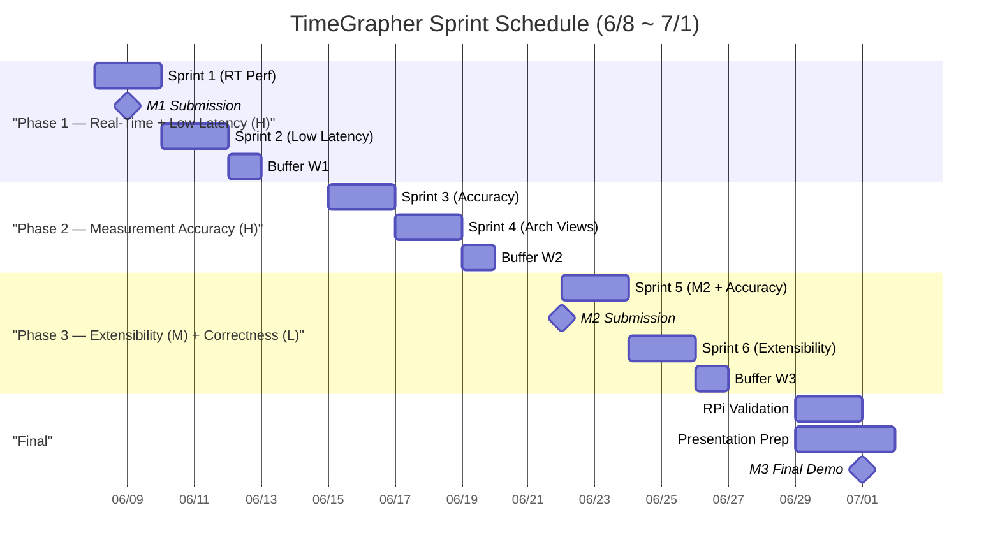
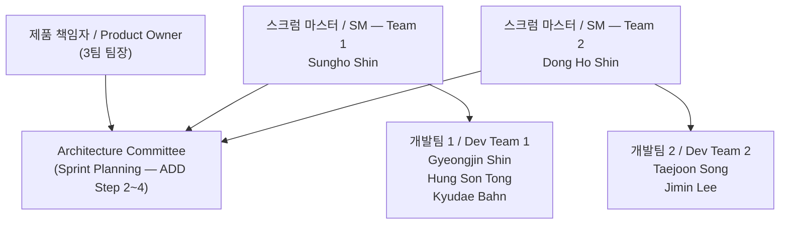

# 프로젝트 플랜 (M1) — 애자일 기반 ADD / Project Plan (M1) — Agile-Based ADD

> **작성일 / Date**: 2026-06-06  
> **제출 기한 / Due**: 2026-06-09  
> **버전 / Version**: 0.2 (Sprint Schedule Revised)

---

## 1. 개요 / Overview

**한국어**

본 문서는 TimeGrapher 프로젝트의 Milestone 1 기준 프로젝트 플랜이다.
2일 단위 스크럼 스프린트를 기반으로, 각 스프린트마다 Architecture Committee가 ADD(Attribute-Driven Design) 기반의 아키텍처 결정을 내리고 팀이 구현한다.

**프로젝트 목표**: 모든 BPH 시계를 커버하지 못하더라도, 정확한 측정값(Rate / Amplitude / Beat Error)을 실시간으로 제공하는 것. 더 높은 BPH 지원은 도전 목표이며, 정확도가 최우선이다.

**English**

This document defines the Milestone 1 project plan for the TimeGrapher project.
Based on 2-day Scrum sprints, the Architecture Committee makes ADD (Attribute-Driven Design) decisions at each Sprint Planning, and development teams implement accordingly.

**Project Goal**: Provide accurate real-time measurements (Rate / Amplitude / Beat Error) even if not all BPH ranges are covered. Supporting higher BPH is a stretch goal; accuracy comes first.

---

## 2. 역할 정의 / Role Definitions

**한국어**

| 역할 / Role | 담당자 / Assignee | 책임 / Responsibility |
|---|---|---|
| 제품 책임자 (Product Owner) | 3팀 팀장 (Team 3 Lead) | 요구사항 우선순위 결정, 스프린트 목표 승인 |
| 스크럼 마스터 — 팀 1 | Sungho Shin | 스프린트 진행 관리, 장애 제거, Architecture Committee 참여 |
| 스크럼 마스터 — 팀 2 | Dong Ho Shin | 스프린트 진행 관리, 장애 제거, Architecture Committee 참여 |
| 개발팀 1 | Gyeongjin Shin, Hung Son Tong, Kyudae Bahn | 기능 구현 및 실험 수행 |
| 개발팀 2 | Taejoon Song, Jimin Lee | 기능 구현 및 실험 수행 |

**English**

| 역할 / Role | 담당자 / Assignee | 책임 / Responsibility |
|---|---|---|
| Product Owner | Team 3 Lead | Prioritize requirements, approve sprint goals |
| Scrum Master — Team 1 | Sungho Shin | Manage sprint progress, remove blockers, join Architecture Committee |
| Scrum Master — Team 2 | Dong Ho Shin | Manage sprint progress, remove blockers, join Architecture Committee |
| Dev Team 1 | Gyeongjin Shin, Hung Son Tong, Kyudae Bahn | Feature implementation and experiments |
| Dev Team 2 | Taejoon Song, Jimin Lee | Feature implementation and experiments |

---

## 3. 애자일 운영 방식 / Agile Ceremonies

**한국어**

| 이벤트 / Event | 주기 / Cadence | 참여자 / Participants | 시간 / Duration |
|---|---|---|---|
| 스프린트 계획 회의 (Sprint Planning) | 매 스프린트 시작 (2일마다) | Architecture Committee (양 팀 SM + PO) | 1시간 |
| 스프린트 개발 (Sprint) | 2일 | 각 팀 독립 진행 | 2일 |
| 스프린트 리뷰 & 회고 (Review & Retrospective) | 매 스프린트 종료 | 전체 팀 | 1시간 |
| 버퍼 (Buffer) | 매주 금요일 | 전체 팀 | 1일 |

- **Architecture Committee**: Sprint Planning 1시간이 곧 ADD Step 2~4에 해당한다. QA 드라이버 선택 → 분해 대상 결정 → Tactic/Pattern 선택 순으로 진행.
- 양 팀은 동일한 스프린트 목표를 공유하되, 태스크 배분은 팀 내에서 자율 결정.
- 매주 working day 기준 2 스프린트 수행 + 1일 버퍼.

**English**

| 이벤트 / Event | 주기 / Cadence | 참여자 / Participants | 시간 / Duration |
|---|---|---|---|
| Sprint Planning | Every sprint start (every 2 days) | Architecture Committee (both SMs + PO) | 1 hour |
| Sprint (Development) | 2 days | Each team independently | 2 days |
| Sprint Review & Retrospective | Every sprint end | Full team | 1 hour |
| Buffer | Every Friday | Full team | 1 day |

- **Architecture Committee**: The 1-hour Sprint Planning corresponds to ADD Steps 2–4: select QA driver → choose element to decompose → select tactics/patterns.
- Both teams share the same sprint goal; task allocation within each team is decided autonomously.
- Each week: 2 sprints (Mon–Thu) + 1 buffer day (Fri).

### ADD ↔ Agile 매핑 / ADD–Agile Mapping

**한국어**

```
Sprint Planning (1h)   = ADD Step 2-4: Iteration Goal + 설계 개념 선택
Sprint 개발 (2일)       = ADD Step 5:  요소 인스턴스화 + 책임 할당 (구현)
Sprint Review (1h)     = ADD Step 6:  Views 스케치 + 설계 결정 기록
다음 Sprint             = ADD "다음 Iteration" (Step 2로 복귀)
```

**English**

```
Sprint Planning (1h)   = ADD Step 2–4: Iteration goal + design concept selection
Sprint development (2d) = ADD Step 5:  Element instantiation + responsibility allocation (impl)
Sprint Review (1h)     = ADD Step 6:  Views sketch + decision record
Next Sprint            = ADD "Next iteration" (return to Step 2)
```

---

## 4. 전체 아키텍처 기반 구현 태스크 / Architecture-Based Construction Tasks

**한국어**

TimeGrapher 시스템은 아래 파이프라인 아키텍처를 기반으로 구현된다.
각 레이어는 독립적으로 교체 가능한 모듈로 설계하여 **Extensibility** QA를 충족한다.

```
[오디오 캡처 / Audio Capture]
       ↓
[신호 필터링 / Signal Filtering]  ← Low-pass / High-pass
       ↓
[박동 이벤트 감지 / Beat Event Detection]  ← T1 / T3
       ↓
[측정값 계산 / Measurement Calculation]  ← Rate / Amplitude / Beat Error
       ↓
[그래프 렌더링 / Graph Rendering]  ← Qt GUI (Plugin/Observer 패턴)
```

**English**

The TimeGrapher system is implemented based on the pipeline architecture below.
Each layer is designed as an independently replaceable module to satisfy the **Extensibility** QA.

| 레이어 / Layer | 주요 태스크 / Key Tasks | 담당 QA / Target QA |
|---|---|---|
| 오디오 캡처 / Audio Capture | sps 설정 (96k/48k/192k), AGC 비활성화 확인 | Real-Time Performance |
| 신호 필터링 / Signal Filtering | Low-pass / High-pass 필터 구현 및 파라미터 튜닝 | Correctness, Measurement Accuracy |
| 박동 감지 / Beat Detection | T1/T3 onset 감지 알고리즘 구현 | Measurement Accuracy |
| 측정값 계산 / Measurement Calc | Rate, Amplitude, Beat Error 공식 구현 (단일 데이터 소스) | Correctness |
| 그래프 렌더링 / Graph Rendering | 11종 그래프 플러그인 방식 구현 (Plugin/Observer 패턴) | Extensibility, Low Latency |
| RPi 검증 / RPi Validation | 각 그래프 완성 후 즉시 RPi 빌드 및 실행 확인 | Real-Time Performance |

---

## 5. QA 우선순위 및 스프린트 집중 순서 / QA Priority and Sprint Focus Order

**한국어**

우선순위는 **비즈니스 중요도 × 기술 난이도** 두 축으로 결정한다.
H/M/L은 이 두 축의 교차 결과이며, 동시에 스프린트 집중 Phase 순서와 일치한다.

| 순위 / Rank | QA | 비즈니스 중요도 | 기술 난이도 | **우선순위 / Priority** | ADD Tactic/Pattern | 근거 / Rationale |
|---|---|---|---|---|---|---|
| 1 | Real-Time Performance | H | H | **H** | Pipeline + Ring Buffer + Dedicated Thread | 나머지 모든 QA의 선행 조건. 없으면 데이터 자체가 없음 |
| 2 | Low Latency + Missed Beats | H | H | **H** | Double-Buffering + Producer-Consumer + Async Qt Update | Hard threshold — 초과 시 beat 누락 → 측정값 계산 불가 |
| 3 | Measurement Accuracy + Error Handling | H | H | **H** | Peak-Picking Algorithm + Graceful Degradation | 프로젝트 존재 이유. WeiShi 비교 = 데모 핵심 평가. T1/T3 감지 기술적 난이도 높음 |
| 4 | Extensibility + Modifiability | M | M | **M** | Plugin Pattern + ≤3 files per new graph | 11개 그래프 일정 리스크 통제 + 데모 증명 항목 |
| 5 | Correctness | M | L | **L** | Single Data Source + Observer Pattern | 단일 데이터 소스 아키텍처로 구조적 자동 보장. 독립 실험 불필요 |

> **스프린트 Phase 순서**: H QA 세 개 중 Real-Time → Low Latency → Measurement Accuracy 순으로 집중하는 것은 "선행 의존성" 때문이다. Measurement Accuracy 검증은 시스템이 실시간으로 동작한 이후에만 가능하다. 중요도가 같아도 구현 순서는 달라진다.

**English**

Priority is determined by two axes: **business importance × technical difficulty**.
H/M/L reflects the intersection of both, and also matches the sprint focus phase order.

| 순위 / Rank | QA | Business Importance | Technical Difficulty | **Priority** | ADD Tactic/Pattern | Rationale |
|---|---|---|---|---|---|---|
| 1 | Real-Time Performance | H | H | **H** | Pipeline + Ring Buffer + Dedicated Thread | Prerequisite for all other QAs. Without it, no data exists |
| 2 | Low Latency + Missed Beats | H | H | **H** | Double-Buffering + Producer-Consumer + Async Qt Update | Hard threshold — exceeded → beat missed → metrics uncomputable |
| 3 | Measurement Accuracy + Error Handling | H | H | **H** | Peak-Picking Algorithm + Graceful Degradation | The reason the project exists. WeiShi comparison = core demo eval. T1/T3 detection is technically hard |
| 4 | Extensibility + Modifiability | M | M | **M** | Plugin Pattern + ≤3 files per new graph | Controls schedule risk across 11 graphs + demonstrable at demo |
| 5 | Correctness | M | L | **L** | Single Data Source + Observer Pattern | Structurally guaranteed by single data source architecture. No independent experiment needed |

> **Sprint phase ordering**: Among the three H QAs, the implementation sequence Real-Time → Low Latency → Measurement Accuracy is driven by *prerequisite dependency*, not importance. Measurement Accuracy validation is only possible after the system runs in real-time.

---

## 6. 스프린트 계획 / Sprint Schedule

**한국어**

총 6 스프린트 × 2일 = 12 working days + 3일 버퍼. 총 3주 (6/8 ~ 6/26).

**English**

Total: 6 sprints × 2 days = 12 working days + 3 buffer days. 3 weeks (6/8 ~ 6/26).



---

### 6-1. Phase 1 — 실시간 성능 + 저지연 / Real-Time Performance + Low Latency (H)

> **집중 QA / Focus QA**: Real-Time Performance, Low Latency + Missed Beats  
> **ADD Tactics**: Pipeline Architecture, Ring Buffer, Dedicated Audio Thread, Double-Buffering, Producer-Consumer

---

#### Sprint 1 (06/08 Mon ~ 06/09 Tue) — 실시간 파이프라인 기반 확립

> **M1 제출: 06/09 (Tue)**

**Architecture Committee 결정 (ADD Step 2–4)**

| 결정 ID / Decision ID | 결정 내용 / Decision | 해결 QA / QA |
|---|---|---|
| ADD-1-01 | 오디오 캡처 전용 스레드 분리 + Ring Buffer 크기 결정 | Real-Time Performance |
| ADD-1-02 | sps 목표: 96k (최소 48k, 스트레치 192k) 확정 | Real-Time Performance |
| ADD-1-03 | 레이턴시 측정 3개 구간 정의 (capture→process / process→display / end-to-end) | Low Latency |

**스프린트 태스크 / Sprint Tasks**

| 태스크 / Task | 팀 / Team | 연계 실험 / Experiment |
|---|---|---|
| M1 문서 최종화 + 제출 (06/09) | Both | — |
| **Exp 1 시작**: RPi sps 성능 측정 (96k/48k/192k) | Team 1 | Exp 1 |
| **Exp 2 시작**: Qt GUI 렌더링 FPS 측정 | Team 2 | Exp 2 |
| 오디오 캡처 파이프라인 기반 구현 (스레드 분리 확인) | Both | Exp 1 |

**리뷰 목표 / Review Goal**: M1 제출 완료. Exp 1·2 초기 측정값 (처리 시간 + FPS) 확보.

---

#### Sprint 2 (06/10 Wed ~ 06/11 Thu) — 레이턴시 병목 식별 + 기반 구현

**Architecture Committee 결정 (ADD Step 2–4)**

| 결정 ID / Decision ID | 결정 내용 / Decision | 해결 QA / QA |
|---|---|---|
| ADD-2-01 | Double-Buffering 적용 여부 결정 (Exp 1·2 초기 결과 기반) | Low Latency |
| ADD-2-02 | Qt 렌더링 스레드 분리 전략 확정 (QTimer vs. background thread) | Low Latency |
| ADD-2-03 | 레이턴시 계측 포인트 코드 삽입 위치 결정 | Low Latency |

**스프린트 태스크 / Sprint Tasks**

| 태스크 / Task | 팀 / Team | 연계 실험 / Experiment |
|---|---|---|
| Exp 1 완료: sps별 처리 시간 수치 확정 | Team 1 | Exp 1 |
| Exp 2 완료: 렌더링 병목 판정 + 허용 FPS 범위 확정 | Team 2 | Exp 2 |
| 레이턴시 계측 코드 삽입 (3구간 측정) | Both | — |
| Low-pass / High-pass 필터 구현 | Team 2 | — |

**리뷰 목표 / Review Goal**: Exp 1·2 완료. sps 달성 가능성 확인. 레이턴시 초기 수치 확보. Double-Buffering 필요성 판단.

---

#### Buffer (06/12 Fri) — Week 1 회고 + 블로커 해소

- Exp 1·2 결과 기반 레이턴시 목표 수치 잠정 확정 (< 66ms end-to-end)
- Sprint 1 Architecture Decision 기록 (ADD Step 6 간략 기록)
- 미해결 블로커 정리

---

### 6-2. Phase 2 — 측정 정확도 + 아키텍처 뷰 / Measurement Accuracy + Architecture Views (H)

> **집중 QA / Focus QA**: Measurement Accuracy (H)  
> **ADD Tactics**: Peak-Picking Algorithm, T1/T3 Onset Detection, Single Data Source (Correctness 구조적 보장)

---

#### Sprint 3 (06/15 Mon ~ 06/16 Tue) — T1/T3 정확도 집중 + 데이터 소스 구조 확정

**Architecture Committee 결정 (ADD Step 2–4)**

| 결정 ID / Decision ID | 결정 내용 / Decision | 해결 QA / QA |
|---|---|---|
| ADD-3-01 | T1/T3 감지 알고리즘 선택 (threshold vs. peak-picking — Exp 3 초기 결과 기반) | **Measurement Accuracy (H)** |
| ADD-3-02 | 단일 BeatData 구조체 → 모든 그래프에 공유 (Correctness 구조적 보장) | Correctness (L — 구조로 자동 해결) |
| ADD-3-03 | Observer/Subscriber 패턴으로 BeatData → 그래프 위젯 배포 | Extensibility 선행 결정 |

**스프린트 태스크 / Sprint Tasks**

| 태스크 / Task | 팀 / Team | 연계 실험 / Experiment |
|---|---|---|
| **Exp 3 시작**: T1/T3 감지 정확도 측정 (WeiShi 1000 비교) | Team 1 | Exp 3 |
| BeatData 단일 소스 구조 구현 | Team 2 | — |
| **Trace Display** 구현 (Rate 편차 + Amplitude 연속 기록) | Both | — |
| RPi 빌드 검증 (Trace Display) | Both | — |

**리뷰 목표 / Review Goal**: Exp 3 초기 정확도 수치 확보. BeatData 단일 소스 구조 동작 확인. Trace Display RPi 검증 완료.

---

#### Sprint 4 (06/17 Wed ~ 06/18 Thu) — 그래프 구현 + 아키텍처 뷰 문서화

**Architecture Committee 결정 (ADD Step 2–4)**

| 결정 ID / Decision ID | 결정 내용 / Decision | 해결 QA / QA |
|---|---|---|
| ADD-4-01 | 모듈 경계 최종 확정 (Exp 1·2·3 결과 반영) | All QA |
| ADD-4-02 | Plugin 등록 포인트 위치 결정 (≤3 files 목표 검증) | Extensibility |
| ADD-4-03 | Deployment View: RPi 스레드 배치 + 통신 채널 확정 | Real-Time Performance |

**스프린트 태스크 / Sprint Tasks**

| 태스크 / Task | 팀 / Team | 연계 실험 / Experiment |
|---|---|---|
| Exp 3 완료: T1/T3 오차 마진 수치 확정 | Team 1 | Exp 3 |
| **Rate & Amplitude Stability (Vario)** 구현 | Team 1 | — |
| **Beat-Noise Scope (Scope 1 & 2)** 구현 | Team 2 | — |
| **Module View** 문서 초안 작성 | Both | — |
| **C&C View** 문서 초안 작성 | Both | — |
| **Beat Error Display & Diagnostic Trace** 구현 | Team 2 | — |
| RPi 빌드 검증 (Graphs 2~4) | Both | — |

**리뷰 목표 / Review Goal**: Exp 1·2·3 모두 완료. Architecture Views (Module + C&C) 초안 완성. M2 문서 준비 시작.

---

#### Buffer (06/19 Fri) — Week 2 회고 + M2 문서 준비

- Exp 1·2·3 결과 취합 → Architecture Views 반영
- Deployment View 초안 작성
- M2 제출 준비 (Updated Project Plan, Construction Plan 초안)

---

### 6-3. Phase 3 — 확장성 구현 + M2 / Extensibility (M) + Correctness (L)

> **집중 QA / Focus QA**: Extensibility (M), Correctness (L — 구조적 검증)  
> **ADD Tactics**: Plugin Pattern, ≤3 files per graph, Graceful Degradation (Accuracy 마무리)

---

#### Sprint 5 (06/22 Mon ~ 06/23 Tue) — M2 제출 + 측정 정확도 검증

> **M2 제출: 06/22 (Mon)**

**Architecture Committee 결정 (ADD Step 2–4)**

| 결정 ID / Decision ID | 결정 내용 / Decision | 해결 QA / QA |
|---|---|---|
| ADD-5-01 | Exp 3 결과 기반 T1/T3 알고리즘 최종 선택 + 파라미터 확정 | Measurement Accuracy |
| ADD-5-02 | 신호 열화 시 Graceful Degradation 전략 (불안정 출력 억제 방법) | Measurement Accuracy |
| ADD-5-03 | Error Detection 기준 임계값 결정 (Signal Quality Classification) | Measurement Accuracy |

**스프린트 태스크 / Sprint Tasks**

| 태스크 / Task | 팀 / Team | 연계 실험 / Experiment |
|---|---|---|
| **M2 제출** (06/22): Exp 결과, Architecture Views, Construction Plan | Both | — |
| **Multi-Position Sequence Display** 구현 | Team 1 | — |
| **Long-Term Performance Graph** 구현 | Team 2 | — |
| WeiShi 1000 vs. 구현 최종 비교 측정 (Rate + Beat Error 오차 수치 확정) | Both | Exp 3 후속 |
| RPi 통합 검증 — 레이턴시 최종 측정 (구간별 average + worst-case) | Both | — |

**리뷰 목표 / Review Goal**: M2 제출 완료. WeiShi 대비 Rate < 5 s/d, Beat Error < 0.1ms 달성 여부 확인. RPi 96k sps 안정 동작 확인.

---

#### Sprint 6 (06/24 Wed ~ 06/25 Thu) — 확장성 구현 + 나머지 그래프

**Architecture Committee 결정 (ADD Step 2–4)**

| 결정 ID / Decision ID | 결정 내용 / Decision | 해결 QA / QA |
|---|---|---|
| ADD-6-01 | Plugin 패턴 최종 확정 — 새 그래프 추가 시 변경 파일 수 ≤3 검증 | Extensibility |
| ADD-6-02 | Enhanced Features (Pause, Time-axis nav) 구현 전략 | Extensibility |

**스프린트 태스크 / Sprint Tasks**

| 태스크 / Task | 팀 / Team | 비고 / Notes |
|---|---|---|
| **Escapement Analyzer & Marker-Line Display** 구현 | Team 1 | A/C 이벤트 마커 + ms 레이블 |
| **Time-Frequency Spectrogram** 구현 | Team 2 | 시간-주파수 에너지 분포 |
| **Waveform Comparison Display** 구현 | Team 1 | 정렬된 박동 파형 비교 |
| **Scope Mode (Synchronized Sweep)** 구현 | Team 2 | 오실로스코프 방식 |
| **Scope Function (F0/F1/F2/F3 Filter Views)** 구현 | Both | 4필터 동시 표시 |
| **확장성 검증**: 새 그래프 추가 시 변경 파일 수 측정 | Both | Extensibility QA 증거 수집 |
| Enhanced Features: Pause, Time-axis navigation | Both | — |

**리뷰 목표 / Review Goal**: 새 그래프 추가 시 ≤3파일 변경 확인. 나머지 그래프 PC 검증 완료.

---

#### Buffer (06/26 Fri) — Week 3 회고 + 최종 검증 준비

- 오디오 블록 드롭 + 누락 박동 수 최종 측정
- RPi 통합 검증 — 전체 기능 빌드 확인
- QA 증거 수집 체크리스트 확인

---

### 6-4. Final Week — 최종 검증 + 발표 준비 / Final Validation + Demo Prep

> **기간 / Period**: 06/29 ~ 07/01  
> **목표 / Goal**: RPi 최종 검증 + 발표 준비 + M3 데모

| 날짜 / Date | 활동 / Activity |
|---|---|
| 06/29 (Mon) | RPi 최종 전체 기능 검증 |
| 06/30 (Tue) | QA 증거 수치 문서화 + 발표 자료 작성 |
| 07/01 (Wed) | **M3 Final Demo** |

---

## 7. 기술 실험 계획 / Planned Technical Experiments

**한국어**

아래 실험들은 아키텍처 결정을 검증하고 QA 목표 달성 가능성을 사전 확인하기 위해 수행된다.
세부 실험 문서는 `technical-experiment-template.md` 템플릿을 사용하여 별도 작성한다.

**English**

The following experiments are conducted to validate architectural decisions and verify feasibility of QA targets.
Detailed experiment documents are written separately using the `technical-experiment-template.md` template.

| 실험 번호 / Exp # | 실험명 / Name | 목적 / Purpose | 해소 질문 / Key Question | 완료 기준 / Completion Criteria | 수행 스프린트 / Sprint |
|---|---|---|---|---|---|
| **Exp 1** | RPi sps 성능 측정 / RPi sps Performance | Real-Time Performance QA 달성 가능성 확인 | RPi 5에서 96k sps 처리가 가능한가? | sps별 처리 시간 수치 확보 (96k/48k/192k) | Sprint 1–2 |
| **Exp 2** | Qt GUI 렌더링 FPS 측정 / Qt GUI Rendering FPS | 렌더링 병목 여부 확인, Double-Buffering 결정 | 실시간 그래프 업데이트가 CPU 병목을 유발하는가? | 허용 FPS 범위 + 렌더링 병목 판정 | Sprint 1–2 |
| **Exp 3** | T1/T3 감지 정확도 / T1/T3 Detection Accuracy | Measurement Accuracy QA 달성 가능성, 알고리즘 선택 | WeiShi 1000 대비 Rate/Beat Error 오차는? | Rate < 5 s/d, Beat Error < 0.1ms 달성 여부 확인 | Sprint 3–5 |
| **Exp 4** | BPH별 레이턴시 측정 / Latency by BPH | Low Latency 목표 수치 확정 (BPH 스코프 팀 합의) | 43,200 BPH 기준 end-to-end < 66ms 달성 가능한가? | 구간별 (①②③) average + worst-case 수치 확보 | Sprint 2–3 |
| **Exp 5** | Plugin 구조 파일 변경 수 / Plugin File Count | Extensibility QA 증거 수집 | 새 그래프 1개 추가 시 변경 파일이 ≤3개인가? | 실제 그래프 추가 시 변경 파일 수 측정 | Sprint 6 |

---

## 8. 마일스톤 연계 / Milestone Linkage

**한국어**

| 마일스톤 / Milestone | 기한 / Due | 연계 스프린트 / Linked Sprints | 주요 산출물 / Key Deliverables |
|---|---|---|---|
| **M1** | 2026-06-09 (Tue) | Sprint 1 | Project Plan, Architectural Drivers, Risk Assessment, Planned Experiments, Architectural Approaches |
| **M2** | 2026-06-22 (Mon) | Sprint 1~4 | 실험 결과 (Exp 1~4), Architecture Views (Module/C&C/Deployment), Construction Plan, Updated Project Plan |
| **M3 (Final Demo)** | 2026-07-01 (Wed) | Sprint 5~6 + Final | RPi 최종 데모, 팀 발표 (20분) |

**English**

| 마일스톤 / Milestone | 기한 / Due | 연계 스프린트 / Linked Sprints | 주요 산출물 / Key Deliverables |
|---|---|---|---|
| **M1** | 2026-06-09 (Tue) | Sprint 1 | Project Plan, Architectural Drivers, Risk Assessment, Planned Experiments, Architectural Approaches |
| **M2** | 2026-06-22 (Mon) | Sprint 1–4 | Experiment Results (Exp 1–4), Architecture Views (Module/C&C/Deployment), Construction Plan, Updated Project Plan |
| **M3 (Final Demo)** | 2026-07-01 (Wed) | Sprint 5–6 + Final | RPi Final Demo, Team Presentation (20 min) |

---

## 9. 팀 구성 요약 / Team Summary

**한국어**



양 팀은 동일한 2일 스프린트 주기로 운영된다. Architecture Committee(PO + 양 팀 SM)가 각 스프린트 시작 시 ADD 기반 아키텍처 결정을 내린다.

**English**

Both teams operate on identical 2-day sprint cycles. The Architecture Committee (PO + both SMs) convenes at the start of each sprint to make ADD-based architectural decisions before development begins.

---

## 10. 미결 항목 / Open Items

**한국어**

| 항목 / Item | 담당자 / Owner | 해결 기한 / Target |
|---|---|---|
| BPH 스코프 팀 합의 (Option A: ≤28,800 BPH vs. Option B: ≤43,200 BPH) | Architecture Committee | Sprint 2 계획 회의 (06/10) — Exp 4 설계에 필요 |
| 팀별 태스크 세부 배분 (팀 내부 합의) | Sungho Shin, Dong Ho Shin | Sprint 1 계획 회의 (06/08) |
| Exp 1·2 결과 기반 레이턴시 목표 수치 최종 확정 | Architecture Committee | Sprint 2 리뷰 (06/11) |
| Exp 3 결과 기반 T1/T3 알고리즘 최종 선택 | Architecture Committee | Sprint 5 계획 회의 (06/22) |

**English**

| 항목 / Item | 담당자 / Owner | 해결 기한 / Target |
|---|---|---|
| BPH scope team consensus (Option A: ≤28,800 BPH vs. Option B: ≤43,200 BPH) | Architecture Committee | Sprint 2 planning (06/10) — needed for Exp 4 design |
| Detailed task allocation per team (internal agreement) | Sungho Shin, Dong Ho Shin | Sprint 1 planning (06/08) |
| Finalize latency targets based on Exp 1·2 results | Architecture Committee | Sprint 2 review (06/11) |
| Select final T1/T3 algorithm based on Exp 3 results | Architecture Committee | Sprint 5 planning (06/22) |
