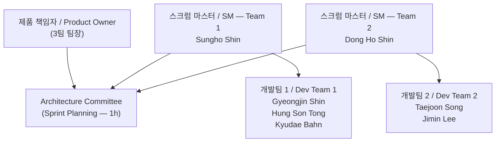

# 프로젝트 플랜 (M1) — 애자일 기반 / Project Plan (M1) — Agile-Based

> **작성일 / Date**: 2026-06-05  
> **제출 기한 / Due**: 2026-06-09  
> **버전 / Version**: 0.1 (Draft)

---

## 1. 개요 / Overview

**한국어**

본 문서는 TimeGrapher 프로젝트의 Milestone 1 기준 프로젝트 플랜을 애자일(스크럼) 방식으로 정의한다.
2일 단위 스프린트를 기반으로 역할 분담, 아키텍처 기반 구현 태스크, 기술 실험 계획을 포함한다.

**English**

This document defines the Milestone 1 project plan for the TimeGrapher project using an Agile (Scrum) framework.
Based on 2-day sprints, it covers role assignments, architecture-driven construction tasks, and planned technical experiments.

---

## 2. 역할 정의 / Role Definitions

**한국어**

| 역할 / Role | 담당자 / Assignee | 책임 / Responsibility |
|---|---|---|
| 제품 책임자 (Product Owner) | 3팀 팀장 (Team 3 Lead) | 요구사항 우선순위 결정, 스프린트 목표 승인 |
| 스크럼 마스터 — 팀 1 | Sungho Shin | 스프린트 진행 관리, 장애 제거, Architecture Committee 참여 |
| 스크럼 마스터 — 팀 2 | Dong Ho Shin | 스프린트 진행 관리, 장애 제거, Architecture Committee 참여 |
| 개발팀 1 | Gyeongjin Shin, Hung Son Tong, Kyudae Bahn | 기능 구현 및 실험 수행 |
| 개발팀 2 | Taejoon Song, Jimin Lee | 기능 구현 및 실험 수행 |

**English**

| 역할 / Role | 담당자 / Assignee | 책임 / Responsibility |
|---|---|---|
| Product Owner | Team 3 Lead | Prioritize requirements, approve sprint goals |
| Scrum Master — Team 1 | Sungho Shin | Manage sprint progress, remove blockers, join Architecture Committee |
| Scrum Master — Team 2 | Dong Ho Shin | Manage sprint progress, remove blockers, join Architecture Committee |
| Dev Team 1 | Gyeongjin Shin, Hung Son Tong, Kyudae Bahn | Feature implementation and experiments |
| Dev Team 2 | Taejoon Song, Jimin Lee | Feature implementation and experiments |

---

## 3. 애자일 운영 방식 / Agile Ceremonies

**한국어**

| 이벤트 / Event | 주기 / Cadence | 참여자 / Participants | 시간 / Duration |
|---|---|---|---|
| 스프린트 계획 회의 (Sprint Planning) | 매 스프린트 시작 (2일마다) | Architecture Committee (양 팀 SM + PO) | 1시간 |
| 스프린트 개발 (Sprint) | 2일 | 각 팀 독립 진행 | 2일 |
| 스프린트 리뷰 & 회고 (Review & Retrospective) | 매 스프린트 종료 | 전체 팀 | 1시간 |

- **Architecture Committee**: 스프린트 계획 회의에서 아키텍처 결정(Architectural Decision)을 내리는 거버넌스 바디. 양 팀 스크럼 마스터(Sungho Shin, Dong Ho Shin) 및 PO로 구성.
- 각 팀은 동일한 스프린트 목표를 공유하되, 태스크 배분은 팀 내에서 자율적으로 결정.

**English**

| 이벤트 / Event | 주기 / Cadence | 참여자 / Participants | 시간 / Duration |
|---|---|---|---|
| Sprint Planning | Every sprint start (every 2 days) | Architecture Committee (both SMs + PO) | 1 hour |
| Sprint (Development) | 2 days | Each team independently | 2 days |
| Sprint Review & Retrospective | Every sprint end | Full team | 1 hour |

- **Architecture Committee**: Governance body that makes Architectural Decisions during Sprint Planning. Composed of both Scrum Masters (Sungho Shin, Dong Ho Shin) and the PO.
- Both teams share the same sprint goal; task allocation within each team is decided autonomously.

---

## 4. 전체 아키텍처 기반 구현 태스크 / Architecture-Based Construction Tasks

**한국어**

TimeGrapher 시스템은 아래 파이프라인 아키텍처를 기반으로 구현된다.
각 레이어는 독립적으로 교체 가능한 모듈로 설계하여 **확장성(Extensibility)** QA를 충족한다.

```
[오디오 캡처 / Audio Capture]
       ↓
[신호 필터링 / Signal Filtering]  ← Low-pass / High-pass
       ↓
[박동 이벤트 감지 / Beat Event Detection]  ← T1 / T3
       ↓
[측정값 계산 / Measurement Calculation]  ← Rate / Amplitude / Beat Error
       ↓
[그래프 렌더링 / Graph Rendering]  ← Qt GUI
```

**English**

The TimeGrapher system is implemented based on the pipeline architecture below.
Each layer is designed as an independently replaceable module to satisfy the **Extensibility** QA.

| 레이어 / Layer | 주요 태스크 / Key Tasks | 담당 QA / Target QA |
|---|---|---|
| 오디오 캡처 / Audio Capture | sps 설정 (96k/48k/192k), AGC 비활성화 확인 | Real-Time Performance |
| 신호 필터링 / Signal Filtering | Low-pass / High-pass 필터 구현 및 파라미터 튜닝 | Correctness, Accuracy |
| 박동 감지 / Beat Detection | T1/T3 onset 감지 알고리즘 구현 | Measurement Accuracy |
| 측정값 계산 / Measurement Calc | Rate, Amplitude, Beat Error 공식 구현 | Correctness |
| 그래프 렌더링 / Graph Rendering | 11종 그래프 플러그인 방식 구현 (Plugin/Observer 패턴) | Extensibility, Low Latency |
| RPi 검증 / RPi Validation | 각 그래프 완성 후 즉시 RPi 빌드 및 실행 확인 | Real-Time Performance |

---

## 5. 스프린트 계획 / Sprint Schedule

**한국어**

M1 제출(06/09) 전까지의 스프린트는 문서 작성 + 코드베이스 분석에 집중한다.
M1 제출 이후부터 기능 구현 스프린트가 시작된다.
QA 우선순위 및 실험 목록은 확정 후 업데이트 예정.

**English**

Sprints before M1 submission (06/09) focus on document writing + codebase analysis.
Feature implementation sprints begin after M1 submission.
QA priorities and experiment list will be updated once finalized.

---

### 5-1. Phase 1 — 정확한 기능/공식 구현 / Correctness-First Implementation

> **기간 / Period**: 06/09 ~ 06/15 (스프린트 1~3 / Sprint 1–3)  
> **집중 QA / Focus QA**: Correctness, Measurement Accuracy

#### Sprint 1 (06/09 ~ 06/10)

**계획 회의 아키텍처 결정 사항 (Architecture Committee)**
- T1/T3 감지 알고리즘 선택 (threshold vs. peak-picking)
- Rate / Amplitude / Beat Error 수식 구현 전략 확정

| 태스크 / Task | 팀 / Team | 비고 / Notes |
|---|---|---|
| Experiment 1: RPi sps 성능 측정 시작 | Team 1 | 96k/48k/192k sps 처리 시간 측정 |
| Experiment 2: Qt GUI 렌더링 FPS 측정 시작 | Team 2 | 그래프 업데이트 주기 vs CPU 사용률 |
| Rate / Amplitude / Beat Error 수식 검증 | Both | `TimeGrapher Equations_v0` 기준 |

**리뷰 목표 / Review Goal**: Experiment 1, 2 초기 데이터 확보. 수식 구현 정확성 검토.

---

#### Sprint 2 (06/11 ~ 06/12)

**계획 회의 아키텍처 결정 사항 (Architecture Committee)**
- Beat event 감지 파이프라인 모듈 경계 확정
- 필터 파라미터 (cutoff frequency) 초기값 결정

| 태스크 / Task | 팀 / Team | 비고 / Notes |
|---|---|---|
| Experiment 3: T1/T3 감지 정확도 측정 시작 | Team 1 | WeiShi 1000 대비 오차 |
| Low-pass / High-pass 필터 구현 | Team 2 | — |
| Trace Display 구현 시작 | Both | Rate 편차 + Amplitude 연속 기록 |

**리뷰 목표 / Review Goal**: 필터 적용 전/후 신호 품질 비교. T1/T3 감지 초기 정확도 수치 확보.

---

#### Sprint 3 (06/13 ~ 06/15)

**계획 회의 아키텍처 결정 사항 (Architecture Committee)**
- TODO: QA 우선순위 확정 후 결정 항목 추가

| 태스크 / Task | 팀 / Team | 비고 / Notes |
|---|---|---|
| Beat-Noise Scope (Scope 1 & 2) 구현 | Team 1 | 개별 박동 파형 + Σ 평균 |
| Beat Error Display & Diagnostic Trace 구현 | Team 2 | — |
| RPi 빌드 검증 (Graphs 1~2) | Both | 각 그래프 완성 즉시 RPi 확인 |

**리뷰 목표 / Review Goal**: 구현된 그래프의 WeiShi 1000 수치 대비 정확도 확인.

---

### 5-2. Phase 2 — 속도 최적화 / Speed-Focused Implementation

> **기간 / Period**: 06/16 ~ 06/19 (스프린트 4~5 / Sprint 4–5)  
> **집중 QA / Focus QA**: Real-Time Performance, Low Latency

#### Sprint 4 (06/16 ~ 06/17)

**계획 회의 아키텍처 결정 사항 (Architecture Committee)**
- TODO: Experiment 1, 2 결과 기반 렌더링 전략 결정 (double-buffering 여부 등)

| 태스크 / Task | 팀 / Team | 비고 / Notes |
|---|---|---|
| Rate & Amplitude Stability (Vario) 구현 | Team 1 | Min/Max/Avg/σ 통계 |
| Module View 문서 작성 | Team 2 | 코드 레벨 구조 + 의존성 |
| C&C View 문서 작성 | Both | 런타임 컴포넌트-커넥터 뷰 |

**리뷰 목표 / Review Goal**: 캡처→처리→표시 end-to-end 레이턴시 초기 측정값 확보.

---

#### Sprint 5 (06/18 ~ 06/19)

**계획 회의 아키텍처 결정 사항 (Architecture Committee)**
- TODO: 레이턴시 병목 지점 기반 최적화 전략 확정

| 태스크 / Task | 팀 / Team | 비고 / Notes |
|---|---|---|
| Experiment 결과 취합 및 아키텍처 뷰 반영 | Both | M2 문서 준비 |
| RPi 빌드 검증 (Graphs 3~4) | Both | — |
| Deployment View 문서 작성 | Team 1 | RPi 하드웨어 배치 + 통신 채널 |

**리뷰 목표 / Review Goal**: Architecture Views 초안 완성. M2 제출 준비.

---

### 5-3. Phase 3 — 메모리/CPU 리소스 최적화 / Memory & CPU Optimization

> **기간 / Period**: 06/22 ~ 06/25 (스프린트 6~7 / Sprint 6–7)  
> **집중 QA / Focus QA**: Real-Time Performance (96k sps on RPi)

#### Sprint 6 (06/22 ~ 06/23)

**계획 회의 아키텍처 결정 사항 (Architecture Committee)**
- TODO: 실험 결과 기반 메모리 관리 전략 결정 (ring buffer 크기 등)

| 태스크 / Task | 팀 / Team | 비고 / Notes |
|---|---|---|
| Multi-Position Sequence Display 구현 | Team 1 | 최대 10포지션 비교 |
| Long-Term Performance Graph 구현 | Team 2 | Rate/Amplitude/Beat Error 장기 추이 |
| RPi 통합 검증 — 레이턴시 측정 | Both | 구간별 (capture→process, process→display) |

**리뷰 목표 / Review Goal**: RPi 96k sps 동작 확인. 메모리 사용량 프로파일링.

---

#### Sprint 7 (06/24 ~ 06/25)

**계획 회의 아키텍처 결정 사항 (Architecture Committee)**
- TODO: CPU 사용률 병목 해소 전략

| 태스크 / Task | 팀 / Team | 비고 / Notes |
|---|---|---|
| Escapement Analyzer & Marker-Line Display 구현 | Team 1 | A/C 이벤트 마커 + ms 레이블 |
| Time-Frequency Spectrogram 구현 | Team 2 | 시간-주파수 에너지 분포 |
| 오디오 블록 드롭 & 누락 박동 수 측정 | Both | — |

**리뷰 목표 / Review Goal**: 96k sps에서 드롭 없는 안정 동작 확인.

---

### 5-4. Phase 4 — 확장성 기능 구현 / Extensibility Features

> **기간 / Period**: 06/26 ~ 06/28 (스프린트 8 / Sprint 8)  
> **집중 QA / Focus QA**: Extensibility

#### Sprint 8 (06/26 ~ 06/28)

**계획 회의 아키텍처 결정 사항 (Architecture Committee)**
- TODO: Plugin/Observer 패턴 적용 범위 최종 확정

| 태스크 / Task | 팀 / Team | 비고 / Notes |
|---|---|---|
| Waveform Comparison Display 구현 | Team 1 | 정렬된 연속 박동 파형 비교 |
| Scope Mode & Scope Function (F0~F3) 구현 | Team 2 | 오실로스코프 방식 + 4필터 동시 표시 |
| 확장성 검증 — 새 그래프 추가 시 변경 파일 수 측정 | Both | Extensibility QA 증거 수집 |
| Enhanced Features (Pause, Time-axis nav, etc.) | Both | — |

**리뷰 목표 / Review Goal**: 새 그래프 추가 시 영향받는 파일 수 측정. Extensibility QA 증거 확보.

---

## 6. 기술 실험 계획 / Planned Technical Experiments

**한국어**

아래 실험들은 아키텍처 결정을 검증하고 QA 목표 달성 가능성을 사전 확인하기 위해 수행된다.
세부 실험 문서는 `technical-experiment-template.md` 템플릿을 사용하여 별도 작성한다.

**English**

The following experiments are conducted to validate architectural decisions and verify feasibility of QA targets.
Detailed experiment documents are written separately using the `technical-experiment-template.md` template.

| 실험 번호 / Exp # | 실험명 / Name | 목적 / Purpose | 해소 질문 / Key Question | 완료 기준 / Completion Criteria | 수행 시점 / Timing |
|---|---|---|---|---|---|
| Exp 1 | RPi sps 성능 측정 / RPi sps Performance | Real-Time Performance QA 달성 가능성 확인 | RPi 5에서 96k sps 처리가 가능한가? | sps별 처리 시간 수치 확보 | Sprint 1 (06/09~) |
| Exp 2 | Qt GUI 렌더링 FPS 측정 / Qt GUI Rendering FPS | 렌더링 병목 여부 확인 | 실시간 그래프 업데이트가 CPU 병목을 유발하는가? | 허용 FPS 범위 + 렌더링 병목 판정 | Sprint 1 (06/09~) |
| Exp 3 | T1/T3 감지 정확도 / T1/T3 Detection Accuracy | Measurement Accuracy QA 달성 가능성 확인 | WeiShi 1000 대비 오차 마진은 얼마인가? | 오차 마진 수치 확보 | Sprint 2 (06/11~) |
| Exp 4 (TODO) | TODO: QA 우선순위 확정 후 추가 | — | — | — | TBD |
| Exp 5 (TODO) | TODO: QA 우선순위 확정 후 추가 | — | — | — | TBD |

---

## 7. 마일스톤 연계 / Milestone Linkage

**한국어**

| 마일스톤 / Milestone | 기한 / Due | 연계 스프린트 / Linked Sprints | 주요 산출물 / Key Deliverables |
|---|---|---|---|
| **M1** | 2026-06-09 | M1 제출 전 (Phase 0) | Project Plan, Architectural Drivers, Risk Assessment, Planned Experiments, Architectural Approaches |
| **M2** | 2026-06-22 | Sprint 1~5 | 실험 결과, Architecture Views (Module/C&C/Deployment), Construction Plan, Updated Project Plan |
| **M3 (Final Demo)** | 2026-07-01 | Sprint 6~8 | RPi 최종 데모, 팀 발표 (20분) |

**English**

| 마일스톤 / Milestone | 기한 / Due | 연계 스프린트 / Linked Sprints | 주요 산출물 / Key Deliverables |
|---|---|---|---|
| **M1** | 2026-06-09 | Pre-M1 (Phase 0) | Project Plan, Architectural Drivers, Risk Assessment, Planned Experiments, Architectural Approaches |
| **M2** | 2026-06-22 | Sprint 1–5 | Experiment Results, Architecture Views (Module/C&C/Deployment), Construction Plan, Updated Project Plan |
| **M3 (Final Demo)** | 2026-07-01 | Sprint 6–8 | RPi Final Demo, Team Presentation (20 min) |

---

## 8. 미결 항목 / Open Items (TODO)

**한국어**

| 항목 / Item | 담당자 / Owner | 해결 기한 / Target |
|---|---|---|
| QA 우선순위 확정 (5개 QA 중 High/Medium/Low 분류) | Architecture Committee | M1 제출 전 (06/09) |
| 실험 목록 최종화 (Exp 4, 5 이상 추가 여부) | Architecture Committee | M1 제출 전 (06/09) |
| 팀별 태스크 세부 배분 (팀 내부 합의) | Sungho Shin, Dong Ho Shin | Sprint 1 계획 회의 (06/09) |
| Sprint 계획 회의별 아키텍처 결정 항목 확정 | Architecture Committee | 각 스프린트 시작 전 |

**English**

| 항목 / Item | 담당자 / Owner | 해결 기한 / Target |
|---|---|---|
| Finalize QA priorities (H/M/L classification for 5 QAs) | Architecture Committee | Before M1 (06/09) |
| Finalize experiment list (add Exp 4, 5+?) | Architecture Committee | Before M1 (06/09) |
| Detailed task allocation per team (internal agreement) | Sungho Shin, Dong Ho Shin | Sprint 1 Planning (06/09) |
| Confirm architectural decision topics for each sprint planning | Architecture Committee | Before each sprint start |

---

## 9. 팀 구성 요약 / Team Summary

**한국어**



**English**

Both teams operate on identical 2-day sprint cycles. The Architecture Committee (PO + both SMs) convenes at the start of each sprint to make architectural decisions before development begins.
