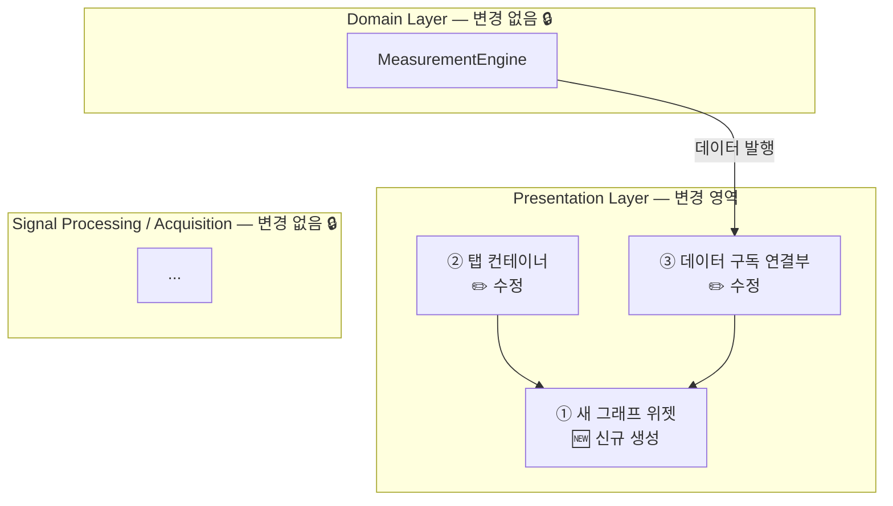

# Quality Attribute Scenarios — Extensibility / 확장성 시나리오

**팀 / Team**: Blue Sky (3팀) | **마일스톤 / Milestone**: M1 | **마감 / Due**: 2026-06-09

---

## EXT-1: New Graph Addition / 새 그래프 추가 (Extensibility)

**한국어**

| 항목 | 내용 |
|------|------|
| **Source** | 개발자 (새 그래프 또는 표시 기능 추가) |
| **Stimulus** | 기존 코드베이스에 새로운 그래프 탭 추가 요청 (예: Spectrogram, Long-Term, Sequence 등) |
| **Artifact** | 소스코드 |
| **Environment** | 개발 환경 (Qt Creator, Windows PC), 5주 프로젝트 진행 기간 내 |
| **Response** | 기존 전처리 모듈 수정 없이 새 그래프 위젯을 독립적으로 생성·등록·테스트 가능 |
| **Response Measure** | 새 그래프 1개 추가 시 변경되는 파일 수: **≤ 3개** *(잠정, 코드 분석 후 확정)* |

**English**

| Field | Content |
|-------|---------|
| **Source** | Developer (adding a new graph or display feature) |
| **Stimulus** | Request to add a new graph tab to the existing codebase (e.g., Spectrogram, Long-Term, Sequence) |
| **Artifact** | Source code |
| **Environment** | Development environment (Qt Creator, Windows PC), within the 5-week project period |
| **Response** | New graph widget can be created, registered, and tested independently without modifying existing preprocessing modules |
| **Response Measure** | Files changed when adding 1 new graph: **≤ 3** *(provisional, confirmed after codebase analysis)* |

---

**추가 시 변경 파일 구조 / Expected File Change Breakdown:**

**한국어**

| 변경 유형 | 대상 | 설명 |
|----------|------|------|
| 새로 생성 | 새 그래프 위젯 모듈 | 새 그래프 클래스 파일 |
| 수정 | 탭 컨테이너 | 새 탭 등록 |
| 수정 | 데이터 구독 연결부 | 데이터 소스 구독 연결 |

이보다 파일 수가 많으면 Presentation Layer가 충분히 분리되지 않았다는 구조적 신호입니다.

**English**

| Change type | Target | Description |
|-------------|--------|-------------|
| New file | New graph widget module | New graph class file |
| Modify | Tab container | Register the new tab |
| Modify | Data subscription wiring | Connect subscription to data source |

More than 3 files indicates that the Presentation Layer is not sufficiently decoupled.

---

**시나리오 / Scenario:**

**한국어**

> 구현해야 할 그래프가 11개이고, 모든 그래프가 공통 데이터 소스(MeasurementEngine)로부터 데이터를 소비한다. 현재 코드의 God Object 구조에서는 그래프를 하나 추가할 때마다 여러 파일에 걸친 수정이 필요하여, 개발 후반부로 갈수록 코드 충돌과 디버깅 비용이 늘어나는 일정 리스크가 있다.
>
> 이 QA가 만족되면, 각 개발자가 담당 그래프를 독립적으로 구현·테스트할 수 있으며, 기존 전처리 모듈을 건드리지 않고 표시 레이어만 확장하는 것이 가능하다. 11개 그래프를 5주 안에 병렬로 개발하기 위한 선행 조건이다.

**English**

> There are 11 graphs to implement, and all of them consume data from a common data source (MeasurementEngine). In the current God Object structure, adding each new graph requires modifying multiple files, creating a schedule risk where code conflicts and debugging costs grow as development progresses.
>
> When this QA is satisfied, each developer can implement and test their assigned graph independently without touching existing preprocessing modules. This is a prerequisite for developing 11 graphs in parallel within 5 weeks.

---

## 우선순위 / Priority

**한국어**

| 항목 | 수준 | 근거 |
|------|------|------|
| **Importance** | High | 11개 그래프를 5주 안에 구현해야 하므로, 각 그래프를 독립적으로 추가할 수 있는 구조가 일정 리스크를 직접 통제함 |
| **Difficulty** | High | 현재 God Object 구조를 Observer 패턴(Signal-Slot)으로 재구성하는 리팩터링이 필요하며, 기존 동작을 보존하면서 레이어를 분리해야 하므로 구현 난이도가 높음 |

**English**

| Item | Level | Rationale |
|------|-------|-----------|
| **Importance** | High | With 11 graphs to deliver in 5 weeks, the ability to add each graph independently directly controls schedule risk |
| **Difficulty** | High | Refactoring the current God Object structure into an Observer pattern (Signal-Slot) requires layer separation while preserving existing behavior |

---

## 리스크 / Risk

**한국어**

| 리스크 | 설명 | 영향 |
|--------|------|------|
| 불완전한 레이어 분리 | Observer 패턴으로 리팩터링한 후에도 잔존 결합이 남아 그래프 추가 시 Presentation Layer 외 모듈까지 수정하게 되는 경우 | ≤ 3개 목표 달성 불가, 개발 후반부로 갈수록 충돌 증가 |
| 리팩터링 중 기존 기능 파손 | God Object 구조를 분리하는 과정에서 기존 그래프(Trace, Beat Error 등) 동작에 사이드이펙트 발생 | 롤백 시 구조 분리 실패 → Extensibility 목표 달성 불가 |
| 새 그래프에 신규 데이터 필요 | 추가하려는 그래프가 MeasurementEngine이 현재 제공하지 않는 데이터를 필요로 하는 경우 (예: Spectrogram의 raw 오디오) | 전처리 레이어까지 수정 범위가 확대되어 ≤ 3개 목표 달성 불가 |

**English**

| Risk | Description | Impact |
|------|-------------|--------|
| Incomplete layer separation | Residual coupling remains after Observer-pattern refactoring, requiring modification of modules outside the Presentation Layer when adding a graph | ≤ 3 target not met; conflicts accumulate as development progresses |
| Regression during refactoring | Separating the God Object structure introduces side effects in existing graphs (Trace, Beat Error, etc.) | Rollback forces reversion to tight coupling → Extensibility goal fails |
| New graph requires additional data | The graph to be added needs data not currently provided by MeasurementEngine (e.g., raw audio for Spectrogram) | Modification scope expands into preprocessing layers → ≤ 3 target not met |

---

## 실험 계획 / Experiment Plan

### 실험: ≤ 3개 파일 구조 검증 / Experiment: ≤ 3-File Constraint Verification

> **선행 조건 / Prerequisite**: Observer 패턴(Signal-Slot) 기반 Layered Architecture 리팩터링 완료 후 실행.
> 리팩터링 미완료 상태에서는 측정 결과가 목표 구조를 반영하지 않음.
>
> **Prerequisite**: Run after Layered Architecture refactoring based on Observer pattern (Signal-Slot) is complete.
> Results measured before refactoring do not reflect the target architecture.

**한국어**

| 항목 | 내용 |
|------|------|
| **목적** | Observer 패턴(Signal-Slot) 기반 구조에서 새 그래프 1개 추가 시 실제 변경 파일 수가 ≤ 3개임을 코드 분석으로 확인 |
| **방법** | ① 기존 그래프 중 1개(예: Trace Display)를 기준으로 추가에 필요한 파일 변경 목록을 역추적 분석. ② 신규 그래프를 실제로 추가하면서 변경 파일 수 측정. ③ 결과가 3개 초과 시 구조 개선 방향 도출 |
| **완료 기준** | 신규 그래프 추가 시 변경 파일 수 ≤ 3개 확인. Response Measure 확정 및 문서에 반영 |

**English**

| Item | Content |
|------|---------|
| **Purpose** | Verify via codebase analysis that adding 1 new graph in the Observer-pattern (Signal-Slot) structure touches ≤ 3 files |
| **Method** | ① Trace back the file change list required to add an existing graph (e.g., Trace Display) as a baseline. ② Add a new graph and measure the number of changed files. ③ If result exceeds 3, derive structural improvement direction |
| **Completion criteria** | Confirm ≤ 3 files changed for new graph addition. Update Response Measure with confirmed value |

---

## 전술 · 패턴 / Tactic · Pattern

**한국어**

| 전술 / 패턴 | 연결 근거 |
|------------|---------|
| **Split Module** | 현재 God Object 구조를 기능별 모듈(전처리·표시·수집)로 분리하여 각 모듈이 단일 책임을 갖도록 함. 새 그래프 추가 시 표시 모듈만 영향을 받아 변경 범위가 최소화됨 |
| **Observer (Signal-Slot)** | 전처리 모듈이 측정값을 발행하면 각 그래프가 독립적으로 구독. 새 그래프 추가 시 기존 로직 수정 없이 구독만 추가하면 됨 |
| **Restrict Dependencies** | Presentation Layer는 Domain Layer(MeasurementEngine 인터페이스)만 참조 가능하도록 의존 방향을 제한. Signal Processing 내부를 직접 참조하지 않으므로 표시 레이어만 독립적으로 추가·교체 가능. Layered Architecture로 구현하여 Separation of Concerns 달성 |

**English**

| Tactic / Pattern | Connection rationale |
|-----------------|---------------------|
| **Split Module** | Split the current God Object structure into focused modules (preprocessing, display, acquisition), each with a single responsibility. When adding a new graph, only the display module is affected, minimizing the scope of change |
| **Observer (Signal-Slot)** | The preprocessing module publishes measurement results; each graph subscribes independently. Adding a new graph only requires adding a subscription — no changes to existing logic |
| **Restrict Dependencies** | Presentation Layer is allowed to reference only the Domain Layer (MeasurementEngine interface), not Signal Processing internals. The display layer can therefore be added or replaced independently. Implemented via Layered Architecture to achieve Separation of Concerns |
