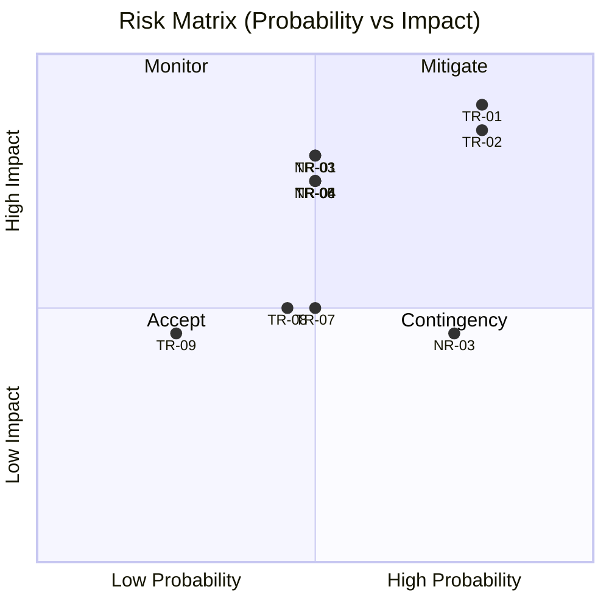

# 리스크 평가 / Risk Assessment

> **작성일 / Date**: 2026-06-03  
> **마일스톤 / Milestone**: M1 | **제출일 / Due**: 2026-06-09

---

## 1. 기술 및 비기술 리스크 / Technical and Non-Technical Risks

**한국어**

> 확률(Probability) 및 영향도(Impact): H = High / M = Medium / L = Low

### 기술 리스크 / Technical Risks

| ID | 리스크 / Risk | 확률 / Prob | 영향 / Impact | 수준 / Level |
|----|--------------|:-----------:|:-------------:|:------------:|
| TR-01 | Raspberry Pi 5에서 Qt GUI 실행 중 96,000 sps 실시간 처리 불가 — CPU 병목 발생 가능 | H | H | 🔴 H |
| TR-02 | T1/T3 beat event 검출 정확도 미달 — 시계 기종·환경마다 음향 패턴이 달라 threshold 일반화 어려움 | H | H | 🔴 H |
| TR-03 | AGC 비활성화 설정이 재부팅 후 리셋 — AlsaMixer 설정 초기화로 측정값 재현성 손실 | M | H | 🔴 H |
| TR-04 | Rate / Amplitude / Beat Error 계산 오류 — Equations_v0 수식 적용 실수 또는 엣지케이스 누락 | M | H | 🟡 M |
| TR-05 | 다중 그래프 탭 동시 활성화 시 Qt 렌더링 FPS 저하 | M | H | 🟡 M |
| TR-06 | USB 오디오 버퍼 언더런으로 beat 누락 발생 | M | H | 🟡 M |
| TR-07 | 기존 코드베이스(v10.5) 구조 파악 난이도 — 잘못된 이해 기반 확장 설계 시 아키텍처 오류 | M | M | 🟡 M |
| TR-08 | 크로스컴파일(macOS → RPi ARM64) 환경 셋업 실패 또는 빌드 복잡도 증가 | M | M | 🟡 M |
| TR-09 | Time-Frequency Spectrogram의 FFT 연산이 RPi에서 실시간 처리에 과부하 | L | M | 🟢 L |

### 비기술 리스크 / Non-Technical Risks

| ID | 리스크 / Risk | 확률 / Prob | 영향 / Impact | 수준 / Level |
|----|--------------|:-----------:|:-------------:|:------------:|
| NR-01 | WeiShi 1000 레퍼런스 디바이스 접근 지연 — 정확도 비교 기준 없이 Correctness 검증 불가 | M | H | 🟡 M |
| NR-02 | 하드웨어(RPi / 마이크 / 터치스크린) 수령·셋업 지연으로 물리 실험 선행 불가 | M | M | 🟡 M |
| NR-03 | 스코프 크리프 — 선택 기능 구현에 집중하여 핵심 기능 품질 저하 | H | M | 🟡 M |
| NR-04 | 측정 수식 오해로 잘못된 구현 — Equations_v0 미숙지 | M | H | 🟡 M |
| NR-05 | 팀원 역할 불명확으로 설계·실험 작업 직렬화 | L | M | 🟢 L |

**English**

> Probability and Impact scale: H = High / M = Medium / L = Low

### Technical Risks

| ID | Risk | Prob | Impact | Level |
|----|------|:----:|:------:|:-----:|
| TR-01 | Raspberry Pi 5 cannot sustain 96,000 sps with Qt GUI running — CPU bottleneck likely | H | H | 🔴 H |
| TR-02 | T1/T3 beat event detection accuracy insufficient — acoustic patterns vary across watch models and environments | H | H | 🔴 H |
| TR-03 | AGC disable setting resets after reboot — AlsaMixer state lost, measurement reproducibility degraded | M | H | 🔴 H |
| TR-04 | Rate / Amplitude / Beat Error calculation errors — formula misapplication or edge cases in Equations_v0 | M | H | 🟡 M |
| TR-05 | Qt rendering FPS degrades when multiple graph tabs are active simultaneously | M | H | 🟡 M |
| TR-06 | USB audio buffer underruns cause dropped audio blocks and missed beats | M | H | 🟡 M |
| TR-07 | Difficulty understanding baseline codebase (v10.5) structure — wrong mental model leads to flawed extension design | M | M | 🟡 M |
| TR-08 | Cross-compilation setup (macOS → RPi ARM64) fails or adds build complexity | M | M | 🟡 M |
| TR-09 | FFT computation for Time-Frequency Spectrogram too CPU-intensive for real-time on RPi | L | M | 🟢 L |

### Non-Technical Risks

| ID | Risk | Prob | Impact | Level |
|----|------|:----:|:------:|:-----:|
| NR-01 | Delayed access to WeiShi 1000 reference device — cannot validate Correctness QA without comparison baseline | M | H | 🟡 M |
| NR-02 | Hardware (RPi / microphone / touchscreen) arrives late, blocking physical experiments | M | M | 🟡 M |
| NR-03 | Scope creep — optional features consume time at expense of core feature quality | H | M | 🟡 M |
| NR-04 | Misunderstanding of measurement equations leads to incorrect implementation | M | H | 🟡 M |
| NR-05 | Unclear team role assignments cause design and experiment tasks to be serialized | L | M | 🟢 L |

---

## 2. 오픈 이슈와 프로젝트 결과의 연관성 / Open Issues and Their Impact on Project Outcome

**한국어**

각 오픈 이슈는 핵심 품질 속성(QA)에 직접 연결되며, 해소되지 않으면 최종 데모 결과에 영향을 미칩니다.

| 오픈 이슈 / Open Issue | 연결 리스크 / Linked Risk | 연결 QA / QA | 미해소 시 영향 / Impact if Unresolved |
|------------------------|--------------------------|--------------|--------------------------------------|
| Pi 5에서 96k sps 실시간 처리 가능한가? | TR-01 | Real-Time Performance | 최종 데모에서 실시간 동작 불가 |
| T1/T3 beat event를 정확히 검출할 수 있는가? | TR-02 | Correctness / Accuracy | Rate·Amplitude·Beat Error 전부 오류 |
| AGC 비활성화 상태가 실험 간 일관성 있게 유지되는가? | TR-03 | Consistency | 측정값 재현성 손실, 실험 신뢰도 저하 |
| Equations_v0 수식 구현이 WeiShi 1000과 일치하는가? | TR-04 | Measurement Accuracy | M3 데모 정확도 기준 미달 |
| 새 그래프를 기존 코드 수정 없이 추가할 수 있는가? | TR-07 | Extensibility | 요구 그래프 11종 구현 일정 초과 |

**English**

Each open issue is directly linked to a core Quality Attribute (QA). If left unresolved, the issue will materially affect the final demo outcome.

| Open Issue | Linked Risk | QA | Impact if Unresolved |
|------------|-------------|-----|----------------------|
| Can Pi 5 process 96k sps in real time with Qt running? | TR-01 | Real-Time Performance | Real-time operation fails at final demo |
| Can T1/T3 beat events be detected accurately? | TR-02 | Correctness / Accuracy | Rate, Amplitude, Beat Error all incorrect |
| Does AGC disable setting persist across experiments? | TR-03 | Consistency | Measurement reproducibility lost, experiment validity undermined |
| Does the Equations_v0 implementation match WeiShi 1000 output? | TR-04 | Measurement Accuracy | Accuracy criteria not met at M3 demo |
| Can new graphs be added without modifying existing code? | TR-07 | Extensibility | Unable to implement all 11 required graphs on schedule |

---

## 3. 오픈 이슈 해소 액션 / Actions to Address Open Issues

**한국어**

| 리스크 ID / Risk ID | 액션 / Action | 수단 / Method |
|--------------------|--------------|--------------|
| TR-01 | Pi 5 실시간 처리 성능 측정 | **EX-01**: Sim 모드로 96k / 48k sps 처리 시간·CPU 사용률 비교 측정 → DSP/렌더링 스레드 분리 여부 결정 |
| TR-02 | T1/T3 검출 알고리즘 검증 | **EX-02**: 알려진 BPH 시계 녹음 파일로 Playback, threshold vs peak detection 정확도 비교 |
| TR-03 | AGC 비활성화 자동 유지 | 부팅 시 AlsaMixer 설정 자동 적용 스크립트 작성 및 재부팅 후 측정값 편차 검증 |
| TR-04 | 수식 구현 정확도 검증 | Equations_v0 기반 단위 테스트 작성, WeiShi 1000 측정값과 수치 비교 |
| TR-05 | 렌더링 성능 측정 | 다중 탭 동시 활성화 시 FPS 모니터링, 탭별 독립 렌더 타이머 적용 |
| TR-06 | USB 버퍼 설정 최적화 | 버퍼 크기 조정 실험, 드롭 블록 카운트 모니터링 |
| TR-07 | v10.5 코드 구조 분석 | 코드 리딩 후 모듈 구조 다이어그램 작성, Architectural Approaches에 반영 |
| TR-08 | 크로스컴파일 환경 셋업 | Qt Creator + RPi 빌드 환경 구성, 실패 시 RPi 네이티브 빌드로 전환 |
| NR-01 | WeiShi 1000 접근 전 대체 검증 | 접근 전까지 Playback 모드(녹음 파일)로 우선 검증 |
| NR-02 | 하드웨어 지연 대비 | 하드웨어 셋업 우선 진행, 지연 시 Sim 모드로 실험 진행 |
| NR-03 | 스코프 관리 | Architectural Drivers HIGH 기능 우선 구현, 선택 기능은 명시적으로 타임박스 |

**English**

| Risk ID | Action | Method |
|---------|--------|--------|
| TR-01 | Measure real-time processing performance on Pi 5 | **EX-01**: Compare CPU usage and processing time at 96k / 48k sps in Sim mode → decide on DSP/render thread separation |
| TR-02 | Validate T1/T3 detection algorithm | **EX-02**: Playback known-BPH watch recording, compare threshold vs peak detection accuracy |
| TR-03 | Ensure AGC disable persists | Write boot script to auto-apply AlsaMixer settings; verify measurement deviation across reboots |
| TR-04 | Verify calculation accuracy | Unit tests based on Equations_v0; cross-check numeric output against WeiShi 1000 reference |
| TR-05 | Measure rendering performance | Monitor FPS with multiple tabs active; apply per-tab independent render timers |
| TR-06 | Optimize USB buffer settings | Tune buffer size; monitor dropped block count |
| TR-07 | Analyze v10.5 code structure | Code reading session; produce module structure diagram; reflect in Architectural Approaches |
| TR-08 | Set up cross-compilation environment | Configure Qt Creator + RPi build target; fall back to native RPi build if needed |
| NR-01 | Alternative validation before WeiShi 1000 access | Use Playback mode (pre-recorded files) for interim accuracy validation |
| NR-02 | Contingency for hardware delays | Prioritize hardware setup; proceed with Sim mode if delayed |
| NR-03 | Scope management | Implement HIGH-priority Architectural Drivers first; explicitly timebox optional features |

---

## 4. 리스크 매트릭스 / Risk Matrix

---

## 5. 리뷰 체크리스트 / Review Checklist

- [ ] 기술/비기술 리스크 구분 완료 / Technical and non-technical risks distinguished
- [ ] 확률·영향도 H/M/L 평가 완료 / Probability and impact assessed on H/M/L scale
- [ ] 각 리스크에 완화 액션 정의 완료 / Mitigation actions defined for each risk
- [ ] 오픈 이슈와 QA 요구사항 연결 완료 / Open issues linked to QA requirements
- [ ] 실험(EX-01, EX-02)과 리스크 연결 완료 / Experiments linked to risks
