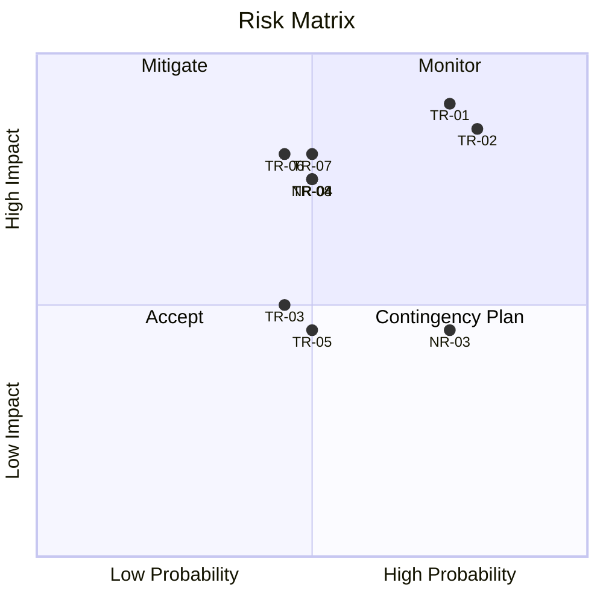

# Risk Assessment

**Milestone**: M1 | **Due**: 2026-06-09 | **Status**: [ ] Draft / [ ] Final

> Probability: H=High / M=Medium / L=Low  
> Impact: H=High / M=Medium / L=Low

---

## 1. Technical Risks

| ID | Risk | Probability | Impact | Mitigation / Action |
|----|------|-------------|--------|---------------------|
| TR-01 | Raspberry Pi 5 cannot sustain 96k sps with Qt GUI running | H | H | Benchmark early (Experiment EX-01); design pipeline to degrade gracefully at 48k sps |
| TR-02 | Beat event detection (T1/T3) is inaccurate or unstable on real watch signals | H | H | Conduct detection experiment (EX-02); compare onset vs peak detection approaches |
| TR-03 | Cross-compilation for RPi ARM64 fails or introduces build complexity | M | M | Set up and verify build pipeline in Week 1; use RPi-native build as fallback |
| TR-04 | Qt rendering FPS degrades when multiple graph tabs are active simultaneously | M | H | Experiment with rendering (EX-05); use separate render timers per tab; lazy rendering |
| TR-05 | Ambient noise causes erratic measurements, failing QAR-06 | M | M | Filter parameter experiment (EX-03); expose Low-pass/High-pass cutoffs as tunable |
| TR-06 | AGC re-enables after system restart, corrupting signal | M | H | Document AGC disable procedure; add startup check in application |
| TR-07 | Baseline TimeGrapher_v10.5 code structure is hard to extend (tight coupling) | M | H | Analyze code structure in Week 1; define clean module boundaries before extending |
| TR-08 | Amplitude calculation inaccurate due to incorrect T3 detection or lift angle | M | H | Validate against WeiShi 1000 reference; experiment with C Event Onset Amplitude parameter |
| TR-09 | Time-Frequency Spectrogram too CPU-intensive for real-time on RPi | L | M | Profile FFT cost early; consider downsampled spectrogram or async rendering |
| TR-10 | USB audio buffer underruns cause dropped audio blocks and missed beats | M | H | Monitor dropped block count; tune buffer size; report in latency metrics |

---

## 2. Non-Technical Risks

| ID | Risk | Probability | Impact | Mitigation / Action |
|----|------|-------------|--------|---------------------|
| NR-01 | Team member unavailable for critical implementation period | M | H | Document design decisions; no single point of knowledge; pair on critical modules |
| NR-02 | Hardware (RPi, microphone, touchscreen) arrives late or malfunctions | L | H | Begin with Sim mode and PC build; have fallback demo plan using Playback mode |
| NR-03 | Scope creep — too many optional features reduce quality of core features | H | M | Prioritize HIGH features first (see Architectural Drivers); timebox optional work |
| NR-04 | Misunderstanding of measurement equations leads to wrong implementation | M | H | Read TimeGrapher Equations_v0.pdf; validate each formula with known reference values |
| NR-05 | Mentor review reveals fundamental design flaw at M2 requiring rework | L | H | Present architectural approach at M1 for early feedback; use checkpoints proactively |

---

## 3. Open Issues

| ID | Issue | Status | Owner | Target Resolution |
|----|-------|--------|-------|-------------------|
| OI-01 | Confirm optimal sample rate achievable on RPi 5 | Open | | EX-01 result by M2 |
| OI-02 | Determine best T1 detection approach (onset vs peak) | Open | | EX-02 result by M2 |
| OI-03 | Confirm cross-compilation toolchain works | Open | | Week 1 |
| OI-04 | Understand baseline code module structure | Open | | Week 1 |

---

## 4. Risk Summary

---

## 5. Review Checklist

- [ ] Technical and non-technical risks distinguished
- [ ] Probability and impact assessed (H/M/L)
- [ ] Actions defined for each risk
- [ ] Open issues listed with owners and target resolution dates
