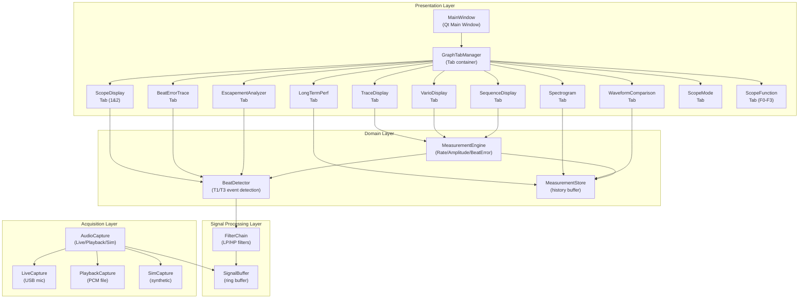
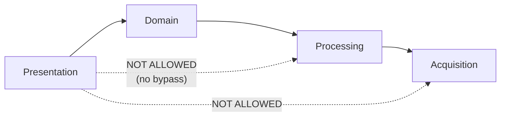

# Architecture — Module View

**Milestone**: M2 | **Due**: 2026-06-22 | **Status**: [ ] Draft / [ ] Final

> Describes the code-level structure: modules, their responsibilities, and dependencies.  
> At least one Module View is required per the project plan.

---

## 1. Module Overview

---

## 2. Module Descriptions

### Acquisition Layer

| Module | Responsibility | Key Interfaces |
|--------|---------------|----------------|
| `AudioCapture` | Abstraction over Live/Playback/Sim modes; produces PCM blocks | `start()`, `stop()`, `onBlock(PCMBlock)` callback |
| `LiveCapture` | USB microphone capture via ALSA/Qt Multimedia | Implements `AudioCapture` |
| `PlaybackCapture` | Reads pre-recorded PCM file | Implements `AudioCapture` |
| `SimCapture` | Generates synthetic watch signal | Implements `AudioCapture` |

### Signal Processing Layer

| Module | Responsibility | Key Interfaces |
|--------|---------------|----------------|
| `SignalBuffer` | Thread-safe ring buffer for PCM samples | `write(PCMBlock)`, `read(N)` |
| `FilterChain` | Applies LP/HP filter cascade to signal | `process(samples) → filtered_samples` |

### Domain Layer

| Module | Responsibility | Key Interfaces |
|--------|---------------|----------------|
| `BeatDetector` | Detects T1 (A) and T3 (C) events from filtered signal | `onSamples(filtered) → BeatEvent{t1, t3, timestamp}` |
| `MeasurementEngine` | Calculates Rate, Amplitude, Beat Error, BPH from beat events | `onBeat(BeatEvent) → Measurement` |
| `MeasurementStore` | Stores measurement history for long-term graphs | `append(Measurement)`, `getHistory(duration)` |

### Presentation Layer

| Module | Responsibility |
|--------|---------------|
| `MainWindow` | Qt main window; hosts control panel and tab widget |
| `GraphTabManager` | Manages graph tabs; routes measurement data to active tabs |
| `TraceDisplay` | Real-time rate + amplitude trace (smoothed) |
| `VarioDisplay` | Min/Max/Avg/σ stability stats for rate and amplitude |
| `SequenceDisplay` | Multi-position measurement table (up to 10 positions) |
| `ScopeDisplay` | Scope 1 (beat noise strip) + Scope 2 (tic/tac dual axis) |
| `BeatErrorTrace` | Numeric rate/amplitude/beat error + diagnostic trace line |
| `LongTermPerf` | Long-term rate/amplitude/beat error time series |
| `EscapementAnalyzer` | Waveform + A/C event markers + ms labels |
| `Spectrogram` | Time-frequency energy distribution |
| `WaveformComparison` | Aligned beat waveforms with timing markers |
| `ScopeMode` | Oscilloscope-style synchronized sweep display |
| `ScopeFunction` | F0/F1/F2/F3 filter views simultaneously |

---

## 3. Module Dependencies

**Dependency rules:**
- Presentation layer may only depend on Domain layer
- Domain layer may only depend on Processing layer
- No upward or cross-layer dependencies
- New graph tabs add to Presentation only — zero changes to Domain or below

---

## 4. Key Design Decisions Reflected Here

| Decision | Module Affected | Experiment |
|----------|----------------|------------|
| Onset vs Peak T1 detection | `BeatDetector` | EX-02 |
| LP/HP filter cutoffs | `FilterChain` | EX-03 |
| Threading: background audio thread | `AudioCapture`, `SignalBuffer` | EX-01, EX-05 |
| Sample rate target | `AudioCapture` | EX-01 |

---

## 5. Review Checklist

- [ ] Code-level structure and module boundaries expressed
- [ ] Dependencies between modules shown (no circular deps)
- [ ] Each module has clear single responsibility
- [ ] Architecture supports adding new graph tabs without modifying Domain/Processing
- [ ] Experiment results reflected in design decisions
