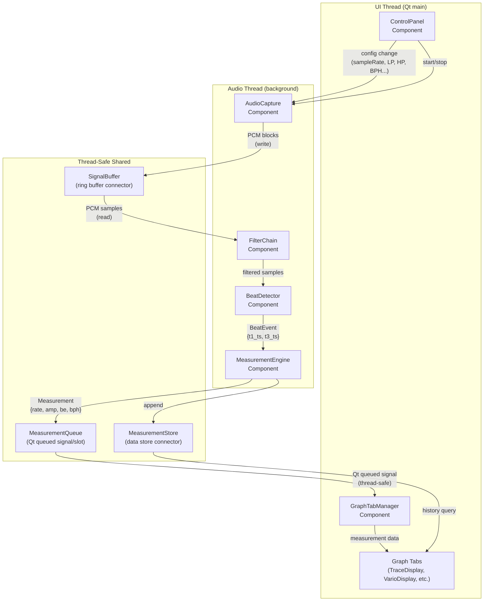
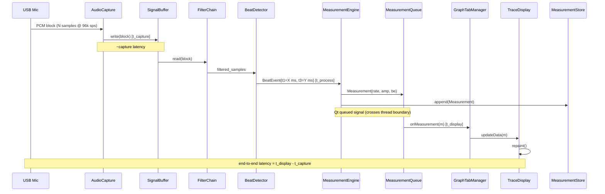

# Architecture — Runtime / C&C View

**Milestone**: M2 | **Due**: 2026-06-22 | **Status**: [ ] Draft / [ ] Final

> Describes the runtime perspective: components, connectors, and their interactions during execution.  
> At least one Runtime/C&C View is required per the project plan.

---

## 1. Component & Connector Overview

---

## 2. Component Descriptions

| Component | Thread | Role | Data In | Data Out |
|-----------|--------|------|---------|----------|
| `AudioCapture` | Audio | Produces PCM sample blocks from Live/Playback/Sim source | Config (mode, sampleRate) | PCM blocks → `SignalBuffer` |
| `FilterChain` | Audio | Applies LP/HP filter to PCM samples | Raw PCM samples | Filtered PCM samples |
| `BeatDetector` | Audio | Detects T1 and T3 acoustic events | Filtered PCM | `BeatEvent{t1_ts, t3_ts, amplitude_hint}` |
| `MeasurementEngine` | Audio | Calculates Rate/Amplitude/Beat Error/BPH | `BeatEvent` stream | `Measurement` → queue + store |
| `GraphTabManager` | UI | Receives measurements; routes to active tabs | `Measurement` (via Qt queue) | Per-tab data updates |
| `Graph Tabs` | UI | Render specific visualization of measurement data | Per-type data | Qt paint event |
| `ControlPanel` | UI | User controls: mode, sample rate, filters, BPH, Lift Angle | User input | Config signals to `AudioCapture` |

---

## 3. Connector Types

| Connector | Type | Between | Properties |
|-----------|------|---------|------------|
| `SignalBuffer` | Ring buffer (thread-safe) | `AudioCapture` → `FilterChain` | Non-blocking write; blocking/polled read; size = N frames |
| `MeasurementQueue` | Qt queued signal-slot | `MeasurementEngine` (audio thread) → `GraphTabManager` (UI thread) | Thread-safe; Qt handles cross-thread dispatch |
| `MeasurementStore` | Shared data store | `MeasurementEngine` → `Graph Tabs` (history queries) | Read-write lock; tabs query on demand |
| Direct call | Synchronous function call | Within same thread | `FilterChain` → `BeatDetector` → `MeasurementEngine` |
| Qt Signal-Slot (direct) | Synchronous Qt signal | Within UI thread | `ControlPanel` → `AudioCapture` config updates |

---

## 4. Runtime Sequence: Live Beat Processing

---

## 5. Latency Measurement Points

| Point | Variable | Description |
|-------|----------|-------------|
| t1 | `t_capture` | Timestamp when PCM block enters `SignalBuffer` |
| t2 | `t_process` | Timestamp when `BeatEvent` is produced by `BeatDetector` |
| t3 | `t_display` | Timestamp when `GraphTabManager` receives `Measurement` |
| **Capture→Process** | `t2 - t1` | Signal processing latency |
| **Process→Display** | `t3 - t2` | Qt queue + UI update latency |
| **End-to-End** | `t3 - t1` | Total end-to-end latency |

---

## 6. Review Checklist

- [ ] Components and connectors shown (runtime perspective, not just static modules)
- [ ] Threading model explicit (which components run on which thread)
- [ ] Cross-thread connector type specified (Qt queued signal)
- [ ] Latency measurement points identified
- [ ] Sequence diagram shows key runtime flow
- [ ] Architecture supports QAR-01 (real-time), QAR-02 (low latency)
