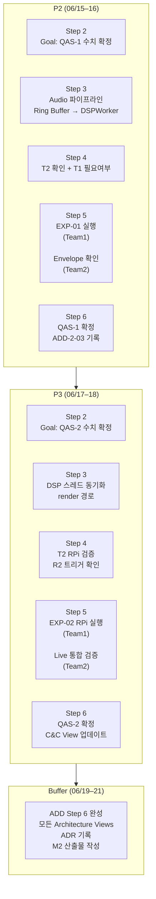

# M2 실행 계획 / M2 Execution Plan

**기준일 / As of**: 2026-06-15 (P2 시작일)  
**마감일 / Deadline**: 2026-06-22 (Mon) M2 제출

---

## 0. 현재 코드 상태 요약 / Current Code State

> 아래는 실제 코드를 확인한 결과. 계획 수립의 기준으로 사용.

| 항목 | 파일 | 상태 |
|------|------|:----:|
| 레이어 구조 (audio / engine / tabs / ui / external) | `src/` | ✅ |
| 13개 그래프 탭 (11 required + RateScopeTab + SoundPrintTab) | `src/tabs/` | ✅ |
| BaseGraphTab (Pause contract + R1 인터페이스) | `src/tabs/BaseGraphTab.h` | ✅ |
| T2 DSPWorker (별도 스레드) | `src/audio/DSPWorker.cpp` | ✅ macOS |
| R1 Lazy Rendering (isVisible guard) | `BaseGraphTab::showEvent()` | ✅ macOS |
| Pause 버튼 + "⚠ No signal" 경고 | `src/ui/MainWindow.cpp:159,209` | ✅ |
| Watch Position 선택기 | `MainWindow` + `SequenceTab` | ✅ |
| Logger 인프라 | `src/logging/` | ✅ |
| 단위 테스트 116개 (7개 바이너리, 전체 Pass) | `src/tests/` | ✅ |
| **EXP-01** RPi sps Dropped Block 측정 | — | ❌ |
| **EXP-02 RPi** T2 효과 검증 | — | ❌ macOS만 |
| RPi Live 모드 통합 검증 | — | ❌ |
| AGC 비활성화 확인 | — | ❌ Week 0 미완 |
| "⚠ Noisy signal" 경고 | — | ❌ |

### M1 FR 크로스체크 갭

| FR | 설명 | 상태 | 처리 |
|----|------|:----:|------|
| FR-04 | HPF + Envelope 필터링 | ⚠️ HPF만 | M2 내 확인 필요 |
| FR-08 | No signal / **Noisy signal** 경고 | ⚠️ No signal만 | P3에서 판단 |
| FR-09 | Pause + **타임라인 scrub** | ⚠️ freeze만 | M3 이연 |

---

## 1. QA 우선순위 재정의 (M2 기준)

> M1 대비 변경. 근거: 일정 지연 위험 + Modifiability가 나머지 QA tactic 적용의 전제.

| 순위 | QA | Business | Risk | M1 순위 | 변경 이유 |
|:---:|---|:---:|:---:|:---:|---|
| **1** | **Modifiability** | M | H | 5 | 레이어 구조 없이 11개 그래프 병렬 구현 불가. tactic 교체도 불가 → 선행 필수. ✅ 완료 |
| **2** | **Real-Time + Low Latency** | H | H | 1, 2 | RPi baseline miss 43% 확인 → 가장 큰 설계 변경. T2 tactic 적용. 두 QA는 trade-off 관계 |
| **3** | **Usability** | M | M | 4 | Pause ✅, No signal ✅. Noisy signal 미구현. P3에서 2h 판단 |
| **4** | **Correctness** | L | L | 3 | 조용한 환경에선 동작 → 명시적 trade-off. EXP-03 M3 이연 |

---

## 2. 팀 구조 및 Agile 세리머니 (M1 프로세스 유지)

```
Architecture Committee (AC): Jimin Lee (PO) + Sungho Shin (SM1) + Dong Ho Shin (SM2)
  └─ Sprint Planning: ADD Step 2-4 수행 (매 스프린트 시작, 1h)
  └─ Sprint Review: ADD Step 6 수행 (매 스프린트 종료, 1h)

Team 1 (SM: Sungho Shin)
  멤버: Gyeongjin Shin · Hung Son Tong · Kyudae Bahn
  QA Focus: Real-Time Performance (QA-2) → EXP-01, EXP-02 RPi

Team 2 (SM: Dong Ho Shin)
  멤버: Taejoon Song · Jimin Lee
  QA Focus: Correctness (QA-4) 최소 + Usability (QA-3) 판단 → RPi Live, Noisy signal
```

---

## 3. 스프린트 계획 / Sprint Plan

### ─── P2: 06/15(일)–06/16(월) ───
**스프린트 목표**: "RPi 실험 환경 확보 + EXP-01 실행하여 QAS-1 수치 확정"

#### Sprint Planning (06/15 AM, AC 1h) — ADD Step 2–4

| ADD Step | 수행 내용 |
|----------|-----------|
| **Step 2** 반복 목표 수립 | "RPi에서 96k sps Dropped Block = 0 달성 가능 여부 확인. T2 + T1 tactic 조합 결정" |
| **Step 3** 분해 대상 선택 | Audio 파이프라인 (`AudioWorker` → Ring Buffer → `DSPWorker`) + RPi 스케줄러 |
| **Step 4** 설계 개념 선택 | T2(DSPWorker 스레드) 이미 적용됨. 추가 T1(SCHED_RR) 필요 여부 → EXP-01 결과로 판단 |

#### Team 1 (06/15–16) — ADD Step 5: EXP-01 실행

| 작업 | 담당 | 완료 기준 |
|------|------|-----------|
| RPi 빌드 (`feature/layer-ex-baseline`, `ENABLE_LOGGING=ON`) | Gyeongjin | 빌드 성공 + Playback 동작 확인 |
| **AGC 비활성화** 확인 (AlsaMixer) | Hung Son | AGC OFF 상태 스크린샷 |
| `AudioWorker`에 `droppedBlockCount` 카운터 추가 | Kyudae | Ring Buffer overflow 시 카운트 증가 |
| EXP-01 측정: 48k / 96k / 192k sps × 10분 연속 | Team 1 전체 | Dropped Block 표 완성 |
| T1 SCHED_RR 적용 전/후 비교 (96k 조건만) | Team 1 전체 | T1 필요 여부 결정 |

**EXP-01 측정 결과 표** (채워야 함):

| 조건 | SPS | T1 SCHED_RR | Dropped Blocks / 10min | 판정 |
|------|:---:|:-----------:|:----------------------:|------|
| A | 48,000 | ✗ | | |
| B | 96,000 | ✗ | | |
| C | 96,000 | ✓ | | |
| D | 192,000 | ✗ | | |

**결정 분기**:
- B = 0 → 96k 확정, T1 불필요
- B > 0, C = 0 → 96k + T1(SCHED_RR) 필수 → ADD-2-03 결정 기록
- B > 0, C > 0 → 48k fallback → QAS-1 수치 수정

#### Team 2 (06/15–16) — ADD Step 5: RPi 환경 + Correctness 최소 기록

| 작업 | 담당 | 완료 기준 |
|------|------|-----------|
| RPi 빌드 환경 지원 (Team 1 병행) | Taejoon | — |
| FR-04 확인: Envelope 필터 현황 조사 | Jimin | Envelope 구현 여부 코드 확인 |
| Correctness 최소 기록: WeiShi 1회 비교 (조용한 환경) | Jimin | Rate / Amp / BE 비교값 1세트 |

#### Sprint Review (06/16 PM, 전체 1h) — ADD Step 6

- EXP-01 결과 공유 → QAS-1 Response Measure 확정 (96k or 48k)
- T1 필요 여부 → ADD-2-03 결정 기록 또는 기각 기록
- FR-04 Envelope 현황 → M2 scope 포함 여부 결정
- 다음 스프린트 목표 확정

---

### ─── P3: 06/17(화)–06/18(수) ───
**스프린트 목표**: "RPi T2 효과 수치화 + Live 모드 통합 + Usability Noisy signal 판단"

#### Sprint Planning (06/17 AM, AC 1h) — ADD Step 2–4

| ADD Step | 수행 내용 |
|----------|-----------|
| **Step 2** 반복 목표 수립 | "EXP-02 RPi T2 효과 수치 확인. macOS 결과(×32,000)가 RPi에서도 유효한지" |
| **Step 3** 분해 대상 선택 | DSP 스레드 간 동기화 경로 (`Qt::QueuedConnection`, wait_ms 측정 포인트) |
| **Step 4** 설계 개념 선택 | T2 이미 적용. RPi spike 기준 확인 → R2(Timer 20FPS) 트리거 여부 판단 (`tactic-analysis.md` §5 참조) |

#### Team 1 (06/17–18) — ADD Step 5: EXP-02 RPi T2

| 작업 | 담당 | 완료 기준 |
|------|------|-----------|
| RPi baseline 재확인 (T2 미적용 상태) | Gyeongjin | exec ~20ms, miss 43% 재현 |
| T2 브랜치 RPi 빌드 + 동일 조건 측정 | Hung Son | wait_ms / miss / backlog 수치 |
| R2 트리거 기준 체크 (replot_count, exec_ms spike) | Kyudae | R2 Skip or Apply 결정 |

**EXP-02 RPi T2 결과 표** (채워야 함):

| 지표 | RPi Baseline | RPi + T2 | macOS + T2 (참조) | 개선율 |
|------|:---:|:---:|:---:|:---:|
| exec_ms avg | 20ms | | 0.57ms | |
| wait_ms avg | ~420ms | | 0.013ms | |
| deadline miss | 43% | | 0% | |
| backlog | 47% | | 0% | |

#### Team 2 (06/17–18) — ADD Step 5: Live 모드 + Usability

| 작업 | 담당 | 완료 기준 |
|------|------|-----------|
| RPi Live 모드 전체 탭 동작 확인 | Taejoon | 13개 탭 Rate/Amp/BE 수치 표시 |
| "⚠ No signal" 경고 Live 동작 확인 | Jimin | 시계 제거 3초 후 경고 표시 |
| **"⚠ Noisy signal" 구현 여부 결정** (2h 기준) | Jimin | 2h 이내 가능 → 구현, 초과 → M3 명시 |

**Noisy signal 구현 판단 기준**:
```
2h 이내 판단 기준:
- SNR 계산이 이미 엔진에 있으면 → 구현 (threshold만 추가)
- SNR 계산이 없으면 → M3 defer (구현 복잡도 과다)
```

#### Sprint Review (06/18 PM, 전체 1h) — ADD Step 6

- EXP-02 결과 공유 → QAS-2 Response Measure 확정
- R2 트리거 여부 → ADD-2-02 보완 또는 Skip 유지 기록
- Noisy signal 구현 결과 또는 M3 defer 결정 기록
- Architecture Views 업데이트 범위 확정
- M2 문서 작업 분담

---

### ─── Buffer / M2 Finalization: 06/19(목)–06/21(토) ───
**목표**: "실험 결과 → 아키텍처 뷰 반영 + M2 전체 산출물 완성"

> 프로세스 원칙: "Buffer = 실험 결과 통합, ADR 작성, 다음 스프린트 준비"

#### 06/19 (목) — Architecture Committee: 결과 통합 + 뷰 업데이트

| 작업 | ADD Step | 담당 |
|------|----------|------|
| EXP-01·EXP-02 결과 → `experiment-results.md` 작성 | Step 6 | Team 1 |
| C&C View 업데이트 (T2 3-thread 구조 명확화) | Step 6 | AC |
| Module View 업데이트 (레이어 경계 + ≤3-file 포인트) | Step 6 | AC |
| ADD 결정 기록 정리 (ADD-2-01, ADD-2-02, ADD-2-03) | Step 6 | AC |

#### 06/20 (금) — 전체 M2 산출물 작성

| 산출물 | 담당 | 내용 |
|--------|------|------|
| `updated-project-plan.md` | Jimin (PO) | QA 재정의 + 팀 목표 업데이트 + task 담당자·날짜 |
| `construction-plan.md` | SM1 + SM2 | M3까지 현실적 일정 (이연 항목 명시) |
| `README.md` (신규) | Taejoon | M2 산출물 전체 목차 + 파일 링크 |
| Deployment View 업데이트 | Gyeongjin | RPi 배치 현실화 |

#### 06/21 (토) — 전체 검토

- [ ] M2 mentor 질문 체크리스트 self-review (milestones.md §M2 체크리스트 기준)
- [ ] 전체 문서 cross-reference 확인 (README → 각 파일 링크 동작)
- [ ] Git repo collaborator 추가: Jason Popowski, Steve Beck, Dan Plakosh, Choonsik Lee
- [ ] 제출 패키지 확인

---

### ─── P4 시작: 06/22(월) — M2 제출 ───

- AM: 최종 검토 + M2 제출
- PM: P4 Sprint Planning (M3을 향한 다음 스프린트)

---

## 4. ADD 단계별 산출물 매핑



---

## 5. M3 이연 항목 명시 (Construction Plan 반영용)

> 아래 항목은 M2 `construction-plan.md`에 명시적으로 기록하여 mentor에게 scope 결정을 투명하게 공개.

| 항목 | FR | 이연 이유 |
|------|----|-----------|
| 타임라인 scrub (Pause 중 앞뒤 이동) | FR-09 | Pause freeze 완료. scrub은 M2 범위 초과 |
| "⚠ Noisy signal" 경고 | FR-08 | P3에서 2h 초과 판단 시 이연 |
| Interactive timing point 선택 | — | M2 범위 초과 |
| Sound Print 개선 (평균 윈도우, 노이즈 감소) | — | M2 범위 초과 |
| Raw signal 오버레이 | — | M2 범위 초과 |
| EXP-03 Detector 파라미터 grid search | QA-4 | Correctness 4순위 trade-off |
| EXP-04 신호 품질 경고 임계값 | QA-3 | 구현 선행 필요 |
| EXP-05 BPH 확장 | — | 28k BPH 확정 후 |

---

## 6. 리스크 / Risks

| 리스크 | 발생 시점 | 대응 |
|--------|-----------|------|
| RPi 빌드 실패 | P2 Day 1 | `baseline/experiments2` 빌드법 참조 |
| 96k Dropped Block > 0 (T1 후도) | P2 EXP-01 | 48k fallback 선언 → QAS-1 수치 수정 후 진행 |
| T2 RPi 효과 미미 | P3 EXP-02 | T1 SCHED_RR 단독 결과 기록. macOS vs RPi 차이 분석 포함 |
| AGC ON → Live 측정값 불안정 | P2 Day 1 | AlsaMixer 확인 필수 선행. AGC OFF 후 Live 진행 |
| Noisy signal 구현 시간 초과 | P3 Day 1 | 2h 기준 즉시 판단. 초과 시 M3 defer 선언 |
| Buffer 문서 작업 시간 부족 | 06/20 | 06/19 Architecture Views 먼저 완성. 나머지 06/20 집중 |
