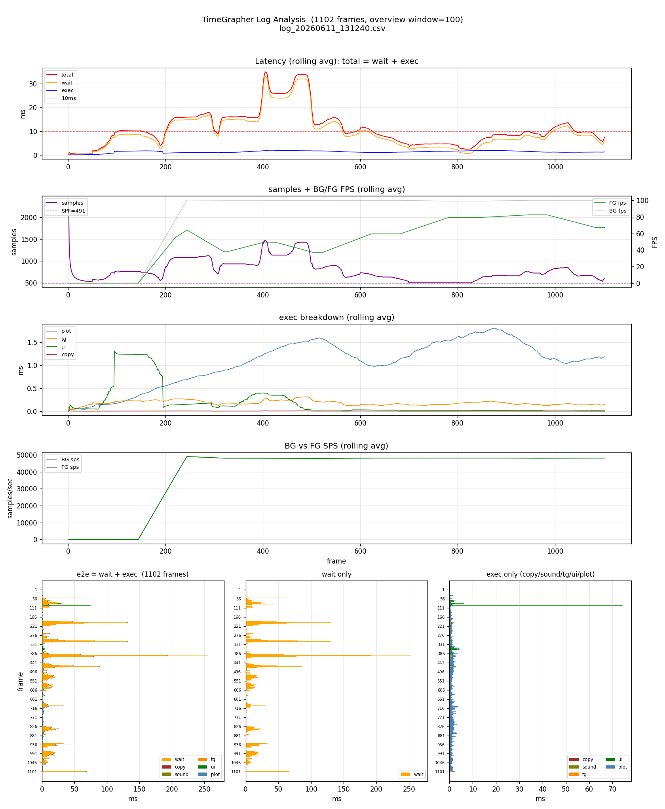
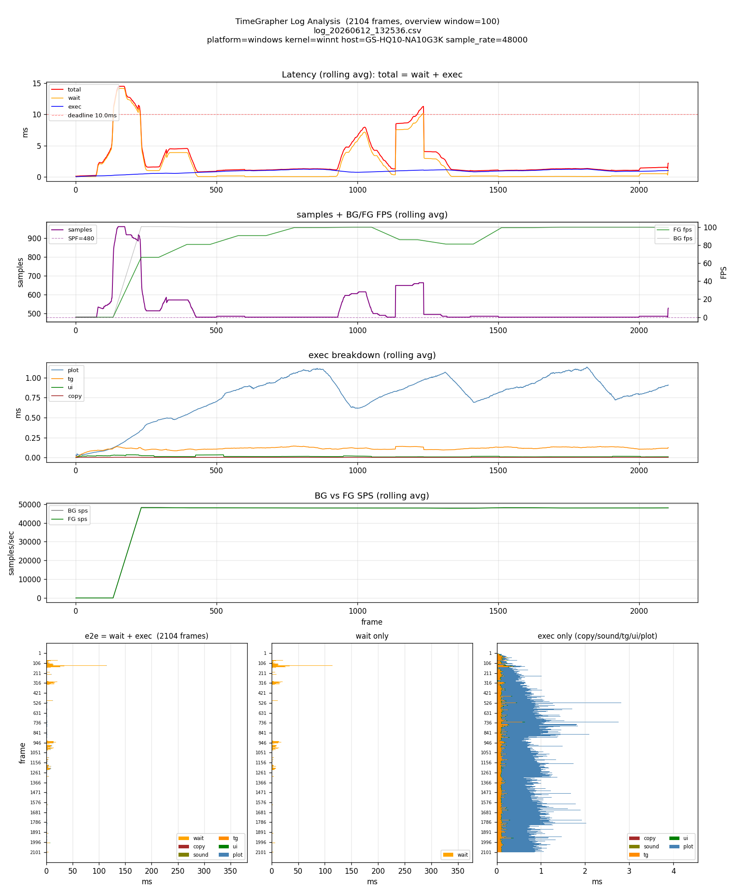
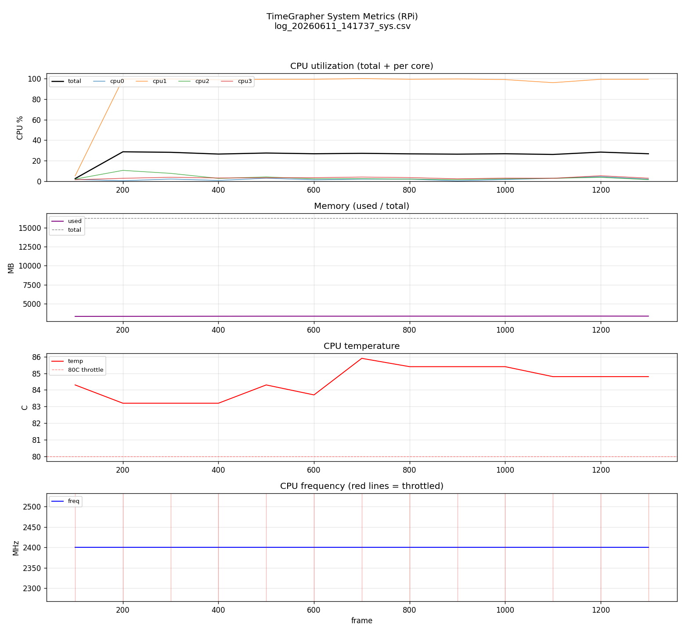
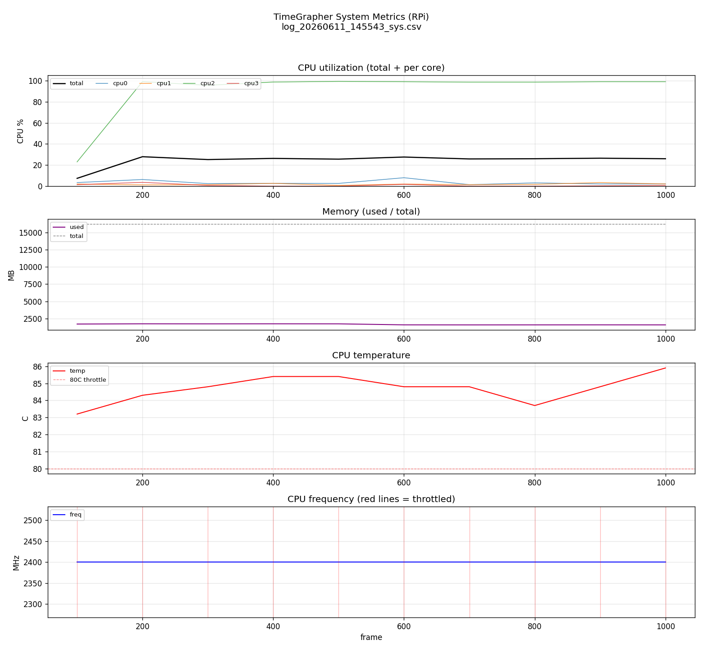

# Experiment Results

**Milestone**: M2 | **Due**: 2026-06-22 | **Status**: [x] Draft  [ ] Final  
**Last Updated**: 2026-06-11

---

## Summary

| ID | Experiment | Runs | Latest Key Result | Status |
|----|------------|:----:|-------------------|:------:|
| EXP-01 | RPi Real-Time Performance — Dropped Block Measurement | 0 | — | ⏳ In Progress |
| EXP-02 | End-to-End Latency — 3-Segment Timestamp Measurement | 4 | Windows E2E avg 2.8 ms (exec < deadline). **RPi: real-time FAIL** — exec ~20 ms overruns ~21 ms deadline (43–65 %), single-core + thermal throttle | ⏳ In Progress |
| EXP-03 | Detector Parameter Optimization Under Noise Conditions | 0 | — | 📅 Planned |
| EXP-04 | Signal Quality Warning Threshold Search | 0 | — | 📅 Planned |
| EXP-05 | BPH Escalation Verification — 36k/43k BPH | 0 | — | ⏸ Deferred |

> Status legend: ✅ Done · ⏳ In Progress · 📅 Planned · ⏸ Deferred · ❌ Cancelled  
> Update **Runs** count and **Latest Key Result** after each run.

### Experiment Dependency Chain

```
EXP-01 (SPS confirmed)
  └─► EXP-02 (latency measurement)   ──┐
  └─► EXP-03 (parameter tuning)        ├─► EXP-05 (BPH escalation, stretch goal)
EXP-04 (warning threshold) ────────────┘
       └─ prerequisite: warning UI implemented
```

> EXP-03, EXP-04 begin after EXP-01 is complete.  
> EXP-05 begins only after EXP-02 is complete AND QAS-1~4 all confirmed.

---

## EXP-01: RPi Real-Time Performance — Dropped Block Measurement

**Linked QA**: QAS-1 | **Linked Risk**: TR-01, TR-02  
**Status**: ⏳ In Progress

**Question**: Can RPi 5 achieve Dropped Block = 0 at 96,000 sps while running Qt GUI + DSP concurrently? If not, what is the maximum sps that can be processed stably?

### Run History

> Add a new row after each run. `Change` describes what was different from the previous run.

| Run | Date | Change from Previous | 48k Dropped/min | 96k Dropped/min | 192k Dropped/min | SCHED_RR applied? | Better? | Next Action |
|:---:|------|----------------------|:---------------:|:---------------:|:----------------:|:-----------------:|:-------:|-------------|
| R1 | | Baseline | — | — | — | No | — | |
| R2 | | | | | | | ↑/↓/= | |
| R3 | | | | | | | ↑/↓/= | |

### Current Best

> Update this block after each run that improves the result.

- **Run**: —
- **Recommended sample rate**: — sps
- **Graceful degradation fallback needed**: —
- **SCHED_RR effect**: —
- **Architecture Decision**: → see [Architecture Decisions Log](#architecture-decisions-log)

---

## EXP-02: End-to-End Latency — 3-Segment Timestamp Measurement

**Linked QA**: QAS-2 | **Linked Risk**: TR-03, TR-04  
**Status**: ⏳ In Progress  
**Prerequisite**: EXP-01 complete (SPS confirmed)

**Question**: What is the end-to-end latency across the full pipeline (capture → DSP → render)? Does ② process→display exceed 30 ms with 11 tabs? Is 36k/43k BPH feasible?

Timestamp injection points:

| Point | Location | Segment |
|-------|----------|---------|
| TS1 | Entry of `audioDataAvailable()` | ① start |
| TS2 | T1/T3 event timestamp finalized | ① end / ② start |
| TS3 | Qt `paintEvent()` complete | ② end |

### Runs

Core comparison only — full per-run numbers and analysis are in the collapsible
detail blocks below. `E2E = ① wait + ② exec` (avg / max, ms). Deadline = chunk
period (`BG_SPF / BG_SPS`): Windows ≈ 10 ms, RPi ≈ 21 ms.

| Run | Date | Platform | Rate | Tabs | E2E avg/max (ms) | Dropped | Missed | Detail |
|:---:|------|----------|:----:|:----:|:----------------:|:-------:|:------:|:------:|
| R1 | 2026-06-11 | Windows | 48 kHz | 1 | 11.5 / 266.7 | — | — | ▼ R1 below |
| R2 | 2026-06-12 | Windows | 48 kHz | 1 | 2.8 / 363.9 | — | — | ▼ R2 below |
| R3 | 2026-06-11 | **RPi** | 48 kHz | ? | 517.2 / 1652.6 | — | — | ▼ R3 below |
| R4 | 2026-06-11 | **RPi** | 48 kHz | ? | 255.4 / 900.9 | — | — | ▼ R4 below |

> R3/R4 are RPi runs recorded before platform auto-metadata existed (no `#`
> meta line); platform is confirmed by the presence of `_sys.csv`. Tabs unknown
> (`?`). Their deadlines differ from Windows: derived from data (R3 ≈19 ms,
> R4 ≈21 ms) because the ALSA chunk size differs (SPF 960 / 1024 vs WASAPI 480).

> `Dropped` (audio blocks) and `Missed` (beat detections) are required by the
> Low-Latency QA but not yet instrumented — shown as `—`. See backlog % in the
> detail block as the current proxy for "falling behind".

### Run details

<details>
<summary><b>R1</b> — 2026-06-11 · Windows · 48 kHz · 1-tab · baseline (logging build) — E2E avg 11.5 / max 266.7 ms</summary>

**Context**: 1-tab, 48 kHz, logging build. Deadline ≈ 10 ms (480 / 48000).
Files: [csv](../../src/logs/EXP-02/log_20260611_131240.csv) ·
[plot](../../src/logs/EXP-02/log_20260611_131240.png)
(this run predates RPi system sampling, so no `_sys` files).

**Per-frame metrics (analyze_log.py, window=100, 1102 frames), ms:**

| Metric | avg | max | min |
|--------|----:|----:|----:|
| total = ①+② | 11.54 | 266.72 | 0.20 |
| ① wait (BG→FG queue + sched) | 10.06 | 265.19 | 0.02 |
| ② exec (process→display) | 1.48 | 74.41 | 0.09 |
| ┄ copy | 0.005 | 0.210 | 0.001 |
| ┄ sound | 0.000 | 0.006 | 0.000 |
| ┄ tg | 0.184 | 2.544 | 0.009 |
| ┄ ui | 0.180 | 73.79 | 0.001 |
| ┄ plot (dominant) | 1.112 | 3.562 | 0.020 |

**Throughput / health:** bg_fps avg 86.8 (max 100.3), fg_fps avg 54.3 (max 82.5),
bg_sps avg 41823. exec > deadline: 1/1102 (0.09 %). backlog (>1.5× SPF):
247/1102 (22.4 %).



**Observations:**

| Phase | Frames | Pattern | Interpretation |
|-------|:------:|---------|----------------|
| Startup / warmup | 1 – 144 | samples=480, total<2 ms | BG not yet stable; FG draining small backlog |
| BG stabilizes | 145 – 220 | bg_fps=100.3, fg_fps=72.3 | Steady 48 kHz capture; FG keeping up |
| fg_fps drop | 221 – 326 | fg_fps→37.8 | FG falls behind BG → backlog grows; samples bursts up to 7200 |
| Recovery | 327+ | fg_fps=52.9, total ~2 ms | FG recovers; latency back to normal |
| Exec spike | frame 95 | exec_ms=74 (ui_ms=73.8) | Isolated Qt repaint jitter — not structural |
| wait spike | frame ~450+ | wait_ms up to 265 | OS scheduling jitter; FG preempted |

**Conclusion:**

- ② (`exec`) is structurally fast: avg **1.5 ms**, well under the 30 ms target.
- The 74 ms exec spike is a single-frame UI paint anomaly, not steady state.
- ① (`wait`) dominates (87 % of avg total) and drives worst-case E2E to 266 ms —
  OS scheduling jitter, not DSP load.
- 22 % backlog during the fg_fps-drop phase = FG cannot sustain realtime
  throughput under competing load. SCHED_RR / priority tuning may help (→ EXP-01).
- **11-tab measurement still required** to answer the EXP-02 question definitively.

</details>

<details>
<summary><b>R2</b> — 2026-06-12 · Windows · 48 kHz · 1-tab · logging+platform-metadata build — E2E avg 2.8 / max 363.9 ms</summary>

**Context**: 1-tab, 48 kHz, logging build with auto-recorded platform metadata.
Deadline = 10.00 ms (480 / 48000, computed from data). CSV meta line:
`platform=windows kernel=winnt sample_rate=48000`.
Files: [csv](../../src/logs/EXP-02/log_20260612_132536.csv) ·
[plot](../../src/logs/EXP-02/log_20260612_132536.png).

**Per-frame metrics (analyze_log.py, window=100, 2104 frames), ms:**

| Metric | avg | max | min |
|--------|----:|----:|----:|
| total = ①+② | 2.81 | 363.87 | 0.07 |
| ① wait (BG→FG queue + sched) | 1.89 | 359.53 | 0.01 |
| ② exec (process→display) | 0.92 | 4.34 | 0.03 |
| ┄ copy | 0.003 | 0.067 | 0.001 |
| ┄ sound | 0.000 | 0.011 | 0.000 |
| ┄ tg | 0.117 | 3.303 | 0.009 |
| ┄ ui | 0.014 | 2.074 | 0.000 |
| ┄ plot (dominant) | 0.784 | 2.356 | 0.012 |

**Throughput / health:** bg_fps avg 93.7 (max 100.6), fg_fps avg 85.6 (max 100.0),
bg_sps avg 44990. samples avg 527 (≈ SPF 480). exec > deadline: **0 / 2104**.
backlog (>1.5× SPF): **91 / 2104 (4.3 %)**.



**Observations:**

| Phase | Pattern | Interpretation |
|-------|---------|----------------|
| Startup (0–250) | samples↑, wait↑ to ~15 ms | warmup; FG draining initial backlog |
| Steady (250+) | wait ≈ 0, total ≈ exec ≈ 1 ms | FG keeps up; latency dominated by exec, not wait |
| Single spike | one frame wait ≈ 360 ms | isolated OS preemption, not structural |

**Conclusion:**

- Much healthier than R1: avg total **2.8 ms** (R1 11.5), wait avg **1.9 ms**
  (R1 10.1), backlog **4.3 %** (R1 22.4 %). The machine kept up frame-by-frame.
- ② (`exec`) never exceeded the 10 ms deadline (0/2104) — processing is not the
  constraint; `plot` remains the dominant exec component (~0.78 ms).
- Worst-case is still a single ~360 ms `wait` spike (OS scheduling), so max E2E
  is jitter-bound, not load-bound.
- Validates the toolchain end-to-end on Windows: platform auto-metadata,
  data-driven deadline (10 ms), and the analysis graphs.
- **11-tab and RPi runs still required** for the definitive EXP-02 answer.

</details>

<details>
<summary><b>R3</b> — 2026-06-11 · RPi · 48 kHz · pre-metadata build — E2E avg 517.2 / max 1652.6 ms · <b>real-time FAIL</b></summary>

**Context**: RPi run, before platform auto-metadata (no `#` line; RPi confirmed
by `_sys.csv`). Deadline ≈ **19.06 ms** (SPF 960 / SPS 50375, ALSA period).
Files: [csv](../../src/logs/EXP-02/log_20260611_141737.csv) ·
[plot](../../src/logs/EXP-02/log_20260611_141737.png) ·
[sys plot](../../src/logs/EXP-02/log_20260611_141737_sys.png).

**Per-frame metrics (window=100, 1335 frames), ms:**

| Metric | avg | max | min |
|--------|----:|----:|----:|
| total = ①+② | 517.25 | 1652.59 | 0.54 |
| ① wait | 495.85 | 1633.48 | 0.04 |
| ② exec | 21.40 | 49.47 | 0.18 |
| ┄ copy | 0.014 | 0.102 | 0.006 |
| ┄ sound | 0.809 | 8.833 | 0.000 |
| ┄ tg | 3.066 | 19.668 | 0.077 |
| ┄ ui | 0.710 | 6.888 | 0.000 |
| ┄ plot (dominant) | 16.795 | 30.335 | 0.052 |

**Throughput / health:** bg_fps avg 48.4, fg_fps avg 36.1, samples avg 1301.
**exec > deadline: 873 / 1335 (65 %)** — processing alone overruns the budget.
backlog (>1.5× SPF): 421 / 1335.

**System (RPi):** cpu_total 25 % but **cpu1 pinned at 91.9 % (max 100 %)** — a
single core saturated; temp **84.5 °C**, **throttled on all 13 samples**;
mem 3365 MB; freq 2400 MHz.



**Conclusion:** RPi **fails real-time performance**, not just latency. `plot`
alone (~16.8 ms) nearly consumes the 19 ms deadline, so `exec` overruns 65 % of
frames; the audio path runs on one core (cpu1 ~92 %) while the others idle, and
the SoC is thermally throttled the whole run. Root causes: heavy `plot`,
single-core processing, thermal throttling.

</details>

<details>
<summary><b>R4</b> — 2026-06-11 · RPi · 48 kHz · pre-metadata build — E2E avg 255.4 / max 900.9 ms · <b>real-time FAIL</b></summary>

**Context**: RPi run, before platform auto-metadata. Deadline ≈ **21.33 ms**
(SPF 1024 / SPS 48008). Files:
[csv](../../src/logs/EXP-02/log_20260611_145543.csv) ·
[plot](../../src/logs/EXP-02/log_20260611_145543.png) ·
[sys plot](../../src/logs/EXP-02/log_20260611_145543_sys.png).

**Per-frame metrics (window=100, 1015 frames), ms:**

| Metric | avg | max | min |
|--------|----:|----:|----:|
| total = ①+② | 255.45 | 900.92 | 0.14 |
| ① wait | 235.20 | 879.61 | 0.03 |
| ② exec | 20.24 | 62.47 | 0.10 |
| ┄ copy | 0.014 | 0.105 | 0.007 |
| ┄ sound | 0.456 | 9.531 | 0.000 |
| ┄ tg | 3.111 | 27.925 | 0.062 |
| ┄ ui | 0.679 | 6.359 | 0.000 |
| ┄ plot (dominant) | 15.979 | 29.651 | 0.025 |

**Throughput / health:** bg_fps avg 43.5, fg_fps avg 31.2, samples avg 1427.
**exec > deadline: 441 / 1015 (43 %)**. backlog (>1.5× SPF): 312 / 1015.

**System (RPi):** cpu_total 24 % but **cpu2 pinned at 91 % (max 99 %)**; temp
**84.7 °C**, **throttled on all 10 samples**; mem 1651 MB; freq 2400 MHz.



**Conclusion:** Same failure mode as R3 — `exec` (plot ~16 ms) overruns the
21 ms deadline 43 % of the time, one core (cpu2) saturated, SoC throttled
throughout. Confirms the RPi bottleneck is structural (plot + single-core +
thermal), independent of which run.

</details>

### Current Best

**Windows (dev) — best so far: R2**
- E2E (1-tab): mean **2.8 ms** / worst **363.9 ms** (single OS-scheduling spike)
- ② exec: mean **0.9 ms**, **never exceeds the 10 ms deadline** (0/2104)
- backlog 4.3 %; dominant cost is `plot` (~0.78 ms). Latency is jitter-bound,
  not load-bound. Processing is not the constraint on dev hardware.

**RPi (target) — R3/R4: real-time FAIL** ⚠
- E2E: mean **255–517 ms** / worst **0.9–1.65 s**
- ② exec mean **~20 ms** overruns the ~19–21 ms deadline **43–65 %** of frames
- `plot` alone ≈ **16 ms** (≈20× Windows); one core saturated (~92 %) while the
  others idle; SoC **thermally throttled** (85 °C) for the entire run
- Root causes (structural): heavy `plot`, single-core audio path, thermal throttle
- Implication: meeting QAS-2 on the Pi needs **lazy/throttled rendering**,
  off-loading `plot` from the audio path, and/or multi-core distribution + cooling

- **Dominant latency source**: Windows = `wait` (OS jitter); RPi = `exec` (`plot`) + backlog
- **Lazy Rendering required**: **Yes on RPi** (exec overruns deadline); Windows inconclusive (11-tab pending)
- **Architecture Decision**: → see [Architecture Decisions Log](#architecture-decisions-log)

---

## EXP-03: Detector Parameter Optimization Under Noise Conditions

**Linked QA**: QAS-3 | **Linked Risk**: TR-05  
**Status**: 📅 Planned  
**Prerequisite**: EXP-01 complete (SPS for measurement confirmed)  
**Expected start**: After EXP-01 concludes

**Question**: Which combination of `onset_fraction` and `min_peak_fraction` minimizes Δ Rate / Δ Amplitude / Δ Beat Error across low / medium / high noise?

### Planned Approach

| Parameter | Default | Planned Search Range | Step |
|-----------|:-------:|:--------------------:|:----:|
| `onset_fraction` | 0.03 | 0.01 ~ 0.10 | 0.01 |
| `min_peak_fraction` | 0.20 | 0.10 ~ 0.40 | 0.05 |

| Planned Noise Condition | Environment | Expected Noise Floor |
|------------------------|-------------|:-------------------:|
| Low | Quiet closed lab | ~30 dB SPL |
| Medium | Typical office | ~50 dB SPL |
| High | Added noise source | ~65 dB SPL |

> R1: Full grid search with default params as baseline.  
> R2: Narrow range around R1 best result.  
> R3: Validate optimal params under abrupt noise transition (low → high).

### Run History

> Fill in when experiment begins.

| Run | Date | Change from Previous | `onset_fraction` tested | `min_peak_fraction` tested | Best Δ Sum (Low+Med+High) | Converging? | Next Action |
|:---:|------|----------------------|:-----------------------:|:--------------------------:|:-------------------------:|:-----------:|-------------|
| R1 | — | Planned: full grid search | — | — | — | — | |
| R2 | — | Planned: narrow around R1 best | — | — | — | — | |
| R3 | — | Planned: abrupt noise transition validation | — | — | — | — | |

### Current Best

- **Run**: —
- **Recommended `onset_fraction`**: —
- **Recommended `min_peak_fraction`**: —
- **Adaptive threshold valid under abrupt noise transition**: —
- **Architecture Decision**: → see [Architecture Decisions Log](#architecture-decisions-log)

---

## EXP-04: Signal Quality Warning Threshold Search

**Linked QA**: QAS-4 | **Linked Risk**: TR-09  
**Status**: 📅 Planned  
**Prerequisite**: Observer pattern refactoring complete + `⚠ No signal` / `⚠ Noisy signal` warning UI implemented  
**Expected start**: After warning UI is implemented

**Questions**:
- After removing the watch, within how many seconds should `⚠ No signal` appear?
- After restoring the watch, within how many seconds should the warning clear?
- What noise/signal ratio threshold triggers `⚠ Noisy signal` without false alarms?

### Planned Approach

| Part | What to sweep | Metric |
|------|--------------|--------|
| A — No Signal | Heartbeat N parameter: 1 / 2 / 3 / 5 s | Warning appear time, warning clear time M |
| B — Noisy Signal | 3–5 noise/signal ratio threshold candidates | False-alarm rate, miss rate |

> R1: Sweep all N values (Part A) + all threshold candidates (Part B) under 3 noise conditions.  
> R2: Narrow to 2 best N candidates; refine threshold.  
> R3: Validate chosen N·M + threshold under abrupt noise condition changes.

### Run History

> Fill in when experiment begins.

| Run | Date | Change from Previous | Best N (s) | Best M (s) | Noisy threshold | False-Alarm Rate | Better? | Next Action |
|:---:|------|----------------------|:----------:|:----------:|:---------------:|:----------------:|:-------:|-------------|
| R1 | — | Planned: full sweep | — | — | — | — | — | |
| R2 | — | Planned: narrow candidates | — | — | — | — | — | |
| R3 | — | Planned: abrupt condition validation | — | — | — | — | — | |

### Current Best

- **Run**: —
- **Finalized N (⚠ No signal delay)**: — s
- **Finalized M (warning clear delay)**: — s
- **Finalized noisy signal threshold**: —
- **Architecture Decision**: → see [Architecture Decisions Log](#architecture-decisions-log)

---

## EXP-05: BPH Escalation Verification — 36k/43k BPH Latency Measurement

**Linked QA**: QAS-2 Stretch  
**Status**: ⏸ Deferred  
**Prerequisite**: EXP-02 complete + QAS-1~4 all confirmed at 28,800 BPH

> Not started. Will begin only after all 28,800 BPH QA targets are confirmed.

### Run History

> Fill in when prerequisite is met.

| Run | Date | Change from Previous | 36k E2E Mean (ms) | 43k E2E Mean (ms) | < 80% beat period? | Better? | Next Action |
|:---:|------|----------------------|:-----------------:|:-----------------:|:------------------:|:-------:|-------------|
| R1 | — | Planned: baseline | — | — | — | — | |

### Current Best

- **Run**: —
- **QAS-2 Stretch target**: Pass / Fail
- **Team 2nd goal (BPH range expansion)**: Declared / Abandoned

---

## Remaining Experiments

| ID | Title | Reason Not Complete | Plan |
|----|-------|---------------------|------|
| | | | |

---

## Architecture Decisions Log

> Consolidated record of all architecture decisions derived from experiments.  
> Update each row as experiments conclude. Reference this section in Architecture Views.

| Decision | Source Experiment | QA Impacted | Decision Made | Date |
|----------|:-----------------:|:-----------:|---------------|------|
| QAS-1 Response Measure: confirmed max sps | EXP-01 | QAS-1 | — | — |
| Graceful degradation fallback threshold | EXP-01 | QAS-1 | — | — |
| SCHED_RR applied to audio capture thread | EXP-01 | QAS-1 | Yes / No | — |
| QAS-2 Response Measure: confirmed E2E latency target | EXP-02 | QAS-2 | Partial — 1-tab avg 11.5 ms; ② avg 1.5 ms (< 30 ms). 11-tab pending. | 2026-06-11 |
| Lazy Rendering tactic: required or not | EXP-02 | QAS-2 | Inconclusive — 11-tab test required | 2026-06-11 |
| `Detector.cpp` default params updated | EXP-03 | QAS-3 | — | — |
| QAS-3 QA-C2 acceptable Δ thresholds | EXP-03 | QAS-3 | — | — |
| Heartbeat N parameter hardened as constant | EXP-04 | QAS-4 | — | — |
| Noisy signal threshold hardened as constant | EXP-04 | QAS-4 | — | — |
| QAS-2 Stretch target: pass or abandon | EXP-05 | QAS-2 | — | — |

---

## Review Checklist

- [ ] All planned experiments have results or documented reason for incompletion
- [ ] Each result clearly resolves (or fails to resolve) the original question
- [ ] Architecture Decisions Log updated for all completed experiments
- [ ] Remaining experiments listed if any
- [ ] Results are relevant to overall system goals
