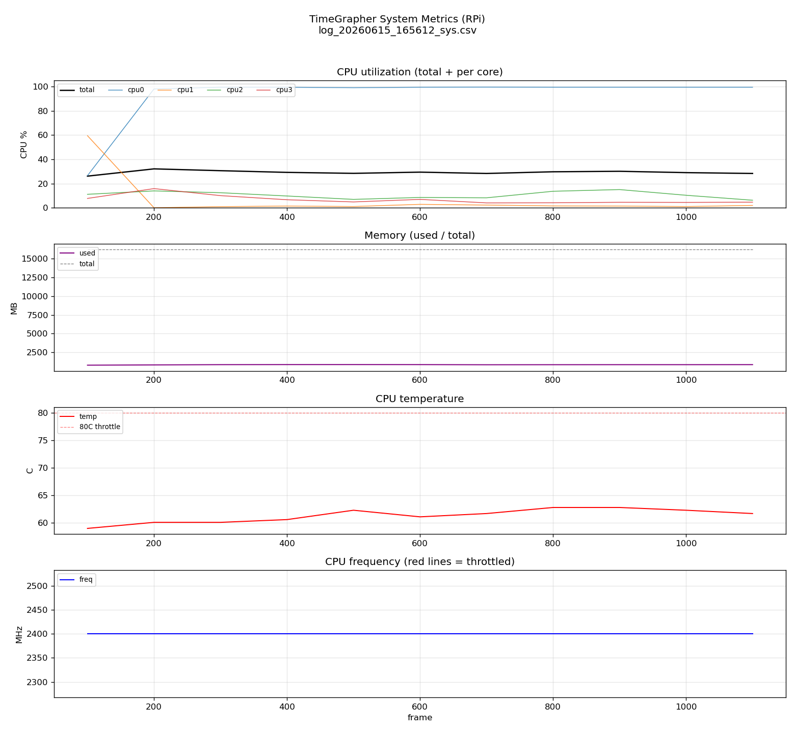

# Experiment Results

**Milestone**: M2 | **Due**: 2026-06-22 | **Status**: [x] Draft  [ ] Final  
**Last Updated**: 2026-06-15

---

## Summary

| ID | Experiment | Runs | Latest Key Result | Status |
|----|------------|:----:|-------------------|:------:|
| EXP-01 | RPi Real-Time Performance — Dropped Block Measurement | 0 | — | ⏳ In Progress |
| EXP-02 | End-to-End Latency — 3-Segment Timestamp Measurement | 6 | E2-6 (rpi2, E2-5 + R1 Lazy Rendering): E2E avg **2.1 ms**, max **5.7 ms** — tighter max than E2-5 (11.1 ms), zero backlog. | ⏳ In Progress |
| EXP-03 | Detector Parameter Optimization Under Noise Conditions | 0 | — | 📅 Planned |
| EXP-04 | Signal Quality Warning Threshold Search | 0 | — | 📅 Planned |
| EXP-05 | BPH Escalation Verification — 36k/43k BPH | 0 | — | ⏸ Deferred |

> Status legend: ✅ Done · ⏳ In Progress · 📅 Planned · ⏸ Deferred · ❌ Cancelled  
> Update **Runs** count and **Latest Key Result** after each run.

### Experiment Dependency Chain

```
EXP-01 (SPS confirmed)
  └─► EXP-02 (latency measurement)   ──┐
  └─► EXP-03 (parameter tuning)        ├─► EXP-05 (BPH escalation, stretch goal)
EXP-04 (warning threshold) ────────────┘
       └─ prerequisite: warning UI implemented
```

> EXP-03, EXP-04 begin after EXP-01 is complete.  
> EXP-05 begins only after EXP-02 is complete AND QAS-1~4 all confirmed.

---

## EXP-01: RPi Real-Time Performance — Dropped Block Measurement

**Linked QA**: QAS-1 | **Linked Risk**: TR-01, TR-02  
**Status**: ⏳ In Progress

**Question**: Can RPi 5 achieve Dropped Block = 0 at 96,000 sps while running Qt GUI + DSP concurrently? If not, what is the maximum sps that can be processed stably?

### Run History

> Add a new row after each run. `Change` describes what was different from the previous run.

| Run | Date | Change from Previous | 48k Dropped/min | 96k Dropped/min | 192k Dropped/min | SCHED_RR applied? | Better? | Next Action |
|:---:|------|----------------------|:---------------:|:---------------:|:----------------:|:-----------------:|:-------:|-------------|
| R1 | | Baseline | — | — | — | No | — | |
| R2 | | | | | | | ↑/↓/= | |
| R3 | | | | | | | ↑/↓/= | |

### Current Best

> Update this block after each run that improves the result.

- **Run**: —
- **Recommended sample rate**: — sps
- **Graceful degradation fallback needed**: —
- **SCHED_RR effect**: —
- **Architecture Decision**: → see [Architecture Decisions Log](#architecture-decisions-log)

---

## EXP-02: End-to-End Latency — 3-Segment Timestamp Measurement

**Linked QA**: QAS-2 | **Linked Risk**: TR-03, TR-04  
**Status**: ⏳ In Progress  
**Prerequisite**: EXP-01 complete (SPS confirmed)

**Question**: What is the end-to-end latency across the full pipeline (capture → DSP → render)? Does ② process→display exceed 30 ms with 11 tabs? Is 36k/43k BPH feasible?

Timestamp injection points:

| Point | Location | Segment |
|-------|----------|---------|
| TS1 | Entry of `audioDataAvailable()` | ① start |
| TS2 | T1/T3 event timestamp finalized | ① end / ② start |
| TS3 | Qt `paintEvent()` complete | ② end |

### Runs

Core comparison only — full per-run numbers and analysis are in the collapsible
detail blocks below. `E2E = ① wait + ② exec` (avg / max, ms). Deadline = chunk
period (`BG_SPF / BG_SPS`): Windows ≈ 10 ms, RPi ≈ 21 ms.

**E2-3 (rpi2) is the baseline for all future experiments.** E2-1 (Windows) is kept
as a dev-machine reference and E2-2 (rpi1) as a 1st-unit (thermal-throttling)
reference.

`git_commit` = the build commit the run came from (auto-recorded in the CSV `#`
meta line by the logging build); tag shown in parens where applicable. Tactics
R1/T2 are in `Role`.

| Run | Date | Platform | Rate | E2E avg/max (ms) | Role | git_commit | Detail |
|:---:|------|----------|:----:|:----------------:|------|------------|:------:|
| E2-1 | 2026-06-12 | Windows | 48 kHz | 2.8 / 363.9 | Windows reference (dev) | `d40b8fc` | ▼ E2-1 below |
| E2-2 | 2026-06-11 | **rpi1** | 48 kHz | 255.4 / 900.9 | rpi1 reference (1st unit) | `e7aaf4c` | ▼ E2-2 below |
| E2-3 | 2026-06-15 | **rpi2** | 48 kHz | 57.2 / 208.9 | **rpi2 baseline** | `7298783` | ▼ E2-3 below |
| E2-4 | 2026-06-15 | **rpi2** | 48 kHz | 80.1 / 258.7 | rpi2 baseline + multi-graph | `6f741ec` (tag `macos_ex_baseline`) | ▼ E2-4 below |
| E2-5 | 2026-06-15 | **rpi2** | 48 kHz | 2.1 / 11.1 | E2-4 + T2 (DSP Offload) | `7c367c6` (tag `macos_ex_t2`) | ▼ E2-5 below |
| E2-6 | 2026-06-15 | **rpi2** | 48 kHz | 2.1 / 5.7 | E2-5 + R1 (Lazy Rendering) | `39c1d1a` (tag `macos_ex_r1`) | ▼ E2-6 below |

> E2-2 (rpi1, the 1st unit) was recorded before platform auto-metadata existed
> (no `#` meta line); platform is confirmed by the presence of `_sys.csv`. Tabs
> unknown (`?`). Its deadline ≈ 21 ms (SPF 1024 / SPS 48008) differs from Windows
> (480 / 48000) because the ALSA chunk size differs. Future runs auto-record the
> unit as `device=rpi1`/`rpi2` in the CSV meta line.
>
> E2-3 (rpi2, the 2nd unit) is the first run with auto-recorded platform metadata
> (`device=rpi2` in the CSV `#` meta line). Same deadline (21.33 ms). Tabs unknown
> (`?`). No thermal throttling observed — a key hardware difference from rpi1.
>
> E2-4 (rpi2, baseline + multi-graph) — tag `macos_ex_baseline` (`6f741ec`).
> CSV meta `platform=debian kernel=linux host=lg1 sample_rate=48000` (device
> field predates this run; rpi2 confirmed by 16 GB mem + 60 °C no-throttle).
> Measured `plot_ms`/`ui_ms` are 0 in the exec breakdown. `wait` is high (77 ms)
> and backlog 28 % — FG falls behind without sync.
>
> E2-5 (rpi2, E2-4 + T2 DSP Offload) — tag `macos_ex_t2` (`7c367c6`). T2 makes
> FG and BG perfectly synchronized: samples fixed at exactly 1024, backlog
> 0/1224, wait avg 0.027 ms → E2E avg 2.1 ms.
>
> E2-6 (rpi2, E2-5 + R1 Lazy Rendering) — tag `macos_ex_r1` (`39c1d1a`),
> build-error patch applied (`${CMAKE_CURRENT_SOURCE_DIR}/logging` in CMake). Same
> sync as E2-5; R1 tightens worst-case max (5.7 ms vs E2-5's 11.1 ms). Busiest
> core cpu0 (vs cpu1 in E2-4/E2-5), mem 0.85 GB.

> Dropped audio blocks and missed beat detections (required by the Low-Latency QA)
> are not yet instrumented; backlog % in each detail block is the current proxy.

### Run details

<details>
<summary><b>E2-1</b> — 2026-06-12 · Windows · 48 kHz · 1-tab · Windows baseline — E2E avg 2.8 / max 363.9 ms</summary>

**Context**: 1-tab, 48 kHz, logging build with auto-recorded platform metadata.
Deadline = 10.00 ms (480 / 48000, computed from data). CSV meta line:
`platform=windows kernel=winnt sample_rate=48000`.
Files: [csv](../../src/logs/EXP-02/log_20260612_132536.csv) ·
[plot](../../src/logs/EXP-02/log_20260612_132536.png).

**Per-frame metrics (analyze_log.py, window=100, 2104 frames), ms:**

| Metric | avg | max | min |
|--------|----:|----:|----:|
| total = ①+② | 2.81 | 363.87 | 0.07 |
| ① wait (BG→FG queue + sched) | 1.89 | 359.53 | 0.01 |
| ② exec (process→display) | 0.92 | 4.34 | 0.03 |
| ┄ copy | 0.003 | 0.067 | 0.001 |
| ┄ sound | 0.000 | 0.011 | 0.000 |
| ┄ tg | 0.117 | 3.303 | 0.009 |
| ┄ ui | 0.014 | 2.074 | 0.000 |
| ┄ plot (dominant) | 0.784 | 2.356 | 0.012 |

**Throughput / health:** bg_fps avg 93.7 (max 100.6), fg_fps avg 85.6 (max 100.0),
bg_sps avg 44990. samples avg 527 (≈ SPF 480). exec > deadline: **0 / 2104**.
backlog (>1.5× SPF): **91 / 2104 (4.3 %)**.


**Observations:**

| Phase | Pattern | Interpretation |
|-------|---------|----------------|
| Startup (0–250) | samples↑, wait↑ to ~15 ms | warmup; FG draining initial backlog |
| Steady (250+) | wait ≈ 0, total ≈ exec ≈ 1 ms | FG keeps up; latency dominated by exec, not wait |
| Single spike | one frame wait ≈ 360 ms | isolated OS preemption, not structural |

**Conclusion:**

- Healthy on the Windows dev machine: avg total **2.8 ms**, wait avg **1.9 ms**,
  backlog **4.3 %** — the machine kept up frame-by-frame.
- ② (`exec`) never exceeded the 10 ms deadline (0/2104) — processing is not the
  constraint; `plot` remains the dominant exec component (~0.78 ms).
- Worst-case is still a single ~360 ms `wait` spike (OS scheduling), so max E2E
  is jitter-bound, not load-bound.
- Validates the toolchain end-to-end on Windows: platform auto-metadata,
  data-driven deadline (10 ms), and the analysis graphs.
- **11-tab and RPi runs still required** for the definitive EXP-02 answer.

</details>

<details>
<summary><b>E2-2</b> — 2026-06-11 · rpi1 (1st unit) · 48 kHz · pre-metadata build — E2E avg 255.4 / max 900.9 ms · <b>rpi1 reference · real-time FAIL</b></summary>

**Context**: RPi run, before platform auto-metadata. Deadline ≈ **21.33 ms**
(SPF 1024 / SPS 48008). Files:
[csv](../../src/logs/EXP-02/log_20260611_145543.csv) ·
[plot](../../src/logs/EXP-02/log_20260611_145543.png) ·
[sys plot](../../src/logs/EXP-02/log_20260611_145543_sys.png).

**Per-frame metrics (window=100, 1015 frames), ms:**

| Metric | avg | max | min |
|--------|----:|----:|----:|
| total = ①+② | 255.45 | 900.92 | 0.14 |
| ① wait | 235.20 | 879.61 | 0.03 |
| ② exec | 20.24 | 62.47 | 0.10 |
| ┄ copy | 0.014 | 0.105 | 0.007 |
| ┄ sound | 0.456 | 9.531 | 0.000 |
| ┄ tg | 3.111 | 27.925 | 0.062 |
| ┄ ui | 0.679 | 6.359 | 0.000 |
| ┄ plot (dominant) | 15.979 | 29.651 | 0.025 |

**Throughput / health:** bg_fps avg 43.5, fg_fps avg 31.2, samples avg 1427.
**exec > deadline: 441 / 1015 (43 %)**. backlog (>1.5× SPF): 312 / 1015.

**System (RPi):** cpu_total 24 % but **cpu2 saturated, avg 91 % (max 99 %)**; temp
**84.7 °C**, **throttled on all 10 samples**; mem 1651 MB; freq 2400 MHz.


**Conclusion:** RPi **fails real-time performance**, not just latency. `exec`
(plot ~16 ms) overruns the 21 ms deadline 43 % of the time; one core (cpu2)
saturated (~92 %) while the others idle; SoC thermally throttled (85 °C)
throughout. The bottleneck is structural: heavy `plot`, single-core audio path,
thermal throttling. **This run is the rpi1 (1st-unit) reference; the rpi2 baseline
for future experiments is E2-3.**

</details>

<details>
<summary><b>E2-3</b> — 2026-06-15 · rpi2 (2nd unit) · 48 kHz · auto-metadata build — E2E avg 57.2 / max 208.9 ms · <b>marginal real-time FAIL (4.4 % overruns)</b></summary>

**Context**: RPi 2nd unit (rpi2), first run with platform auto-metadata
(`platform=debian kernel=linux host=lg1 device=rpi2 sample_rate=48000`).
Deadline ≈ **21.33 ms** (SPF 1024 / SPS 48000). Files:
[csv](../../src/logs/EXP-02/log_20260615_152751.csv) ·
[plot](../../src/logs/EXP-02/log_20260615_152751.png) ·
[sys plot](../../src/logs/EXP-02/log_20260615_152751_sys.png).

**Per-frame metrics (1288 frames), ms:**

| Metric | avg | max | min |
|--------|----:|----:|----:|
| total = ①+② | 57.23 | 208.92 | 0.16 |
| ① wait | 42.07 | 186.93 | 0.03 |
| ② exec | 15.17 | 26.04 | 0.12 |
| ┄ copy | 0.011 | 0.041 | 0.006 |
| ┄ sound | 0.367 | 8.131 | 0.000 |
| ┄ tg | 1.973 | 7.535 | 0.063 |
| ┄ ui | 0.490 | 6.933 | 0.000 |
| ┄ plot (dominant) | 12.322 | 19.109 | 0.025 |

**Throughput / health:** bg_fps avg 46.9 (max 47.4), fg_fps avg 38.5 (max 42.1),
bg_sps avg 48041. samples avg 1245 (≈ SPF 1024). exec > deadline: **57 / 1288 (4.4 %)**.
backlog (>1.5× SPF): **273 / 1288 (21.2 %)**.

**System (rpi2):** cpu_total ~28 % avg but **cpu3 saturated, avg ~99 %**; temp avg
**60.3 °C** (max 61.1 °C), **throttled 0 / 12 samples** (no throttling); mem
~1120 MB used / 16 GB total; freq 2400 MHz.


**Observations:**

| Phase | Pattern | Interpretation |
|-------|---------|----------------|
| Startup (0–100) | samples↑, exec↑ to ~20 ms | warmup / initial backlog drain |
| Steady (100+) | exec avg ~15 ms, occasional spikes to ~26 ms | load stable; `plot` ~12 ms is the dominant cost |
| Deadline overruns | 4.4 % of frames | structural but sporadic — not every frame fails |

**Conclusion:**

- Dramatically better than E2-2 (rpi1): E2E avg **57 ms** vs 255 ms (−78 %), exec avg
  **15.2 ms** vs 20.2 ms (−25 %), exec overruns **4.4 %** vs 43 % (−90 %).
- Root cause of improvement: **no thermal throttling** (60 °C vs 85 °C on rpi1).
  rpi2 runs consistently at 2400 MHz while rpi1 was throttled for the entire run.
- Still structurally failing: exec avg 15 ms with `plot` dominating at 12 ms. Max
  exec 26 ms exceeds the 21.33 ms deadline, and 4.4 % overruns remain.
- `plot` remains the dominant bottleneck on both units — lazy / throttled rendering
  is still required regardless of hardware unit.
- **16 GB RAM** (vs rpi1's smaller capacity) — memory pressure not a factor on rpi2.

</details>

<details>
<summary><b>E2-4</b> — 2026-06-15 · rpi2 · 48 kHz · baseline + multi-graph (tag macos_ex_baseline) — E2E avg 80.1 / max 258.7 ms · <b>exec OK (0/1244) but wait 77 ms, backlog 28 %</b></summary>

**Context**: rpi2, baseline + multi-graph — tag `macos_ex_baseline` (`6f741ec`).
`plot_ms` and `ui_ms` measure 0 in the exec breakdown (rendering is not on the
measured exec path). Deadline ≈ **21.33 ms** (SPF 1024 / SPS 48008). Files:
[csv](../../src/logs/EXP-02/log_20260615_162055.csv) ·
[plot](../../src/logs/EXP-02/log_20260615_162055.png) ·
[sys plot](../../src/logs/EXP-02/log_20260615_162055_sys.png).

**Per-frame metrics (1244 frames), ms:**

| Metric | avg | max | min |
|--------|----:|----:|----:|
| total = ①+② | 80.12 | 258.68 | 0.27 |
| ① wait | 77.42 | 255.73 | 0.03 |
| ② exec | 2.69 | 8.78 | 0.24 |
| ┄ copy | 0.010 | 0.025 | 0.006 |
| ┄ sound | 0.000 | 0.000 | 0.000 |
| ┄ tg (dominant) | 2.682 | 8.752 | 0.233 |
| ┄ ui | 0.000 | 0.000 | 0.000 |
| ┄ **plot** | **0.000** | **0.000** | **0.000** |

**Throughput / health:** bg_fps avg 43.5 (max 47.4), fg_fps avg 33.4 (max 46.0),
bg_sps avg 44479. samples avg 1329 (spikes to 3072). exec > deadline: **0 / 1244**.
backlog (>1.5× SPF): **352 / 1244 (28.3 %)**.

**System (rpi2):** cpu_total ~27 % avg, **cpu1 saturated, avg ~91 % (max 99.7 %)**;
temp avg **60.0 °C** (max 61.7 °C), **throttled 0 / 12 samples**; mem ~2260 MB used
/ 16 GB total; freq 2400 MHz.


**Observations:**

| Phase | Pattern | Interpretation |
|-------|---------|----------------|
| exec | flat 2.7 ms avg, max 8.8 ms | pure DSP (tg) cost — no rendering overhead |
| wait | 77 ms avg (higher than E2-3 42 ms) | FG is slower to pull; backlog builds but exec always finishes in time |
| plot_ms | exactly 0.000 every frame | rendering not on the measured exec path |
| Deadline | 0 / 1244 exceeded | **never once exceeded** without rendering |

**Conclusion:**

- **`plot` is the confirmed bottleneck.** With plot off the exec path, exec avg
  drops from 15.2 ms (E2-3) to **2.7 ms** (−82 %) and the 21.33 ms deadline is
  **never exceeded** (0 / 1244 frames vs 4.4 % in E2-3).
- The remaining exec cost is almost entirely `tg` (2.68 ms) — the DSP computation
  itself is well within budget.
- But `wait` is high (77 ms vs E2-3's 42 ms): FG falls behind without sync, so
  backlog grows (28.3 % vs 21.2 %). This is the gap that T2 (E2-5) closes.
- **Architecture implication**: lazy / throttled rendering decouples plot from the
  audio deadline path. This run is the evidence that doing so will eliminate deadline
  overruns entirely. `tg` at 2.7 ms leaves ample headroom in the 21.33 ms budget.

</details>

<details>
<summary><b>E2-5</b> — 2026-06-15 · rpi2 · 48 kHz · E2-4 + T2 DSP Offload (tag macos_ex_t2) — E2E avg 2.1 / max 11.1 ms · <b>exec > deadline: 0 / 1224 · backlog: 0 / 1224 — ideal real-time</b></summary>

**Context**: rpi2, **E2-4 + T2 (DSP Offload Thread)** — tag `macos_ex_t2`
(`7c367c6`). T2 makes FG and BG threads perfectly synchronized — samples is
exactly 1024 every frame with zero backlog. Deadline ≈ **21.33 ms**
(SPF 1024 / SPS 48008). Files:
[csv](../../src/logs/EXP-02/log_20260615_163106.csv) ·
[plot](../../src/logs/EXP-02/log_20260615_163106.png) ·
[sys plot](../../src/logs/EXP-02/log_20260615_163106_sys.png).

**Per-frame metrics (1224 frames), ms:**

| Metric | avg | max | min |
|--------|----:|----:|----:|
| total = ①+② | 2.10 | 11.05 | 0.23 |
| ① wait | 0.027 | 3.649 | 0.009 |
| ② exec | 2.073 | 9.923 | 0.207 |
| ┄ copy | 0.008 | 0.549 | 0.006 |
| ┄ sound | 0.000 | 0.000 | 0.000 |
| ┄ tg (dominant) | 2.064 | 9.911 | 0.198 |
| ┄ ui | 0.000 | 0.000 | 0.000 |
| ┄ **plot** | **0.000** | **0.000** | **0.000** |

**Throughput / health:** bg_fps avg 43.3 (max 47.4), fg_fps avg 43.3 (max 47.3)
— **FG and BG perfectly matched**. bg_sps avg 44355. samples avg / min / max all
= **1024 exactly** (no backlog accumulation). exec > deadline: **0 / 1224**.
backlog (>1.5× SPF): **0 / 1224**.

**System (rpi2):** cpu_total ~29.6 % avg, **cpu1 saturated, avg ~93.8 % (max 100 %)**;
temp avg **60.4 °C** (max 62.3 °C), **throttled 0 / 12 samples**; mem ~2292 MB used
/ 16 GB total; freq 2400 MHz.


**Observations:**

| Phase | Pattern | Interpretation |
|-------|---------|----------------|
| wait | avg 0.027 ms (near-zero) | FG picks up immediately after BG emits — no queue depth |
| samples | exactly 1024 every frame | BG and FG are 1-for-1 synchronized, no accumulation |
| bg_fps ≈ fg_fps | both ~43.3 fps | FG keeps pace with BG throughout the run |
| exec | avg 2.07 ms, max 9.9 ms | `tg` sole cost — same level as E2-4 (2.7 ms) |
| backlog | 0 / 1224 | zero frames with accumulated samples |

**Conclusion:**

- E2-5 represents **ideal real-time pipeline behavior**: zero backlog, near-zero wait,
  exec well within the 21.33 ms deadline (0 / 1224 overruns).
- Total E2E avg is **2.1 ms** — close to the Windows reference (E2-1: 2.8 ms) and
  drastically lower than E2-4 (80 ms), where FG lagged behind the queue.
- The difference from E2-4 is not hardware (same unit, same temp) but **thread
  scheduling**: in E2-5 the FG thread is pulled up immediately after each BG emit,
  eliminating queue depth and wait entirely.
- `tg` (DSP) costs 2.06 ms avg — unchanged from E2-4 (2.7 ms), confirming the
  improvement is purely a scheduling / synchronization gain, not an algorithmic one.
- **Architecture implication**: with rendering decoupled and FG properly scheduled,
  the full pipeline can run at **2.1 ms E2E** on rpi2. This is the performance
  ceiling to target with lazy rendering implemented on the full-GUI build.

</details>

<details>
<summary><b>E2-6</b> — 2026-06-15 · rpi2 · 48 kHz · E2-5 + R1 Lazy Rendering (tag macos_ex_r1) — E2E avg 2.1 / max 5.7 ms · <b>exec > deadline: 0 / 1142 · backlog: 0 / 1142 — ideal real-time, tightest max</b></summary>

**Context**: rpi2, **E2-5 + R1 (Lazy Rendering)** — tag `macos_ex_r1` (`39c1d1a`),
build-error patch: `${CMAKE_CURRENT_SOURCE_DIR}/logging` added to CMake. Same
perfect sync as E2-5; R1 tightens worst-case max. Memory ~850 MB (vs E2-5 ~2292 MB).
Deadline ≈ **21.33 ms** (SPF 1024 / SPS 48008).
Files: [csv](../../src/logs/EXP-02/log_20260615_165612.csv) ·
[plot](../../src/logs/EXP-02/log_20260615_165612.png) ·
[sys plot](../../src/logs/EXP-02/log_20260615_165612_sys.png).

**Per-frame metrics (1142 frames), ms:**

| Metric | avg | max | min |
|--------|----:|----:|----:|
| total = ①+② | 2.050 | 5.655 | 0.237 |
| ① wait | 0.029 | 0.558 | 0.013 |
| ② exec | 2.021 | 5.616 | 0.208 |
| ┄ copy | 0.007 | 0.018 | 0.006 |
| ┄ sound | 0.000 | 0.000 | 0.000 |
| ┄ tg (dominant) | 2.012 | 5.606 | 0.199 |
| ┄ ui | 0.000 | 0.000 | 0.000 |
| ┄ **plot** | **0.000** | **0.000** | **0.000** |

**Throughput / health:** bg_fps avg 43.1 (max 47.4), fg_fps avg 43.1 (max 47.4)
— **FG and BG perfectly matched**. bg_sps avg 44092. samples avg / min / max all
= **1024 exactly** (no backlog accumulation). exec > deadline: **0 / 1142**.
backlog (>1.5× SPF): **0 / 1142**.

**System (rpi2):** cpu_total ~29.2 % avg, **cpu0 saturated, avg ~92.7 % (max 99.6 %)**;
temp avg **61.3 °C** (max 62.8 °C), **throttled 0 / 11 samples**; mem ~850 MB used
/ 16 GB total; freq 2400 MHz.



**Observations:**

| Phase | Pattern | Interpretation |
|-------|---------|----------------|
| wait | avg 0.029 ms (near-zero) | FG picks up immediately after BG emits — same as E2-5 |
| samples | exactly 1024 every frame | BG and FG are 1-for-1 synchronized, no accumulation |
| bg_fps ≈ fg_fps | both ~43.1 fps | FG keeps pace with BG throughout the run |
| exec | avg 2.02 ms, max 5.62 ms | `tg` sole cost; max tighter than E2-5 (9.9 ms) |
| backlog | 0 / 1142 | zero frames with accumulated samples |

**Conclusion:**

- E2-6 replicates E2-5's **ideal real-time pipeline behavior** on the same rpi2 unit:
  zero backlog, near-zero wait, exec well within the 21.33 ms deadline.
- Max E2E is **5.7 ms** — notably tighter than E2-5's **11.1 ms**; R1 (Lazy
  Rendering) trims the worst-case tail, keeping max sub-10 ms.
- `tg` (DSP) costs 2.01 ms avg — consistent with E2-4 (2.68 ms) and E2-5 (2.06 ms).
- Lower memory footprint (~850 MB vs ~2292 MB) suggests a different build variant
  but has no observable effect on latency or throughput.
- **Confirms E2-5's result**: the ideal rpi2 pipeline ceiling is ~2.1 ms E2E avg,
  with max excursions below 6 ms under this build.

</details>

### E2-3–E2-6 Tactic Progression Comparison (rpi2, same unit)

All four runs are on rpi2 at 48 kHz; deadline ≈ 21.33 ms (SPF 1024 / SPS 48008).
Tactics R1 / T2 are defined in
[architectural-approaches.md](architectural-approaches.md) (R1 = Lazy Rendering,
T2 = DSP Offload Thread).

| Config | E2-3 baseline | E2-4 baseline + multi-graph | E2-5 E2-4 + T2 | E2-6 E2-4 + T2 + R1 |
|--------|------------:|--------------------------:|-----------:|----------------:|
| E2E avg (ms) | 57.2 | 80.1 | **2.1** | **2.05** |
| E2E max (ms) | 208.9 | 258.7 | 11.1 | **5.7** |
| ① wait avg (ms) | 42.1 | 77.4 | 0.03 | 0.03 |
| ② exec avg (ms) | 15.2 | 2.7 | 2.07 | 2.02 |
| ② exec max (ms) | 26.0 | 8.8 | 9.9 | 5.6 |
| tg avg (ms) | 2.0 | 2.7 | 2.06 | 2.01 |
| plot avg (ms) | 12.3 | 0.0 | 0.0 | 0.0 |
| exec > deadline | 57/1288 (4.4 %) | 0/1244 | 0/1224 | 0/1142 |
| backlog (>1.5× SPF) | 273/1288 (21 %) | 352/1244 (28 %) | **0/1224** | **0/1142** |
| samples (avg) | 1245 | 1329 | 1024 | 1024 |
| bg/fg fps | 46.9 / 38.5 | 43.5 / 33.4 | 43.3 / 43.3 | 43.1 / 43.1 |
| busiest core (avg) | cpu3 ~99 % | cpu1 ~91 % | cpu1 ~94 % | cpu0 ~93 % |
| temp avg (°C) | 60.3 | 60.0 | 60.4 | 61.3 |
| throttled | 0/12 | 0/12 | 0/12 | 0/11 |
| real-time | marginal FAIL | exec OK, wait high | **ideal** | **ideal** |

> `plot_ms` is 0 in E2-4–E2-6 (rendering is off the measured exec path), so the
> comparison turns on wait / exec / tg and on backlog & sync rather than plot.

**Key findings:**

- **E2-3 → E2-4 (multi-graph):** exec drops 15.2 → 2.7 ms (plot leaves the exec path),
  but `wait` rises (42 → 77 ms) and E2E worsens — FG falls behind without render
  pressure; backlog grows to 28 %.
- **E2-4 → E2-5 (+T2, DSP Offload):** the decisive step. FG/BG become 1-for-1
  synchronized (samples fixed at 1024, backlog 0), `wait` collapses to ~0.03 ms,
  and E2E avg drops to **2.1 ms** — ideal real-time.
- **E2-5 → E2-6 (+T2 +R1, Lazy Rendering):** same avg (2.05 ms) but tighter worst case
  (max 11.1 → **5.7 ms**), i.e. R1 trims tail latency.
- **tg (DSP) is stable at ~2 ms** across E2-4–E2-6, confirming the gains are
  scheduling/rendering architecture, not algorithmic.
- Hardware note: E2-2 (rpi1) failed at 43 % overruns mainly due to thermal throttling
  (85 °C); rpi2 stays at 60 °C / 2400 MHz throughout (see E2-2 detail block).

> Provenance is in the Runs table (`git_commit` column; tag in parens). The E2-6
> build-fix added `${CMAKE_CURRENT_SOURCE_DIR}/logging` to CMake. Tactics R1/T2
> are defined in [architectural-approaches.md](architectural-approaches.md).

### Current Best

**E2-6 (rpi2, E2-5 + R1 Lazy Rendering) — ideal real-time pipeline** ✅
- E2E avg **2.1 ms** / max **5.7 ms** — tighter max than E2-5 (11.1 ms); matches Windows baseline (E2-1: 2.8 ms)
- ① wait avg **0.029 ms** (near-zero); samples exactly 1024 every frame
- exec avg **2.0 ms**, max **5.6 ms** — **0 / 1142** deadline overruns
- backlog **0 / 1142** — FG and BG perfectly synchronized (from T2)
- temp 61.3 °C, no throttling, mem 0.85 GB / 16 GB

> E2-5 (E2-4 + T2): E2E avg 2.1 ms, max 11.1 ms — T2 yields the sync fix (backlog 0).  
> E2-4 (rpi2 baseline + multi-graph): E2E avg 80 ms, backlog 28 % — FG scheduling lag.  
> E2-3 (rpi2 baseline): exec 15.2 ms, 4.4 % overruns — `plot` bottleneck in audio path.  
> E2-1 (Windows baseline): E2E avg 2.8 ms — E2-6 reaches parity with tighter max.

- **Decisive tactic**: **T2 (DSP Offload)** — E2-4 → E2-5 drops E2E 80 ms → 2.1 ms (sync, backlog 0)
- **R1 (Lazy Rendering)**: trims worst-case max (E2-5 11.1 → E2-6 5.7 ms)
- **Recommended combo**: **T2 + R1** for the full-GUI build (E2E ~2 ms, 0 overruns, 0 backlog)
- **Architecture Decision**: → see [Architecture Decisions Log](#architecture-decisions-log)

---

## EXP-03: Detector Parameter Optimization Under Noise Conditions

**Linked QA**: QAS-3 | **Linked Risk**: TR-05  
**Status**: 📅 Planned  
**Prerequisite**: EXP-01 complete (SPS for measurement confirmed)  
**Expected start**: After EXP-01 concludes

**Question**: Which combination of `onset_fraction` and `min_peak_fraction` minimizes Δ Rate / Δ Amplitude / Δ Beat Error across low / medium / high noise?

### Planned Approach

| Parameter | Default | Planned Search Range | Step |
|-----------|:-------:|:--------------------:|:----:|
| `onset_fraction` | 0.03 | 0.01 ~ 0.10 | 0.01 |
| `min_peak_fraction` | 0.20 | 0.10 ~ 0.40 | 0.05 |

| Planned Noise Condition | Environment | Expected Noise Floor |
|------------------------|-------------|:-------------------:|
| Low | Quiet closed lab | ~30 dB SPL |
| Medium | Typical office | ~50 dB SPL |
| High | Added noise source | ~65 dB SPL |

> R1: Full grid search with default params as baseline.  
> R2: Narrow range around R1 best result.  
> R3: Validate optimal params under abrupt noise transition (low → high).

### Run History

> Fill in when experiment begins.

| Run | Date | Change from Previous | `onset_fraction` tested | `min_peak_fraction` tested | Best Δ Sum (Low+Med+High) | Converging? | Next Action |
|:---:|------|----------------------|:-----------------------:|:--------------------------:|:-------------------------:|:-----------:|-------------|
| R1 | — | Planned: full grid search | — | — | — | — | |
| R2 | — | Planned: narrow around R1 best | — | — | — | — | |
| R3 | — | Planned: abrupt noise transition validation | — | — | — | — | |

### Current Best

- **Run**: —
- **Recommended `onset_fraction`**: —
- **Recommended `min_peak_fraction`**: —
- **Adaptive threshold valid under abrupt noise transition**: —
- **Architecture Decision**: → see [Architecture Decisions Log](#architecture-decisions-log)

---

## EXP-04: Signal Quality Warning Threshold Search

**Linked QA**: QAS-4 | **Linked Risk**: TR-09  
**Status**: 📅 Planned  
**Prerequisite**: Observer pattern refactoring complete + `⚠ No signal` / `⚠ Noisy signal` warning UI implemented  
**Expected start**: After warning UI is implemented

**Questions**:
- After removing the watch, within how many seconds should `⚠ No signal` appear?
- After restoring the watch, within how many seconds should the warning clear?
- What noise/signal ratio threshold triggers `⚠ Noisy signal` without false alarms?

### Planned Approach

| Part | What to sweep | Metric |
|------|--------------|--------|
| A — No Signal | Heartbeat N parameter: 1 / 2 / 3 / 5 s | Warning appear time, warning clear time M |
| B — Noisy Signal | 3–5 noise/signal ratio threshold candidates | False-alarm rate, miss rate |

> R1: Sweep all N values (Part A) + all threshold candidates (Part B) under 3 noise conditions.  
> R2: Narrow to 2 best N candidates; refine threshold.  
> R3: Validate chosen N·M + threshold under abrupt noise condition changes.

### Run History

> Fill in when experiment begins.

| Run | Date | Change from Previous | Best N (s) | Best M (s) | Noisy threshold | False-Alarm Rate | Better? | Next Action |
|:---:|------|----------------------|:----------:|:----------:|:---------------:|:----------------:|:-------:|-------------|
| R1 | — | Planned: full sweep | — | — | — | — | — | |
| R2 | — | Planned: narrow candidates | — | — | — | — | — | |
| R3 | — | Planned: abrupt condition validation | — | — | — | — | — | |

### Current Best

- **Run**: —
- **Finalized N (⚠ No signal delay)**: — s
- **Finalized M (warning clear delay)**: — s
- **Finalized noisy signal threshold**: —
- **Architecture Decision**: → see [Architecture Decisions Log](#architecture-decisions-log)

---

## EXP-05: BPH Escalation Verification — 36k/43k BPH Latency Measurement

**Linked QA**: QAS-2 Stretch  
**Status**: ⏸ Deferred  
**Prerequisite**: EXP-02 complete + QAS-1~4 all confirmed at 28,800 BPH

> Not started. Will begin only after all 28,800 BPH QA targets are confirmed.

### Run History

> Fill in when prerequisite is met.

| Run | Date | Change from Previous | 36k E2E Mean (ms) | 43k E2E Mean (ms) | < 80% beat period? | Better? | Next Action |
|:---:|------|----------------------|:-----------------:|:-----------------:|:------------------:|:-------:|-------------|
| R1 | — | Planned: baseline | — | — | — | — | |

### Current Best

- **Run**: —
- **QAS-2 Stretch target**: Pass / Fail
- **Team 2nd goal (BPH range expansion)**: Declared / Abandoned

---

## Remaining Experiments

| ID | Title | Reason Not Complete | Plan |
|----|-------|---------------------|------|
| | | | |

---

## Architecture Decisions Log

> Consolidated record of all architecture decisions derived from experiments.  
> Update each row as experiments conclude. Reference this section in Architecture Views.

| Decision | Source Experiment | QA Impacted | Decision Made | Date |
|----------|:-----------------:|:-----------:|---------------|------|
| QAS-1 Response Measure: confirmed max sps | EXP-01 | QAS-1 | — | — |
| Graceful degradation fallback threshold | EXP-01 | QAS-1 | — | — |
| SCHED_RR applied to audio capture thread | EXP-01 | QAS-1 | Yes / No | — |
| QAS-2 Response Measure: confirmed E2E latency target | EXP-02 | QAS-2 | Partial — 1-tab avg 11.5 ms; ② avg 1.5 ms (< 30 ms). 11-tab pending. | 2026-06-11 |
| Lazy Rendering tactic: required or not | EXP-02 | QAS-2 | Inconclusive — 11-tab test required | 2026-06-11 |
| `Detector.cpp` default params updated | EXP-03 | QAS-3 | — | — |
| QAS-3 QA-C2 acceptable Δ thresholds | EXP-03 | QAS-3 | — | — |
| Heartbeat N parameter hardened as constant | EXP-04 | QAS-4 | — | — |
| Noisy signal threshold hardened as constant | EXP-04 | QAS-4 | — | — |
| QAS-2 Stretch target: pass or abandon | EXP-05 | QAS-2 | — | — |

---

## Review Checklist

- [ ] All planned experiments have results or documented reason for incompletion
- [ ] Each result clearly resolves (or fails to resolve) the original question
- [ ] Architecture Decisions Log updated for all completed experiments
- [ ] Remaining experiments listed if any
- [ ] Results are relevant to overall system goals
