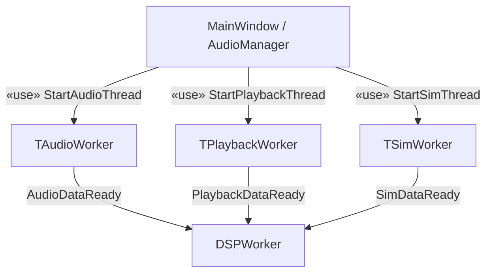
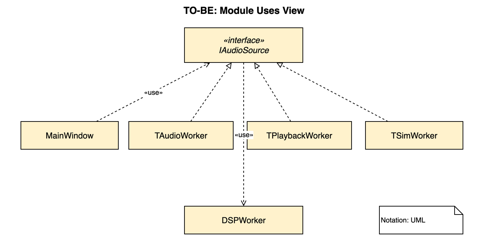
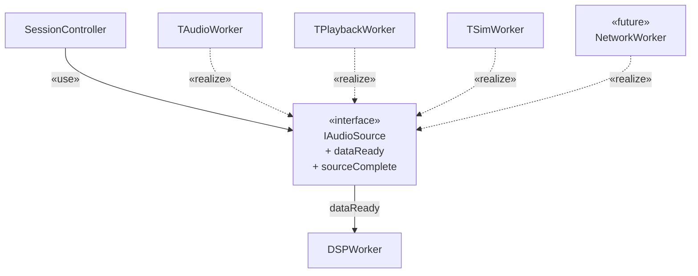
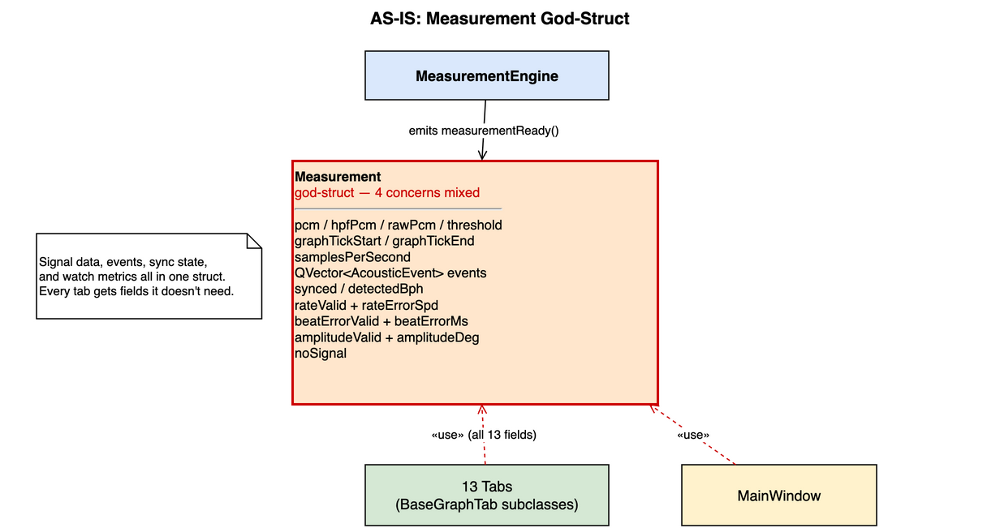
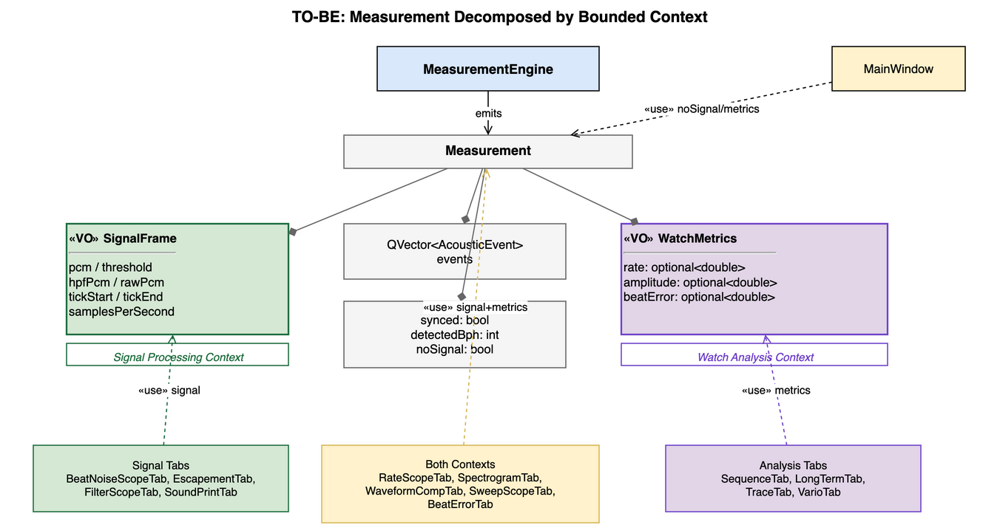
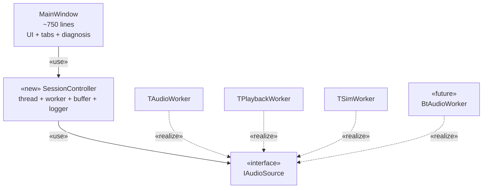
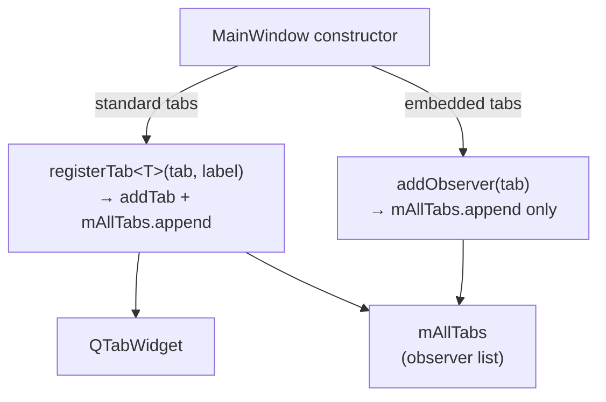
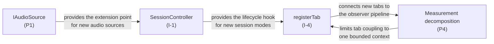

# Extensibility Tactics: Architecture Synthesis

## Overview

This document synthesizes the three highest-impact extensibility tactics applied
during the Milestone 2 refactoring cycle. Each tactic addresses a concrete
change-scenario derived from the TimeGrapher requirements: adding a new audio
source, adding a new graph tab, or adding a new session mode. Together they form
a layered extensibility strategy that minimizes the blast radius of each
anticipated growth path.

---

## Tactic 1 — Dependency Inversion: `IAudioSource` Interface (P1)

### Change Scenario

> "Add a network-stream audio source for remote watch analysis."

### AS-IS



`MainWindow` depended directly on all three concrete worker types. Each worker
emitted a differently-named signal, forcing three separate `connect()` blocks.
Adding a fourth source required modifying `MainWindow` and `AudioManager`.

### TO-BE





`SessionController` holds one `IAudioSource*` and connects to the unified
`dataReady` / `sourceComplete` signals. A new source is added by:

1. Implementing `IAudioSource` in the new worker class.
2. Adding `SessionController::startNetwork()`.
3. **No other file is touched.**

### Module View

| Module | Role | Depends on |
|--------|------|-----------|
| `IAudioSource` | Abstract signal source contract | Qt signal infrastructure |
| `TAudioWorker`, `TPlaybackWorker`, `TSimWorker` | Concrete sources | `IAudioSource` |
| `SessionController` | Source lifecycle manager | `IAudioSource` (abstraction only) |
| `DSPWorker` | PCM consumer | `IAudioSource::dataReady` signal |

### Rationale

**Dependency Inversion Principle** — `SessionController` depends on the
`IAudioSource` abstraction, not on concrete types. This is the textbook
DIP application: the high-level policy (session management) is isolated
from the low-level detail (which audio hardware/file format is active).

**Open/Closed Principle** — The system is open for extension (new worker
implementing `IAudioSource`) and closed for modification (`SessionController`
does not change). The single `connect()` block in `SessionController` wires any
conforming source identically.

**Signal unification** — The AS-IS design named signals differently per worker
(`AudioDataReady`, `PlaybackDataReady`, `SimDataReady`). Unifying to `dataReady`
collapses three identical `connect()` blocks into one, removing a class of
copy-paste divergence bugs.

**Blast radius without this tactic:** Adding the fourth source requires editing
`MainWindow`, `AudioManager`, and adding a new `connect()` block — three files,
three opportunities for divergence. With this tactic: one new file.

---

## Tactic 2 — Bounded Context Decomposition: `Measurement` Struct (P4)

### Change Scenario

> "Add a new graph tab that displays only watch rate trend over time."

### AS-IS



`Measurement` was a flat god-struct combining four concerns: PCM signal data,
acoustic events, sync state, and watch metrics (as `bool valid + double value`
pairs). Every tab received `const Measurement &m` and accessed whatever subset it
needed, implicitly coupling every consumer to the internal layout of all four
concerns.

```cpp
// AS-IS: a new tab must understand all 13 fields
struct Measurement {
    QVector<double> pcm, hpfPcm, rawPcm, threshold;
    int   graphTickStart, graphTickEnd, samplesPerSecond;
    QVector<AcousticEvent> events;
    bool  synced;   int detectedBph;
    bool  rateValid;      double rateErrorSpd;
    bool  amplitudeValid; double amplitudeDeg;
    bool  beatErrorValid; double beatErrorMs;
};
```

### TO-BE



`Measurement` is restructured as a thin container of two named Value Objects,
each aligned with one Bounded Context:

```cpp
struct SignalFrame {              // Signal Processing Context
    QVector<double> pcm, threshold;
    QVector<float>  hpfPcm, rawPcm;
    uint64_t        tickStart = 0, tickEnd = 0;
    int             samplesPerSecond = 48000;
};

struct WatchMetrics {             // Watch Analysis Context
    std::optional<double> rate;       // s/day
    std::optional<double> amplitude;  // degrees
    std::optional<double> beatError;  // ms
};

struct Measurement {
    SignalFrame            signal;
    QVector<AcousticEvent> events;
    bool                   synced      = false;
    int                    detectedBph = 0;
    WatchMetrics           metrics;
};
```

### Module View — Tab Consumer Classification

| Tab group | Bounded Context | Fields accessed |
|-----------|----------------|----------------|
| `BeatNoiseScopeTab`, `EscapementTab`, `FilterScopeTab`, `SoundPrintTab` | Signal only | `signal`, `events` |
| `SequenceTab`, `LongTermTab`, `TraceTab`, `VarioTab` | Analysis only | `metrics` |
| `RateScopeTab`, `SpectrogramTab`, `BeatErrorTab`, `SweepScopeTab` | Both | `signal` + `events` + `metrics` |
| `MainWindow` | Sync + Analysis | `noSignal`, `synced`, `detectedBph`, `metrics` |

### Adding a New Tab

A new rate-trend tab needs only to implement `BaseGraphTab::update(const Measurement &m)`
and read `m.metrics.rate`. It has zero coupling to signal PCM fields:

```cpp
// New tab — touches only Watch Analysis context
void RateTrendTab::update(const Measurement &m) {
    if (!m.metrics.rate) return;
    mSeries->append(mFrameIndex++, *m.metrics.rate);
}
```

**No existing file changes.** The tab is registered with `registerTab()` (I-4);
`MeasurementEngine` publishes to it automatically via the observer list.

### Rationale

**Bounded Context alignment (DDD)** — The TimeGrapher domain has two distinct
ubiquitous languages: Signal Processing ("sample", "tick", "onset", "HPF") and
Watch Analysis ("rate s/day", "amplitude °", "beat error ms"). Mapping these
contexts to struct boundaries reduces cognitive load: a tab author working in the
Watch Analysis context does not need to understand PCM field semantics, and
vice versa.

**`std::optional` over `bool + double` pairs** — The AS-IS pattern allowed
reading `rateErrorSpd` even when `rateValid == false`; the compiler could not
detect this. `std::optional<double>` makes the invalid-read a compile error or
an explicit suppression (`value_or()`). Adding a new metric (`beatErrorVariance`)
requires one field in `WatchMetrics` — no additional `bool` flag, no risk of
forgetting to check it.

**Reduced coupling for new metrics** — Adding a fourth metric (e.g., power reserve
estimate) requires adding one `std::optional<double>` field to `WatchMetrics`.
Only tabs that read that field need to change; the 9 signal-only tabs are unaffected.

**Blast radius without this tactic:** Every new metric requires adding two fields
(`bool valid + double value`) and updating every consumer that forwards or logs
`Measurement`. With this tactic: one field, two files (`Measurement.h` and
`MeasurementEngine.cpp`).

---

## Tactic 3 — Separation of Concerns: `SessionController` Extraction (I-1) + Tab Registration Helpers (I-4)

### Change Scenario

> "Add a new session mode (e.g., Bluetooth watch audio) and a new display tab for it."

These two tactics work together: I-1 localizes the session-mode extension point;
I-4 localizes the tab registration extension point.

### I-1: SessionController Module View



Adding a Bluetooth session mode requires:
- `BtAudioWorker` implements `IAudioSource` (new file)
- `SessionController::startBluetooth()` — one method in one file
- `MainWindow` acquires a button and calls `mSession->startBluetooth(...)` — UI
  code only, no thread logic

The ring-buffer allocation, logger initialization, and observer wiring are all
handled once inside `SessionController::initRawAudio()` and `startSourceThread()`.
They are not duplicated for the new mode.

### I-4: Tab Registration Module View



Adding the Bluetooth display tab requires:
- `BtScopeTab` implements `BaseGraphTab` (new file)
- One call: `mBtScopeTab = registerTab(new BtScopeTab(this), "BT Scope");`
- **`MainWindow` is open-closed**: the constructor gains one line; no existing logic changes

### Rationale

**Single Responsibility Principle (I-1)** — The AS-IS `MainWindow` had four
simultaneous concerns: UI state, session lifecycle, tab construction, and
diagnosis display. Each concern had its own reason to change. Extracting
`SessionController` gives session lifecycle a single, testable owner. A new
session mode only changes `SessionController`; UI state changes only touch
`MainWindow`.

**DRY — ring-buffer and logger initialization (I-1)** — The AS-IS
`StartAudioThread`, `StartPlaybackThread`, and `StartSimThread` each contained
an identical `#ifdef ENABLE_LOGGING` block and ring-buffer `new/delete` sequence.
`SessionController::initRawAudio()` is the single location. A new session mode
calls it and inherits correct behavior without duplicating the protocol.

**Locality of Change (I-4)** — Adding a tab required three coordinated edits
across three separate blocks in `MainWindow`'s constructor: construction, tab
widget registration, and observer list. A single omission — forgetting `mAllTabs.append`
— caused the tab to miss `pause()` and `reset()` calls with no compiler warning.
`registerTab<T>()` consolidates all three into one call; the omission is impossible.

**Type-safe registration (I-4)** — The template return type preserves the concrete
tab type at the call site (`mBtScopeTab = registerTab(...)` gives a `BtScopeTab*`
directly). A non-template version returning `BaseGraphTab*` would require a
`static_cast` for every post-construction setup call.

**Combined blast radius:** Adding a new session mode + display tab touches:
- One new `IAudioSource` implementation file
- One `startXxx()` method in `SessionController`
- One `registerTab()` call in `MainWindow`'s constructor
- The new tab file

No existing session logic, no existing tab, and no signal routing code changes.

---

## Summary: Tactic → Change Scenario Mapping

| Tactic | Change scenario protected | Files added | Files modified |
|--------|--------------------------|-------------|---------------|
| P1: `IAudioSource` interface | New audio source type | 1 (worker) | 1 (`SessionController::startXxx`) |
| P4: `Measurement` decomposition | New graph tab / new metric | 1 (tab) | 2 (`Measurement.h`, `MeasurementEngine.cpp`) |
| I-1: `SessionController` extraction | New session mode | 1 (worker) | 1 (`SessionController`) |
| I-4: Tab registration helpers | New standard tab | 1 (tab) | 1 (one line in `MainWindow` constructor) |

### Modifiability Impact

The four tactics interlock:



Each tactic removes a different category of modification cost:
- **P1** removes interface spread (new source = one file, not three).
- **P4** removes struct coupling (new metric = one field, not two + all consumers).
- **I-1** removes code duplication (new mode reuses init; no copy-paste).
- **I-4** removes scattered registration (new tab = one call, not three).

Together they achieve the goal stated in the Supplementary Specification:
a new measurement mode, filter, graph, or display can be added with limited
redesign of existing modules.
