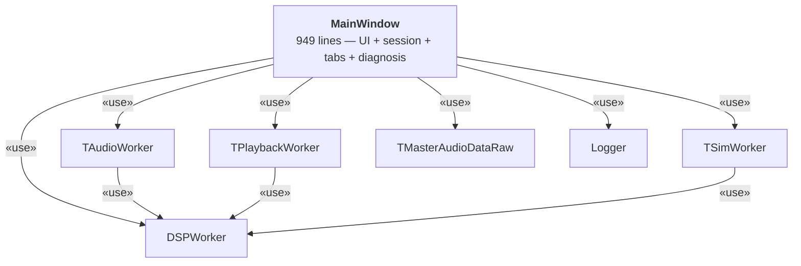
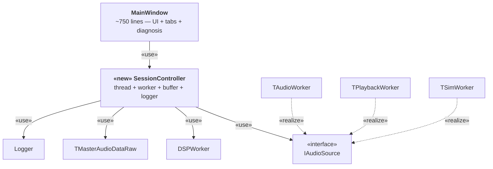

# I-1: SessionController Extraction

## Summary

Extracted the acquisition-layer coordinator from `MainWindow` into a dedicated
`SessionController` class, reducing `MainWindow` from 949 lines to ~750 lines
and giving the session lifecycle a single, testable owner.

---

## AS-IS



`MainWindow` directly owned every acquisition-layer element for all three
operation modes:

| Owned member | Role |
|---|---|
| `mRawAudio` (`TMasterAudioDataRaw*`) | PCM ring buffer |
| `mActiveSource` (`IAudioSource*`) | current audio source worker |
| `mSourceThread` (`QThread*`) | source worker thread |
| `mDspWorker` (`DSPWorker*`) | DSP pipeline |
| `mDspThread` (`QThread*`) | DSP thread |
| `mLogger` (`Logger*`) | per-frame CSV logger |

Three factory methods (`StartAudioThread`, `StartPlaybackThread`,
`StartSimThread`) each duplicated ring-buffer allocation, `#ifdef ENABLE_LOGGING`
blocks, and `connect()` wiring.  `wireEngineToTabs()` was also called inline
from within those methods, mixing observer registration with thread startup.

**Problems**

| # | Problem | Impact |
|---|---|---|
| 1 | Session lifecycle mixed with UI, tab, and diagnosis logic in one 949-line file | Any change to threading requires reading the whole class |
| 2 | Ring-buffer allocation and Logger setup copied 3× | Silent divergence risk on update |
| 3 | `MainWindow` depends on all six concrete acquisition types | Adding a new mode (e.g. network stream) forces changes to MainWindow |
| 4 | `wireEngineToTabs()` called from within thread-start methods | Observer registration is not separable from thread lifecycle |

---

## TO-BE



A new `SessionController` class owns all acquisition-layer state.
`MainWindow` reads UI controls, constructs `MovementSpec` + `AcquisitionConfig`
Value Objects, and delegates:

```cpp
// MainWindow::LiveStart() — after refactor
void MainWindow::LiveStart() {
    if (!RecordSessionCheck()) return;
    resetTabs();
    MovementSpec      movement{ ManualAutoBPH[...], mLiftAngle };
    AcquisitionConfig config  { mCurrentSamplesPerSecond, ... };
    mSession->startLive(movement, config, useOnset, device, volume);
    SetGuiRunMode();
}
```

`SessionController` exposes three session-start methods and two signals:

```cpp
class SessionController : public QObject {
public:
    void startLive    (MovementSpec, AcquisitionConfig, bool, QAudioDevice, float);
    void startPlayback(MovementSpec, AcquisitionConfig, bool, QString);
    void startSim     (MovementSpec, AcquisitionConfig, bool, WatchSynthStreamConfig);
    void stop();
    void connectObservers(QList<BaseGraphTab*>, QObject*, const char*);
signals:
    void sessionStopped();
    void frameLogged(Logger::Frame);
};
```

---

## Rationale

### 1. Single Responsibility Principle

The AS-IS `MainWindow` violated SRP by holding responsibilities from four
distinct concerns simultaneously:

| Concern | AS-IS owner | TO-BE owner |
|---|---|---|
| Session thread lifecycle | `MainWindow` | `SessionController` |
| UI state (buttons, combos) | `MainWindow` | `MainWindow` |
| Tab construction + observer wiring | `MainWindow` | `MainWindow` |
| Results display + diagnosis | `MainWindow` | `MainWindow` |

Each class now has one reason to change.

### 2. DRY — ring-buffer allocation and Logger setup

The three `StartXxxThread()` factory methods each contained an identical
`#ifdef ENABLE_LOGGING` block and identical ring-buffer `new/delete` sequence.
`SessionController::initRawAudio()` is the single location for both:

```cpp
// SessionController.cpp — written once
void SessionController::initRawAudio(int sampleRate) {
#ifdef ENABLE_LOGGING
    delete mLogger;
    mLogger = new Logger(...);
#endif
    delete[] mRawAudio->Samples;
    delete mRawAudio;
    mRawAudio = new TMasterAudioDataRaw;
    mRawAudio->Samples = new float[sampleRate * SECONDS_OF_BUFFER];
}
```

### 3. Open/Closed for new session modes

In the AS-IS, adding a fourth audio source (e.g. a network stream) required:
- Adding a new `StartNetworkThread()` method to `MainWindow`
- Adding new member pointers `mNetworkWorker`, `mNetworkThread` to `MainWindow`
- Wiring `connect()` blocks inside `MainWindow`

In the TO-BE, the same change requires only:
- Implementing `IAudioSource` in the new worker class
- Adding `SessionController::startNetwork()` (one method in one file)
- `MainWindow` is not touched

### 4. Observer registration decoupled from thread startup

`connectObservers()` is called once at construction time; `startSourceThread()`
re-applies the stored observer list each session.  This makes the wiring
relationship between `MeasurementEngine` and the tabs readable independently
of the thread lifecycle code.

---

## Files Changed

| File | Change |
|---|---|
| `src/ui/SessionController.h` | New — public interface |
| `src/ui/SessionController.cpp` | New — 180 lines: thread lifecycle, observer wiring |
| `src/ui/MainWindow.h` | Remove 8 member vars and 5 private methods; add `mSession` |
| `src/ui/MainWindow.cpp` | 949 → ~750 lines; `LiveStart/Playback/SimStart` delegate to `mSession` |
| `src/CMakeLists.txt` | Add `SessionController.cpp/.h` to `PROJECT_SOURCES` |
| `src/tests/test_*.cpp` | Update `Measurement` field paths to `signal.*` / `metrics.*` (P4 follow-up) |
