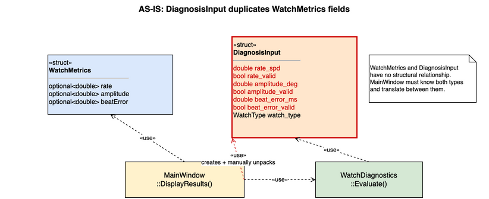
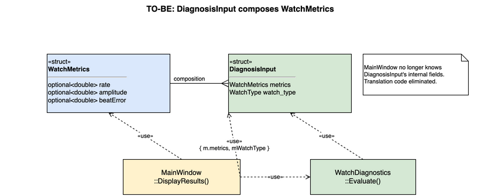

# I-2: DiagnosisInput Composes WatchMetrics

## Summary

Replaced six `bool + double` fields in `DiagnosisInput` with a single `WatchMetrics`
composition, eliminating the manual unpacking translation that `MainWindow::DisplayResults()`
performed between the two structs.

---

## AS-IS



`DiagnosisInput` duplicated the nullable metric fields that `WatchMetrics` already
expressed via `std::optional`:

```cpp
// WatchMetrics (Measurement.h) — correct nullable representation
struct WatchMetrics {
    std::optional<double> rate;
    std::optional<double> amplitude;
    std::optional<double> beatError;
};

// DiagnosisInput (WatchDiagnostics.h) — same data, old bool+double anti-pattern
struct DiagnosisInput {
    double    rate_spd;        // duplicates WatchMetrics::rate
    bool      rate_valid;
    double    amplitude_deg;   // duplicates WatchMetrics::amplitude
    bool      amplitude_valid;
    double    beat_error_ms;   // duplicates WatchMetrics::beatError
    bool      beat_error_valid;
    WatchType watch_type;
};
```

`MainWindow::DisplayResults()` had to manually translate between the two representations
with 7 lines of boilerplate:

```cpp
DiagnosisInput diagInput;
diagInput.rate_valid       = m.metrics.rate.has_value();
diagInput.rate_spd         = m.metrics.rate.value_or(0.0);
diagInput.amplitude_valid  = m.metrics.amplitude.has_value();
diagInput.amplitude_deg    = m.metrics.amplitude.value_or(0.0);
diagInput.beat_error_valid = m.metrics.beatError.has_value();
diagInput.beat_error_ms    = m.metrics.beatError.value_or(0.0);
diagInput.watch_type       = mWatchType;
```

**Problems**

| # | Problem | Impact |
|---|---------|--------|
| 1 | `DiagnosisInput` reverts the `bool + double` anti-pattern that P4 eliminated in `WatchMetrics` | Inconsistent convention; two ways to express the same nullable semantics |
| 2 | `MainWindow` must know the internal field layout of `DiagnosisInput` to fill it | Couples the controller to the struct's implementation detail |
| 3 | `WatchDiagnostics::Evaluate()` reads raw `double` values with no compiler-enforced validity check | Compiler cannot prevent reading `rate_spd` when `rate_valid` is false |

---

## TO-BE



`DiagnosisInput` composes `WatchMetrics` directly:

```cpp
struct DiagnosisInput {
    WatchMetrics metrics;
    WatchType    watch_type = WatchType::Men;
};
```

`MainWindow::DisplayResults()` constructs it with a single aggregate initializer:

```cpp
DiagnosisResult diagResult = mWatchDiagnostics.Evaluate({ m.metrics, mWatchType });
```

`WatchDiagnostics::Evaluate()` reads `std::optional` fields directly:

```cpp
if (!input.metrics.rate || !input.metrics.amplitude || !input.metrics.beatError)
    return { DiagnosisLevel::Unknown, "DIAGNOSIS: Unknown" };

const double rate       = *input.metrics.rate;
const double amplitude  = *input.metrics.amplitude;
const double beat_error = *input.metrics.beatError;
```

---

## Rationale

### 1. Consistency with P4 (single nullable convention)

P4 replaced six `bool valid + double value` fields in `Measurement` with
`std::optional<double>` in `WatchMetrics`. `DiagnosisInput` used the old pattern
for the same three metrics, creating two conventions in the same codebase for
expressing "value not yet available."

Composing `WatchMetrics` into `DiagnosisInput` enforces one convention uniformly:
`std::optional` is the canonical nullable value in the Watch Analysis Bounded Context.

### 2. Information hiding (Larman OOAD)

In the AS-IS design, `MainWindow` acted as a translator: it unpacked `WatchMetrics`
fields and repacked them into `DiagnosisInput` fields. This required `MainWindow` to
know the internal layout of both structs simultaneously.

In the TO-BE design, `MainWindow` passes `m.metrics` as an opaque value — it does
not need to know what fields `DiagnosisInput` contains. If `WatchMetrics` gains a
new field (e.g., `beatErrorVariance`), `MainWindow` requires no change.

### 3. Compiler-enforced validity

The `bool + double` pattern allows reading `rate_spd` even when `rate_valid` is
false — the compiler cannot detect this. `std::optional` requires the caller to
check `has_value()` (or use `value_or()`) before dereferencing, making the
invalid-read mistake a compile error or explicit suppression.

---

## Files Changed

| File | Change |
|------|--------|
| `src/engine/WatchDiagnostics.h` | `DiagnosisInput`: 6 `bool+double` fields → `WatchMetrics metrics`; added `#include "Measurement.h"` |
| `src/engine/WatchDiagnostics.cpp` | `Evaluate()`: reads `input.metrics.rate` / `.amplitude` / `.beatError` via `std::optional` |
| `src/ui/MainWindow.cpp` | `DisplayResults()`: 7-line manual unpack → 1-line aggregate init `{ m.metrics, mWatchType }` |
