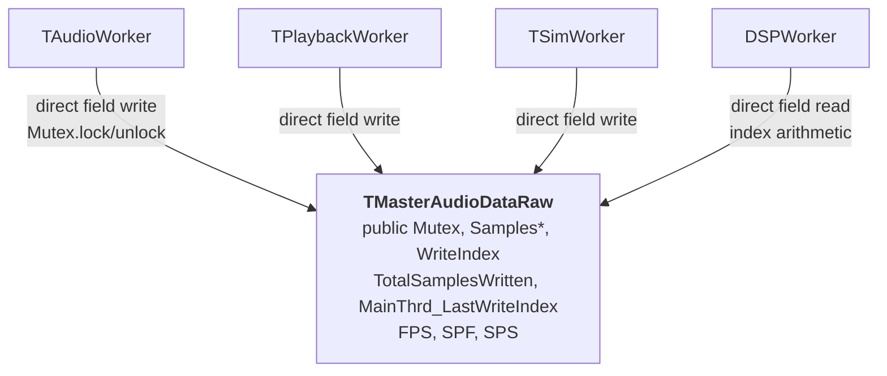
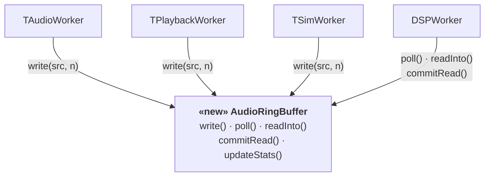

# I-3: AudioRingBuffer Encapsulation

## Summary

Replaced the naked C struct `TMasterAudioDataRaw` with a proper `AudioRingBuffer`
class, hiding the ring-buffer index arithmetic, mutex protocol, and stats fields
behind a typed API that enforces the single-producer / single-consumer contract.

---

## AS-IS



`TMasterAudioDataRaw` was a C-style typedef struct with all fields public:

```cpp
typedef struct {
    QMutex       Mutex;
    float        *Samples;
    int          NumberOfAudioSamples;
    unsigned int WriteIndex;
    uint64_t     TotalSamplesWritten;
    uint64_t     MainThrd_LastTotalSamplesWritten;
    unsigned int MainThrd_LastWriteIndex;
    double       FPS, SPF, SPS;
} TMasterAudioDataRaw;
```

`DSPWorker` accessed the struct internals directly:

```cpp
// DSPWorker.cpp — AS-IS
mRaw->Mutex.lock();
uint64_t totalWritten = mRaw->TotalSamplesWritten;
mRaw->Mutex.unlock();

int samplesToAdd = (int)(totalWritten - mRaw->MainThrd_LastTotalSamplesWritten);
// ...
mInputBlock[i] = mRaw->Samples[mRaw->MainThrd_LastWriteIndex];
mRaw->MainThrd_LastWriteIndex =
    (mRaw->MainThrd_LastWriteIndex + 1) % mRaw->NumberOfAudioSamples;
```

**Problems**

| # | Problem | Impact |
|---|---------|--------|
| 1 | Mutex lock/unlock protocol duplicated in every worker | One missing unlock = deadlock; no single place to audit the protocol |
| 2 | Ring-buffer index arithmetic (`% NumberOfAudioSamples`) exposed to DSPWorker | Any caller can corrupt the ring by miscalculating the index |
| 3 | `MainThrd_` prefix naming convention enforces thread ownership by convention only | Compiler cannot prevent the wrong thread from writing `MainThrd_LastWriteIndex` |
| 4 | `Samples` is a raw `float*`; allocation / deallocation scattered across workers | Double-free and size-mismatch bugs are latent |

---

## TO-BE



`AudioRingBuffer` exposes a typed API split by producer / consumer side:

```cpp
class AudioRingBuffer {
public:
    // --- Writer side (audio thread) ---
    void write(const float *src, int n);
    void updateStats(double fps, double sps, double spf);

    // --- Reader side (DSP thread) ---
    int    poll();           // snapshot TotalWritten; returns new sample count
    int    drops() const;    // samples overwritten since last poll()
    double bufferPct() const;
    void   readInto(float *dst, int n);
    void   commitRead();
    // ...
};
```

`DSPWorker` now reads through the API:

```cpp
// DSPWorker.cpp — TO-BE
int samplesToAdd = mRaw->poll();        // acquires mutex internally
// ...
mRaw->readInto(mInputBlock, slice);    // no index arithmetic at call site
mRaw->commitRead();
```

---

## Rationale

### 1. Encapsulation of invariants

The ring buffer has two invariants that the AS-IS struct could not enforce:
- The mutex must be held when reading `TotalSamplesWritten`.
- `MainThrd_LastWriteIndex` must be advanced modulo `NumberOfAudioSamples`.

`AudioRingBuffer` internalises both. Every caller gets correct behavior for free;
there is no protocol to remember.

### 2. Thread-role clarity via API shape

The AS-IS struct had no way to express that `WriteIndex` belongs to the writer
thread and `MainThrd_LastWriteIndex` belongs to the reader thread. The comments
used a naming prefix as the only guard.

`AudioRingBuffer` splits its API into writer-side (`write`, `updateStats`) and
reader-side (`poll`, `readInto`, `commitRead`). The class comment states:

> Invariant: `readInto()` and `commitRead()` must only be called from one thread.
> `write()` and `updateStats()` must only be called from one thread.

Code review now has a single place to check the threading contract.

### 3. `std::unique_ptr` replaces raw `float*`

The AS-IS `Samples` pointer required manual `new[]` / `delete[]` in every
construction / destruction site, with no size embedded alongside the pointer.
`AudioRingBuffer` uses `std::unique_ptr<float[]> mBuffer` and stores `mCapacity`,
eliminating the allocation mismatch risk.

### 4. Extensibility

Adding a second consumer (e.g. a real-time FFT display that reads from the ring
independently of `DSPWorker`) requires only a new reader-side state pair inside
`AudioRingBuffer` and a new `pollN()` / `readIntoN()` method pair. No callers
of the writer-side API are affected.

---

## Files Changed

| File | Change |
|------|--------|
| `src/audio/AudioRingBuffer.h` | New — SPSC ring buffer class |
| `src/audio/AudioRingBuffer.cpp` | New — implementation |
| `src/audio/SharedAudio.h` | Reduced to PCM format constants; `TMasterAudioDataRaw` removed |
| `src/audio/AudioWorker.cpp/h` | `write()` + `updateStats()` replaces direct struct writes |
| `src/audio/PlaybackWorker.cpp/h` | Same |
| `src/audio/SimWorker.cpp/h` | Same |
| `src/audio/DSPWorker.cpp/h` | `poll()` + `readInto()` + `commitRead()` replaces manual index arithmetic |
| `src/ui/SessionController.cpp` | Constructs `AudioRingBuffer`; passes pointer to workers |
| `src/CMakeLists.txt` | Add `AudioRingBuffer.cpp/.h` |
