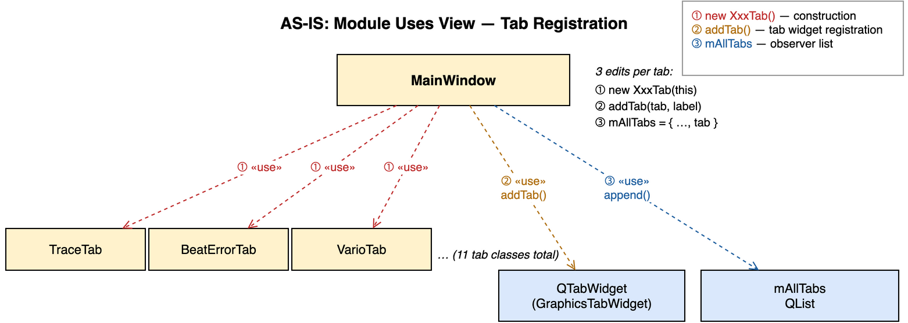
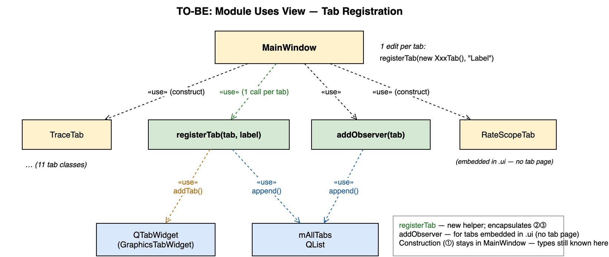

# I-4: Tab Registration Helpers

## Summary

Replaced the three-location edit pattern for tab registration in `MainWindow` with two
helper methods — `registerTab<T>()` and `addObserver()` — so that adding a new tab
requires a single edit instead of three scattered changes.

---

## AS-IS



Every tab was registered across three separate locations in `MainWindow`'s constructor:

```cpp
// ① Construction — one line per tab
mTraceTab     = new TraceTab(this);
mBeatErrorTab = new BeatErrorTab(this);
// … (11 tabs)

// ② Tab widget registration — second block, same order required
ui->GraphicsTabWidget->addTab(mTraceTab,     "Trace");
ui->GraphicsTabWidget->addTab(mBeatErrorTab, "Beat Error");
// … (11 addTab calls)

// ③ Observer list — third location, same order required
mAllTabs = { mRateScopeTab, mTraceTab, mSoundPrintTab, mBeatErrorTab,
             mVarioTab, mSequenceTab, … };
```

**Problems**

| # | Problem | Impact |
|---|---------|--------|
| 1 | Three separate edit points per tab | Adding or removing a tab requires three coordinated changes; missing one silently breaks pause/reset |
| 2 | Order must be kept consistent across all three blocks | Mismatched order does not cause a compile error but produces wrong tab layout or missing observer |
| 3 | `QTabWidget` and `QList<BaseGraphTab*>` are direct dependencies of `MainWindow` | Every callsite knows and touches the internal storage structure |

---

## TO-BE



Two helper methods consolidate the three responsibilities:

```cpp
// Standard tabs — one call per tab: constructs, registers in TabWidget, appends to mAllTabs.
mTraceTab     = registerTab(new TraceTab(this),     "Trace");
mBeatErrorTab = registerTab(new BeatErrorTab(this), "Beat Error");
// … (11 calls)

// Embedded tabs (no tab page — wrapped around existing .ui widgets).
addObserver(mRateScopeTab);   // RateScopeTab wraps ui->RatePlot / ui->ScopePlot
addObserver(mSoundPrintTab);  // SoundPrintTab wraps ui->SoundImage
```

The helpers are implemented as private methods of `MainWindow`:

```cpp
// MainWindow.h
template<typename T>
T*   registerTab(T *tab, const QString &label); // addTab + mAllTabs.append; returns tab
void addObserver(BaseGraphTab *tab);             // mAllTabs.append only

// MainWindow.cpp
template<typename T>
T* MainWindow::registerTab(T *tab, const QString &label)
{
    ui->GraphicsTabWidget->addTab(tab, label);
    mAllTabs.append(tab);
    return tab;
}

void MainWindow::addObserver(BaseGraphTab *tab)
{
    mAllTabs.append(tab);
}
```

---

## Rationale

### 1. Locality of Change (OCP — Open/Closed Principle)

Adding a new tab previously required three edits in three different places inside
`MainWindow`. A single omission — forgetting to add the tab to `mAllTabs` — meant
the tab would not respond to global pause or reset without any compile-time warning.

With `registerTab()`, the single call site is the only location to change. The
`QTabWidget` and observer-list updates are encapsulated in the helper; callers cannot
accidentally omit one.

### 2. `registerTab<T>` returns `T*` — typed assignment without cast

The template return type preserves the concrete tab type at the call site:

```cpp
mSequenceTab = registerTab(new SequenceTab(this), "Sequence");
// mSequenceTab is SequenceTab* — no static_cast needed for post-construction setup
```

A non-template version returning `BaseGraphTab*` would require a cast every time a
concrete method is called after registration (e.g., `mBeatNoiseScopeTab->setLiftAngle()`).

### 3. `addObserver` makes the embedded-tab distinction explicit

`RateScopeTab` and `SoundPrintTab` wrap existing widgets from the `.ui` file and are
**not** added as tab pages. Previously they were silently included in the `mAllTabs`
initializer list alongside standard tabs, with no indication that they were treated
differently. `addObserver()` makes the distinction visible at the call site and
documents the intent in code.

### 4. Relationship to Observer pattern (AP-4)

`mAllTabs` is the observer registry — it holds every `BaseGraphTab*` that receives
`Measurement` notifications from `MeasurementEngine`. The prior scattered registration
made it hard to reason about which tabs were observers and which were not. The new
pattern groups all observer registrations into consecutive `registerTab` /
`addObserver` calls, making the Observer registration block clearly delimited in the
constructor.

---

## Files Changed

| File | Change |
|------|--------|
| `src/ui/MainWindow.h` | Added `registerTab<T>()` and `addObserver()` private declarations |
| `src/ui/MainWindow.cpp` | Replaced 3-block tab setup with `registerTab` / `addObserver` calls; added helper implementations |
