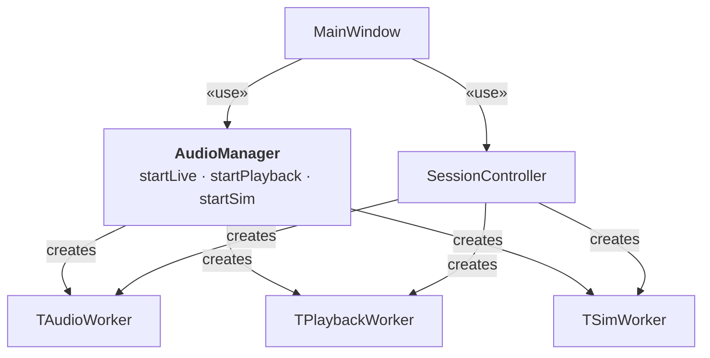
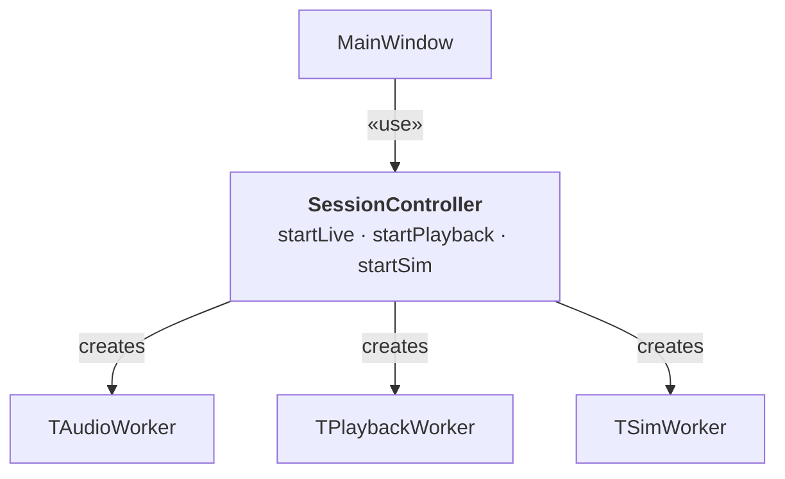

# I-6: AudioManager Removal

## Summary

Deleted the `AudioManager` class after `SessionController` (I-1) absorbed all of
its responsibilities. `AudioManager` had become dead code: no file in the source
tree included or instantiated it after the I-1 refactor.

---

## AS-IS

After the I-1 `SessionController` extraction, both `AudioManager` and
`SessionController` owned worker-creation logic for the same three modes:

| Method | `AudioManager` | `SessionController` |
|--------|---------------|---------------------|
| Live   | `startLive(int, int, double, int, bool)` | `startLive(MovementSpec, AcquisitionConfig, bool, QAudioDevice, float)` |
| Playback | `startPlayback(QString, int, double, int, bool)` | `startPlayback(MovementSpec, AcquisitionConfig, bool, QString)` |
| Sim    | `startSim(int, double, int, int, bool)` | `startSim(MovementSpec, AcquisitionConfig, bool, WatchSynthStreamConfig)` |

`AudioManager`'s signatures still used raw `int`/`double` parameters — the same
anti-pattern that P2 eliminated in `MeasurementEngine::init()`. Its `bph`,
`liftAngle`, `averagingPeriod`, and `useOnset` parameters were all marked
`/*unused*/` in the implementation, meaning the class performed no work that
`SessionController` did not already duplicate correctly.

After I-1, no file in `src/` included `AudioManager.h`. The class existed
only in `CMakeLists.txt` and its own two files.

---

## TO-BE

`SessionController` is the single acquisition-layer coordinator.
`AudioManager` is deleted.

---

## Rationale

### 1. Dead code removal

After I-1, `grep -rn "AudioManager" src/ --include="*.h" --include="*.cpp"`
returned zero results outside of `AudioManager`'s own two files. The class was
unreachable from any active code path. Keeping dead code introduces maintenance
cost without benefit: it must be updated when interfaces change, it appears in
search results, and it misleads readers into thinking it is used.

### 2. Inconsistent VO convention

`AudioManager`'s method signatures used raw `int bph, double liftAngle` parameters
— the same pattern that P2 replaced with `MovementSpec` and `AcquisitionConfig`
throughout the rest of the codebase. Its continued presence created two conflicting
calling conventions for the same domain concepts.

### 3. Overlapping responsibility with SessionController

Both classes held references to `TAudioWorker`, `TPlaybackWorker`, and `TSimWorker`
and created them in `startXxx()` methods. Two classes owning the same responsibility
violates the Single Responsibility Principle and raises the question of which class
is authoritative — a question with no good answer once `AudioManager` is unused.

---

## Files Changed

| File | Change |
|------|--------|
| `src/audio/AudioManager.h` | Deleted |
| `src/audio/AudioManager.cpp` | Deleted |
| `src/CMakeLists.txt` | Removed `audio/AudioManager.h` and `audio/AudioManager.cpp` from `PROJECT_SOURCES` |
