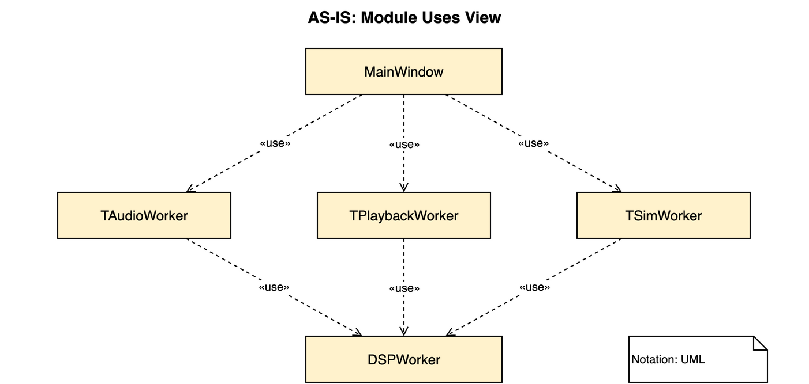

# P1: IAudioSource Interface 도입

## 변경 개요

`MainWindow`(및 `AudioManager`)가 3개의 concrete worker 클래스에 직접 의존하던 구조를
`IAudioSource` 인터페이스를 도입해 의존성을 역전시킨 변경이다.

---

## AS-IS

`MainWindow`는 `TAudioWorker`, `TPlaybackWorker`, `TSimWorker` 세 concrete 타입을 직접 `«use»`한다.
각 worker는 서로 다른 이름의 시그널(`AudioDataReady`, `PlaybackDataReady`, `SimDataReady` 등)을
emit하고, `MainWindow`/`AudioManager`에서 worker별로 `connect()` 블록을 반복 작성했다.

**문제점**

- 새로운 audio source(예: 네트워크 스트림)를 추가하려면 `MainWindow`/`AudioManager` 코드를 반드시 수정해야 한다.
- worker마다 신호 이름이 달라 `connect()` 로직이 3벌 복제된다.
- EOF/완료 처리 핸들러(`HandlePlaybackDoneReadingFile`, `HandleSimDone`)가 동일 로직으로 중복된다.

---

## TO-BE

`IAudioSource` 인터페이스를 도입하고 세 worker가 이를 realize한다.
`MainWindow`/`AudioManager`는 `IAudioSource*` 하나만 `«use»`하며,
`DSPWorker`는 `IAudioSource::dataReady` 시그널을 통해 데이터를 수신한다.

**변경 이유**

| 원칙 | 적용 내용 |
|------|-----------|
| Dependency Inversion | `MainWindow`가 abstraction(`IAudioSource`)에 의존, concrete 타입에 의존하지 않음 |
| Open/Closed | 새 audio source는 `IAudioSource`를 구현하기만 하면 되고, `MainWindow` 수정 불필요 |
| DRY | `dataReady` / `sourceComplete` 시그널 이름이 통일되어 `connect()` 블록이 1벌로 줄어듦 |

**주요 코드 변경**

- `IAudioSource.h` / `IAudioSource.cpp` 추가 — `Q_OBJECT` 기반 추상 인터페이스
- `TAudioWorker`, `TPlaybackWorker`, `TSimWorker` 생성자 initializer를 `QObject(parent)` → `IAudioSource(parent)`로 변경
- `AudioManager.cpp`의 모든 `connect()` 호출을 `IAudioSource::dataReady`, `IAudioSource::sourceComplete`로 통일
- `CMakeLists.txt`에 `IAudioSource.cpp` 추가 (Qt MOC 링크 오류 방지)
