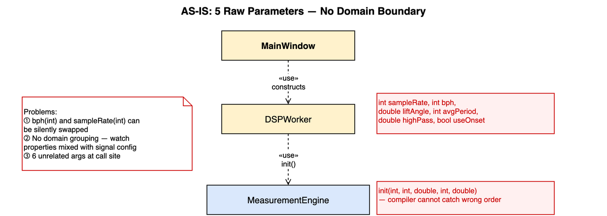
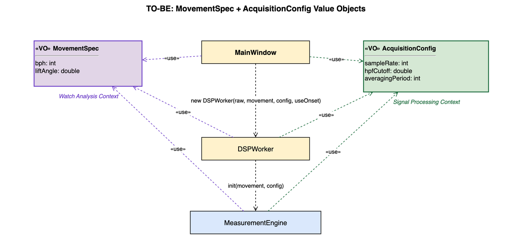

# P2: MovementSpec and AcquisitionConfig Value Objects

## Summary

Replaced `MeasurementEngine::init(int, int, double, int, double)` — a 5-argument raw
parameter list — with two domain-aligned Value Objects that reflect the two Bounded
Contexts identified in the TimeGrapher domain model.

---

## AS-IS



`MainWindow` constructed `DSPWorker` with six raw arguments, and `DSPWorker` forwarded
five of them directly to `MeasurementEngine::init()`:

```cpp
// MainWindow.cpp
mDspWorker = new DSPWorker(mRawAudio, mCurrentSamplesPerSecond, bph, mLiftAngle,
                            mAveragingPeriod, ui->HighLineEdit->text().toDouble(),
                            ui->UseConsetCheckBox->isChecked());

// MeasurementEngine.h
void init(int sampleRate, int bph, double liftAngle, int averagingPeriod, double hpfCutoff);
```

**Problems**

| # | Problem | Impact |
|---|---------|--------|
| 1 | `bph` and `sampleRate` are both `int` — wrong-order calls compile silently | Latent runtime bug |
| 2 | Watch properties (`bph`, `liftAngle`) mixed with signal config (`sampleRate`, `hpfCutoff`, `averagingPeriod`) | Domain boundary invisible at call site |
| 3 | 6 unrelated arguments require the caller to know internal groupings | High cognitive load; no locality of change |

---

## TO-BE



Two Value Objects are constructed at session start in `MainWindow` and passed through
the call chain:

```cpp
// MainWindow.cpp — session start
MovementSpec      movement{ ManualAutoBPH[ui->BPHComboBox->currentIndex()], mLiftAngle };
AcquisitionConfig config  { mCurrentSamplesPerSecond,
                             ui->HighLineEdit->text().toDouble(),
                             mAveragingPeriod };
mDspWorker = new DSPWorker(mRawAudio, movement, config, ui->UseConsetCheckBox->isChecked());

// MeasurementEngine.h
void init(const MovementSpec &movement, const AcquisitionConfig &config);
```

---

## Rationale

### 1. Value Object criterion (Larman OOAD)

Both types satisfy the VO definition:

| Criterion | MovementSpec | AcquisitionConfig |
|-----------|-------------|-------------------|
| **No identity needed** | Two specs with same bph+liftAngle are the same movement type | Two configs with same sampleRate+hpfCutoff+averagingPeriod are identical settings |
| **Immutable** | Fixed at session start; UI controls disabled during session | Fixed at session start; passed by const reference |

### 2. Bounded Context alignment

The split between the two VOs follows the domain's Bounded Context boundary:

| VO | Bounded Context | Fields | Domain meaning |
|----|----------------|--------|----------------|
| `MovementSpec` | Watch Analysis | `bph`, `liftAngle` | Mechanical identity of the watch movement — used in amplitude and rate formulas (`WatchMath::amplitudeDeg`, `halfBeatInterval`) |
| `AcquisitionConfig` | Signal Processing | `sampleRate`, `hpfCutoff`, `averagingPeriod` | Signal acquisition and analysis settings — interpreted by the DSP pipeline, not the watch domain |

Mixing these in one parameter list forced callers to understand both contexts
simultaneously. Separate VOs make each context's configuration independently
understandable and changeable.

### 3. Type safety

The original `init(int sampleRate, int bph, ...)` signature is dangerous because
`sampleRate` (e.g. 48000) and `bph` (e.g. 28800) are both `int` — a transposition
compiles without warning and produces silently wrong measurements. Named struct fields
make this mistake impossible:

```cpp
// Before: compiles even if bph and sampleRate are swapped
engine->init(bph, sampleRate, liftAngle, avgPeriod, hpfCutoff);  // silent bug

// After: field names prevent transposition
MovementSpec { .bph = bph, .liftAngle = liftAngle };
AcquisitionConfig { .sampleRate = sampleRate, ... };
```

### 4. Relationship to P4 (Measurement decomposition)

`AcquisitionConfig.sampleRate` and `SignalFrame.samplesPerSecond` (introduced in P4)
hold the same numeric value but serve different roles:

| Location | Role |
|----------|------|
| `AcquisitionConfig.sampleRate` | Configuration **input** — passed once at session init |
| `SignalFrame.samplesPerSecond` | Published **output** — carried per-block so tabs can interpret PCM positions |

This duplication is intentional; it reflects the input/output boundary between
session configuration and the real-time measurement pipeline.

---

## Files Changed

| File | Change |
|------|--------|
| `src/engine/MovementSpec.h` | New VO — `bph`, `liftAngle` |
| `src/engine/AcquisitionConfig.h` | New VO — `sampleRate`, `hpfCutoff`, `averagingPeriod` |
| `src/engine/MeasurementEngine.h` | `init()` signature: 5 raw params → `(MovementSpec, AcquisitionConfig)` |
| `src/engine/MeasurementEngine.cpp` | `init()` body reads from VO fields |
| `src/audio/DSPWorker.h` | Constructor: 6 raw params → `(MovementSpec, AcquisitionConfig, useOnset)` |
| `src/audio/DSPWorker.cpp` | Passes VOs through to `MeasurementEngine::init()` |
| `src/ui/MainWindow.cpp` | Constructs both VOs at session start; passes to `DSPWorker` |
