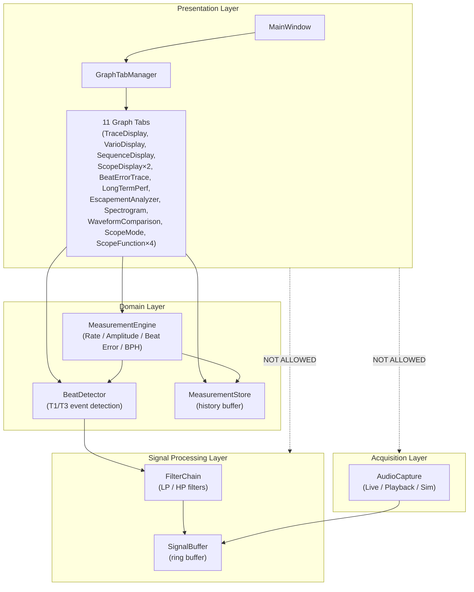
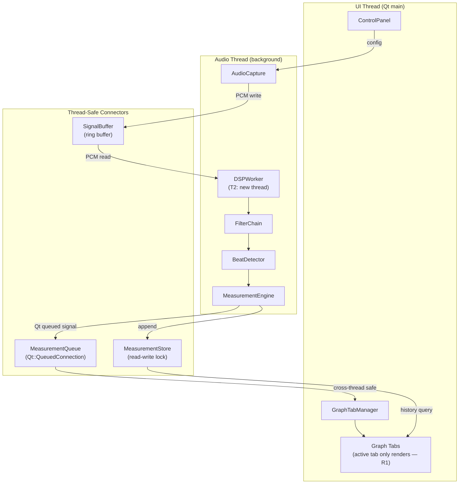

# Architecture

**Team**: Blue Sky (Team 3) | **Milestone**: M2 | **Date**: 2026-06-22

---

## Module View — Code-Level Structure



**Dependency rule**: strictly downward. Presentation → Domain → Processing → Acquisition. No bypass allowed.

**Extensibility**: Adding a new graph tab = add one class in Presentation only. Zero changes to Domain or below.

---

## Runtime / C&C View — Threading Model



**ADD-2-01 (T2)**: `DSPWorker` runs on a separate thread. Audio capture stays lightweight (write-only to ring buffer). DSP runs independently → eliminates Qt event-loop bottleneck.

**ADD-2-02 (R1)**: `isVisible()` guard in each tab's `updateData()`. Non-visible tabs skip `replot()`. Tab switch triggers `showEvent()` → `QTimer::singleShot(0)` catch-up.

---

## Deployment View

```mermaid
graph TD
    subgraph DevMachine["Development Machine (macOS)"]
        QtCreator["Qt Creator IDE + qmake/CMake"]
        Src["TimeGrapher Source"]
    end

    subgraph RPi5["Raspberry Pi 5 (ARM64, 8GB) — Runtime Target"]
        subgraph SW["Software Stack"]
            Bin["TimeGrapher Executable"]
            OS["Raspberry Pi OS (Linux ARM64)"]
            ALSA["ALSA / Qt Multimedia"]
            QtRT["Qt Runtime Libraries"]
        end
        USB_A["USB — Audio input"]
        HDMI_P["HDMI — Display output"]
        USB_T["USB — Touch input"]
    end

    subgraph Peripherals["Connected Hardware"]
        Mic["USB Sensor Stand + Converter\n(watch microphone)"]
        Screen["8" IPS Touchscreen 1280×800"]
        Watch["Mechanical Watch"]
    end

    Watch -->|vibration| Mic
    Mic -->|USB PCM| USB_A --> ALSA --> Bin
    Bin -->|Qt rendering| HDMI_P --> Screen
    Screen -->|USB HID| USB_T --> Bin
    Src -->|SSH / SCP deploy| Bin
```

**AGC must be disabled** on each RPi boot (`alsamixer` → Auto Gain Control → OFF). If AGC is on, amplitude measurements become unreliable.

---

## Architectural Approaches — Design Decisions

### Decision 1: Rendering Strategy

**Problem**: `plot` consumes 79% of exec budget on RPi. Runs inside audio exec path.

| Option | Mechanism | exec saving | Complexity | M2 risk |
|--------|-----------|:-----------:|:----------:|:-------:|
| **R1: Lazy Rendering** ✅ | `isVisible()` guard — skip inactive tab render | ★★★★☆ | Low | None |
| R2: Timer-Decoupled | Qt 20FPS timer drives render, beat only updates data | ★★★☆☆ | Medium | Low |
| R3: Double-Buffer Async | Off-screen QPixmap, blit in UI thread | ★★★★★ | High | **High** |

**Selected: R1** — minimal code change (1 guard line per tab), 75–85% replot reduction confirmed on macOS. R2 kept as fallback: apply if RPi R5 shows replot spike (>20/beat) or exec leak after tab switch.

---

### Decision 2: Threading Strategy

**Problem**: All pipeline stages on cpu2 (91% load). Three other cores idle. Thermal throttle at 85°C.

| Option | Mechanism | Core spread | Complexity | M2 risk |
|--------|-----------|:-----------:|:----------:|:-------:|
| T1: SCHED_RR + CPU Affinity | OS scheduling priority + core pin | Low | Low | None |
| **T2: DSP Offload Thread** ✅ | AudioCapture ↔ DSP on separate threads via ring buffer | Medium | Medium | Low |
| T3: Full Pipeline Split | Each stage on its own thread | High | **High** | **High** |

**Selected: T2** — wait_ms ×32,000 reduction, backlog 0% confirmed on macOS. T1 (SCHED_RR) will be layered on top of T2 during RPi R6.

---

### Trade-off Summary

```
Speed to validate vs Structural completeness
  R1 + T2 → validated on macOS, RPi R5 next
  R2 + T2 → better long-term structure, needs more implementation time

Rendering decoupling
  R1 (Lazy) → gains when most tabs inactive
  R2 (Timer) → caps FPS uniformly; better when all tabs active simultaneously

Threading depth
  T2 alone: 2-thread model, simple synchronization
  T2 + T1: adds OS-level priority — Linux only, applies on RPi in R6
```

---

## Architecture Evaluation

### Did experiments drive architecture refinement?

| Experiment Result | Architecture Change |
|-------------------|---------------------|
| RPi deadline miss 43% (EXP-02 R1) | → Identified structural root cause — not solvable by tuning |
| wait_ms 420ms on macOS baseline (EXP-02 R1) | → ADD-2-01: T2 DSP Offload Thread |
| replot_count 8.22/beat without guard (EXP-02 R2b) | → ADD-2-02: R1 Lazy Rendering |
| backlog 0%, wait_ms ×32,000 after T2 (EXP-02 R2) | → T2 confirmed; layered architecture validated |
| replot ↓75–85% after R1 (EXP-02 R3/R4) | → R1 confirmed; RPi plot_ms ~14ms saving expected |

### QA Achievement Assessment

| QA | Target | Current Evidence | Status |
|----|--------|-----------------|--------|
| Modifiability | New graph tab ≤ 3 file changes, 0 Domain changes | 4-layer structure enforced; new tabs = Presentation only | ✅ Design ready |
| Real-Time Performance | 0% deadline miss at 96kHz on RPi | 0% on macOS (T2+R1). RPi R5 pending | 🔶 macOS ✅, RPi pending |
| Low Latency | capture→display < 100ms | wait_ms 0.013ms on macOS. RPi TBD | 🔶 macOS ✅, RPi pending |
| Usability | Tab switch < 200ms response | catch-up via singleShot(0) confirmed | ✅ |

### Unresolved Critical Concerns

| Concern | Plan |
|---------|------|
| T2+R1 effect on RPi not yet measured | EXP-02 RPi R5 — 06/23 |
| Thermal throttle mitigation | T1 (SCHED_RR) on RPi R6 — 06/24 |
| 11-tab rendering under full load on RPi | EXP-05 — 06/26 |
