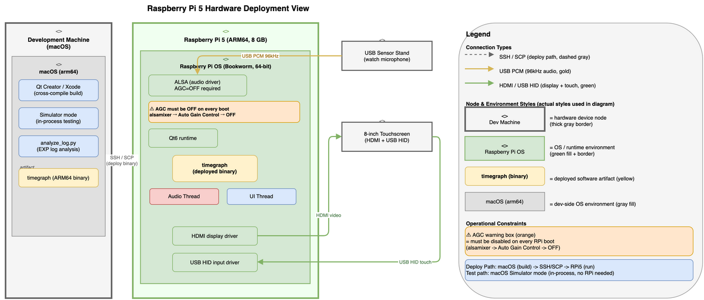
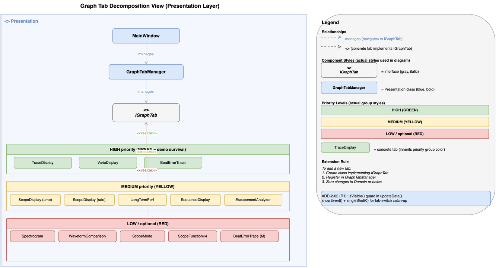
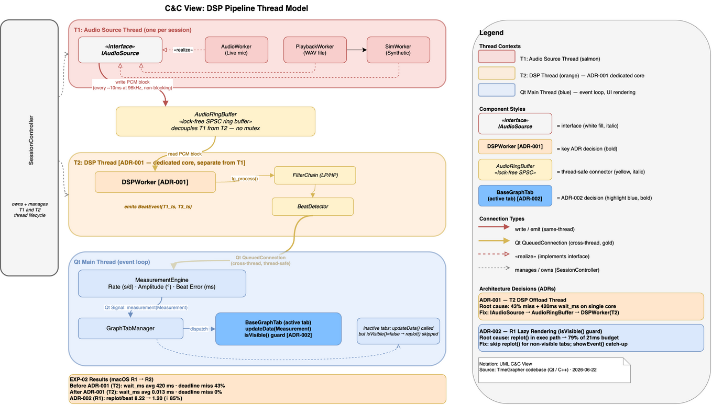
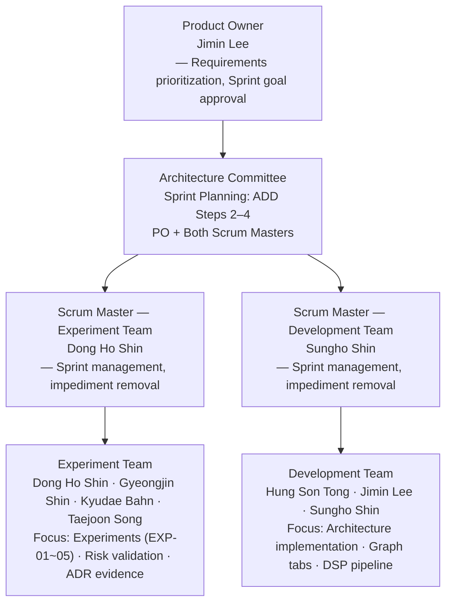

# TimeGrapher — Milestone 2 Presentation

**Team**: Blue Sky (Team 3) | **Milestone**: M2 | **Date**: 2026-06-22

---

## Agenda

| # | Section |
|---|---------|
| 1 | M1 Feedback & Improvements |
| 2 | Our Goals |
| 3 | Architectural Approach Overview |
| 4 | Milestone 2 Sprint Progress |
| 5 | Remaining Schedule |

---

## 1. M1 Feedback & Improvements

### What We Fixed

| Area | M1 Issue | M2 Fix |
|------|----------|--------|
| Project Plan | No owner/date. Experiments not tracked. No Kanban link | Owner + date on every task. Experiments as GitHub issues → [Board](references/github-project-status.md) |
| Architecture Diagrams | Source unlabeled. Too detailed | One diagram per view, legend added, source labeled |
| Architectural Drivers | Tactics mixed into QA doc. Provisional numbers. Solution language | QAs describe problem only. Tactics moved to Approaches doc. Numbers confirmed by EXP-02 |
| Experiments | 1 of 9 risks linked. None started | EXP-02 complete. Every experiment maps to Risk ID(s) |
| Navigation | No README. No cross-links | README written. All docs cross-linked |

---

## 2. Our Goals

> The architecture exists to serve these goals — every structural decision can be traced back to one of them.

### Goal Map

| Category | Goal | Quality Attribute |
|----------|------|-------------------|
| **On-Schedule Delivery** | Shorten dev machine ↔ RPi deploy cycle | Deployability |
| | Apply architecture decisions fast enough to stay on schedule | [Extensibility, Modifiability](references/qa.md#qas-3-extensibility-modifiability--priority-4-execution-enabler) |
| **Accuracy** | Computed Rate / Amplitude / Beat Error must match Witschi within tolerance | [**Measurement Accuracy, Error Detection, and Handling**](references/qa.md#qas-0-measurement-accuracy-error-detection-and-handling--priority-1-governing-goal) ← governing |
| | Pipeline must process beats without missing the 21ms deadline | [Real Time Performance](references/qa.md#qas-1-real-time-performance--priority-2) |
| | Capture-to-detect latency must be low enough for correct timestamps | [Low Latency and Low Number of Missed Beats](references/qa.md#qas-2-low-latency-and-low-number-of-missed-beats--priority-3) |
| | Correct results even under noise | [Correctness](references/qa.md#qas-4-correctness--priority-5) |
| **Usability** | Inputs the system cannot handle must be clearly communicated | Usability |

### QA Priority Order

| Rank | Quality Attribute | Rationale |
|------|-------------------|-----------|
| 1 | [**Measurement Accuracy, Error Detection, and Handling**](references/qa.md#qas-0-measurement-accuracy-error-detection-and-handling--priority-1-governing-goal) | The governing criterion: Rate / Amplitude / Beat Error must match Witschi reference |
| 2 | [**Real Time Performance**](references/qa.md#qas-1-real-time-performance--priority-2) | Missed 21ms deadline → dropped beat → wrong Rate/BPH |
| 3 | [**Low Latency and Low Number of Missed Beats**](references/qa.md#qas-2-low-latency-and-low-number-of-missed-beats--priority-3) | Late timestamp → wrong Beat Error / Amplitude |
| 4 | [**Extensibility, Modifiability**](references/qa.md#qas-3-extensibility-modifiability--priority-4-execution-enabler) | Execution enabler — architecture changes must apply fast enough to stay on schedule |
| 5 | [**Correctness**](references/qa.md#qas-4-correctness--priority-5) | False trigger → wrong everything |

### Measurement Accuracy as the Governing Goal

> Measurement Accuracy, Error Detection, and Handling is not one QA among equals. It is the criterion the entire architecture is evaluated against.

```
Goal: Measurement Accuracy, Error Detection, and Handling
├── Enabler:      Extensibility, Modifiability               → architecture changes must apply fast
├── Prerequisite: Real Time Performance                      → missed deadline = dropped beat = wrong Rate/BPH
├── Prerequisite: Low Latency and Low Number of Missed Beats → late timestamp = wrong Beat Error / Amplitude
└── Prerequisite: Correctness                               → false trigger = wrong everything
```

---

## 3. Architectural Approach Overview

### View Selection Rationale

Views are documented only when needed and useful to a specific reader (Merson principle).

| View | Type | Goal Addressed | Primary Reader |
|------|------|----------------|----------------|
| [Deployment: Build-Deploy Pipeline](references/views/view-deployment-build-pipeline.md) | Allocation | Deployability — shorten dev ↔ RPi cycle | Ops / hardware owners |
| [Layered: 4-Layer Allowed-to-Use](references/views/view-layered-4layer.md) | Module — Layered | Modifiability — parallel tab dev, fast architecture changes | Developers (11 tabs) |
| [Decomposition: Graph Tab](references/views/view-decomposition-graph-tab.md) | Module — Decomposition | Modifiability — how to add a new tab | Developers (per-tab) |
| [C&C: DSP Pipeline Thread Model](references/views/view-cc-dsp-pipeline.md) | Runtime / C&C | Accuracy — thread isolation, lazy rendering | Developers (perf / concurrency) |

---

### 3-A: On-Schedule Delivery

---

#### View 1 — Deployment View: Build-Deploy Pipeline

> Which hardware runs which software? What is the deploy path from dev machine to RPi?



**Deploy flow**:  
Dev machine → code + build + unit test + run (macOS) → `git push` →  
RPi → `git pull` → build + test + experiment

**Constraint**: AGC must be disabled on every RPi boot (`alsamixer`). AGC on → Amplitude / Beat Error unreliable.

**Why this shortens the cycle**: Structural validation happens on macOS. RPi is used only for hardware experiments and final demo. No repeated re-imaging or file transfers.

---

#### View 2 — Layered View: 4-Layer Allowed-to-Use

> Which direction do dependencies flow? Which layer changes when a new tab is added?


**Four layers, one rule**: Dependencies flow downward only.  
Acquisition → Signal Processing → Domain → Presentation.

**Modifiability guarantee**: New graph tab = one class in Presentation. Zero Domain changes.  
This is how 11 graph tabs are built in parallel without team conflict.

---

#### View 3 — Decomposition View: Graph Tab

> What is the internal structure of Presentation? How is a new tab added?



**Extension rule**: Implement `IGraphTab` + register in `GraphTabManager`. No other files touched.

Each team member owns specific tabs independently. No cross-tab dependencies.

**Evidence**: All 11 graph tabs implemented ✅ by 06/22.

---

### 3-B: Accuracy

> Both decisions below were forced by EXP-02 evidence — 43% deadline miss on RPi under the original single-threaded design.

---

#### View 4 — C&C View: DSP Pipeline Thread Model

> How do the two threads cooperate? Where do T2 and R1 operate at runtime?



Two decisions are embedded directly in this view:

| ID | Tactic | Where in diagram | Effect |
|----|--------|-----------------|--------|
| **ADR-001 (T2)** | DSP Offload Thread | AudioCapture → ring buffer → DSPWorker | wait_ms: 420ms → **0.013ms** (×32,000). Backlog: 47% → **0%** |
| **ADR-002 (R1)** | Lazy Rendering Guard | `updateData()` `isVisible()` guard | replot/beat: 8.22 → **1.20** (↓85%). Est. RPi saving: ~14ms |

---

#### Risk → Experiment → Decision (supporting detail)

**Case 1 — Single-Core Saturation**

| | |
|-|-|
| **Risk** | TR-02/03: RPi cpu2 at 91%; Qt event loop coupling causes 420ms backlog; 43% deadline miss |
| **Experiment** | [EXP-02](references/experiments/exp-02-pipeline-latency.md): wait_ms 420ms → **0.013ms** (×32,000); backlog 47% → **0%** after T2 |
| **Decision** | [ADR-001](references/adr/ADR-001-t2-dsp-offload-thread.md): `DSPWorker` thread — AudioCapture writes to ring buffer; DSP runs on separate core |
| **Status** | ✅ Accepted — macOS validated. RPi: EXP-02 R5 on 06/23 |

**Case 2 — Rendering Bottleneck in Exec Path**

| | |
|-|-|
| **Risk** | TR-04: `replot()` in exec path = 16ms (79% of 21ms budget); scales with N active tabs |
| **Experiment** | [EXP-02](references/experiments/exp-02-pipeline-latency.md): replot_count 8.22 → **2.08** (↓75%) / **1.20** (↓85%) after R1 |
| **Decision** | [ADR-002](references/adr/ADR-002-r1-lazy-rendering.md): `isVisible()` guard in `updateData()`; `showEvent()` catch-up frame |
| **Status** | ✅ Accepted — macOS validated. RPi confirmation: EXP-02 R5 on 06/23 |

**Case 3 — RPi Sample Rate Ceiling (Pending)**

| | |
|-|-|
| **Risk** | TR-01: RPi 5 may not sustain 96kHz block-drop-free while Qt GUI runs |
| **Experiment** | [EXP-01](references/experiments/exp-01-sample-rate.md): macOS ✅ 96kHz, 0 dropped. RPi ⏳ 06/23 |
| **Decision** | ADR-003 pending EXP-01 RPi result. Fallback: 48kHz (Beat Error resolution: 10.4µs → 20.8µs) |
| **Status** | ⏳ Decision deferred |

---

## 4. Milestone 2 Sprint Progress

### Team Structure



| Role | Name |
|------|------|
| Product Owner | Jimin Lee |
| Scrum Master (Experiment Team) | Dong Ho Shin |
| Scrum Master (Development Team) | Sungho Shin |
| **Experiment Team** | Dong Ho Shin, Gyeongjin Shin, Kyudae Bahn, Taejoon Song |
| **Development Team** | Hung Son Tong, Jimin Lee, Sungho Shin |

---

### Sprint Timeline

```
Week 2 (6/9 – 6/12)
├── Sprint 1 (6/9–6/10)  — Modifiability
└── Sprint 2 (6/11–6/12) — Deployability

Week 3 (6/16 – 6/19)
├── Sprint 1 (6/16–6/17) — Performance: Real-Time / Latency  [IN PROGRESS]
└── Sprint 2 (6/18–6/19) — Reliability: Correctness under Noise  [PLANNED]
```

---

### W2 Sprint 1 (6/9–6/10) — Modifiability

**Focus**: Build all 11 graph tabs in parallel without conflict.

| Outcome | Evidence |
|---------|---------|
| 4-Layer Allowed-to-Use structure established | Module View V1 committed |
| `IGraphTab` interface + `GraphTabManager` pattern defined | Decomposition View: Graph Tab |
| AI-assisted unit test generation for domain-knowledge coverage | Unit test suite bootstrapped without deep domain expertise |
| All 11 graph tabs implemented ✅ | GitHub — [board](references/github-project-status.md) |

> **AI leverage**: Domain knowledge gap was a risk (TR-NTR-01). AI-generated unit tests allowed structural validation of graph tabs without deep watch-measurement expertise.

---

### W2 Sprint 2 (6/11–6/12) — Deployability

**Focus**: Shorten the dev machine ↔ RPi experiment cycle.

| Outcome | Evidence |
|---------|---------|
| Experiment runner scripts (`run_exp.sh`, `analyze_log.py`) | Deployment View — deploy path documented |
| CSV-based structured logger built into DSP pipeline | EXP-02 logging infrastructure |
| `git pull` → build → run workflow confirmed on RPi | Deployment View — RPi node |

---

### W3 Sprint 1 (6/16–6/17) — Performance: Real-Time / Latency

**Focus**: Confirm and fix real-time deadline miss. Produce ADRs with trade-off analysis.

| Outcome | Evidence |
|---------|---------|
| EXP-02 complete — wait_ms, exec_ms, deadline miss measured | [EXP-02](references/experiments/exp-02-pipeline-latency.md) |
| ADR-001 (T2 DSP Offload) — accepted with trade-off | [ADR-001](references/adr/ADR-001-t2-dsp-offload-thread.md) |
| ADR-002 (R1 Lazy Rendering) — accepted with trade-off | [ADR-002](references/adr/ADR-002-r1-lazy-rendering.md) |
| C&C View: DSP Pipeline Thread Model documented | View 4 committed |

> Trade-off accepted (ADR-002): Non-visible tabs show a stale frame on switch. Catch-up frame in `showEvent()` makes this imperceptible (< 21ms at 28,800 BPH).

---

### W3 Sprint 2 (6/18–6/19) — Reliability: Correctness under Noise *(Planned)*

**Focus**: Characterize noise impact on Beat Error and Amplitude. Produce ADRs with trade-off analysis.

| Planned Outcome | Target |
|-----------------|--------|
| EXP-03: LP/HP filter parameter sweep | 06/25 |
| EXP-05: 11-tab FPS on RPi under full load | 06/26 |
| ADR-003: Sample rate decision (96kHz vs 48kHz) | Post EXP-01 RPi |
| Noise mitigation approach confirmed | Post EXP-03 |

---

### Open Experiments

| ID | Experiment | Target | Blocks |
|----|------------|:------:|--------|
| [EXP-01](references/experiments/exp-01-sample-rate.md) | RPi sample rate (96kHz, 0 dropped blocks) | 06/23 | ADR-003 |
| EXP-02 R5 | T2+R1 on RPi — confirm deadline miss resolved | 06/23 | Phase A go/no-go |
| EXP-02 R6 | T1 SCHED_RR on RPi — thermal throttle mitigation | 06/24 | ADR-003 supplement |
| [EXP-03](references/experiments/exp-03-filter-sweep.md) | LP/HP filter parameter sweep | 06/25 | Phase A task A-02 |
| [EXP-05](references/experiments/exp-05-rendering-fps.md) | Qt 11-tab FPS on RPi | 06/26 | ADR-002 confirmation |

### Unresolved Critical Concerns

| Concern | Plan |
|---------|------|
| T2+R1 unconfirmed on RPi | EXP-02 R5 — 06/23 |
| Thermal throttle (85°C) not mitigated | SCHED_RR affinity EXP-02 R6 — 06/24 |
| Filter cutoffs undetermined | EXP-03 — 06/25 |

→ Full risk register: [references/risks.md](references/risks.md)

---

## 5. Remaining Schedule

### Upcoming Sprints

| Sprint | Date | Focus |
|--------|------|-------|
| W4 Sprint 1 | 6/22–6/23 | RPi experiments (EXP-01, EXP-02 R5) + M2 feedback |
| W4 Sprint 2 | 6/24–6/25 | EXP-02 R6 + EXP-03 + ADR-003 finalized |
| W4 Sprint 3 | 6/25–6/26 | EXP-05 + Usability + AI Feature |
| W4 Sprint 4 | 6/26–6/28 | Radar Chart + Diagnosis / Classification + buffer |
| W5 Sprint 1 | 6/29–6/30 | RPi integration + WeiShi accuracy validation + Demo rehearsal |
| **M3 Demo** | **7/1** | **Final Demo on Raspberry Pi** |

### Phase Status

| Phase | Scope | Status |
|-------|-------|:------:|
| A | Core pipeline: capture → DSP → WeiShi accuracy validation on RPi | ⏳ 06/29 |
| Experiments | EXP-01/02/03/05 on RPi | ⏳ 06/23–06/26 |
| Demo | E2E latency documented + rehearsal | ⏳ 06/30 |

**Critical path: RPi experiments → WeiShi validation → demo.**

---

## M2 Deliverable Status

| Deliverable | Status |
|-------------|:------:|
| Updated Project Plan | ✅ |
| Experiment Results (EXP-02 complete) | ✅ |
| Architecture — Layered View: 4-Layer Allowed-to-Use | ✅ |
| Architecture — Decomposition View: Graph Tab | ✅ |
| Architecture — C&C View: DSP Pipeline Thread Model | ✅ |
| Architecture — Deployment View: Build-Deploy Pipeline | ✅ |
| Construction Plan | ✅ |
