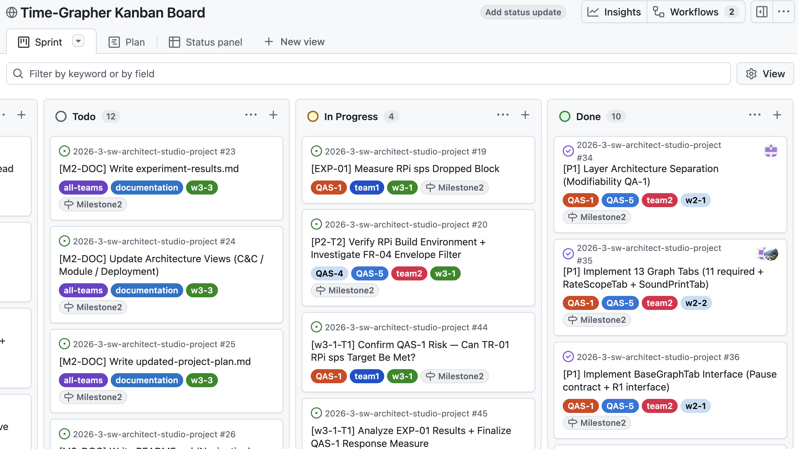
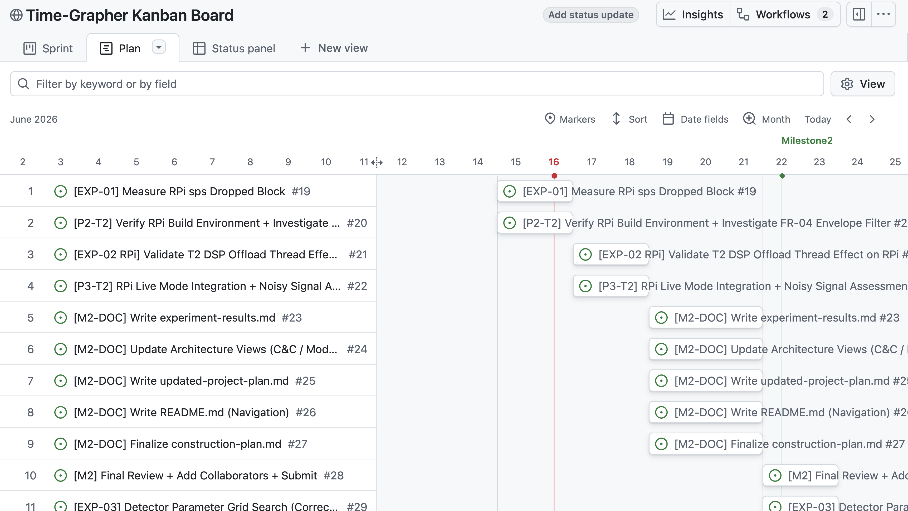
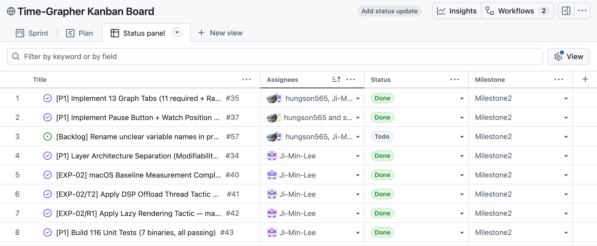
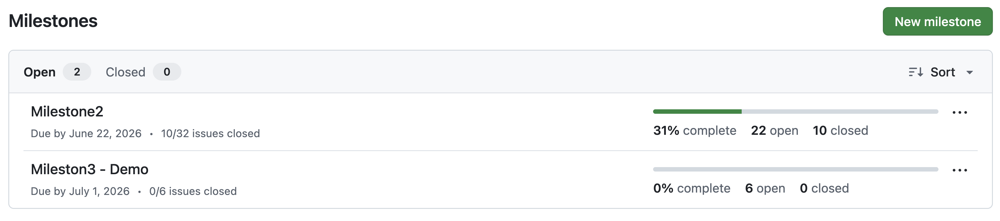

# GitHub Project Management — TimeGrapher

**Project**: [Time-Grapher Kanban Board](https://github.com/users/Ji-Min-Lee/projects/3/views/2)  
**Repo**: [Ji-Min-Lee/2026-3-sw-architect-studio-project](https://github.com/Ji-Min-Lee/2026-3-sw-architect-studio-project)

---

## How We Manage Work

All tasks — experiments, architecture decisions, implementation, and documentation — are tracked as GitHub Issues linked to this project board. Every issue carries a sprint label (`w2-1`, `w3-2`, …), a team label (`team1` / `team2` / `all-teams`), and a QA label (`QAS-1` … `QAS-5`) so any filter immediately answers "what is this team working on, for which quality attribute, in which sprint."

Two milestones gate the project: **Milestone 2** (06-22, architecture + experiments) and **Milestone 3 - Demo** (07-01, final demo). Every issue is assigned to one of these two milestones at creation time, keeping scope boundaries explicit.

---

## Kanban Board — Sprint Flow

> https://github.com/users/Ji-Min-Lee/projects/3/views/2

Four columns map directly to our sprint workflow:

| Column | Purpose |
|--------|---------|
| **Todo** | Committed to the current sprint but not yet started — visible scope for the week |
| **In Progress** | Actively being worked on — at most 2–3 items per team to limit WIP |
| **Sprint Backlog** | Planned for an upcoming sprint; not yet pulled into Todo |
| **Done** | Pass criteria met, output document written, result linked in the issue |

The board is the team's shared source of truth for who is working on what right now. During Sprint Planning (every 2 days), the Architecture Committee pulls items from Sprint Backlog → Todo and assigns them. During the Sprint Review, Done items are closed and the next sprint is loaded.

---

## Roadmap — Schedule vs. Milestone

> https://github.com/users/Ji-Min-Lee/projects/3/views/1

The Roadmap view overlays all open issues on a calendar timeline with the **Milestone 2** deadline marker visible. This lets us see at a glance whether the current sprint's issues are scheduled to land before the milestone, and whether anything is drifting right. Start Date and End Date fields are set on each issue at Sprint Planning; the roadmap makes deadline risk visible without a separate Gantt tool.

---

## Table View — Cross-cutting Visibility

> https://github.com/users/Ji-Min-Lee/projects/3

The Table view exposes Assignee, Status, and Milestone columns simultaneously, which the Kanban board hides. We use this view to:

- Verify every issue has an assignee (no orphaned tasks)
- Confirm milestone assignment before sprint close
- Audit whether QAS labels match the issue content

It is also the fastest way to bulk-update fields (Status, Milestone, Assignee) across many issues at once.

---

## Milestone Progress — Scope Gate

> https://github.com/Ji-Min-Lee/2026-3-sw-architect-studio-project/milestones

GitHub Milestones serve as scope gates between M2 and M3. An issue's milestone determines which deliverable it belongs to — not a label, not a column. This means the milestone completion bar directly answers "how much of the M2 scope is done" without manual counting. When the M2 bar reaches 100%, the scope is complete by definition.

Issues that surface mid-sprint and belong after M2 are immediately assigned to Milestone 3 - Demo to keep M2 scope from expanding.
