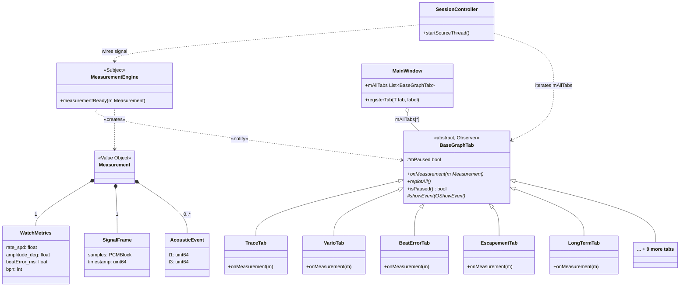

# Decomposition View: Graph Tab

This view decomposes the Presentation layer into its internal components, focusing on the `BaseGraphTab` interface and the `GraphTabManager` registry. It answers: "What must a developer implement to add a new graph tab?"


## Module Relationships (Class Diagram)


> Source (editable): [view2b-observer-module.drawio](../../assets/view2b-observer-module.drawio)



**Relationship key:**
- `..>` **Dependency** — source uses target but does not own it
  - `«notify»` — MeasurementEngine emits Qt signal received by BaseGraphTab slots
  - `«creates»` — MeasurementEngine constructs and owns each Measurement instance
- `<|--` **Inheritance** — concrete tab extends abstract BaseGraphTab (hollow triangle points to parent)
- `*--` **Composition** — Measurement owns its VO fields; they do not outlive the Measurement
- `o--` **Aggregation** — MainWindow holds a reference list; Qt parent hierarchy owns lifetime

> `SessionController` appears here to document the wiring role only. It is not an Observer itself — it calls `connect()` once at session start and does not appear in the per-beat data path.

## Element Catalog

#### BaseGraphTab (abstract class / interface)
- Abstract C++ base class that every graph tab must implement.
- Key method: `updateData(const Measurement& m)` — called by `GraphTabManager` when a new measurement arrives from `MeasurementEngine`.
- `isVisible()` guard inside `updateData()` skips `replot()` for non-visible tabs (ADR-002 R1), reducing replot/beat from 8.22 to 1.20 (↓85%).
- Optionally overrides `showEvent(QShowEvent*)` to render a catch-up frame when the tab becomes visible.
- No direct reference to Signal Processing or Acquisition layers.

#### GraphTabManager
- Owns the tab widget container and the list of registered `BaseGraphTab` instances.
- Receives `Measurement` signals from `MeasurementEngine` (Domain layer) via Qt Signal-Slot.
- Iterates registered tabs and calls `updateData()` on each.
- Single point of tab registration — a new tab is added here and nowhere else.

#### Concrete Tab Implementations (14 tabs)
Each extends `BaseGraphTab`:

| Group | Tab Class | Display |
|-------|-----------|---------|
| Signal / Scope | `TraceTab` | Raw waveform trace |
| | `RateScopeTab` | Rate deviation scope |
| | `SweepScopeTab` | Sweep oscilloscope |
| | `FilterScopeTab` | Filtered signal scope |
| | `BeatNoiseScopeTab` | Beat noise scope |
| | `SoundPrintTab` | Acoustic fingerprint |
| Measurement | `VarioTab` | Rate deviation (s/d) |
| | `BeatErrorTab` | Beat error (ms) |
| | `EscapementTab` | Escapement analysis |
| | `LongTermTab` | Long-term rate trend |
| | `SequenceTab` | Beat sequence |
| Analysis / AI | `SpectrogramTab` | Frequency spectrogram |
| | `WaveformCompTab` | Waveform comparison |
| | `RadarChartTab` | Multi-metric radar |

All 14 tabs implemented by 2026-06-22.

## Behavior

**Normal data flow per beat event:**

```
MeasurementEngine (Domain)
    │  Qt Signal: measurement(Measurement)
    ▼
GraphTabManager::onMeasurement(m)
    │  for each tab in registry
    ├─▶ TraceTab::updateData(m)        [isVisible() guard — ADR-002]
    ├─▶ VarioTab::updateData(m)        [isVisible() guard]
    └─▶ … (all 14 tabs)
```

**Tab switch catch-up (ADR-002 R1):**

```
User switches to tab T
    → QTabWidget::currentChanged(T)
    → T::showEvent()
    → T::update()           ← single catch-up frame rendered
```

## Related ADRs

- [ADR-006: BaseGraphTab Observer Pattern](../adr/ADR-006-basegraphtab-observer-pattern.md) — rationale for the `BaseGraphTab` interface and `registerTab()` registration pattern
- [ADR-002: R1 Lazy Rendering](../adr/ADR-002-r1-lazy-rendering.md) — `isVisible()` guard in `onMeasurement()`; `showEvent()` catch-up via `replotAll()`
- [ADR-004: R2 Timer-Decoupled Rendering](../adr/ADR-004-r2-timer-decoupled-rendering.md) — conditional replacement for ADR-002 if EXP-05 confirms R1 insufficient

## Related views

- [Layered View: 4-Layer Allowed-to-Use](view-layered-4layer.md) — parent view; shows where Presentation fits in the full layer stack
- [C&C View: DSP Pipeline Thread Model](view-cc-dsp-pipeline.md) — shows the runtime path that produces the `Measurement` struct consumed here
