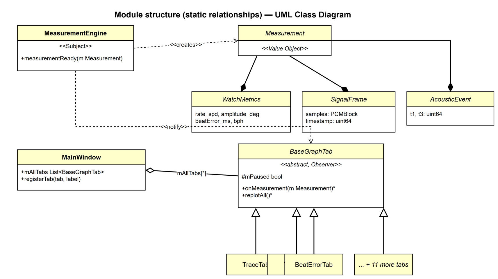

# Section 2 — Architecture Views

← [Wrap-up & Intro](slide-m1-wrapup-intro.md) | [Presentation Index](README.md) | Next: [Schedule →](slide-schedule.md)

> **Time**: ~12 min | Goal: Latency → Correctness → Extensibility — each decision driven by experiment evidence

All views follow the **Merson 7-section template**. Each view is written for a specific reader and a specific QA.  
→ Full view documents: [references/views/](references/views/)

---

## 2-A. Latency: Thread Separation

**Problem**: GUI replot blocks DSP processing on a single thread → 43% deadline miss on RPi

**Decision**: Separate into three threads — T1 (audio capture) · T2 (DSP) · Qt main (rendering), connected by a lock-free ring buffer

| Metric | Before (single thread) | After (T2 offload) |
|--------|:----------------------:|:------------------:|
| wait_ms avg | 420 ms | **0.013 ms** (×32,000) |
| Deadline miss | 43% | **0%** (macOS + RPi) |
| Backlog | Present | **None** |

| Category | Documents |
|----------|-----------|
| QA | [QAS-2 — RPi 실시간 처리: dropped block 0% 달성 기준](references/qa/qas-2-real-time-performance.md) · [QAS-3 — E2E 레이턴시 및 beat miss 최소화 기준](references/qa/qas-3-low-latency-and-low-number-of-missed-beats.md) |
| Risk | [Risk Register — TR-09: 단일 스레드 DSP 블로킹 위험](references/risks.md) |
| Experiment | [EXP-02 — RPi에서 dropped block 측정](references/experiments/exp-02-realtime-dropped-block.md) · [EXP-03 — 2-구간 타임스탬프 기반 E2E 레이턴시 측정](references/experiments/exp-03-latency-e2e.md) |
| ADR | [ADR-001 — DSP 전용 오프로드 스레드(T2) 도입 결정](references/adr/ADR-001-t2-dsp-offload-thread.md) · [ADR-002 — 비가시 탭 replot 스킵(Lazy Rendering)](references/adr/ADR-002-r1-lazy-rendering.md) · [ADR-004 — 타이머 기반 렌더링 분리(R2)](references/adr/ADR-004-r2-timer-decoupled-rendering.md) |
| View | [C&C View: DSP Pipeline Thread Model](references/views/view-cc-dsp-pipeline.md) |
| Related References | [Deployment View — macOS → RPi 5 빌드/배포 파이프라인](references/views/view-deployment-build-pipeline.md) |

---

## 2-B. Correctness: Observer Pattern

| Category | Documents |
|----------|-----------|
| QA | [QAS-5 — 신호 검출 파라미터 정확도 및 노이즈 환경 대응 기준](references/qa/qas-5-correctness.md) |
| Risk | [Risk Register — NTR-07: 탭 확장 시 Observer 누락 위험](references/risks.md) |
| Experiment | [EXP-04 — Observer 패턴 준수: 탭 추가 비용(파일 수) 측정](references/experiments/exp-04-extensibility-observer-pattern.md) |
| ADR | [ADR-006 — BaseGraphTab Observer 패턴 및 탭 등록 구조 결정](references/adr/ADR-006-basegraphtab-observer-pattern.md) |
| View | [Decomposition View: Graph Tab — ≤3-file 확장 레시피](references/views/view-decomposition-graph-tab.md) |

---

## 2-C. Extensibility: Layer + Interface + Entity/VO

### Layer — 4-Layer Allowed-to-Use

| Sprint | Tabs | Why |
|---|:---:|---|
| W2 S1 | 11 | Core requirements — baseline graph set |
| W2 S2 | +2 → 13 | Project-plan screens added (Fig 7-19): FilterScope + SweepScope |
| W3 S1 | +1 → **14** | Bonus: Radar/Polar chart for multi-position comparison |

| Category | Documents |
|----------|-----------|
| QA | [QAS-4 — 신규 탭 추가 시 하위 레이어 무변경 검증 기준](references/qa/qas-4-extensibility-modifiability.md) |
| View | [Layered View: 4-Layer Allowed-to-Use](references/views/view-layered-4layer.md) |
| Related References | [Decomposition View: Graph Tab — ≤3-file 확장 레시피 상세](references/views/view-decomposition-graph-tab.md) |

### Interface — IAudioSource Dependency Inversion

| Category | Documents |
|----------|-----------|
| QA | [QAS-4 — 신규 오디오 소스 추가 시 MainWindow 무변경 검증 기준](references/qa/qas-4-extensibility-modifiability.md) |
| ADR | [ADR-005 — IAudioSource 의존성 역전(P1 리팩토링) 결정](references/adr/ADR-005-p1-iaudiosource-dependency-inversion.md) |
| View | [Module View: IAudioSource Dependency Inversion](references/views/view-iaudiosource.md) |
| Related References | [ADR-002 — 비가시 탭 Lazy Rendering: isVisible() guard, replot ↓85%](references/adr/ADR-002-r1-lazy-rendering.md) |

### Entity / Value Object — Domain Layer

| Category | Documents |
|----------|-----------|
| QA | [QAS-1 — 측정 정확도 및 오류 감지/처리 최우선 목표](references/qa/qas-1-measurement-accuracy-error-detection-handling.md) · [QAS-5 — 노이즈 환경 신호 검출 정확도 기준](references/qa/qas-5-correctness.md) |
| Experiment | [EXP-05 — 노이즈 환경에서의 Detector 파라미터 최적화 실험](references/experiments/exp-05-correctness-detector-optimization.md) |
| ADR | [ADR-003 — RPi 5 오디오 샘플레이트 선택 결정](references/adr/ADR-003-sample-rate-selection.md) |
| View | [Module View: Domain Entity / Value Object](references/views/view-domain-entity-vo.md) |

---

## 2-D. Risk: AI-Assisted Unit Test

| Category | Documents |
|----------|-----------|
| QA | [QAS-5 — 노이즈 환경 신호 검출 정확도 기준](references/qa/qas-5-correctness.md) |
| Risk | [Risk Register — NTR-07: AI 생성 TC의 커버리지 편향 위험](references/risks.md) |
| Experiment | [EXP-01 — WeiShi No.1000 대비 TimeChecker 측정 정확도 비교](references/experiments/exp-01-accuracy-weishi-comparison.md) |
| View | [Decomposition View: Graph Tab](references/views/view-decomposition-graph-tab.md) |
| Related References | [Unit Test Results — AI 생성 TC 기반 유닛테스트 실행 결과](references/unit-test-results.md) |
