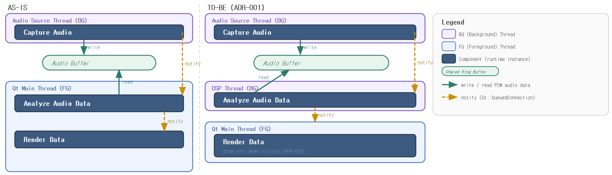
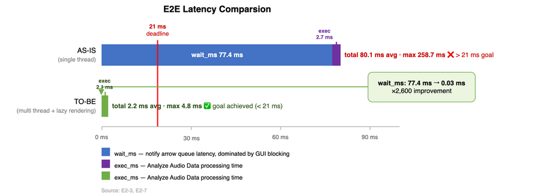
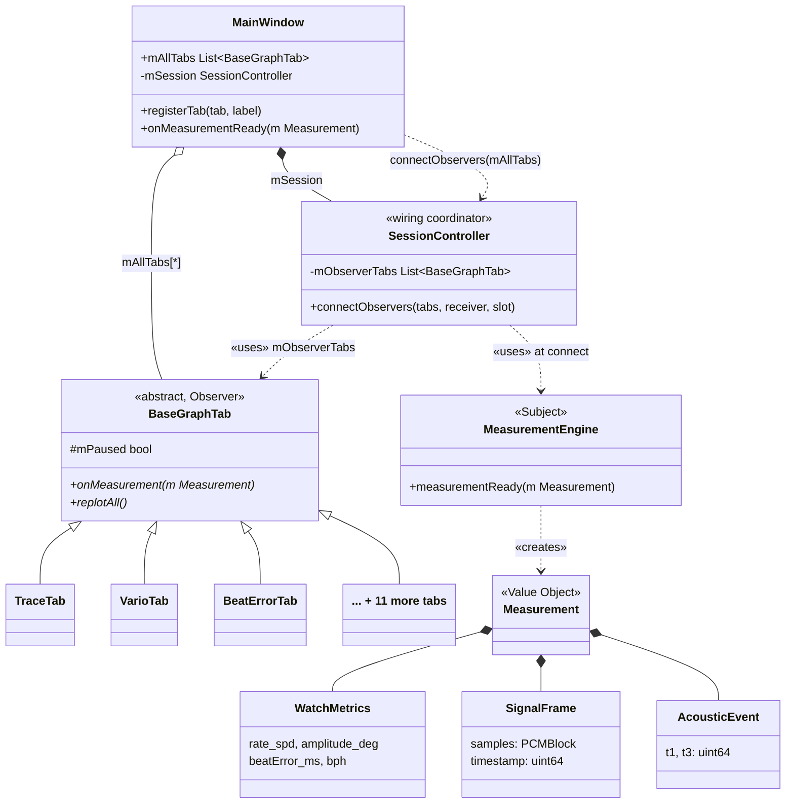
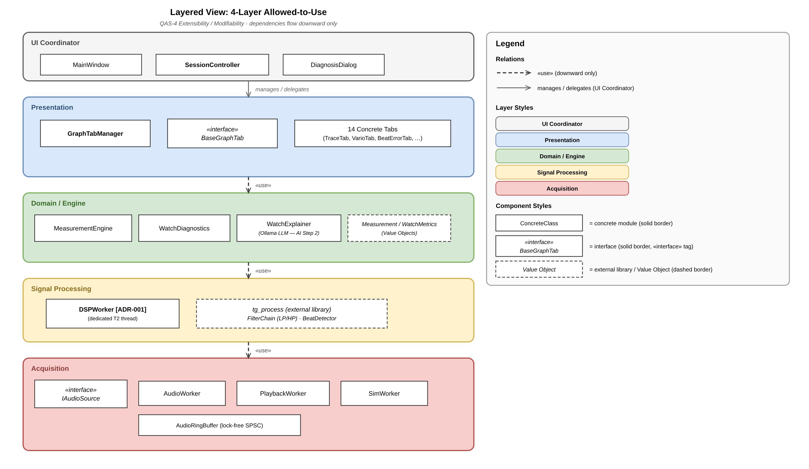
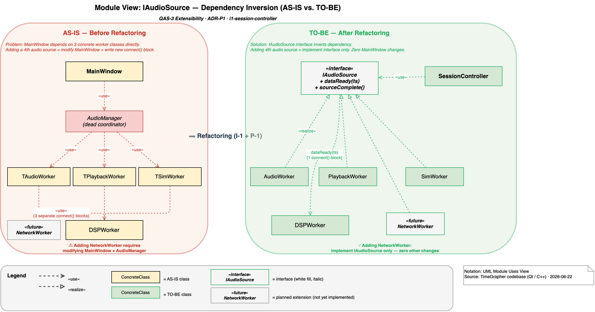
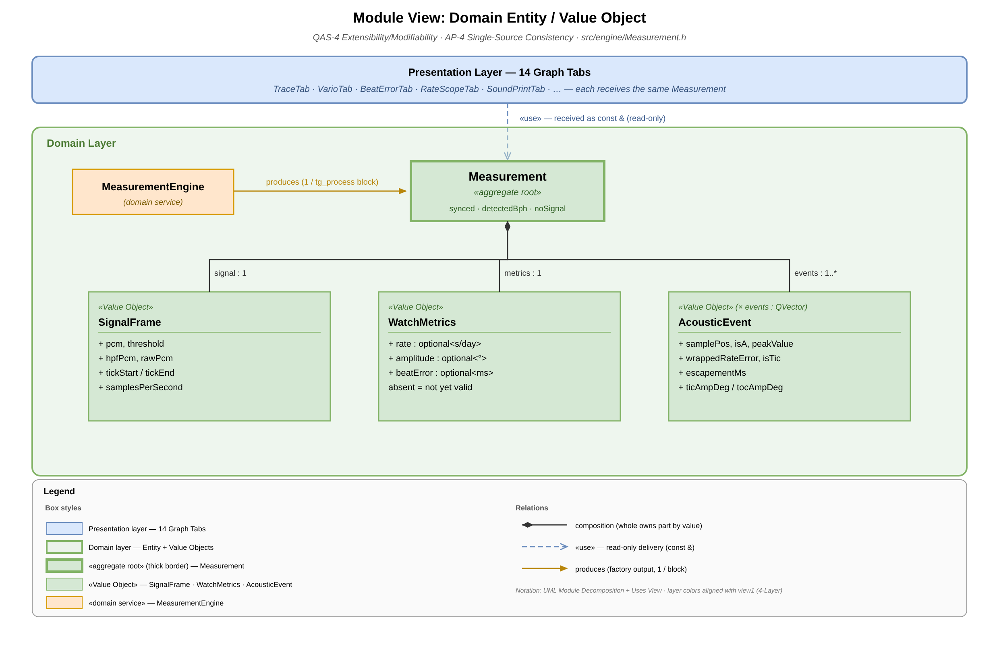

# Section 2 — Architecture Views

← [Wrap-up & Intro](slide-m1-wrapup-intro.md) | [Presentation Index](README.md) | Next: [Schedule →](slide-schedule.md)

> **Time**: ~12 min | Goal: Latency → Correctness → Extensibility — each decision driven by experiment evidence

All views follow the **Merson 7-section template**. Each view is written for a specific reader and a specific QA.  
→ Full view documents: [references/views/](references/views/)

---

## 2-A. Latency: Thread Separation

> 📢 **PRESENT** (~4 min) · Evidence: [EXP-02](references/experiments/exp-03-latency-e2e.md) · Decision: [ADR-001](references/adr/ADR-001-t2-dsp-offload-thread.md)

**Problem**: GUI replot blocks DSP processing on a single thread → 43% deadline miss on RPi

**Decision**: Separate into three threads — T1 (audio capture) · T2 (DSP) · Qt main (rendering), connected by a lock-free ring buffer

| Metric | Before (single thread) | After (T2 offload) |
|--------|:----------------------:|:------------------:|
| wait_ms avg | 420 ms | **0.013 ms** (×32,000) |
| Deadline miss | 43% | **0%** (macOS + RPi) |
| Backlog | Present | **None** |

→ Full view: [view-cc-dsp-pipeline.md](references/views/view-cc-dsp-pipeline.md) · ADR: [ADR-001](references/adr/ADR-001-t2-dsp-offload-thread.md)

| Category | Documents |
|----------|-----------|
| QA | [QAS-2 Real-time Performance](references/qa/qas-2-real-time-performance.md) · [QAS-3 Low Latency](references/qa/qas-3-low-latency-and-low-number-of-missed-beats.md) |
| Risk | [risks.md — TR-09](references/risks.md) |
| Experiment | [EXP-02 Dropped Block](references/experiments/exp-02-realtime-dropped-block.md) · [EXP-03 E2E Latency](references/experiments/exp-03-latency-e2e.md) |
| ADR | [ADR-001 T2 DSP Offload](references/adr/ADR-001-t2-dsp-offload-thread.md) · [ADR-002 R1 Lazy Rendering](references/adr/ADR-002-r1-lazy-rendering.md) · [ADR-004 R2 Timer Rendering](references/adr/ADR-004-r2-timer-decoupled-rendering.md) |
| View | [view-cc-dsp-pipeline.md](references/views/view-cc-dsp-pipeline.md) |

---

## 2-B. Correctness: Observer Pattern

→ [view-decomposition-graph-tab.md](references/views/view-decomposition-graph-tab.md) · [ADR-006](references/adr/ADR-006-basegraphtab-observer-pattern.md)

| Category | Documents |
|----------|-----------|
| QA | [QAS-5 Correctness](references/qa/qas-5-correctness.md) |
| Risk | [risks.md — NTR-07](references/risks.md) |
| Experiment | [EXP-04 Extensibility/Observer](references/experiments/exp-04-extensibility-observer-pattern.md) |
| ADR | [ADR-006 BaseGraphTab Observer](references/adr/ADR-006-basegraphtab-observer-pattern.md) |
| View | [view-decomposition-graph-tab.md](references/views/view-decomposition-graph-tab.md) |

---

## 2-C. Extensibility: Layer + Interface + Entity/VO

### Layer — 4-Layer Allowed-to-Use

| Sprint | Tabs | Why |
|---|:---:|---|
| W2 S1 | 11 | Core requirements — baseline graph set |
| W2 S2 | +2 → 13 | Project-plan screens added (Fig 7-19): FilterScope + SweepScope |
| W3 S1 | +1 → **14** | Bonus: Radar/Polar chart for multi-position comparison |

→ [view-layered-4layer.md](references/views/view-layered-4layer.md)

| Category | Documents |
|----------|-----------|
| QA | [QAS-4 Extensibility/Modifiability](references/qa/qas-4-extensibility-modifiability.md) |
| Risk | — |
| Experiment | — |
| ADR | — |
| View | [view-layered-4layer.md](references/views/view-layered-4layer.md) |

### Interface — IAudioSource Dependency Inversion

→ [view-iaudiosource.md](references/views/view-iaudiosource.md) · [ADR-005](references/adr/ADR-005-p1-iaudiosource-dependency-inversion.md)

| Category | Documents |
|----------|-----------|
| QA | [QAS-4 Extensibility/Modifiability](references/qa/qas-4-extensibility-modifiability.md) |
| Risk | — |
| Experiment | — |
| ADR | [ADR-005 IAudioSource DI](references/adr/ADR-005-p1-iaudiosource-dependency-inversion.md) |
| View | [view-iaudiosource.md](references/views/view-iaudiosource.md) |

### Entity / Value Object — Domain Layer

→ [view-domain-entity-vo.md](references/views/view-domain-entity-vo.md)

| Category | Documents |
|----------|-----------|
| QA | [QAS-1 Accuracy](references/qa/qas-1-measurement-accuracy-error-detection-handling.md) · [QAS-5 Correctness](references/qa/qas-5-correctness.md) |
| Risk | — |
| Experiment | [EXP-05 Detector Optimization](references/experiments/exp-05-correctness-detector-optimization.md) |
| ADR | [ADR-003 Sample Rate Selection](references/adr/ADR-003-sample-rate-selection.md) |
| View | [view-domain-entity-vo.md](references/views/view-domain-entity-vo.md) |

---

## 2-D. Risk: AI-Assisted Unit Test

→ [view-decomposition-graph-tab.md](references/views/view-decomposition-graph-tab.md) · [risks.md — NTR-07](references/risks.md)

| Category | Documents |
|----------|-----------|
| QA | [QAS-5 Correctness](references/qa/qas-5-correctness.md) |
| Risk | [risks.md — NTR-07](references/risks.md) |
| Experiment | [EXP-01 Accuracy Weishi Comparison](references/experiments/exp-01-accuracy-weishi-comparison.md) |
| ADR | — |
| View | [view-decomposition-graph-tab.md](references/views/view-decomposition-graph-tab.md) |

---

*Reference only — not presented:*

- [Deployment: Build-Deploy Pipeline](references/views/view-deployment-build-pipeline.md) — RPi deploy workflow (Deployability)
- [ADR-002: R1 Lazy Rendering](references/adr/ADR-002-r1-lazy-rendering.md) — isVisible() guard, replot/beat 8.22 → 1.20 (↓85%)
- [Decomposition: Graph Tab](references/views/view-decomposition-graph-tab.md) — ≤3-file extension recipe in detail
