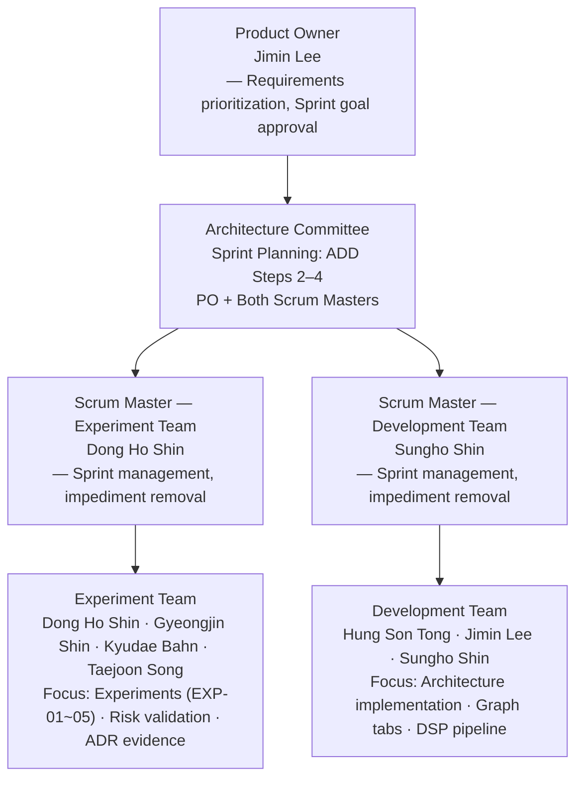

# Sprint Progress & Remaining Schedule

← [Architecture Views](slide-architecture-view.md) | [Presentation Index](README.md)

---

## 4. Milestone 2 Sprint Progress

### Team Structure

| Role | Name |
|------|------|
| Product Owner | Jimin Lee |
| Scrum Master (Experiment Team) | Dong Ho Shin |
| Scrum Master (Development Team) | Sungho Shin |
| **Experiment Team** | Dong Ho Shin, Gyeongjin Shin, Kyudae Bahn, Taejoon Song |
| **Development Team** | Hung Son Tong, Jimin Lee, Sungho Shin |

---

### Sprint Summary (W2–W3)

| Sprint | Focus | Key Outcome |
|--------|-------|-------------|
| W2 S1 (6/9–6/10) | Modifiability | 4-Layer structure + all 11 tabs ✅ |
| W2 S2 (6/11–6/12) | Deployability | `run_exp.sh` + CSV logger + RPi workflow confirmed |
| W3 S1 (6/16–6/17) | Real-Time / Latency | EXP-02 complete · ADR-001/002 accepted |
| W3 S2 (6/18–6/19) | Correctness under Noise | EXP-03/05 in progress |

### Experiment Status

| ID | Experiment | Status | Key Result |
|----|------------|:------:|------------|
| [EXP-01](references/experiments/exp-01-sample-rate.md) | RPi sample rate sustainability | ✅ Done 06/15 | Dropped=0 at 48k/96k/192k → [ADR-003](references/adr/ADR-003-sample-rate-selection.md) Accepted |
| [EXP-02](references/experiments/exp-02-pipeline-latency.md) E2-5/6 | T2+R1 on RPi — deadline miss resolved | ✅ Done 06/15 | E2E avg **2.05 ms**, 0 deadline miss |
| [EXP-02](references/experiments/exp-02-pipeline-latency.md) E2-7 | FG scheduling pickup latency | ✅ Done 06/16 | fg_wait avg **60.1 ms**, 84% > deadline 🔴 |
| [EXP-03](references/experiments/exp-03-filter-sweep.md) | LP/HP filter parameter sweep | ⏳ In Progress | Target: 06/25 |
| [EXP-05](references/experiments/exp-05-rendering-fps.md) | Qt 11-tab FPS on RPi | ⏳ In Progress | Target: 06/26 |

### Unresolved Critical Concerns

| Concern | Plan |
|---------|------|
| FG scheduling: fg_wait avg 60.1 ms (84% > deadline) on RPi | SCHED_RR on FG thread or QTimer polling — measure E2-8 |
| Filter cutoffs undetermined | [EXP-03](references/experiments/exp-03-filter-sweep.md) — 06/25 |

→ Full risk register: [references/risks.md](references/risks.md)

---

## 5. Remaining Schedule

### Past Sprints (reference only)

W2–W3 complete. See sprint summary above.

### M2 → Final (W4–W5)

| Sprint | Date | Focus | Deliverable Target |
|--------|------|-------|--------------------|
| W4 S1 | 6/22–6/23 | RPi experiments + M2 feedback incorporation | EXP-01/02 RPi results |
| W4 S2 | 6/24–6/25 | EXP-03 filter sweep + ADR-003 finalized | ADR-003 accepted |
| W4 S3 | 6/25–6/26 | EXP-05 rendering FPS + Usability + AI feature | ADR-004/005 drafted |
| W4 S4 | 6/26–6/28 | Radar Chart + Diagnosis / Classification + buffer | Feature complete |
| W5 S1 | 6/29–6/30 | RPi integration + WeiShi accuracy validation + Demo rehearsal | QAS-0 validated |
| **M3 Demo** | **7/1** | **Final Demo on Raspberry Pi** | — |

### Final Deliverable Readiness

| Deliverable | Target | Status |
|-------------|--------|:------:|
| Architecture Views (5 views, Merson template) | 06/22 | ✅ |
| ADRs with experiment evidence | 06/28 | ⏳ |
| QAS validation (Accuracy vs Witschi) | 06/29 | ⏳ |
| EXP-03/05 results + remaining ADRs | 06/26 | ⏳ |
| Demo rehearsal on RPi | 06/30 | ⏳ |
| **M3 Final Demo** | **07/01** | ⏳ |

**Critical path: RPi experiments → WeiShi accuracy validation → demo.**

### Quality Gates *(must pass before M3 demo)*

| Gate | Criteria | Status |
|------|----------|:------:|
| Core pipeline | Rate/Amplitude/Beat Error match WeiShi within tolerance | ⏳ |
| Real-time | Dropped blocks = 0 at 96kHz on RPi | ✅ EXP-01 confirmed |
| DSP latency | E2E DSP avg < 10ms on RPi | ✅ E2-6: 2.05ms |
| FG latency | fg_wait avg < 21ms on RPi (currently 60.1ms 🔴) | ⏳ EXP-02 E2-8 |
| Rendering | 0% deadline miss under 11-tab load on RPi | ⏳ [EXP-05](references/experiments/exp-05-rendering-fps.md) |
| RPi demo | All HIGH-priority graphs running on RPi 5 | ⏳ |
| Extensibility | New graph tab ≤ 3 file changes, 0 Domain changes | ✅ |

### Explicitly Deferred to M3

| Item | Reason |
|------|--------|
| Timeline scrub (Pause + rewind) | Pause freeze implemented; full scrub exceeds M2 scope |
| `⚠ Noisy signal` warning | Requires SNR computation; deferred pending EXP-03 |
| BPH range beyond 28,800 BPH | Confirmed operating point first; stretch goal |
| Sound Print improvements | M2 scope exceeded |

---

## M2 Deliverable Status

| Deliverable | Status |
|-------------|:------:|
| Updated Project Plan | ✅ |
| Experiment Results (EXP-02 complete) | ✅ |
| Architecture — Layered View: 4-Layer Allowed-to-Use | ✅ |
| Architecture — Decomposition View: Graph Tab | ✅ |
| Architecture — C&C View: DSP Pipeline Thread Model | ✅ |
| Architecture — Deployment View: Build-Deploy Pipeline | ✅ |
| Construction Plan (absorbed into schedule) | ✅ |
