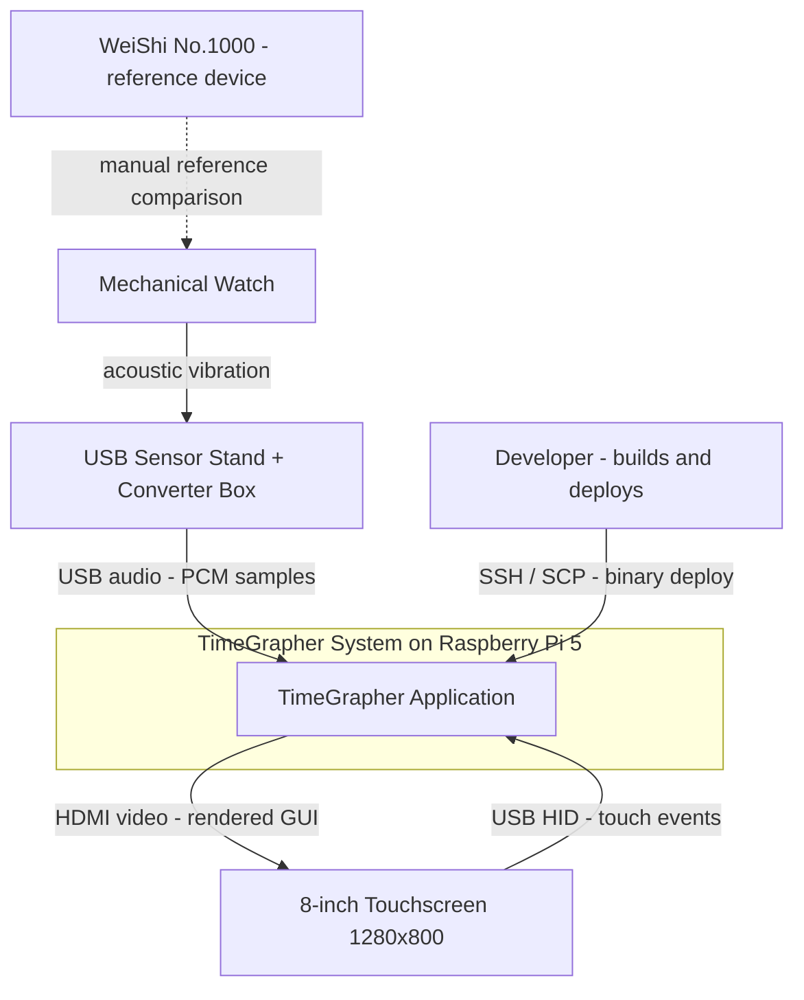

# Context Diagram

The TimeGrapher System sits at the center of the diagram. The diagram shows the scope of the system and the external entities it interacts with at runtime and at development time.

## Element Catalog

#### Mechanical Watch
- The primary signal source. Its escapement produces an acoustic beat (tick-tock) at a frequency determined by its BPH rating.
- Not integrated into software; physical placement on the sensor stand is the operator's responsibility.

#### USB Sensor Stand + Converter Box
- A microphone mounted in a stand, coupled with a USB audio converter.
- Converts the mechanical vibration into a digital PCM stream at the configured sample rate (default 96,000 sps).

#### TimeGrapher System (Raspberry Pi 5)
- The full scope of software designed and implemented in this project.
- Runs entirely on a single Raspberry Pi 5 (ARM64, 8 GB RAM) as a native Qt application.
- Internal structure is described in the [Module View](module-view.md) and [Runtime View](runtime-view.md).

#### 8-inch Touchscreen (1280×800)
- Receives rendered GUI frames from the RPi via HDMI.
- Sends touch events back via USB HID.
- No software runs on the display itself.

#### WeiShi No.1000
- A standalone commercial watch timing machine used as the accuracy reference.
- Not integrated into the TimeGrapher software. Comparison is performed manually by the operator.
- Required for QAS-2 (Measurement Accuracy) validation.

#### Developer
- Builds the application on a development machine (macOS / Windows) using Qt Creator.
- Deploys the binary to RPi via SSH / SCP or SD card flash.
- Responsible for adding new graph tabs in the Presentation layer (see [ADR 003](../ADRs/ADR003-layered-architecture.md)).

## Related Views
- [Module View](module-view.md)
- [Runtime View](runtime-view.md)
- [Deployment View](deployment-view.md)
